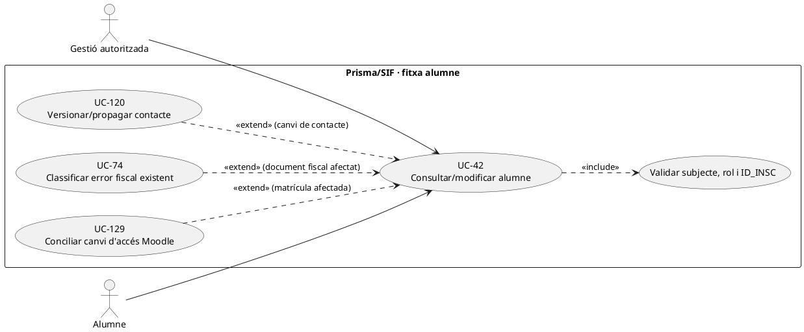

# UC-42 · Consultar i modificar la fitxa operativa d'un alumne

**Objectiu del catàleg:** fitxa operativa de l'alumne; els canvis amb impacte fiscal deriven a un flux específic. **Estat [DISSENY/PARCIAL].** No equiparar el perfil acadèmic, el participant de la factura i el receptor o pagador.

## Evidència contrastada

`LegacyCourseSnapshotRepository::loadByIdpag()` recupera camps de `inscripcions` (`ID`, `NOM`, `COGNOMS`, `DNI`, `CORREU`, adreça, `ANY/MES/CURS`, `FACTURA_RELACIONADA`, `A_PAGAR`, `PAGAMENT`, etc.) per construir **un snapshot d'emissió**, no una API completa de consulta/edició d'alumnes. `LegacySyncRepository::syncInscripcioSummary()` només escriu `FACTURA_RELACIONADA` amb `COALESCE` i concatena dades fiscals a `OBSERVACIONS`; **no modifica el perfil, comprova identitat ni actualitza Moodle**. `personal_data_change_request` està definida a SQL amb `SUBJECT_KEY`, `CHANGESET_JSON`, revisió i resultats de propagació; no s'ha acreditat un servei PHP complet de gestió de dades personals al SIF.

## Fitxa funcional

| Operació | Regla específica |
| --- | --- |
| Consultar | Autoritzar operador/alumne per **subjecte i `ID_INSC`**; veure inscripcions i estat acadèmic corresponents. Els documents de grup amb `VISIBLE_ALUMNE=0` i les dades de pagador empresa no són visibles pel sol fet de pertànyer al grup. |
| Modificar contacte | Previsualitzar valor original/nou de nom de contacte, email, telèfon o adreça segons origen verificat; UC-126 resol identitats amb emails compartits i UC-120 governa petició/versionat/propagació. |
| Modificar identificació fiscal | Distingir dada actual de l'alumne i **receptor d'una factura ja emesa**. Si s'ha emès factura, preservar `BILLING_*` i classificar error fiscal per UC-74/93; no editar directament la factura. |
| Modificar curs/edició/baixa | No és un canvi de perfil: remetre a UC-71/72/124/129, amb plaça, accés, factura i titularitat econòmica per inscripció. |
| Diners i consentiment | Editar la fitxa no crea `CHARGE/REFUND`, no traspassa saldo, no subscriu l'alumne a comunicacions comercials (UC-125) ni prova que `A_PAGAR` sigui l'import bancari real. |

### Flux proposat

1. Resoldre subjecte canònic i `ID_INSC` abans de mostrar dades; distingir rol de gestió i rol d'alumne sense exposar factures d'empresa.
2. Comparar perfil actual de Prisma, propostes i estat d'operacions obertes; registrar camp, font, motiu, actor i versió. La BD llegada pot tenir una adreça actual distinta de la que consta a la factura emesa.
3. Per contacte simple, aprovar UC-120 i propagar amb resultat per destinació; si hi ha conflicte d'identitat, UC-126 exigeix resolució abans de fusionar dades.
4. Si el camp afecta el receptor fiscal de document existent, **separar** correcció fiscal de perfil acadèmic; una factura original i el seu hash no es reescriuen. Si afecta Moodle, remetre a UC-129 i verificar matrícula real.
5. Després de cada canvi, rellegir destinacions i mostrar estat parcial/pendent; un `UPDATE inscripcions` o nota a `OBSERVACIONS` no certifica sincronització global.

**Proves:** dues matrícules i correu compartit, factura pagada per empresa, alumne sense dret a PDF grup, canvi de DNI després de factura, Moodle inaccessible, canvi acadèmic sense efecte econòmic, modificació concurrent del contacte.

## UML de casos d'ús



## UML de classes


## UML de seqüència — email actual amb factura antiga

```mermaid
sequenceDiagram
actor G as Gestió
participant S as StudentProfileService [DISSENY]
participant L as inscripcions [llegat]
participant P as personal_data_change_request [SQL]
participant F as factura [SIF, immutable]
participant M as Moodle [integració pendent]
G->>S: Modificar email d'ID_INSC
S->>L: Consultar subjecte/inscripcions
S->>F: Identificar receptor fiscal i docs previs
S-->>G: Abans/després i sistemes afectats
G->>S: Aprovar canvi de contacte
S->>P: Desar petició, causa i destins [writer pendent]
S->>L: Propagar email actual [adaptador pendent]
opt Existeix usuari Moodle a sincronitzar
 S->>M: Canviar contacte autoritzat i verificar
end
S-->>G: Estat per destí; BILLING_EMAIL històric intacte
Note over S,F: Canviar email no valida identitat fiscal ni autoritza veure factura de grup.
```

## Traçabilitat

[UC-42 original](../06-fitxes-funcionals/uc-042.md) · [UC-120 dades personals](uc-120-canvi-dades-personals-propagacio.md) · [UC-126 identitat](uc-126-identitat-contacte-conflicte-sistemes.md) · [UC-129 Moodle](uc-129-reconciliar-prisma-moodle-matricules.md) · [UC-74 correcció](uc-074-classificar-correccio-fiscal.md) · [LegacyCourseSnapshotRepository](../../sif/src/Repository/LegacyCourseSnapshotRepository.php) · [LegacySyncRepository](../../sif/src/Repository/LegacySyncRepository.php) · [Migració personal_data_change_request](../../sif/database/migrations/2026_09_16_000005_add_operation_lifecycle_tables.sql).
