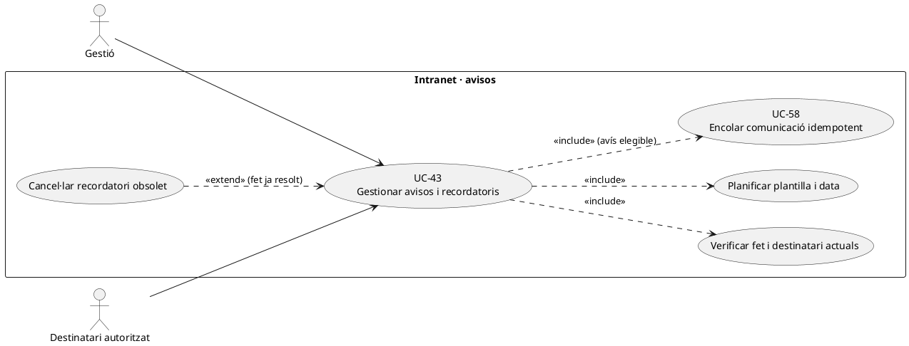
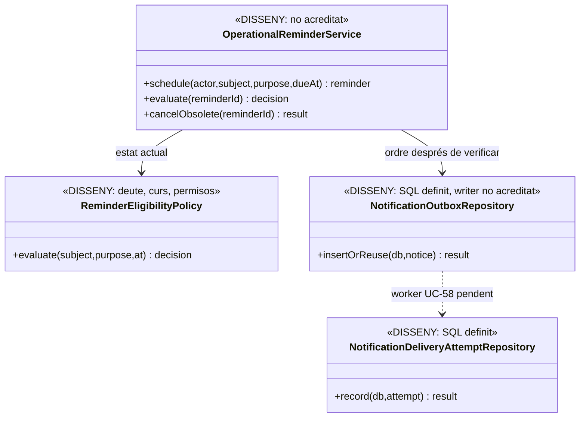
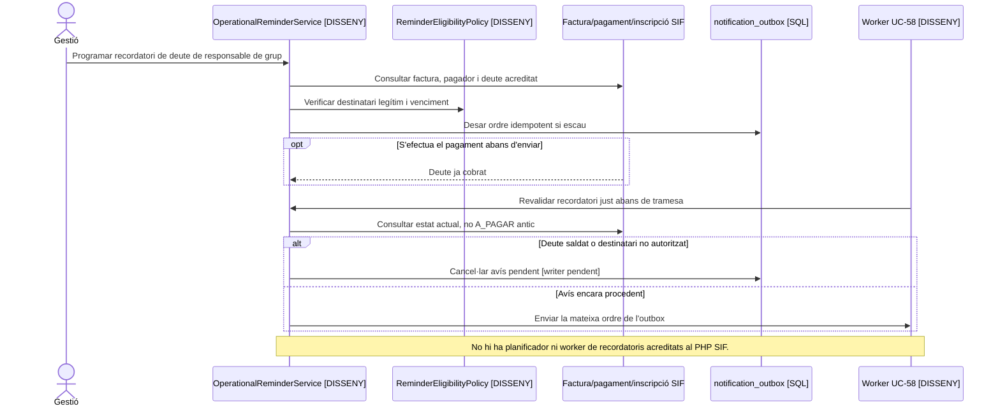

# UC-43 · Gestionar notificacions i recordatoris des de la intranet

**Objectiu del catàleg:** avisos operatius amb destinatari, moment, estat i motiu; no confondre'ls amb l'emissió de factura, el cobrament o una comunicació comercial autoritzada per una altra finalitat. **Estat [DISSENY].** UC-43 decideix **què i quan recordar**; UC-58 gestiona el lliurament tècnic d'una ordre persistent.

## Evidència de l'esquema i del PHP

`notification_outbox` està definida a SQL amb `IDEMPOTENCY_KEY` únic, `TEMPLATE_CODE/VERSION`, `RECIPIENT_TYPE/HASH`, `PAYLOAD_JSON`, factura/pagament opcionals, `STATUS`, `NEXT_ATTEMPT_AT` i correlació. `notification_delivery_attempt` conserva intents i resultat de canal. **No s'ha acreditat** al PHP SIF un planificador complet de recordatoris, un lector d'elegibilitat, ni un worker que executi aquestes dues taules. La presència de `BILLING_EMAIL` o `CORREU` llegat **no acredita** que aquell contacte sigui el destinatari legítim d'un recordatori de deute de grup.

## Fitxa funcional específica

| Classe d'avís | Condició i contingut |
| --- | --- |
| Recordatori de pagament | Derivar el pendent real de factura/assignacions i titularitat del pagador, **no** només de `A_PAGAR` ni d'una intenció TPV `PENDING`. Si una empresa paga el grup, no enviar automàticament a cada alumne una reclamació sobre el total de l'empresa. |
| Canvi acadèmic | L'estat de matrícula/edició i la confirmació d'un trasllat o baixa han de ser reals; si l'acció està pendent a Moodle, la plantilla no ha d'afirmar «baixa completada». |
| Document/factura disponible | Confirmar `UUID_FACTURA`, permisos del destinatari i fitxer real abans d'incloure un enllaç UC-80. `factura_documents.CREATED` sola no prova que el PDF físic estigui disponible. |
| Avisos comercials | La decisió UC-125 per finalitat/canal és **independent** de la matrícula i d'un avís operatiu; no usar un recordatori de curs per subscriure implícitament l'alumne a promocions. |
| Recurrència | Definir finestra, cadència, límit de reenvios, no enviament per deute saldat/cancel·lat i clau idempotent per fet+finalitat+destinatari+període. **La política de freqüències i límits no està acreditada** al SIF actual. |

### Flux objectiu

1. Gestió configura motiu, destinatari autoritzat i data de recordatori; un scheduler **pendent** revisa deute/estat acadèmic/documental actual abans de crear cada comunicació.
2. Distingir alumne, pagador i receptor; validar identitat i contacte vigents. No serialitzar informació d'una factura d'empresa al `PAYLOAD_JSON` adreçat a un participant sense autorització.
3. Crear una ordre idempotent a l'outbox **després del commit del fet** o des d'una consulta acreditada del deute actual; UC-58 en fa la tramesa. Si el saldo es liquida abans del venciment programat, cancel·lar o revalidar l'avís pendent.
4. El panell mostra `SCHEDULED/PENDING/SENT/FAILED` **com a estats funcionals proposats**, no com a enum ja implementat. Distingir «ordre programada», «proveïdor accepta l'enviament» i «destinatari l'ha rebut» segons el canal.
5. Reintentar **el mateix avís lògic** quan el transport falla; una incidència del correu no crea factura nova, `CHARGE` ni modificació acadèmica.

**Proves:** pagament fet just abans d'un recordatori, grup empresa, email compartit, canvi d'edició encara pendent de Moodle, token documental caducat, dues tasques programades simultànies, canvi de consentiment comercial i timeout de canal després d'enviar.

### Recordatoris de deute del llegat, pròrrogues i canvi d'estat abans de l'enviament

**Punts del llegat que originen un avís.** El procediment d'intranet identifica les rutes de `primera-reclamacio`, `reclamacio-final` i `morosos`, i les consultes `cnsCursosRecordarPag`, `cnsAlumnesRecordarPag`, `cnsRegBaixesSegonaSetnaba`, `cnsAlumnClaimPag`, `cnsAlumnClaimEntMoros` i les variants d'alumnes morosos amb o sense certificat. Els camps `reclamat/data_reclamacio/pag_observacions` són **seguiment administratiu antic**, no una fila `notification_outbox` ni evidència de recepció de correu. El servei `ClaimPaymentService` només registra el cobrament real d'una reclamació sobre una factura existent: **no programa ni envia els avisos** d'aquestes pantalles.

**Revalidar en el moment que surt el missatge.** Entre el càlcul de `cnsAlumnesRecordarPag` i l'enviament poden arribar una transferència `UUID_PAYMENT`, un callback Redsys en cua, una pròrroga UC-96, una baixa amb decisió econòmica pendent o una nova responsabilitat de pagament per factura d'empresa. Abans de cada enviament, rellegir factura real, assignacions, cobrament extern incert, estat acadèmic, venciment aprovat i titular/contacte de la comunicació; si l'objectiu de l'avís ha canviat, **cancel·lar o reformular** la notificació pendent, no repetir una plantilla antiga. Si el cobrament s'ha confirmat però encara falla el resum llegat, reparar UC-47/53 i no reclamar de nou pel valor antic de `PAGAMENT`.

**Distingir pagar de poder entrar al curs.** PrisMa documenta que **no s'ha de bloquejar l'accés a una via de pagament d'una persona morosa**; això no determina automàticament si conserva el dret d'accés a Moodle o al certificat, que requereix decisió UC-95/124. Si l'empresa és responsable de la factura del grup, l'avís del deute va al pagador/representant autoritzat amb la URL corresponent: no enviar als participants ni l'import complet ni el PDF de l'empresa per tenir el mateix `IDPAG`. Els avisos de baixa acadèmica no han d'afirmar «baixa feta» o «accés retirat» mentre el destí Moodle no hagi confirmat la fase.

**Prova de transport i abast.** `notification_outbox`/`notification_delivery_attempt` són esquemes objectiu sense scheduler/worker complet acreditat; una marca `SENT` indica un resultat de transport registrat, no que el destinatari hagi llegit o obert el missatge. El correu operatiu de reclamació no és consentiment per rebre promocions UC-125. Guardar la causa i el període lògics de cada avís per evitar duplicats en un reintent, però no deduir del nom `cnsRegBaixesSegonaSetnaba` la cadència exacta de la política de «segona setmana».

### Proves addicionals dels recordatoris (no executades)

| ID | Escenari | Resultat exigible |
| --- | --- | --- |
| AV-43-01 | Un recordatori és a la cua i arriba el pagament real | Cancel·lació/revisió de l'avís abans d'enviar; cap reclamació d'un deute ja saldat. |
| AV-43-02 | Pròrroga UC-96 activa quan venç l'avís antic | Comprovar regla i data aprovades, no enviar escalat sobre un venciment anterior. |
| AV-43-03 | Inscripció coberta per factura d'empresa i IDPAG compartit | Avís i URL a responsable autoritzat; cap PDF complet enviat a participants. |
| AV-43-04 | Baixa registrada a Prisma però no propagada a Moodle | Comunicar estat real i pendent, no «accés retirat» fictici. |
| AV-43-05 | Pagament al SIF confirmat, però `web.inscripcions.PAGAMENT=0` | Reconciliar la fase llegada i no generar una segona reclamació bancària. |
| AV-43-06 | Proveïdor accepta el correu però no hi ha prova de recepció | «Enviat pel canal» i no «llegit/acceptat per destinatari». |

## UML de casos d'ús

## UML de classes

## UML de seqüència — recordatori que deixa de ser procedent

## Traçabilitat

[UC-43 original](../06-fitxes-funcionals/uc-043.md) · [UC-58 outbox original](../06-fitxes-funcionals/uc-058.md) · [UC-79 comunicació fiscal](uc-079-comunicacio-fiscal-auditable.md) · [UC-61 pendent](uc-061-consultar-pendent-obtenir-enllac.md) · [UC-125 consentiment](uc-125-consentiment-comunicacions-separat.md) · [DDL outbox/intents](../../sif/database/migrations/2026_09_15_000003_add_functional_audit_control.sql).
