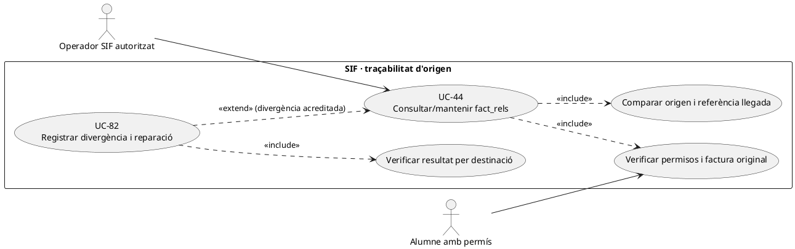
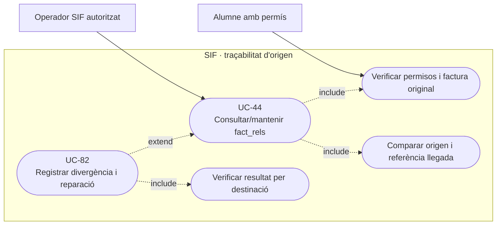
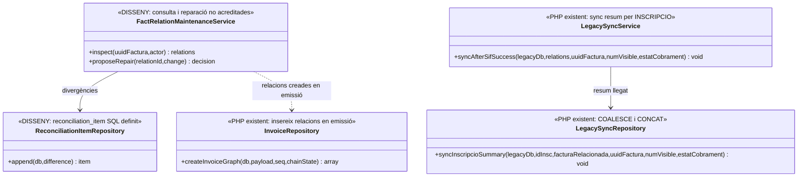
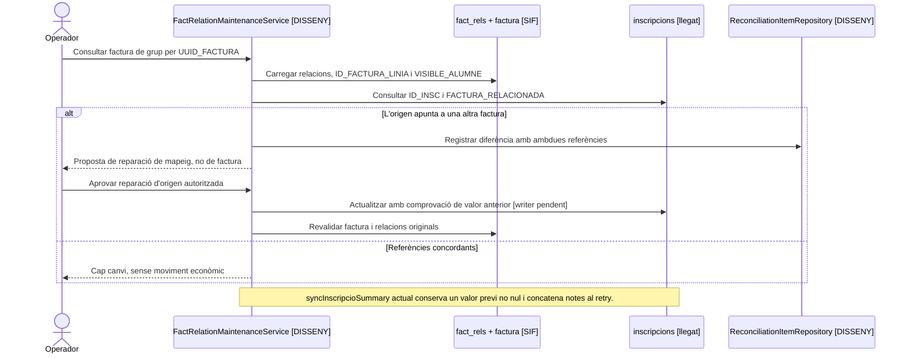

# UC-44 · Consultar i mantenir `fact_rels` i la relació amb l'origen llegat

**Objectiu original:** el model existeix; consulta, divergències i manteniment controlat al panell són pendents. **Estat [BASE/PARCIAL].** `fact_rels` és una relació documental; **no és el llibre de cobraments ni una autorització d'accés universal**.

## Evidència de codi i esquema

`InvoiceRepository::insertRelations()` insereix per factura `SOURCE_TYPE`, `SOURCE_ID`, `RELATION_TYPE`, `FACTURA_RELACIONADA`, `IDPAG`, `DS_ORDER` i `VISIBLE_ALUMNE` de `payload['relations']`. El DDL de `fact_rels` també conté `ID_FACTURA_LINIA` amb FK a `factura_linia`, però **el mètode actual no l'omple**. Per tant, no es pot afirmar que cada relació de participant estigui vinculada a una línia fiscal individual a través d'aquest camp.

El builder de grup crea relacions `INSCRIPCIO` amb `VISIBLE_ALUMNE=0` per participant i una factura del responsable. `LegacySyncService` recorre relacions de tipus `INSCRIPCIO`; `LegacySyncRepository` posa `FACTURA_RELACIONADA=COALESCE(FACTURA_RELACIONADA,?)` i concatena `OBSERVACIONS`. **No comprova files afectades ni repara un ID de factura llegat contradictori**, i un retry pot duplicar la nota. Les relacions no tenen camp d'import assignat per inscripció; `payment_allocation` assigna pagament a factura, no a `ID_INSC`.

## Fitxa funcional específica

| Acció | Regla |
| --- | --- |
| Consultar | Cercar per `UUID_FACTURA`, `SOURCE_TYPE/SOURCE_ID`, `IDPAG`, `DS_ORDER`, `FACTURA_RELACIONADA` i, si existeix, `ID_FACTURA_LINIA`. Mostrar les relacions **reals**, distingint origen, altres vincles i document fiscal immutable. |
| Autoritzar | `VISIBLE_ALUMNE` és un senyal de la relació; el controlador també ha de verificar **subjecte, `ID_INSC`, receptor/pagador i rol**. Un email compartit o conèixer `IDPAG` no dóna accés a factura d'empresa. |
| Detectar divergència | Comparar cada `source_id` amb el llegat i cada UUID/número amb la factura real; detectar referència llegada absent, `COALESCE` que conserva un valor erroni, relació amb línia no vinculada i múltiples `DS_ORDER` legítimes de pagaments fraccionats. |
| Mantenir | **No executar `UPDATE` massiu de `fact_rels`** per fer quadrar observacions. Aprovar reparació de la referència d'origen amb causa, abans/després, actor, idempotència i auditoria; preservar l'històric d'atribució i distingir error de mapeig d'error de factura real (UC-74). |
| Quantificar | Una fila `INSCRIPCIO` només relaciona, no expressa **quants euros** d'un ingrés de grup corresponen a l'alumne. Cal ledger quantitatiu `enrollment_fund_movement` **proposat/no implementat**; no dividir el total per nombre de relacions. |
| Diners/AEAT | Corregir mapeig no crea `CHARGE/REFUND`, no modifica factura, `factura_registres`, cadena ni cua; si existeix canvi de prestació/document real, derivar al cas fiscal/econòmic explícit. |

### Flux objectiu

1. Operador selecciona factura o origen, consulta files `fact_rels` i els recursos reals associats amb permís servidor; mostra `ID_FACTURA_LINIA` com a **absent** quan és `NULL`, no reconstrueix una equivalència falsa.
2. Classifica diferència: identificador llegat desaparegut, error d'IDPAG, relació legítima a diverses inscripcions, referència `FACTURA_RELACIONADA` contradictòria o problemes d'accés.
3. Abans d'una correcció, consulta snapshot fiscal, events i cobrament **real**; una relació alterada no autoritza canviar la quantia d'un pagament ni crear una altra factura.
4. Registra decisió/reparació d'origen com a event auditable **pendent** i propaga només el camp legítim. Si el valor de la factura fiscal és erroni, UC-74 exigeix una classificació independent.
5. Reconsulta SIF i llegat, confirma resultat per item i conserva incidència UC-82 si alguna destinació falla. No donar per resolta la reconciliació per haver concatenat `OBSERVACIONS`.

**Proves:** factura de grup amb tres `fact_rels` i un sol ingrés; `ID_FACTURA_LINIA=NULL`; referència llegada errònia però no nul·la; callback duplicat i dos `DS_ORDER` fraccionats; `VISIBLE_ALUMNE=0`; retry de sincronització que duplica la nota.

### Llegat de factura relacionada, grup i permís de consulta per participant

**Per què existeix l'agrupador antic.** Les pantalles «Generar factura abans de pagar» i «Passar pagaments» poden associar diverses inscripcions del mateix curs/edició a una **factura real única** de l'empresa/responsable i conservar una `FACTURA_RELACIONADA` com a referència de família. El procediment de facturació estableix que aquest camp també pot agrupar factura ordinària A i rectificativa R històriques; **no substitueix** la relació fiscal directa entre UUIDs d'original/rectificativa. La cerca per `FACTURA_RELACIONADA` ha de mostrar la família com a índex històric, no donar per acreditat que tots els documents comparteixen receptor, línies, estat o visibilitat.

**Una fila no és una línia fiscal ni una quota.** `InvoiceRepository::insertRelations()` no emplena actualment `fact_rels.ID_FACTURA_LINIA`, tot i que la columna existeix al model. Per tant, la vista no pot assegurar per defecte que cada `ID_INSC` estigui referenciat a una línia fiscal concreta, ni que un pagament de 200 € repartit entre dues persones s'expressi com 100 €/100 €: el registre de fons per inscripció és **proposta pendent**. En canvis de curs o de grup, mostrar estat històric de la relació i event de canvi abans de suggerir una correcció, en lloc de reescriure `SOURCE_ID` sense traça.

**Visibilitat no transferible entre membres de grup.** El builder de grup crea relacions de participant `INSCRIPCIO` amb `VISIBLE_ALUMNE=0`. L'alumne pot necessitar conèixer que la seva inscripció és coberta per una empresa i el seu estat acadèmic/econòmic mínim, però no obté automàticament el **PDF de la factura completa**, les dades fiscals del responsable o els altres participants. L'empresa o responsable han d'acreditar representació i autorització; el seu correu de contacte no és per si sol prova universal de titularitat fiscal. La consulta i el manteniment d'UC-44 són tasques d'operador fiscal autoritzat, mentre que UC-07/80 decideixen la informació mínima visible a cada canal.

### Proves complementàries per grup i agrupador (no executades)

| ID | Escenari | Resultat exigible |
| --- | --- | --- |
| RL-44-01 | Factura única d'empresa amb tres `fact_rels` de participant | Una factura real, tres vincles i cap import individual inventat. |
| RL-44-02 | `ID_FACTURA_LINIA` de la relació és NULL | Mostrar línia no vinculada, no deduir relació 1:1 sense prova. |
| RL-44-03 | FACTURA_RELACIONADA agrupa A i R | Documents separats amb relació directa fiscal conservada. |
| RL-44-04 | Alumne figura en un grup amb VISIBLE_ALUMNE=0 | Estat mínim de cobertura, no factura/PDF complet de l'empresa. |
| RL-44-05 | ID_INSC canvia de curs després d'emetre factura | Historial de l'origen i classificació fiscal separada, no UPDATE indiscriminat. |

## UML de casos d'ús

### Vista de casos d’ús per a GitHub (Mermaid)

## UML de classes

## UML de seqüència — referència llegada contradictòria

## Traçabilitat

[UC-44 original](../06-fitxes-funcionals/uc-044.md) · [UC-82 conciliació](uc-082-reconciliar-sif-bd-llegada.md) · [UC-80 accés fiscal](uc-080-servir-registrar-acces-document-fiscal.md) · [InvoiceRepository](../../sif/src/Repository/InvoiceRepository.php) · [LegacySyncRepository](../../sif/src/Repository/LegacySyncRepository.php) · [DDL fact_rels](../../sif/database/migrations/2026_06_02_000001_create_sif_core.sql) · [Traça de fons per inscripció](00-revisio-moviments-inscripcions.md).
