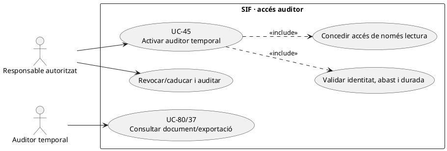
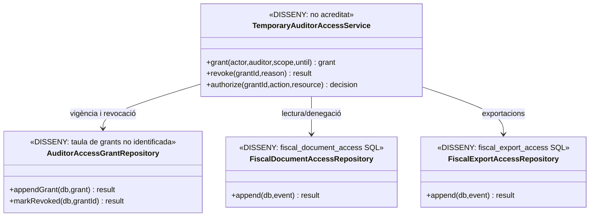
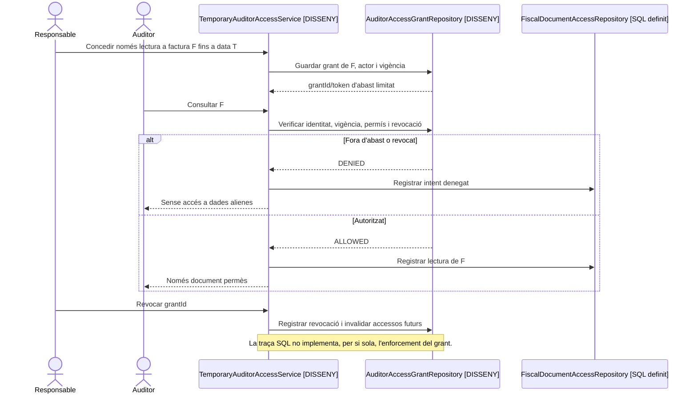

# UC-45 · Activar un auditor temporal amb accés de només lectura

**Objectiu original:** consulta restringida en temps i abast, sense permisos de modificació. **Estat [DISSENY].** L'esquema conté `sif_audit_event`, `fiscal_export_access` i `fiscal_document_access` per deixar traça d'activitats, però **no s'ha identificat una taula d'atorgament temporal d'accés auditor ni un controlador PHP d'alta/caducitat/revocació d'aquest rol**. Una columna `ACTOR_ROLE` en un event no és un sistema d'autorització.

## 1. Fitxa específica

| Unitat | Contracte |
| --- | --- |
| Actors | Responsable de seguretat/fiscal que concedeix l'accés, auditor identificat i administrador que el revoca. L'auditor **no** pot autoritzar-se a si mateix. |
| Sol·licitud | Identitat verificada, finalitat, causa i expedient, emissor, període, tipus de documents/registre, durada, canals i `REQUEST_ID/CORRELATION_ID`. Concedir un període no autoritza accés a qualsevol curs, persona o dades bancàries alienes a l'abast. |
| Permisos | Només lectura sobre recursos seleccionats: documents existents, registre/historial fiscal i exportacions autoritzades. Prohibir `INSERT/UPDATE/DELETE`, reenvio AEAT, descàrrega massiva no concedida, canvi de dades, devolucions i operacions TPV. La restricció s'ha d'aplicar al **servidor i a la BD**, no només amagant botons. |
| Caducitat/revocació | Versió de concessió, `VALID_FROM/VALID_UNTIL` i estat efectiu, revocació anticipada amb actor/motiu. **Aquests camps són proposta del model d'accés**, no camps d'una taula identificada al SQL revisat. Sessió/token existent ha de deixar de ser útil després del venciment/revocació. |
| Auditoria real i pendent | `sif_audit_event` defineix actor/rol, recurs, acció, resultat, hashes i correlació; `fiscal_document_access` i `fiscal_export_access` tenen traça per accés/denegació. El **writer de concessió i enforcement no està acreditat**. |
| Confidencialitat | Consulta de dades personals fiscalment necessàries segons abast i custòdia/retenció aprovades; un auditor no obté documents de salut, evidències de descompte sensibles ni secrets de pagament per tenir accés fiscal. |
| Efecte fiscal/econòmic | Concedir, consultar o revocar accés **no modifica factures/registres, no crea `CHARGE/REFUND` ni envia res a l'AEAT**. |

### Flux objectiu

1. Rebre sol·licitud i validar identitat, rol de l'aprovador, motiu, dates i permisos mínims. Rebutjar abast ambigu com «tot el SIF» si no està justificat.
2. Registrar concessió versionada i **secret d'accés independent** del `payment_link` o del token d'alumne. No reutilitzar credencials compartides d'administració, ni guardar token en clar a `sif_audit_event`.
3. En cada petició de consulta UC-80/37/84, comprovar identitat, abast, venciment i revocació **abans** de consultar dades; registrar també denegacions amb actor/canal/motiu sense filtrar identificadors de tercers.
4. Revocar accés o deixar-lo caducar automàticament i invalidar sessions/descàrregues futures; conservar auditoria dels accessos anteriors. Una exportació **ja descarregada** no es pot recuperar retroactivament: política de custòdia externa pendent.
5. Provar: URL compartida, token caducat, rol amb abast només una factura, descàrrega exportació d'un altre emissor, API d'edició cridada directament, revocació durant sessió, dades sensibles en logs i accés d'auditor a secrets.

**Pendents:** font de la identitat/rol, model SQL de grants, política d'abast i retenció, endpoint d'activació/revocació, enforcement en totes les APIs, controls de BD i proves d'autorització end-to-end.

## 2. UML de casos d'ús

## 3. UML de classes — grant no implementat i traça SQL

## 4. UML de seqüència — accés restringit i revocació (DISSENY)

## 5. Traçabilitat

[UC-45 original](../06-fitxes-funcionals/uc-045.md) · [UC-59 accés auditor original](../06-fitxes-funcionals/uc-059.md) · [UC-37 exportació](uc-037-exportar-periode-fiscal.md) · [UC-80 lectura fiscal](uc-080-servir-registrar-acces-document-fiscal.md) · [UC-84 paquet auditor original](../06-fitxes-funcionals/uc-084.md) · [Migració de registres d'accés](../../sif/database/migrations/2026_09_15_000003_add_functional_audit_control.sql).
