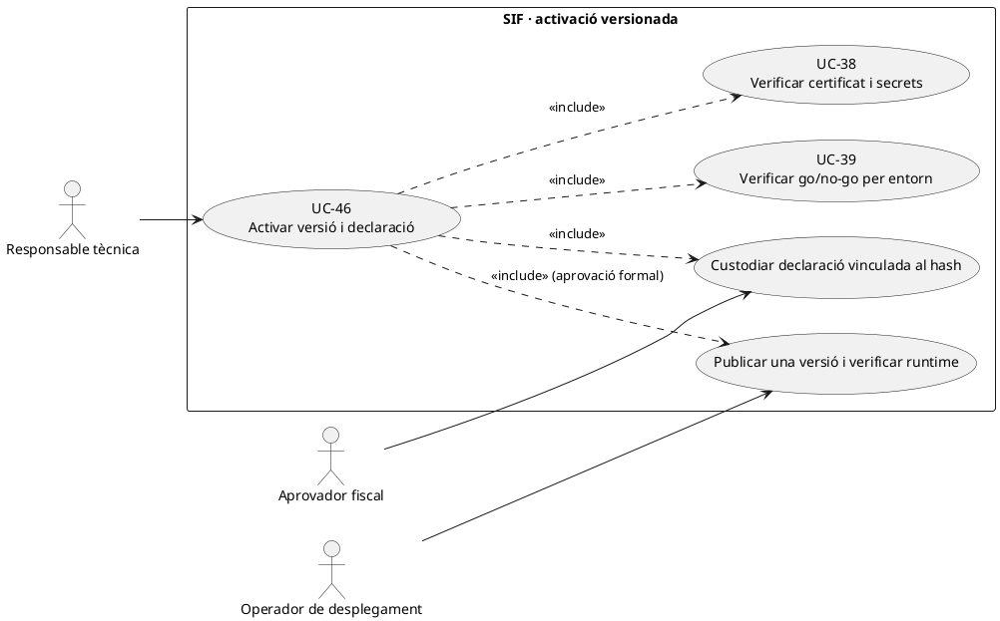
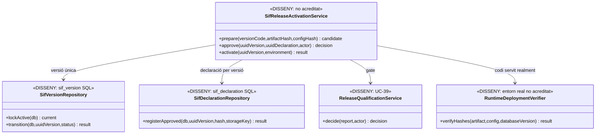

# UC-46 · Activar versió i declaració responsable després del go/no-go

**Objectiu original:** proves, certificat i aprovació formal com a condicions de l'activació. **Estat [DISSENY].** `sif_version` i `sif_declaration` estan definides a SQL, però **no s'ha acreditat** un servei PHP que comprovi els gates, activi una única versió i publiqui la declaració associada. UC-83 descriu el registre versionat detallat; UC-46 és la **decisió d'activació operacional**.

## 1. Evidència i prerequisits

La migració d'auditoria defineix `sif_version.UUID_VERSION/VERSION_CODE/GIT_REVISION/ARTIFACT_HASH/CONFIG_HASH/DATABASE_VERSION/STATUS/ACTIVATED_AT` i `sif_declaration.UUID_DECLARATION/UUID_VERSION/DECLARATION_VERSION/DOCUMENT_HASH/STORAGE_KEY/APPROVED_BY/APPROVED_AT/STATUS`. La FK uneix declaració i versió. **La FK no comprova que la declaració sigui jurídicament suficient, que els bytes físics existeixin o que la versió activa coincideixi amb el codi servit a `pay.prisma.cat`.** Tampoc s'ha comprovat al DDL una restricció d'una sola fila `STATUS=ACTIVE` a tota `sif_version`; aquesta invariant exigeix servei/transacció i verificació del desplegament.

`go-no-go-preproduction.php` comprova l'entorn `test/preproduction` i dependències, no aprova producció. `ClientCertificate::inspect()` fa validacions locals del P12, no acredita representació o estat remot. `SoapTransport` revisat refusa endpoints diferents del de **preproducció**, de manera que el contracte de transport productiu és un bloquejant real abans de declarar activació per producció.

## 2. Fitxa funcional específica

| Element | Contracte |
| --- | --- |
| Actor | Responsable tècnica, aprovador fiscal/representant de l'empresa emissora i operador de desplegament autoritzat. Cap usuari genèric del panell pot autoaprovar la declaració. |
| Identitat de la candidata | `UUID_VERSION`, commit Git, hash d'artefacte, hash de configuració **sense secrets**, versió BD, entorn i data; manifest de components i estat del desplegament real. |
| Gate | Evidències de proves i preflights UC-39, certificat/representació UC-38, migracions, reconciliació, recuperació UC-40/85, control de permisos, cua AEAT i circuits de pagaments. Un `ok=true` de presència d'arxius no tanca les proves pendents. |
| Declaració | Document aprovat de la versió i abast **realment verificats**, hash de bytes, ubicació privada, versió, aprovador i instant. **No generar el document legal ni atribuir-li conformitat només perquè la taula permet un `STORAGE_KEY`.** |
| Activació | Control atòmic d'estat per evitar **dues versions marcades actives**, coordinació entre BD/configuració/codi servit i pla de reversió de desplegament. El SQL per si sol no prova aquest procés. |
| Continuïtat | Si una activació falla després de canviar un component, registrar resultat per component i revalidar factures/regs/cues/processos en vol; no fer un rollback de base de dades que perdi operacions reals posteriors. |
| Efecte fiscal i bancari | Canviar versió/declaració no crea ni edita factures, `CHARGE/REFUND`, registres AEAT ni assignacions per inscrit. Les cues pendents continuen referenciant el seu registre fiscal original. |

### Flux objectiu i proves

1. Crear una **candidata immutable** amb revision/hash/BD/config i aprovar abast d'entorn. No confondre branca Git o PR de documentació amb l'artefacte binari/codi desplegat.
2. Recollir gates UC-39 i resultats d'integració de l'entorn objectiu, inclosos transport/certificat, tests de pagament/fracció/grup, ledger individual pendent i restauració provada. Qualsevol bloquejant no resolt queda identificat com a `NO_GO` per aquell abast.
3. Preparar i custodiar declaració específica de la versió si el circuit legal i responsable autoritzat l'aproven; verificar hash real i permisos del document. L'existència de la fila SQL no prova que s'hagi signat ni revisat externament.
4. En una operació governada, assegurar exclusivitat de versió activa i activar artefacte/config/codi, migracions i workers coordinadament, **verificant el que realment serveix `pay.prisma.cat`**; el mètode concret de desplegament i locking està pendent.
5. Registrar resultat per destinació; en error parcial, mantenir incident i decidir reversió segura sense reexecutar factures o callbacks bancaris. Si la versió canvia després de signar la declaració, exigir nova correlació/hashes, no reciclar document antic de manera opaca.
6. Provar: dues activacions concurrents, declaració d'una altra revisió, hash d'artefacte no coincident, script go/no-go passa però transport productiu no admès, P12 caducat, migració parcial, worker antic i nou simultanis i rollback amb registres emesos durant el canvi.

**Pendents:** contracte formal de declaració/aprovació, responsable signant, exclusivitat transaccional de versió, evidència de codi desplegat, gate productiu i proves de fallada parcial. No s'han executat proves ni activat cap versió amb aquesta fitxa.

## 3. UML de casos d'ús



## 4. UML de classes — esquema vs controlador pendent



## 5. UML de seqüència — gate insuficient i activació condicionada

```mermaid
sequenceDiagram
actor T as Responsable tècnica
actor F as Aprovador fiscal
participant S as SifReleaseActivationService [DISSENY]
participant G as Gate UC-39 [preproducció parcial]
participant V as sif_version [SQL]
participant D as sif_declaration [SQL]
participant R as RuntimeDeploymentVerifier [DISSENY]
T->>S: Proposar candidata amb commit/hash/config/BD
S->>V: Registrar DRAFT amb identitat del paquet
S->>G: Comprovar evidències per l'entorn objectiu
alt Transport, backup o prova bloquejant pendent
 G-->>S: NO_GO / evidència insuficient
 S-->>T: No activar ni declarar conformitat
else Proves i autoritzacions aprovades
 G-->>S: Gate documentat per versió
 F->>S: Aprovar declaració específica
 S->>D: Vincular document/hash i aprovador a UUID_VERSION
 S->>V: Bloquejar versions i preparar activació exclusiva
 S->>R: Verificar codi/config/BD servits realment
 alt Runtime no coincideix
  R-->>S: Conflicte o desplegament parcial
  S-->>T: Incidència, sense donar per activa la candidata
 else Runtime coherent
  R-->>S: Hashes i versió concordants
  S->>V: Registrar activació i preservar història
  S-->>T: Versió activa verificada
 end
end
Note over S,R: Els repositoris i l'orquestrador d'activació són disseny; el SQL no desplega codi.
```

## 6. Traçabilitat

[UC-46 original](../06-fitxes-funcionals/uc-046.md) · [UC-83 governança original](../06-fitxes-funcionals/uc-083.md) · [UC-38 certificat](uc-038-configurar-sif-certificat.md) · [UC-39 proves](uc-039-proves-gate-go-no-go.md) · [UC-40 backup](uc-040-backup-restauracio.md) · [Migració sif_version/sif_declaration](../../sif/database/migrations/2026_09_15_000003_add_functional_audit_control.sql) · [SoapTransport limitat a proves](../../sif/src/Aeat/SoapTransport.php).
