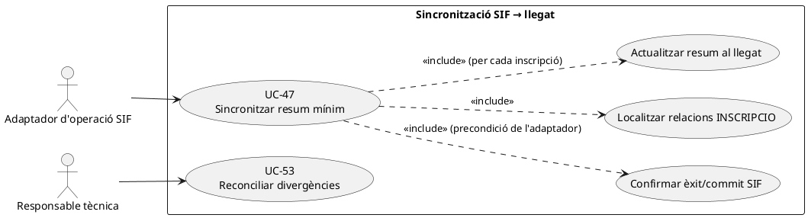
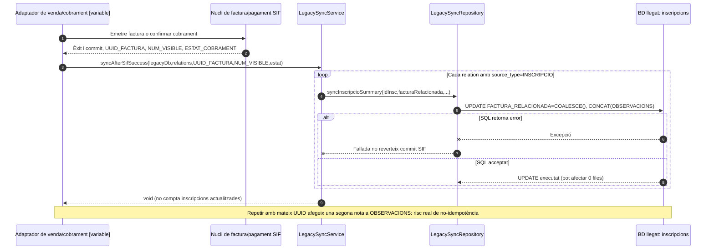
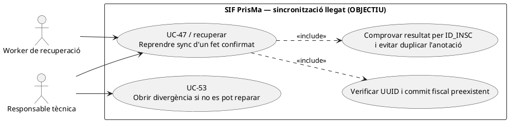
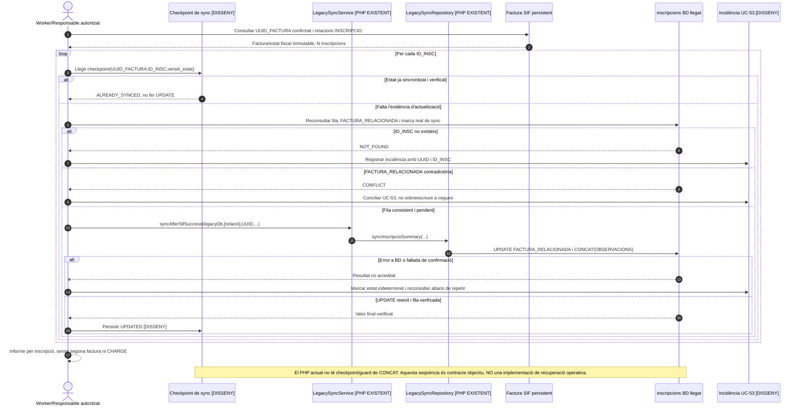
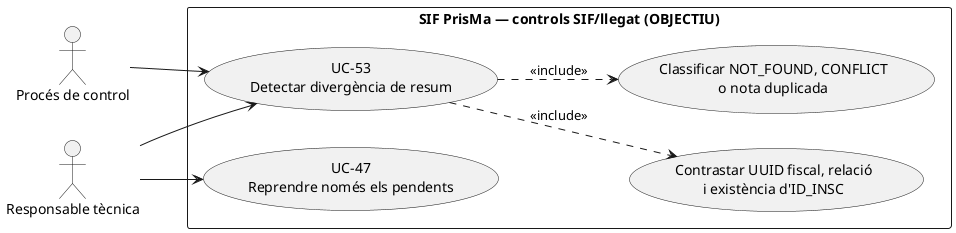
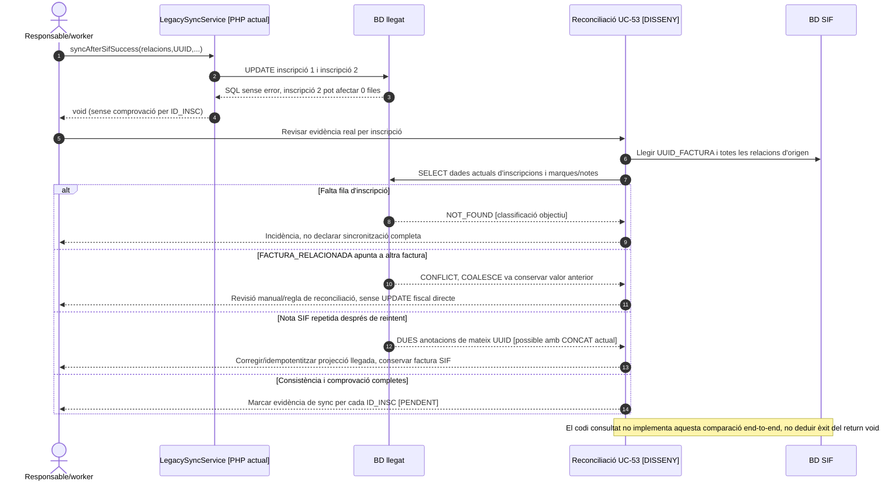

# UC-47 · Sincronitzar l'estat mínim al llegat després del commit del SIF

**Finalitat:** donar al sistema llegat una referència de consulta de la factura i un resum informatiu **després** que el SIF hagi confirmat la seva pròpia operació. La BD llegada **no** assigna número fiscal ni és font de veritat per alterar factures i cobraments.

**Estat de codi revisat:** `LegacySyncService::syncAfterSifSuccess()` i `LegacySyncRepository::syncInscripcioSummary()` són implementats. El servei recorre relacions `INSCRIPCIO` i fa una actualització SQL al llegat; **no** és un worker/outbox general ni prova una transacció distribuïda. La migració de control entre sistemes pot definir estructures addicionals però el camí PHP consultat no les registra automàticament.

## 1. Fitxa basada en el servei real

| Element | Evidència o contracte |
| --- | --- |
| Actor | Adaptador/integració després de l'èxit d'emissió o cobrament SIF; operador només per visualització/conciliació posterior. |
| Entrada | Connexió `legacyDb`, `relations`, `uuidFactura`, `numVisible`, `estatCobrament`; per cada relació amb `source_type=INSCRIPCIO` i `source_id`, opcional `factura_relacionada`. |
| Filtre del servei | Ignora relacions no `INSCRIPCIO` i relacions sense `source_id`. Una factura de pack/grup pot tenir N relacions d'inscripció; la sincronització pot executar diversos `UPDATE`. |
| Escriptura exacta al llegat | `UPDATE inscripcions SET FACTURA_RELACIONADA=COALESCE(FACTURA_RELACIONADA, ?), OBSERVACIONS=CONCAT(COALESCE(OBSERVACIONS,''), '\\nSIF ', NUM_VISIBLE, ESTAT_COBRAMENT, UUID_FACTURA) WHERE ID=?`. |
| Resultat | No retorna UUID ni un estat de job: el mètode és `void`. El mètode repositori no comprova `rowCount()`; una inscripció absent pot no produir error SQL, **malgrat no quedar sincronitzada**. |
| Límits | El servei **no modifica `A_PAGAR`, `PAGAMENT` ni l'estat de matrícules**, i no conserva una atribució monetària individual. El text a `OBSERVACIONS` no substitueix `payment_transaction` ni `factura_registres`. |

### 1.1. Flux real de codi

1. L'adaptador executa l'operació al SIF; només **després de confirmar l'èxit SIF** ha de cridar `syncAfterSifSuccess()`. Aquesta condició és el contracte de l'adaptador; la classe `LegacySyncService` no pot verificar per si sola que l'altre commit existeix.
2. `LegacySyncService` selecciona cada relació de `INSCRIPCIO` amb `source_id`. Altres relacions principals `PACK`, `GRUP` o `REGAL` no generen una actualització directa en aquest servei.
3. Per a cada inscripció, `LegacySyncRepository` assigna `FACTURA_RELACIONADA` **només quan el valor anterior és NULL** i concatena una anotació `SIF NUM_VISIBLE ESTAT_COBRAMENT UUID_FACTURA` a `OBSERVACIONS`.
4. L'adaptador ha d'evitar presentar una sincronització de totes les inscripcions com a completada si una crida SQL falla o la fila llegada no existeix. Aquesta verificació final no està implementada en el repositori actual.
5. Una correcció posterior del cobrament fiscal o de la situació de l'inscrit **no** pot limitar-se a afegir una altra nota sense conciliació de l'estat estructurat al SIF.

### 1.2. Riscos concrets detectats al codi

| Situació | Efecte que cal tractar |
| --- | --- |
| Reintent equivalent després de fallada de xarxa | L'`UPDATE` **torna a concatenar el mateix text a `OBSERVACIONS`**: aquest side effect **no és idempotent** tot i que la factura SIF sí que es pugui reutilitzar. Cal un marcador/evidència de sincronització únic o una operació idempotent pròpia; no s'ha modificat el PHP. |
| Inscripció ja amb `FACTURA_RELACIONADA` diferent | `COALESCE` conserva la primera relació; si correspon a una altra factura real, la divergència queda amagada al camp estructurat. Cal UC-53, no forçar una sobreescriptura. |
| L'`ID_INSC` no existeix en la BD llegada | `UPDATE ... WHERE ID=?` afecta 0 files, però el repositori no comprova el nombre de files; l'adaptador no ha de dir que el cas ha quedat conciliat sense verificar-ho. |
| Grup/pack amb múltiples inscripcions | N actualitzacions separades; pot quedar sincronització parcial en cas d'error. No s'ha acreditat transacció que abraci el conjunt de canvis al llegat i el commit anterior del SIF. |
| Factura sense relacions INSCRIPCIO | El mètode recorre l'array i finalitza sense tocar cap fila. És un resultat possible, no prova de visibilitat/assignació fiscal. |
| Pagament posterior, compensació o devolució | Cal reflectir el nou estat econòmic al SIF i planificar sincronització estructurada, no assumir que el text existent en `OBSERVACIONS` canvia l'estat acadèmic o calcula el cobrament. |

**Decisió tècnica pendent:** fer un resultat per relació (`UPDATED`, `ALREADY_SYNCED`, `NOT_FOUND`, `CONFLICT`), checkpoint idempotent i incidència amb correlació. Aquests valors són **proposta**, no retorn actual del servei `void`.

### 1.3. Contracte amb «Passar pagaments» i la factura prèvia del llegat

**Situació operativa recuperada.** El circuit de `/alumnes/pagaments/` pot arribar a executar `efectuarPagament()`, amb vies diferents per inscripció (`I`), grup (`G`), pack (`P`) o regal (`R`). Els resums històrics de l'operació s'han expressat a `inscripcions.PAGAMENT`, `DATA PAG`, `FRACCIO` i `FACTURA_RELACIONADA`; la pantalla «Generar factura abans de pagar» també pot seleccionar **diverses** inscripcions de la mateixa edició en una sola factura d'empresa/responsable. El contracte final de migració exigeix que aquests camps es tractin com a **compatibilitat després de confirmar** la factura/cobrament SIF. No s'han de deduir un nou `CHARGE` ni una segona factura a partir d'un resum llegat encara no actualitzat.

**Límit concret del servei actual.** `LegacySyncService::syncAfterSifSuccess()` només transmet identificador de factura, número, estat de cobrament i relacions `INSCRIPCIO`; `LegacySyncRepository::syncInscripcioSummary()` només escriu `FACTURA_RELACIONADA=COALESCE(...)` i afegeix una nota a `OBSERVACIONS`. **No actualitza `PAGAMENT`, `DATA PAG`, `FRACCIO`, estat de matrícula ni una relació UUID estructurada al llegat.** Tampoc comprova que un `UPDATE` de la inscripció hagi afectat una fila: el mètode `void` no és prova de sincronització material.

**Confirmació de cada membre de grup/pack.** La sincronització de N relacions és un bucle d'UPDATE: registrar resultat independent per `ID_INSC`, `UUID_FACTURA` i versió de l'event, i informar quines inscripcions s'han actualitzat realment, quines no existeixen i quines ja tenen `FACTURA_RELACIONADA` conflictiva. Una incidència a la tercera inscripció no anul·la la factura SIF ni justifica repetir les primeres dues notes. En una factura prèvia encara **sense ingrés**, no sincronitzar `PAGAMENT` o `DATA PAG` com si s'hagués cobrat per la mera presència d'un UUID fiscal.

**Retorn del cobrament parcial i reintents.** Quan es confirma una transferència o fracció, el resum individual s'ha de derivar dels moviments reals i de les atribucions aprovades de `UUID_PAYMENT`; `fact_rels` tot sol no determina quina part s'ha cobrat per cada inscripció. Reintentar la mateixa operació de sincronització no ha de concatenar de nou `SIF NUM_VISIBLE ESTAT UUID_FACTURA` a `OBSERVACIONS`, i un estat de cobrament que ha canviat no pot quedar representat únicament amb notes acumulades contradictòries.

### 1.4. Proves de sincronització funcional (no executades)

| ID | Escenari | Resultat exigible |
| --- | --- | --- |
| SL-01 | Factura abans de cobrar, N inscripcions | Relacions fiscals enllaçades; cap cobrament llegat fingit. |
| SL-02 | `syncAfterSifSuccess` es repeteix amb el mateix UUID | Cap segona nota ni segona factura; resultat idempotent per inscripció (pendent d'implementar). |
| SL-03 | Una inscripció del grup no existeix al llegat | Informar `NOT_FOUND` real en lloc de donar per bona l'execució de l'UPDATE. |
| SL-04 | `FACTURA_RELACIONADA` ja apunta a un altre document | `CONFLICT` revisable, no donar per sincronitzat el nou UUID pel simple `COALESCE`. |
| SL-05 | SIF ha confirmat pagament i el resum/accés acadèmic fallen | Retenir `UUID_PAYMENT/UUID_FACTURA` i reparar només les fases fallides. |
| SL-06 | Pack o grup actualitzat parcialment abans d'un error | Reconciliació per `ID_INSC`, sense repetir imports o notes ja confirmats. |

## 2. UML de casos d'ús

## 3. Diagrama de classes real

**No** s'atribueix a `LegacySyncRepository` cap consulta/validació de `rowCount`, lock d'inscripció, reconciliació o idempotència que el codi revisat no conté.

## 4. Seqüència del flux real i fallada de sincronització

### 4.1. Acció independent: recuperar una sincronització fallida o parcial — DISSENY

**Disparador propi:** el SIF ha fet `COMMIT`, però una o més inscripcions no han rebut el resum al llegat o el worker/adapter ha caigut després del commit. **Actor:** procés de recuperació o responsable tècnica autoritzada. **Precondició:** UUID_FACTURA i snapshot/versió del fet fiscal existents; no repetir `InvoiceService::issueInvoice()` per reparar un `UPDATE` llegat. **Postcondició exigida:** resultat per inscripció `UPDATED`/`ALREADY_SYNCED`/`NOT_FOUND`/`CONFLICT`, incidència recuperable si en queda alguna de pendent; aquests estats i el checkpoint **no són retorn actual del servei PHP**.

### 4.2. Acció independent: detectar una sincronització aparentment correcta però falsa — DISSENY/UC-53

**Disparador propi:** retorn `void` de la sincronització amb 0 files afectades, `FACTURA_RELACIONADA` de factura antiga diferent o nota duplicada per reintent. Com que el servei existent no retorna un resultat per inscripció ni comprova `rowCount()`, **una execució SQL sense excepció no acredita que l'estat fiscal estigui reflectit correctament al llegat**. La detecció és part de UC-53 i no justifica crear un UC nou.

| ID | Prova d'acceptació pendent | Resultat requerit |
| --- | --- | --- |
| LS-01 | Mateixa factura i estat sincronitzats dues vegades | Una sola projecció/nota efectiva per versió del fet; el PHP actual concatena dues notes. |
| LS-02 | Segona inscripció del grup absent | Informe `NOT_FOUND` per aquell ID; èxit de la primera no amaga el fallit. |
| LS-03 | `FACTURA_RELACIONADA` ja conté altra factura | Conflicte visible i traçat; no considerar-la sincronitzada per `COALESCE`. |
| LS-04 | Caiguda després de COMMIT SIF i abans del primer UPDATE llegat | Reprendre la projecció sense emetre altra factura ni registrar un altre cobrament. |
| LS-05 | Fallada a meitat de grup i reintent de tot el grup | No duplicar anotacions a les inscripcions ja correctes; recuperar únicament les pendents. |
| LS-06 | Cobrament posterior modifica l'estat econòmic | Nova projecció identificada per fet/versió; no confondre-la amb el reintent del mateix resum. |
## 5. Traçabilitat i proves pendents

[Fitxa antiga UC-47](../06-fitxes-funcionals/uc-047.md) · [UC-53 divergències original](../06-fitxes-funcionals/uc-053.md) · [Model de fons per inscripció](00-revisio-moviments-inscripcions.md) · [LegacySyncService](../../sif/src/Service/LegacySyncService.php) · [LegacySyncRepository](../../sif/src/Repository/LegacySyncRepository.php) · [Regles del cas al catàleg](../04-estat-final/33-casos-us-sif.md).

**No s'ha executat cap test aquí.** Proves imprescindibles: mateixa sync repetida, `ID_INSC` absent, grup parcial, `FACTURA_RELACIONADA` contradictori, caiguda després del commit SIF i efecte d'un cobrament/rectificativa posterior. Cap actualització del llegat pot mutar una factura fiscal ja emesa.
