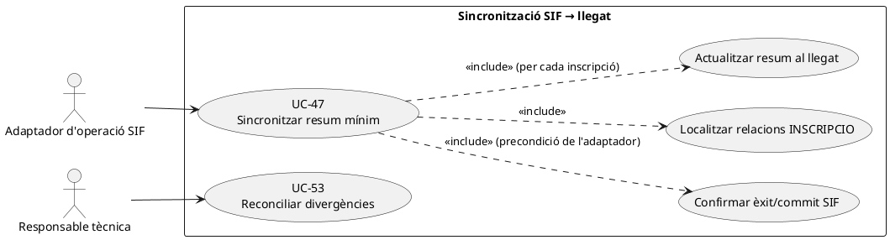
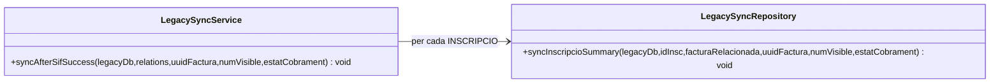

# UC-47 · Sincronitzar l'estat mínim al llegat després del commit del SIF

**Finalitat:** donar al sistema llegat una referència de consulta de la factura i un resum informatiu **després** que el SIF hagi confirmat la seva pròpia operació. La BD llegada **no** assigna número fiscal ni és font de veritat per alterar factures i cobraments.

**Estat de codi revisat:** `LegacySyncService::syncAfterSifSuccess()` i `LegacySyncRepository::syncInscripcioSummary()` són implementats. El servei recorre relacions `INSCRIPCIO` i fa una actualització SQL al llegat; **no** és un worker/outbox general ni prova una transacció distribuïda. La migració de control entre sistemes pot definir estructures addicionals però el camí PHP consultat no les registra automàticament.

## 1. Fitxa basada en el servei real

| Element | Evidència o contracte |
| --- | --- |
| Actor | Adaptador/integració després de l'èxit d'emissió o cobrament SIF; operador només per visualització/conciliació posterior. |
| Entrada | Connexió `legacyDb`, `relations`, `uuidFactura`, `numVisible`, `estatCobrament`; per cada relació amb `source_type=INSCRIPCIO` i `source_id`, opcional `factura_relacionada`. |
| Filtre del servei | Ignora relacions no `INSCRIPCIO` i relacions sense `source_id`. Una factura de pack/grup pot tenir N relacions d'inscripció; la sincronització pot executar diversos `UPDATE`. |
| Escriptura exacta al llegat | `UPDATE inscripcions SET FACTURA_RELACIONADA=COALESCE(FACTURA_RELACIONADA, ?), OBSERVACIONS=CONCAT(COALESCE(OBSERVACIONS,''), '\\nSIF ', NUM_VISIBLE, ESTAT_COBRAMENT, UUID_FACTURA) WHERE ID=?`. |
| Resultat | No retorna UUID ni un estat de job: el mètode és `void`. El mètode repositori no comprova `rowCount()`; una inscripció absent pot no produir error SQL, **malgrat no quedar sincronitzada**. |
| Límits | El servei **no modifica `A_PAGAR`, `PAGAMENT` ni l'estat de matrícules**, i no conserva una atribució monetària individual. El text a `OBSERVACIONS` no substitueix `payment_transaction` ni `factura_registres`. |

### 1.1. Flux real de codi

1. L'adaptador executa l'operació al SIF; només **després de confirmar l'èxit SIF** ha de cridar `syncAfterSifSuccess()`. Aquesta condició és el contracte de l'adaptador; la classe `LegacySyncService` no pot verificar per si sola que l'altre commit existeix.
2. `LegacySyncService` selecciona cada relació de `INSCRIPCIO` amb `source_id`. Altres relacions principals `PACK`, `GRUP` o `REGAL` no generen una actualització directa en aquest servei.
3. Per a cada inscripció, `LegacySyncRepository` assigna `FACTURA_RELACIONADA` **només quan el valor anterior és NULL** i concatena una anotació `SIF NUM_VISIBLE ESTAT_COBRAMENT UUID_FACTURA` a `OBSERVACIONS`.
4. L'adaptador ha d'evitar presentar una sincronització de totes les inscripcions com a completada si una crida SQL falla o la fila llegada no existeix. Aquesta verificació final no està implementada en el repositori actual.
5. Una correcció posterior del cobrament fiscal o de la situació de l'inscrit **no** pot limitar-se a afegir una altra nota sense conciliació de l'estat estructurat al SIF.

### 1.2. Riscos concrets detectats al codi

| Situació | Efecte que cal tractar |
| --- | --- |
| Reintent equivalent després de fallada de xarxa | L'`UPDATE` **torna a concatenar el mateix text a `OBSERVACIONS`**: aquest side effect **no és idempotent** tot i que la factura SIF sí que es pugui reutilitzar. Cal un marcador/evidència de sincronització únic o una operació idempotent pròpia; no s'ha modificat el PHP. |
| Inscripció ja amb `FACTURA_RELACIONADA` diferent | `COALESCE` conserva la primera relació; si correspon a una altra factura real, la divergència queda amagada al camp estructurat. Cal UC-53, no forçar una sobreescriptura. |
| L'`ID_INSC` no existeix en la BD llegada | `UPDATE ... WHERE ID=?` afecta 0 files, però el repositori no comprova el nombre de files; l'adaptador no ha de dir que el cas ha quedat conciliat sense verificar-ho. |
| Grup/pack amb múltiples inscripcions | N actualitzacions separades; pot quedar sincronització parcial en cas d'error. No s'ha acreditat transacció que abraci el conjunt de canvis al llegat i el commit anterior del SIF. |
| Factura sense relacions INSCRIPCIO | El mètode recorre l'array i finalitza sense tocar cap fila. És un resultat possible, no prova de visibilitat/assignació fiscal. |
| Pagament posterior, compensació o devolució | Cal reflectir el nou estat econòmic al SIF i planificar sincronització estructurada, no assumir que el text existent en `OBSERVACIONS` canvia l'estat acadèmic o calcula el cobrament. |

**Decisió tècnica pendent:** fer un resultat per relació (`UPDATED`, `ALREADY_SYNCED`, `NOT_FOUND`, `CONFLICT`), checkpoint idempotent i incidència amb correlació. Aquests valors són **proposta**, no retorn actual del servei `void`.

## 2. UML de casos d'ús



## 3. Diagrama de classes real



**No** s'atribueix a `LegacySyncRepository` cap consulta/validació de `rowCount`, lock d'inscripció, reconciliació o idempotència que el codi revisat no conté.

## 4. Seqüència del flux real i fallada de sincronització

```mermaid
sequenceDiagram
autonumber
participant A as Adaptador de venda/cobrament [variable]
participant SIF as Nucli de factura/pagament SIF
participant S as LegacySyncService
participant R as LegacySyncRepository
participant L as BD llegat: inscripcions
A->>SIF: Emetre factura o confirmar cobrament
SIF-->>A: Èxit i commit; UUID_FACTURA, NUM_VISIBLE, ESTAT_COBRAMENT
A->>S: syncAfterSifSuccess(legacyDb,relations,UUID_FACTURA,NUM_VISIBLE,estat)
loop Cada relation amb source_type=INSCRIPCIO
 S->>R: syncInscripcioSummary(idInsc,facturaRelacionada,...)
 R->>L: UPDATE FACTURA_RELACIONADA=COALESCE(), CONCAT(OBSERVACIONS)
 alt SQL retorna error
  L--xR: Excepció
  R--xS: Fallada no reverteix commit SIF
 else SQL acceptat
  L-->>R: UPDATE executat (pot afectar 0 files)
 end
end
S-->>A: void (no compta inscripcions actualitzades)
Note over A,L: Repetir amb mateix UUID afegeix una segona nota a OBSERVACIONS: risc real de no-idempotència
```

## 5. Traçabilitat i proves pendents

[Fitxa antiga UC-47](../06-fitxes-funcionals/uc-047.md) · [UC-53 divergències original](../06-fitxes-funcionals/uc-053.md) · [Model de fons per inscripció](00-revisio-moviments-inscripcions.md) · [LegacySyncService](../../sif/src/Service/LegacySyncService.php) · [LegacySyncRepository](../../sif/src/Repository/LegacySyncRepository.php) · [Regles del cas al catàleg](../04-estat-final/33-casos-us-sif.md).

**No s'ha executat cap test aquí.** Proves imprescindibles: mateixa sync repetida, `ID_INSC` absent, grup parcial, `FACTURA_RELACIONADA` contradictori, caiguda després del commit SIF i efecte d'un cobrament/rectificativa posterior. Cap actualització del llegat pot mutar una factura fiscal ja emesa.
