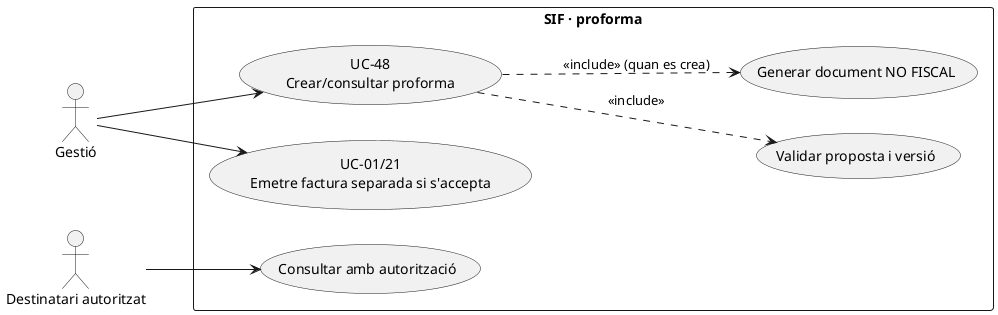
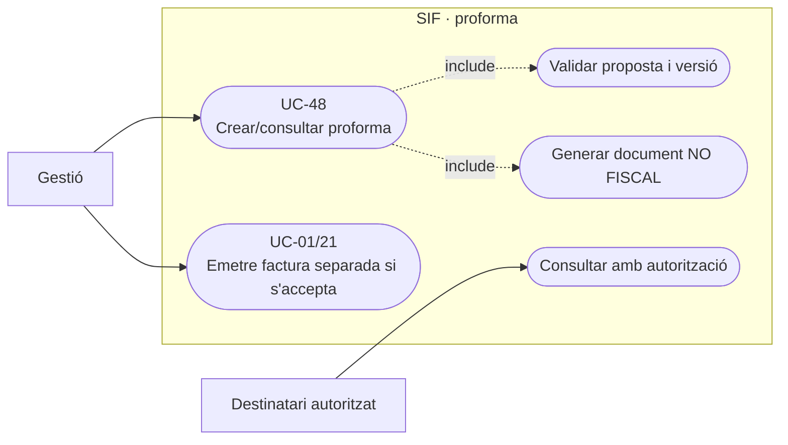
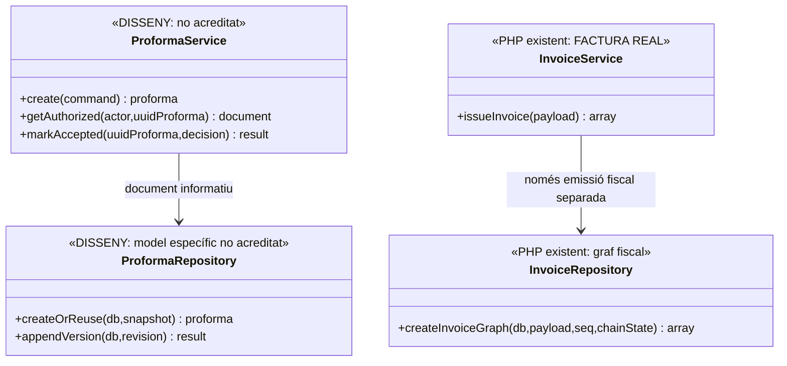
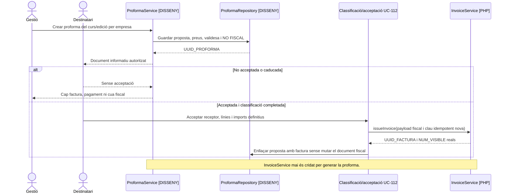

# UC-48 · Crear o consultar una proforma no fiscal

**Objectiu canònic:** una proforma ha d'indicar inequívocament **«No és una factura»**, sense consumir numeració fiscal, hash, cadena o registre de facturació. La fitxa original identifica una funcionalitat llegada i en deixa pendent el disseny de la ruta SIF; **no s'ha identificat al PHP de `sif/src` un `ProformaService` ni una taula de proformes equivalent a `factura`**.

## 1. Fitxa funcional específica

| Aspecte | Regla |
| --- | --- |
| Actors | Gestió que prepara l'oferta i destinatari autoritzat que la consulta. Una proforma d'empresa no dona a cada alumne accés als documents del responsable. |
| Dades | `UUID_OPERATION` de proposta, producte/edició, receptor provisional, línies i preus/tributació proposats, validesa, versió, estat, autor/instant i document o URL segregat; la proforma no rep `UUID_FACTURA` fiscal ni `NUM_VISIBLE` d'una factura real per semblança. |
| Semàntica | Oferta o document informatiu **no fiscal**, amb identificador propi i etiqueta visible. No ha d'aparèixer a `factura_registres`, `fiscal_queue` o `fiscal_chain_state`, ni derivar-ne una factura històrica falsa. |
| Estat inicial | No acredita prestació, ingrés bancari, inscripció confirmada ni emissió de factura. La data de la proposta no es converteix automàticament en data d'emissió fiscal. |
| Import | Preu estimat/proposat derivat de regles aprovades i snapshot, no d'un import editat arbitràriament al navegador; la validesa i la fiscalitat definitives es revisen **en emetre**. |
| Conversió | Si el destinatari accepta i correspon emetre una factura, UC-01/21 crea **una factura nova** amb numeració/cadena pròpies i `UUID_FACTURA`, referenciant l'oferta anterior sense presentar-la com la mateixa entitat fiscal. |
| Pagament | La consulta o enviament d'una proforma no registra `CHARGE`. Si existeix un pagament extern posterior, cal vincular-lo a l'operació/factura vàlida, **no** crear-ne un per marcar «proforma acceptada». |

### Flux objectiu

1. Gestió valida persona/receptor provisional, productes i imports i prepara proposta versionada. No reutilitzar `InvoiceService::issueInvoice()` com a «impressora de proformes»: el servei crea el graf fiscal amb registre i cua.
2. Un servei de proformes **pendent** genera document segregat amb identificador no fiscal, `NO ÉS FACTURA`, validesa i línies. Manté una cronologia de versions/revisions sense modificar la factura que pugui existir més endavant.
3. En consultar, la ruta verifica rol/destinatari i no filtra documents d'altres participants de la mateixa compra/grup.
4. En acceptar, classificar oferta, receptor i impostos actuals; si correspon, emetre per UC-01/21 amb dades definitives i enllaçar el document fiscal real amb la proposta anterior. La proforma no proporciona mai un número fiscal preassignat.
5. Si la proposta caduca o canvia el preu, UC-114/121 governa la nova acceptació; una proforma anul·lada no es transforma en registre fiscal d'anul·lació.

### Alternatives de prova

| Cas | Control |
| --- | --- |
| Proforma generada i mai acceptada | Cap fila a `factura`, `factura_registres`, `fiscal_queue` o `payment_transaction`. |
| Doble clic de «convertir» | Una sola factura real si es classifica/emèt, reutilitzant idempotència de l'operació, sense dos números fiscals. |
| Receptor provisional canvia abans d'acceptar | Oferta nova/versionada i factura amb receptor confirmat; no editar una factura antiga si ja s'havia emès. |
| Proforma de pack/grup | Una línia identificada per component quan correspongui, amb receptor/pagador autoritzats; no deduir que dos participants impliquen dues factures. |
| PDF amb marca «Factura» o QR fiscal previ | Rebuig: cal distingir visualment el document informatiu del fiscal, també al nom, tipus i canal d'accés. |

**Pendent:** repositori/model d'identificador no fiscal, plantilles i permisos, política de caducitat, classificació fiscal en acceptació, enllaç entre proforma i factura i proves de no persistència fiscal.

### Del terme antic «proforma» a la factura real abans del cobrament

**Decisió de PrisMa recuperada als fluxos.** La documentació indica explícitament que PrisMa **no treballarà amb proformes fiscals separades dins del SIF**. En l'operativa antiga, algunes «proformes» s'utilitzaven **com si fossin factures**; si el document porta sèrie/número fiscal o és la factura que l'empresa necessita abans d'abonar la transferència, el cas final és UC-04: **factura real emesa abans de cobrar**, amb `EMESA_ABANS_COBRAMENT=1`, registre i numeració propis, i **sense** `CHARGE` inicial. No permetre que el nom històric de la pantalla o del document reclassifiqui una factura real com una oferta editable que no entra al SIF.

**Document merament informatiu.** Si és un pressupost, simulació o oferta que **encara no s'emet com a factura**, pot existir com a document comercial no fiscal, **sense número ni QR fiscal, hash chain ni cua AEAT**. Això és l'únic abast coherent de UC-48 en l'arquitectura objectiu, i **no acredita** que sigui obligatori crear un mòdul nou de proformes o que `ProformaService` existeixi. Si l'empresa vol una factura real abans de pagar, no enviar-li una proforma etiquetada «no és factura» per substituir el document que ha sol·licitat.

**Convertir sense duplicar.** Una oferta no fiscal acceptada pot precedir l'emissió d'una factura real, amb revisió de receptor, producte, imports i identificadors d'inscripció en el moment de confirmar UC-01/04/21. Si una factura real ja existeix per aquestes inscripcions —encara que estigui pendent de cobrament—, no executar una segona emissió amb el pretext de «convertir la proforma»: recuperar `UUID_FACTURA`, servir el document real i registrar el cobrament posterior per UC-02. La mateixa oferta no és prova d'haver ingressat cap quantitat.

### Proves complementàries de terminologia (no executades)

| ID | Escenari | Resultat exigible |
| --- | --- | --- |
| PF-01 | Empresa sol·licita factura real abans de transferir | UC-04 crea factura fiscal pendent, no una proforma no fiscal. |
| PF-02 | Pressupost editable sense sèrie ni número de factura | Cap inserció al nucli fiscal per la mera generació del pressupost. |
| PF-03 | Oferta «convertida» quan ja existeix factura prèvia de les inscripcions | Recuperar factura existent, sense segon número. |
| PF-04 | Arriba transferència d'una factura emesa abans de cobrar | UC-02 registra CHARGE contra UUID_FACTURA existent, no conversió de document. |

## 2. UML de casos d'ús

### Vista de casos d’ús per a GitHub (Mermaid)

## 3. UML de classes — orquestració no acreditada

## 4. UML de seqüència — proforma i emissió posterior (DISSENY/PARCIAL)

## 5. Traçabilitat

[UC-48 original](../06-fitxes-funcionals/uc-048.md) · [UC-01 factura real](uc-001-emetre-o-reutilitzar-factura.md) · [UC-04 abans de cobrar](uc-004-emetre-factura-abans-cobrar.md) · [UC-112 oferta](uc-112-congelar-snapshot-abans-tpv.md) · [InvoiceService](../../sif/src/Service/InvoiceService.php) · [InvoiceRepository](../../sif/src/Repository/InvoiceRepository.php).
