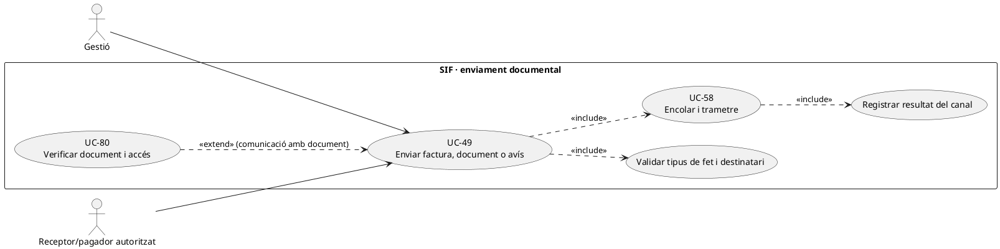
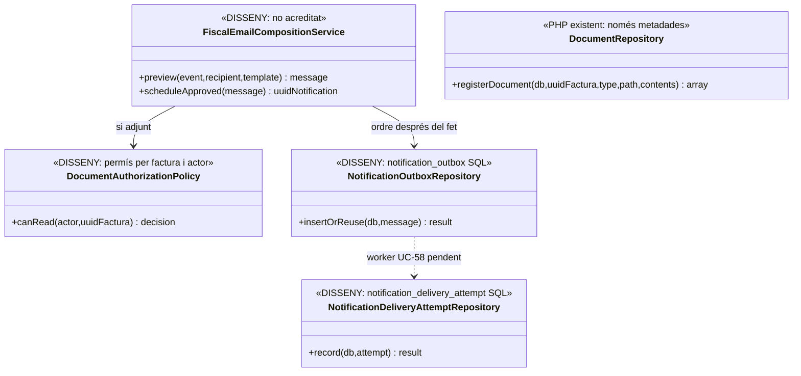
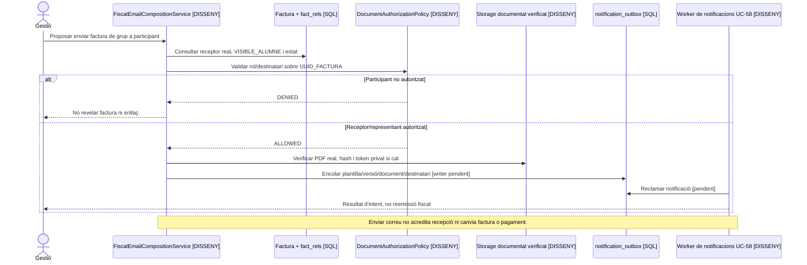

# UC-49 · Enviar factura, document o avís per correu

**Objectiu del catàleg:** enviament al destinatari autoritzat amb plantilla, document real i resultat auditable. **Estat [DISSENY].** UC-49 és la decisió **de contingut i destinatari per una comunicació concreta**; UC-58 és el motor persistent d'enviament. El correu d'una factura no és per si sol lliurament de factura electrònica en format/canal acordats (UC-123), ni tramesa AEAT (UC-77).

## Evidència

`notification_outbox` i `notification_delivery_attempt` estan definides al SQL d'auditoria amb plantilla/versionat, `RECIPIENT_TYPE/HASH`, `PAYLOAD_JSON`, enllaç opcional amb `UUID_FACTURA/UUID_PAYMENT`, estat, següent intent i referència del proveïdor. `DocumentRepository::registerDocument()` registra **només metadades i hash dels bytes aportats**, no comprova que `PATH_FITXER` tingui un fitxer físic servible. **No s'ha acreditat** al PHP revisat ni un controlador complet d'enviament fiscal de correu, ni un worker d'outbox, ni el custodi/servei de documents amb comprovació de permisos. Un camp `BILLING_EMAIL` o `CORREU` no prova automàticament que el destinatari pugui rebre la factura de grup/empresa.

## Contracte de contingut i autorització

| Acció | Control específic |
| --- | --- |
| Triar comunicació | Distingir avís de factura emesa, sol·licitud de pagament, confirmació de cobrament **real**, rectificativa, document informatiu i avís acadèmic. El text no pot afirmar «pagat» per `DS_ORDER` pendent ni «factura emesa» per una proforma. |
| Triar destinatari | Validar receptor fiscal/representant, pagador i contacte vigent. Per factura de grup creada amb responsable de `respGrups` i relacions `VISIBLE_ALUMNE=0`, **no adjuntar-la als participants** pel sol fet de compartir `IDPAG`. |
| Adjuntar o enllaçar | Confirmar `UUID_FACTURA`, tipus de document, existència i integritat **real dels bytes** UC-78, i permís UC-80. Preferir enllaç privat, caducable i limitat en abast quan la política ho requereixi; no posar una ruta de storage o token reutilitzable en un correu sense protecció. |
| Plantilla i sortida | Conservar `TEMPLATE_CODE/VERSION`, idioma, objecte i destinatari, causa, `REQUEST_ID` i correlació; censurar NIF, dades sensibles i secrets en assumpte/log. Un email de gestió no és una forma de donar consentiment comercial UC-125. |
| Enviar i auditar | Crear ordre idempotent **després** de confirmar el fet, registrar l'intent/canal/proveïdor, i diferenciar acceptació del servidor de correu, lliurament i lectura. Un timeout pot tenir resultat incert i exigeix evitar duplicar l'avís de manera indiscriminada. |
| Efecte fiscal i diner | Enviar o reenviar email no emet nova factura ni crea `CHARGE/REFUND` o entrada AEAT. Si falla només correu/document, recuperar **la mateixa factura** sense tornar a cobrir/rectificar l'operació original. |

### Flux objectiu i proves

1. L'operador identifica **el fet existent** i el tipus de comunicació, comprova receptor/pagador, grup, rol, fitxer i estat fiscal/econòmic real. Si falta document o autorització, l'avís queda pendent, **no** es fabrica un PDF en el correu.
2. Previsualitzar plantilla, destinatari i enllaç privat. Registrar acceptació/ordre amb idempotència per fet+tipus+receptor i persistir outbox. Per correus amb adjunt, relacionar document **exacte** i hash, no només `UUID_FACTURA`.
3. El worker UC-58 **pendent** envia amb prova d'intent. En resposta incerta conserva l'event original i consulta la referència del proveïdor abans de reintentar si el canal ho permet.
4. Mostrar separadament «preparat», «enviat», «lliurat si acreditat» i «document consultat». Un avís d'email no modifica `ESTAT_AEAT` ni `ESTAT_COBRAMENT`.
5. Provar: factura abans de cobrar, una factura de tres alumnes a empresa, email compartit, PDF absent amb metadada `CREATED`, token caducat, correu duplicat amb timeout, devolució autoritzada però encara no executada i baixa acadèmica amb Moodle pendent.

**Pendents:** plantilla i política de destinatari, storage i link segur, worker/outbox, tractament de lliurament, idempotència en proveïdor i proves de privacitat. Cap correu real enviat ni test executat en aquesta revisió.

## UML de casos d'ús

## UML de classes

## UML de seqüència — factura d'empresa i destinatari no autoritzat

## Traçabilitat

[UC-49 original](../06-fitxes-funcionals/uc-049.md) · [UC-58 outbox original](../06-fitxes-funcionals/uc-058.md) · [UC-79 comunicació fiscal](uc-079-comunicacio-fiscal-auditable.md) · [UC-78 documents](uc-078-generar-custodiar-pdf-qr-xml.md) · [UC-80 autorització](uc-080-servir-registrar-acces-document-fiscal.md) · [UC-123 electrònica](uc-123-lliurar-factura-electronica.md) · [DocumentRepository](../../sif/src/Repository/DocumentRepository.php) · [SQL outbox](../../sif/database/migrations/2026_09_15_000003_add_functional_audit_control.sql).
