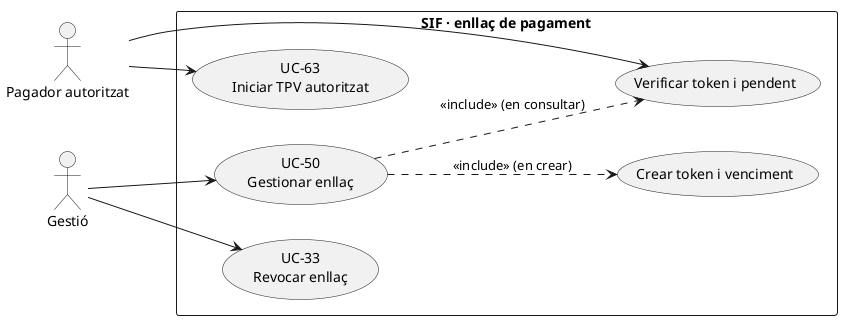
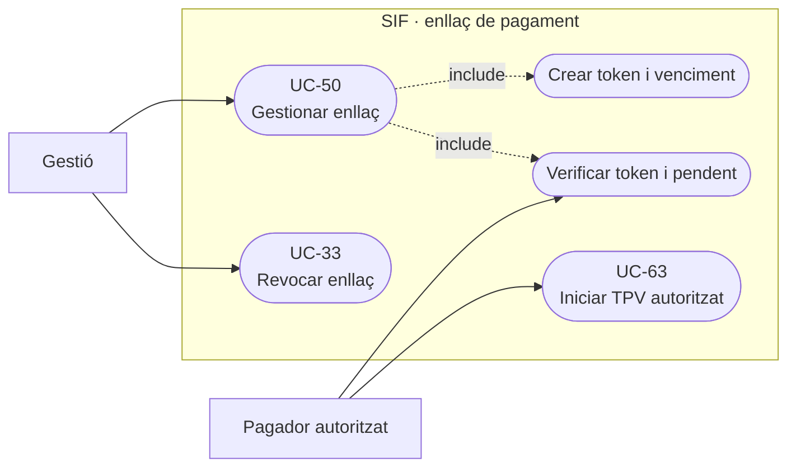
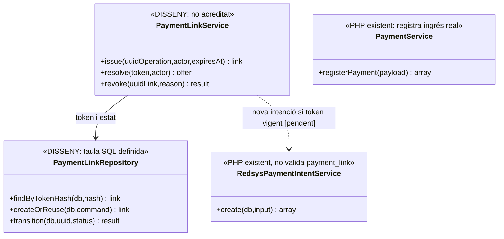
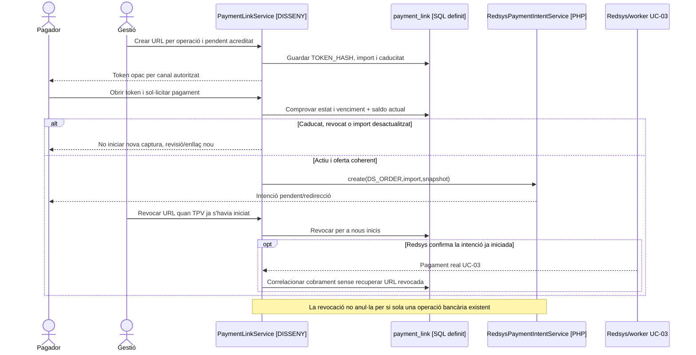
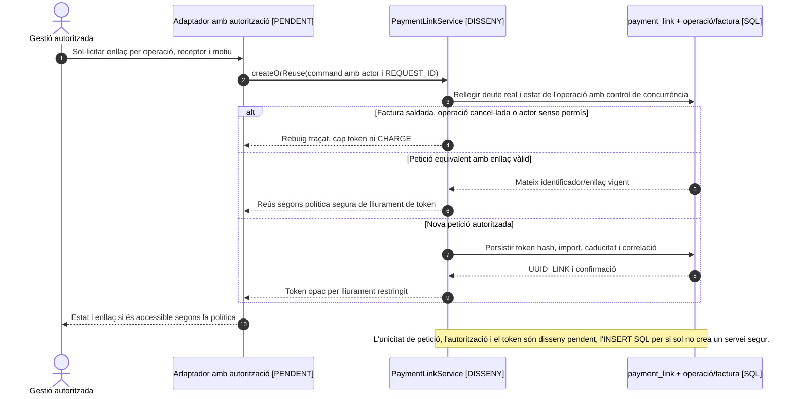
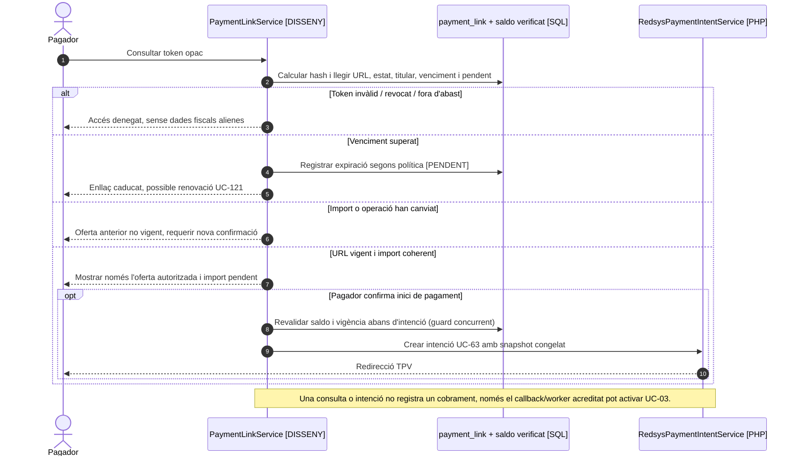

# UC-50 · Crear, consultar, desactivar o caducar un enllaç de pagament

**Objectiu canònic:** token segur, caducitat, estat i auditoria. L'enllaç és una **autorització temporal per iniciar una compra/pagament**, no una factura ni una garantia que la caixa hagi rebut diners. UC-33 tracta específicament la revocació i UC-61 la consulta de l'import pendent des de l'alumnat.

## 1. Evidència actual i abast

La migració `2026_09_16_000004_add_commercial_operation_and_fiscal_fields.sql` defineix `payment_link` amb `UUID_PAYMENT_LINK`, `UUID_OPERATION`, `TOKEN_HASH` únic, `STATUS` (per defecte `ACTIVE`), `PAYER_PARTY_KEY`, `EXPECTED_AMOUNT`, `CURRENCY`, `EXPIRES_AT`, `REVOKED_AT/BY/REASON`, `REPLACED_BY_UUID` i `LAST_ACCESSED_AT`. La FK apunta a `commercial_operation`; **no hi ha un `UUID_FACTURA` directe** a `payment_link`: cal arribar-hi per operació/relacions.

`RedsysPaymentIntentService::create()` sí que crea una intenció de TPV a partir de `DS_ORDER`, snapshot i import; comprova el reús contradictori de la mateixa ordre. **No és** un servei d'emissió, lectura o revocació de `payment_link`. En els serveis PHP revisats no s'ha acreditat `PaymentLinkService`, validació server-side de token o connexió efectiva del portal d'alumnat amb aquesta taula. `TOKEN_HASH` en SQL per si sol no controla autenticació, reutilització o filtració de la URL.

## 2. Contracte funcional específic

| Acció | Condicions i resultat |
| --- | --- |
| Crear | Validar actor, `UUID_OPERATION`, titular/pagador, import **pendent real** derivat de factura i assignacions, moneda, oferta acceptada i venciment. Generar token aleatori opac, guardar-ne només hash i comunicar el secret una sola vegada al destinatari autoritzat; el mecanisme de generació/custòdia **no està implementat al servei SIF revisat**. |
| Consultar | Comprovar token/permís, `STATUS`, venciment, pagador/operació, import actual i enllaç substitutiu. Evitar que consultar un token reveli matrícula, NIF o documents d'una altra persona. Registrar `LAST_ACCESSED_AT`/event quan la ruta real estigui integrada. |
| Iniciar TPV | Revalidar estat i import **immediatament abans** de crear la intenció UC-63: un enllaç emès per 100 € no pot iniciar una nova captura de 100 € si ja s'han ingressat 60 € i el pendent real és 40 €, sense nova oferta autoritzada. |
| Revocar/caducar | Canviar estat amb versió, actor, motiu i moment; impedir **noves iniciacions** des del token. `REPLACED_BY_UUID` permet referenciar un enllaç renovat, però la lògica de transició/revocat no està acreditada. |
| Efecte fiscal | Crear o revocar enllaç **no modifica** `factura`, `factura_registres`, numeració, cadena, total ni receptor. Una factura emesa abans de cobrar continua existint quan caduqui la URL. |
| Efecte monetari | Cap `CHARGE` per crear, visualitzar, revocar o caducar. Un pagament real es registra només mitjançant el callback/worker o via de cobrament acreditada, amb identificació única del moviment i fons individuals quan correspongui. |

### Flux objectiu

1. L'operador/portal identifica l'operació i la persona legitimada, consulta factura i pagaments **reals** i classifica si l'operació ja està pagada, cancel·lada o en curs.
2. El gestor pendent crea/reutilitza un enllaç per petició idempotent, token hash, import i caducitat; **la taula no té clau idempotent per enllaç** diferent del hash únic. Cal definir unicitat lògica de l'operació/versió per evitar múltiples URLs actives contradictòries.
3. En visitar-lo, el servidor verifica hash/estat/venciment i torna a calcular el pendent; un token caducat o revocat **no redirigeix a Redsys**. El navegador no decideix l'import final.
4. En confirmar pagament, es congela snapshot coherent UC-112 i es crea intenció UC-63; el callback UC-03 només valida signatura, import, divisa i terminal de la **intenció**, no l'estat actual de `payment_link`. Cal integrar explícitament aquests controls abans d'acceptar una nova captura.
5. Després de confirmar el moviment real, s'actualitza estat de l'enllaç (consumit o parcial, segons política), es conserva evidència de l'operació i s'evita capturar una altra vegada pel mateix deute.
6. En revocació/renovació, preservar l'operació i factura; si arriba **després** un callback d'una intenció iniciada mentre l'enllaç era vàlid, cal conciliar l'ingrés existent en comptes d'esborrar-lo o emetre una factura duplicada.

### Alternatives de prova

| Escenari | Control esperat |
| --- | --- |
| URL reenviada a persona no autoritzada | No revelar dades/factura; definir autenticació addicional segons política i risc. |
| Dos clics sobre el mateix token | Una única intenció/comanda equivalent, sense doble captura o dues matrícules. |
| Enllaç antic de 100 € després de pagament parcial de 60 € | No cobrar 100 € de nou; nova proposta/enllaç per import pendent real de 40 €, si és correcte. |
| Revocació amb Redsys ja iniciat | Bloquejar nous inicis i conciliar callback tardà; revocar URL **no desfà** una autorització bancària en tràmit. |
| Nova oferta després d'expiració | UC-121: nou snapshot, plaça i consentiment quan correspongui; no reutilitzar `DS_ORDER` amb dades diferents. |

**Pendents:** servei de token, permisos i consulta real, criteri de múltiples enllaços, lock de saldo, ús parcial, integració de validació al TPV, idempotència i proves de callbacks/revocació concurrents.

### 2.1. Enllaços individuals coberts per factura d'empresa — xat original

El xat original especifica un cas d'ús propi: l'operador selecciona N inscripcions a «Generar factura abans de pagar», assigna el pagament a una empresa/responsable i vol **inhabilitar les URL individuals** de totes aquestes persones, amb un missatge que indiqui que el pagament correspon a l'entitat. Això requereix una relació de cobertura per `ID_INSC` i `UUID_FACTURA`/operació, no una revocació massiva per coincidència de CIF: una entitat pot tenir diverses factures legítimes. El responsable conserva una via de pagament autoritzada per **la factura exacta** si aquesta continua pendent.

**Transició de cobertura proposada (no implementació acreditada):** reservar/bloquejar de forma idempotent les inscripcions seleccionades i intencions TPV incompatibles, revalidar factura/cobraments i confirmar l'emissió abans de publicar la cobertura efectiva. El resolvedor ha de denegar nous TPV individuals tan bon punt es confirma la cobertura, incloses URLs antigues que encara circulin per correu; desactivar només un botó o reescriure URL al navegador no és suficient. Si falla la sincronització amb intranet després de l'emissió fiscal, conservar factura i restricció de pagament incompatible i obrir incidència; si falla abans d'emetre, alliberar qualsevol reserva no consumida segons regla auditada. **No s'afirma atomicitat real entre dues BDs, banc i SIF.**

**Reassignació i expiració:** la factura d'empresa `EMESA_ABANS_COBRAMENT=1` no s'anul·la per revocar les URLs individuals. El cobrament posterior es vincula al mateix UUID_FACTURA; una URL global d'empresa de 300 € que ha quedat desfasada per una baixa, alta o transferència parcial requereix revalidació i eventual reemplaçament abans de començar un altre TPV, sense duplicar la factura. UC-33 és la revocació d'un enllaç concret i UC-61 és la consulta per persona autoritzada.

**Proves addicionals no executades:** doble clic per generar factura de grup i clic simultani en TPV individual; URL antiga reutilitzada després de cobertura; pagament d'empresa parcial amb URL global d'import antic; empresa-contacte amb mateix CIF que altres grups; callback d'operació individual validada abans de revocació; error de sincronització després d'emetre factura; revocació i nova oferta per un participant retirat sense reutilitzar token ni `DS_ORDER` obsolets.
## 3. UML de casos d'ús

### Vista de casos d’ús per a GitHub (Mermaid)

## 4. UML de classes — SQL existent vs PHP real

## 5. UML de seqüència — intent amb revocació concurrent (DISSENY/PARCIAL)

### 5.1. Seqüència pròpia de l'acció «crear enllaç» — OBJECTIU, no implementació acreditada

### 5.2. Seqüència pròpia de l'acció «consultar enllaç» — OBJECTIU, no implementació acreditada

### 5.3. Accions «revocar» i «caducar»: fronteres i seqüències pròpies

**Revocar** és UC-33, amb [diagrama de seqüència propi](uc-033-desactivar-url-pagament.md#4-uml-de-seqüència--revocació-i-callback-posterior) i prova de callback signat d'una intenció iniciada abans de la revocació. **Caducar** s'explicita al flux de consulta 5.2; si el sistema adopta un worker de caducitat, cal documentar una seqüència addicional del worker i demostrar que l'expiració només impedeix **noves** intencions: no anul·la automàticament la factura ni descarta un cobrament bancari que ja s'havia iniciat. Cap d'aquestes dues accions no modifica la numeració fiscal.

**Punts de prova d'UC-50:** doble creació simultània; consulta de token aleatori/aliè; canvi de saldo entre consulta i iniciar Redsys; revocació i callback tardà; venciment exacte; intenció creada abans de caducar; reintent de creació amb mateixa clau però import/pagador diferents. No consten com a proves executades en aquesta revisió.
## 6. Traçabilitat

[UC-50 original](../06-fitxes-funcionals/uc-050.md) · [UC-33 revocació original](../06-fitxes-funcionals/uc-033.md) · [UC-61 pendent original](../06-fitxes-funcionals/uc-061.md) · [UC-121 renovació](uc-121-repreuar-renovar-reserva-caducada.md) · [UC-112 snapshot](uc-112-congelar-snapshot-abans-tpv.md) · [UC-03 cobrament](uc-003-processar-cobrament-redsys-asincron.md) · [Migració payment_link](../../sif/database/migrations/2026_09_16_000004_add_commercial_operation_and_fiscal_fields.sql) · [RedsysPaymentIntentService](../../sif/src/Service/RedsysPaymentIntentService.php) · [RedsysCallbackService](../../sif/src/Service/RedsysCallbackService.php).
