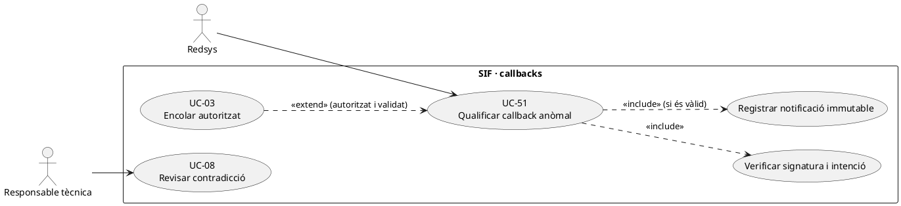
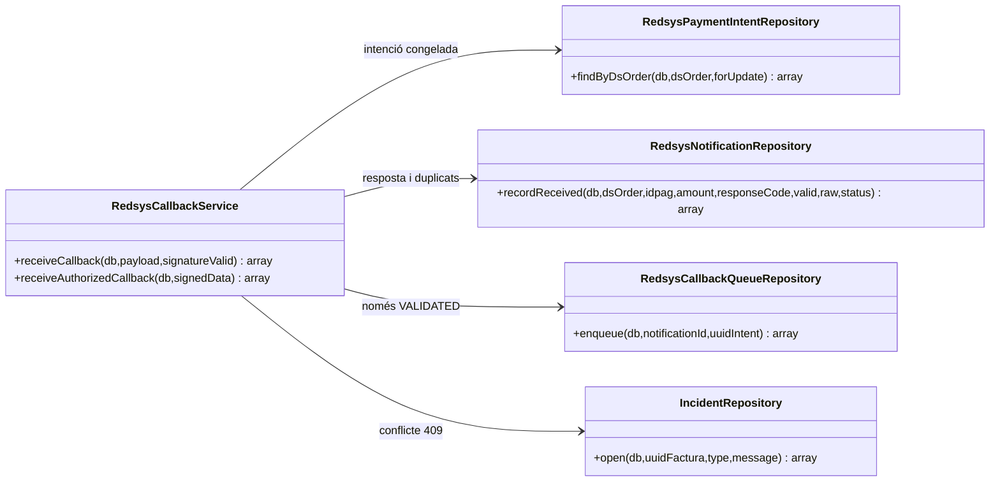

# UC-51 · Callback Redsys denegat, duplicat, tardà o contradictori

**Frontera funcional.** UC-51 qualifica una notificació concreta de Redsys; UC-03 és el circuit ordinari de recepció, cua i emissió; UC-52 gestiona l'execució/recuperació dels jobs. **Estat verificat:** `RedsysCallbackService`, `RedsysNotificationRepository`, `RedsysPaymentIntentRepository`, `RedsysCallbackQueueRepository` i `IncidentRepository` existeixen. «Tardà» no té una regla de caducitat explícita verificada al servei de recepció: no s'afirma que rebutgi automàticament totes les notificacions fora de termini.

## 1. Fitxa funcional basada en el codi

| Situació | Comportament executable observat | Límit o decisió pendent |
| --- | --- | --- |
| Signatura invàlida | `receiveCallback(db,payload,false)` llança error **abans** d'entrar a la transacció i no desa notificació/job. | El tractament del log i la resposta HTTP depèn de l'adaptador extern. |
| Ordre desconeguda | `findByDsOrder(...,true)` no troba `redsys_payment_intent`; error i rollback. | El servei no inventa una intenció a posteriori. |
| Import, divisa o terminal diferents | `assertMatchesIntent` exigeix igualtat respecte de la intenció; error i rollback de notificació/job. | El codi consultat només obre `REDSYS_CALLBACK` automàticament per excepció de **conflicte 409**, no per tot error de validació 422. |
| Redsys denega | `statusForResponseCode`: sols codis numèrics 0–99 són `VALIDATED`; la resta `ERROR`. Desa notificació denegada i **no encua job**. | La denegació no cancel·la per si sola una factura ja emesa ni revoca una inscripció anterior. |
| Duplicat equivalent de `DS_ORDER` | `recordReceived` comprova import, codi resposta, divisa, terminal, versió de signatura i hash; retorna `duplicate=true`. Una notificació validada equivalent reutilitza el job perquè `enqueue` és idempotent per `NOTIFICATION_ID`. | No repetir `CHARGE`, factura ni atribució individual. |
| Duplicat contradictori | Si `DS_ORDER` existent té dades diferents, `SifException::conflict`; el servei fa rollback i després obre `errors_verifactu` tipus `REDSYS_CALLBACK`. | No permetre que el segon callback reescrigui l'import, receptor o snapshot del primer. |
| Callback tardà | En el codi de recepció consultat **no es verifica `EXPIRES_AT` ni l'estat acadèmic de la inscripció** abans d'encuar una notificació validada. | Cal decidir tractament de compra/inscripció canviada o anul·lada abans de l'emissió efectiva, amb conciliació i UC-71/72 si escau. |
| Resposta denegada després d'una altra resposta | Si comparteixen `DS_ORDER` però difereixen en codi o altres camps, es classifiquen com a contradictòries; no se substitueix la notificació existent. | Cal revisar el resultat del proveïdor abans de qualsevol moviment compensatori. |

**Precondicions del canal:** signatura verificada per `RedsysSignatureValidator`; `receiveAuthorizedCallback()` pressuposa que el canal ja li entrega dades signades verificades. **No s'ha d'exposar públicament aquest segon mètode sense la comprovació del primer.** No desar PAN/CVV ni publicar payloads complets en una incidència accessible a alumnes.

### 1.1. Efectes fiscals i econòmics

UC-51 **no crea una factura ni un `payment_transaction` directament**: el callback autoritzat i validat només crea/reutilitza notificació i feina de cua. UC-52/03 poden emetre la factura i registrar l'import bancari confirmat més endavant. Quan el callback es contradiu amb una factura ja processada, cal revisar `UUID_FACTURA`, `UUID_PAYMENT`, `DS_ORDER` i eventual atribució a cada inscripció: **no** inventar un segon cobrament o una devolució només per una resposta tardana.

### 1.2. Ordre antiga, cobertura d'empresa i devolució posterior — contrast amb el xat original

**L-ORDRE — tardà respecte a què?** El xat diferencia una intenció individual iniciada abans que una empresa assumeixi el pagament, una inscripció canviada de curs/baixa i un enllaç antic d'import desfasat. Revocar l'enllaç o canviar la inscripció **no és cancel·lar la transacció Redsys ja iniciada**. La recepció valida signatura i intenció original, però ha de distingir la validesa tècnica del callback de l'autorització de generar ara una **factura nova per l'antic servei**. Si el banc ha cobrat realment, conservar-ne la prova i tramitar assignació, excés, retorn o incidència segons la situació; no suprimir el `CHARGE` ni emetre una factura duplicada per resoldre el conflicte.

**L-COBERTURA — factura d'empresa anterior al callback.** Abans que el worker processi una intenció individual validada, contrastar `ID_INSC`, `UUID_FACTURA` de grup/empresa, `DS_ORDER`, intents actius i altres cobraments. La comparació de callback per la mateixa DS_ORDER detecta duplicació **d'aquesta ordre**, però no que una **altra** DS_ORDER o transferència ja hagi cobert l'operació. Si hi ha cobertura incompatible, preservar la notificació real, suspendre emissió/cobrament de venda incompatible i obrir conciliació. El bloqueig entre sistemes, la política de devolució i el coordinador continuen pendents.

**L-DENEGAT — mateixa referència operativa, intents diferents.** Un `IDPAG` pot tenir un primer intent denegat i un segon acceptat amb DS_ORDER diferent. L'ordre denegada pot figurar a `redsys_notifications` com `ERROR` i no genera job/CHARGE, però no impedeix per ella mateixa que una nova ordre vàlida es processi. En canvi, dos callbacks diferents per **la mateixa DS_ORDER** amb imports/respostes contradictoris exigeixen incidència i verificació externa, no agafar l'últim rebut com a veritat.

**L-FITXER — relació amb conciliació de CSV.** El fitxer TPV de la intranet és evidència addicional de l'operació bancària i pot descobrir callback perdut o job no processat; no crea una notificació signada retroactiva ni pot convertir un resultat `state=1` del comparador antic en cobrament SIF verificat. Revisió a UC-25 i recuperació de job a UC-52.

**Proves addicionals no executades:** mateixa IDPAG amb una denegació i una acceptació a DS_ORDER diferents; callback individual tardà després de factura d'empresa; callback de diferència de curs ja revertit; notificació de DS_ORDER antic amb import desfasat; callback validat encara en RETRY que apareix com a «no facturat» al CSV; en tots els casos conciliar el cobrament real sense una factura/assignació duplicada.

## 2. Diagrama UML de casos d'ús



## 3. Diagrama de classes — dependències PHP



## 4. Seqüència — notificació i alternatives reals

```mermaid
sequenceDiagram
autonumber
actor Bank as Redsys
participant C as Canal/verificador de signatura
participant S as RedsysCallbackService
participant I as RedsysPaymentIntentRepository
participant N as RedsysNotificationRepository
participant Q as RedsysCallbackQueueRepository
participant E as IncidentRepository
Bank->>C: Callback signat
alt Signatura invàlida
 C--xBank: Rebuig; sense notificació/job al servei
else Signatura vàlida
 C->>S: receiveAuthorizedCallback(payload verificat)
 S->>I: findByDsOrder(DS_ORDER,true)
 alt Intenció absent o import/divisa/terminal no coincideixen
  S--xC: Validació i rollback
 else Intenció coherent
  S->>N: recordReceived(DS_ORDER,code,payload,status)
  alt Duplicat contradictori
   N--xS: conflict 409
   S->>E: open(REDSYS_CALLBACK,detalls) després de rollback
   S--xC: Conflicte sense nou job
  else Denegat
   N-->>S: ERROR
   S-->>C: status ERROR, sense job
  else Autoritzat o duplicat equivalent
   N-->>S: notification_id, duplicate?
   S->>Q: enqueue(notification_id,UUID_INTENT)
   Q-->>S: job existent o QUEUED nou
   S-->>C: Resposta HTTP lògica amb job; cap factura al callback
  end
 end
end
```

## 5. Proves i traçabilitat

Proves localitzades, **no executades en aquesta revisió**: `RedsysCallbackTest` cobreix signatura, denegat, duplicat equivalent/contradictori, import diferent, ordre repetida i ús d'`IDPAG` de la intenció. Queden pendents les proves de **caducitat real**, callback després d'una baixa o canvi de curs i la conciliació de fons per inscripció.

[UC-51 original](../06-fitxes-funcionals/uc-051.md) · [UC-03](uc-003-processar-cobrament-redsys-asincron.md) · [UC-52](../06-fitxes-funcionals/uc-052.md) · [UC-63](uc-063-crear-intencio-redsys.md) · [RedsysCallbackService](../../sif/src/Service/RedsysCallbackService.php) · [RedsysNotificationRepository](../../sif/src/Repository/RedsysNotificationRepository.php) · [RedsysCallbackTest](../../sif/tests/Integration/RedsysCallbackTest.php).
