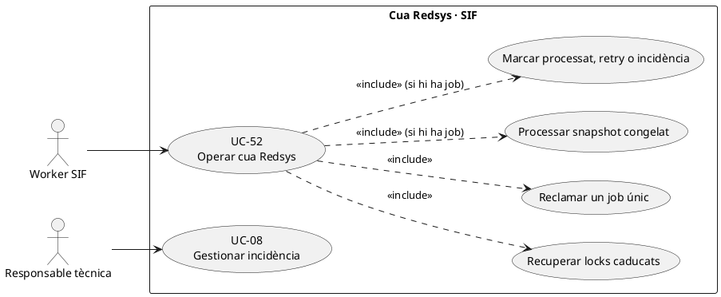
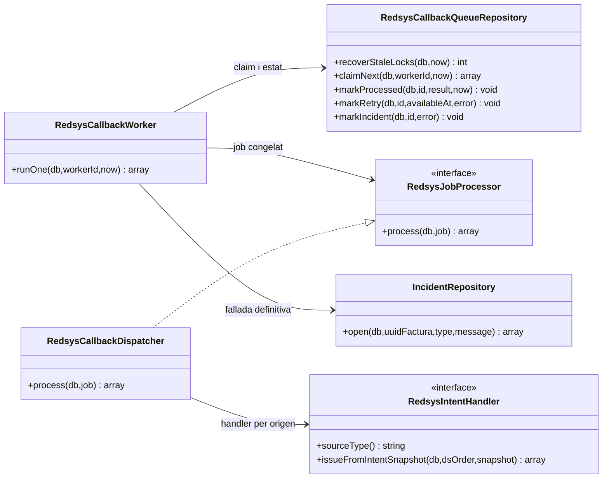
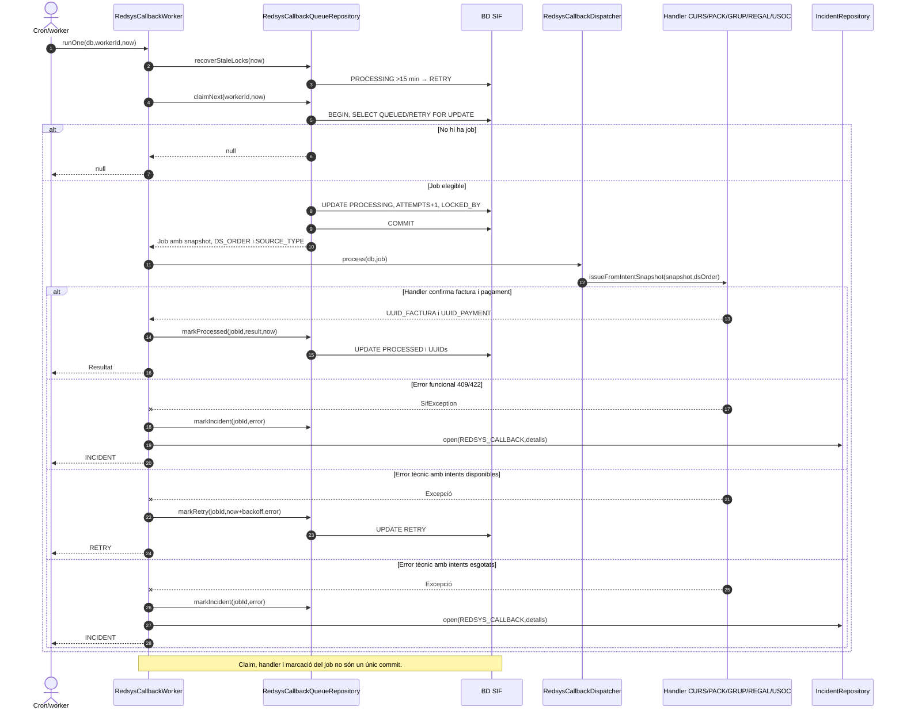

# UC-52 · Operar la cua Redsys — fitxa funcional i UML

**Àmbit:** seleccionar i executar de manera asíncrona un job vinculat a una **notificació Redsys ja validada**. UC-51 tracta callbacks anòmals; UC-03 engloba la recepció/execució de l'operació; UC-52 descriu la cua, reintents, bloquejos i resultat. **No** equival a la cua fiscal AEAT de UC-09/54.

**Codi contrastat:** `RedsysCallbackWorker`, `RedsysCallbackQueueRepository`, `RedsysCallbackDispatcher` i `RedsysJobProcessor`. **Part implementada:** recuperació de bloquejos, claim únic amb `FOR UPDATE`, despatx per `SOURCE_TYPE`, reintents i incidència. **Pendent d'acreditar:** panell d'operació segur, reconciliació d'efectes sobre el llegat i atribució quantitativa de pagaments per inscripció.

## 1. Fitxa del cas

| Punt | Contracte i evidència |
| --- | --- |
| Actors | Worker SIF automàtic; responsable tècnica amb accés al panell objectiu. L'operació del worker no necessita que la intranet sigui oberta. |
| Entrada | Job `redsys_callback_queue` vinculat a `redsys_notifications` i `redsys_payment_intent`; `DS_ORDER`, `UUID_INTENT`, `SOURCE_TYPE`, `SOURCE_ID` i `SNAPSHOT_JSON` congelats. |
| Selecció | `claimNext(db,workerId,now)` busca `QUEUED`/`RETRY` amb `AVAILABLE_AT <= now`, ordena disponibilitat/ID, bloqueja amb `FOR UPDATE`, marca `PROCESSING`, augmenta `ATTEMPTS` i desa `LOCKED_AT`/`LOCKED_BY`. |
| Procés | `RedsysCallbackDispatcher::process()` valida `SOURCE_TYPE` amb un handler registrat i descodifica `SNAPSHOT_JSON`; el handler crea/reutilitza factura/pagament corresponent a la compra. |
| Èxit | `markProcessed()` escriu `RESULT_JSON`, `UUID_FACTURA`, `UUID_PAYMENT`, `PROCESSED_AT` i estat `PROCESSED`, i esborra lock/error. |
| Fallada funcional | `SifException` amb codi 409 o 422 va **directament** a `INCIDENT`; `IncidentRepository::open()` crea avís `REDSYS_CALLBACK`. |
| Fallada tècnica | Amb intents disponibles: `RETRY` als 1, 5, 15 i 60 minuts (segons intent); amb intents esgotats: `INCIDENT` + obertura d'incidència. `maxAttempts` s'injecta al constructor i **no** està codificat en aquesta classe com a literal 5. |
| Lock obsolet | `recoverStaleLocks` retorna a `RETRY` jobs en `PROCESSING` bloquejats **fa més de 15 minuts**, i els fa disponibles de nou. |

### 1.1. Flux executable i transaccions

1. `RedsysCallbackWorker::runOne(db,workerId,now)` recupera bloquejos antics i demana `claimNext()`; si la cua és buida retorna `null` i no emet cap factura.
2. `claimNext()` fa `BEGIN`, `SELECT ... FOR UPDATE` i `UPDATE PROCESSING` i després `COMMIT`. **El claim acaba abans** del treball de negoci.
3. El worker invoca `RedsysJobProcessor::process()` (concretament `RedsysCallbackDispatcher`) que selecciona el handler segons l'intent congelat: `CURS`, `PACK`, `GRUP`, `REGAL` o `USOC_ALUMNE`.
4. El handler emet/reutilitza factura, registre fiscal, cua AEAT i pagament real; si té èxit, `markProcessed()` exigeix que el job encara sigui `PROCESSING` i desa UUIDs.
5. Si hi ha `SifException 409/422`, l'estat passa a `INCIDENT` i s'obre una incidència; la cua no reintenta automàticament un error funcional.
6. Si falla per problema tècnic, `markRetry()` calcula nova disponibilitat segons el número d'intent, o `markIncident()` quan s'esgota `maxAttempts`; les transicions exigeixen `STATUS='PROCESSING'`.

**Observació de concurrència:** `markProcessed`, `markRetry` i `markIncident` comproven l'estat `PROCESSING` però **no comparen `LOCKED_BY=workerId`** en l'`UPDATE` que s'ha revisat. Recuperar un lock mentre un worker lent encara treballa pot fer que una execució posterior també processi el mateix job. L'idempotència del handler i de la factura/pagament és indispensable, i la coordinació de l'atribució per inscripció ha de ser idempotent.

### 1.2. Alternatives i diagnosi

| Escenari | Resultat correcte |
| --- | --- |
| Job reintentat després que s'emetés la factura però abans de marcar `PROCESSED` | Handler ha de retornar UUIDs existents; no crear un segon `CHARGE` o una segona atribució econòmica per inscripció. |
| `SOURCE_TYPE` sense handler o snapshot invàlid | El despatxador retorna validació; el worker classifica `422` com a incidència funcional. |
| Error tècnic primer, segon, tercer o quart | `RETRY` segons `retryDelayMinutes()`; l'espera es compta des de `now`. |
| Cinquè error tècnic | Amb configuració de màxim 5 intents, `INCIDENT`; verificar el valor real injectat al worker abans de suposar la configuració del desplegament. |
| Worker caigut després del claim | `PROCESSING` queda bloquejat fins a recuperació a `RETRY` després de 15 minuts. |
| Error d'obertura d'incidència | No afirmar que job i avís han quedat registrats atòmicament; `markIncident()` i `incidents->open()` són dues crides de repositoris diferents sense transacció conjunta explícita en `runOne()`. |
| Job marcat `PROCESSED` però BD llegada no sincronitzada | `RESULT_JSON` i UUIDs del nucli no acrediten l'alta acadèmica ni l'accés a cursos; cal estat/conciliació posterior de UC-47/53. |
| Pack o grup amb N inscripcions | Un `UUID_PAYMENT` inicial real i N atribucions quantitatives objectiu; la recuperació del job **no** pot multiplicar pagaments ni atribucions. |

**Proves identificades, no executades en aquesta revisió:** `RedsysCallbackWorkerTest`: claim únic, commit de claim, èxit amb UUIDs, retry tècnic, 409→incidència, lock obsolet i cinquè error; `RedsysAsyncFlowTest`: dos workers no reclamen simultàniament el mateix job.

### 1.3. Recuperació d'efectes confirmats i alta acadèmica pendent — contrast amb el xat original

**Q-SIF vs BD llegada.** El worker pot marcar `PROCESSED` després de rebre `UUID_FACTURA` i `UUID_PAYMENT`, però l'operativa antiga continuava en `web.factures` i `inscripcions.PAGAMENT`, `DATA PAG`, `FACTURA_RELACIONADA` i `FRACCIO`. El contracte final exigeix sincronitzar aquest llegat **després del commit SIF** sense convertir-ne els UPDATE en font econòmica/fiscal. Si el worker acaba però falla la sincronització o l'accés acadèmic, l'expedient queda **fiscalment/econòmicament confirmat, integració pendent**: registrar incidència UC-47/53 i reintentar la fase fallida, **no** tornar a encuar una segona venda.

**Q-PRE — revisar la cobertura abans de cridar el handler.** Quan el pagament prové d'una factura real anterior (empresa/inscripció) o d'una diferència de canvi de curs, el worker no pot delegar cegament al handler ordinari de venda que emet factura amb pagament inicial. Ha de consultar l'operació i la factura existent o desviar l'event a conciliació. El dispatcher actual selecciona per `SOURCE_TYPE` de la intenció congelada i no acredita una branca universal de `registerPayment()` sobre factura prèvia. La idempotència del handler només evita repetir una petició **equivalent**, no una factura de la mateixa inscripció generada prèviament amb una altra clau.

**Q-STALE — commit anterior a marcat PROCESSED.** Si el worker emet factura/pagament però cau abans de `markProcessed()`, el lock pot caducar i un altre worker reclamar el job. Abans de repetir, recuperar pels identificadors de l'ordre i la clau d'emissió, i exigir que els mateixos UUIDs i les N atribucions internes es reutilitzin. Una segona execució d'un worker lent no ha de poder sobreescriure resultats incompatibles; el codi consultat comprova `STATUS=PROCESSING`, però no una generació de lock ni `LOCKED_BY=workerId` per a totes les marques, de manera que el control reforçat i les proves de cursa continuen pendents.

**Q-CORREUS — no prometre PDF prematur.** Separar `PROCESSED` del job Redsys, estat de la cua fiscal AEAT, disponibilitat de `factura_documents`, accés acadèmic i correu de confirmació. Si el document encara és PENDING, no reprocessar el cobrament per generar-ne una còpia; reintentar el job documental UC-55 i enviar enllaç segur només quan el document estigui disponible i el receptor autoritzat.

### 1.4. Proves de recuperació transversals (no executades)

| ID | Escenari | Resultat exigible |
| --- | --- | --- |
| CQ-01 | Handler fa commit de factura/CHARGE i cau abans de PROCESSED | Recupera UUIDs idempotentment; no duplica factura ni ingrés. |
| CQ-02 | Job PROCESSED però matrícula/accés llegat pendents | Reintentar només sincronització UC-47/53; no tornar a facturar. |
| CQ-03 | Callback de factura prèvia arriba al worker de venda | Desviar a cobrament sobre UUID_FACTURA existent o incidència, no segona factura. |
| CQ-04 | Worker lent continua després de recuperar el seu lock | Protecció de generació/fencing i idempotència; cap sobrescriptura de resultat incompatible. |
| CQ-05 | PDF PENDING amb cobrament ja processat | Reintentar job documental; no reiniciar cua de Redsys ni comunicar PDF inexistent. |

## 2. UML de casos d'ús

## 3. UML de classes del camí implementat

## 4. Seqüència de worker, recuperació i reintents

## 5. Fonts i dependències

[UC-52 original](../06-fitxes-funcionals/uc-052.md) · [UC-03](uc-003-processar-cobrament-redsys-asincron.md) · [UC-51](uc-051-callback-redsys-anomal.md) · [UC-47 llegat original](../06-fitxes-funcionals/uc-047.md) · [Revisió de fons](00-revisio-moviments-inscripcions.md) · [RedsysCallbackWorker](../../sif/src/Service/RedsysCallbackWorker.php) · [RedsysCallbackQueueRepository](../../sif/src/Repository/RedsysCallbackQueueRepository.php) · [RedsysCallbackDispatcher](../../sif/src/Service/RedsysCallbackDispatcher.php) · [RedsysCallbackWorkerTest](../../sif/tests/Integration/RedsysCallbackWorkerTest.php).
