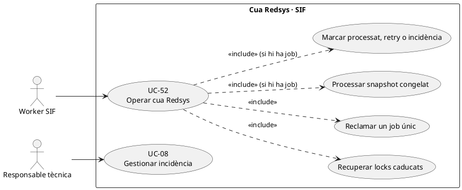
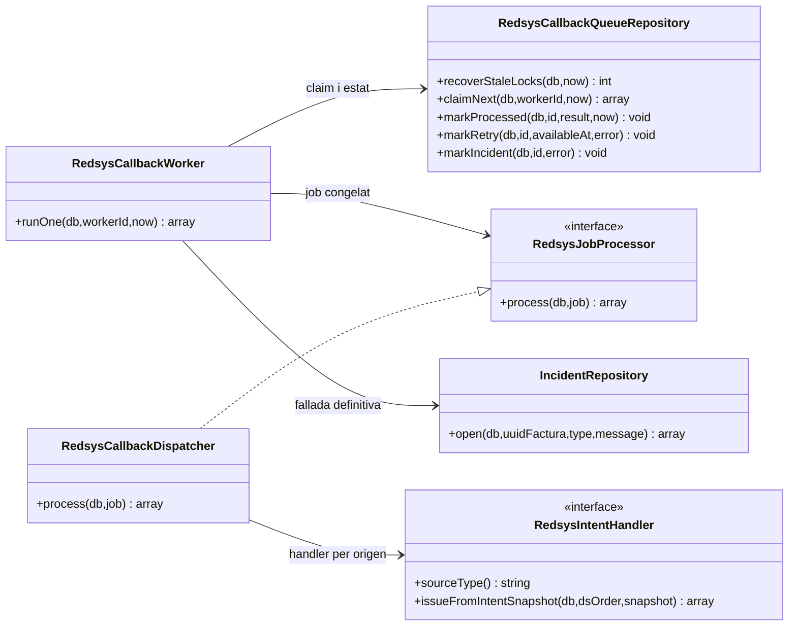
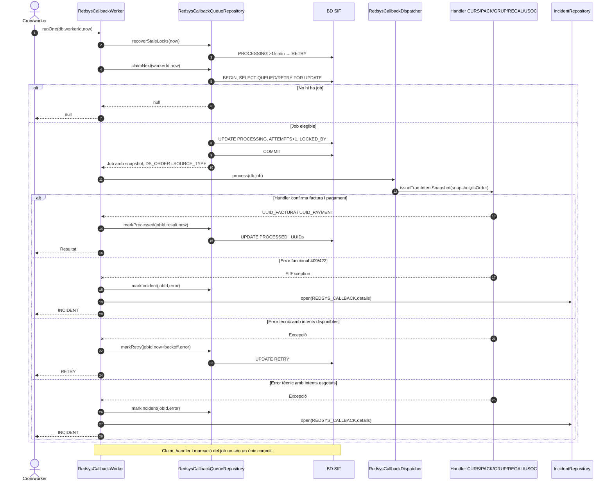
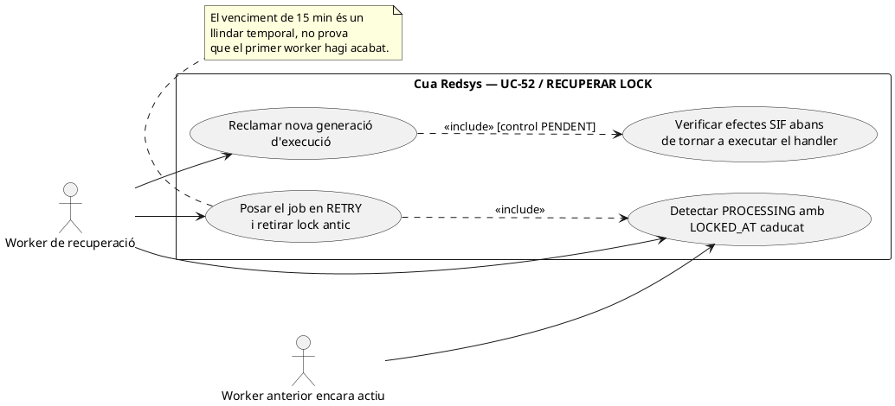
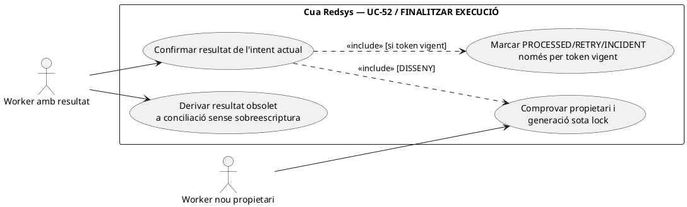
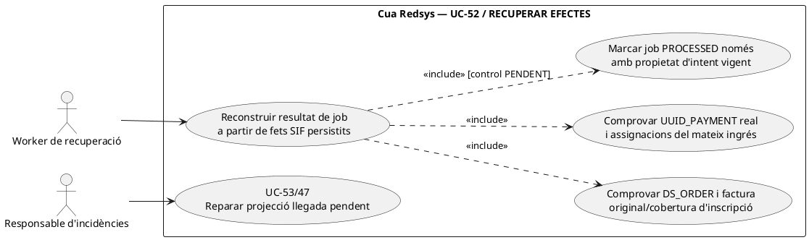
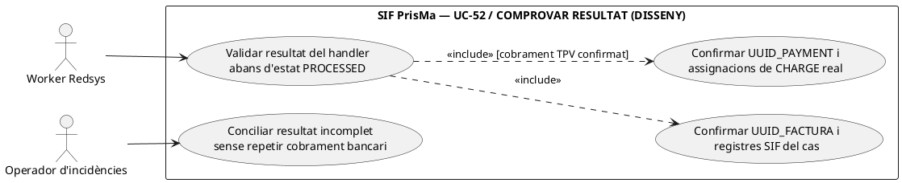

# UC-52 · Operar la cua Redsys — fitxa funcional i UML

**Àmbit:** seleccionar i executar de manera asíncrona un job vinculat a una **notificació Redsys ja validada**. UC-51 tracta callbacks anòmals; UC-03 engloba la recepció/execució de l'operació; UC-52 descriu la cua, reintents, bloquejos i resultat. **No** equival a la cua fiscal AEAT de UC-09/54.

**Codi contrastat:** `RedsysCallbackWorker`, `RedsysCallbackQueueRepository`, `RedsysCallbackDispatcher` i `RedsysJobProcessor`. **Part implementada:** recuperació de bloquejos, claim únic amb `FOR UPDATE`, despatx per `SOURCE_TYPE`, reintents i incidència. **Pendent d'acreditar:** panell d'operació segur, reconciliació d'efectes sobre el llegat i atribució quantitativa de pagaments per inscripció.

## 1. Fitxa del cas

| Punt | Contracte i evidència |
| --- | --- |
| Actors | Worker SIF automàtic; responsable tècnica amb accés al panell objectiu. L'operació del worker no necessita que la intranet sigui oberta. |
| Entrada | Job `redsys_callback_queue` vinculat a `redsys_notifications` i `redsys_payment_intent`; `DS_ORDER`, `UUID_INTENT`, `SOURCE_TYPE`, `SOURCE_ID` i `SNAPSHOT_JSON` congelats. |
| Selecció | `claimNext(db,workerId,now)` busca `QUEUED`/`RETRY` amb `AVAILABLE_AT <= now`, ordena disponibilitat/ID, bloqueja amb `FOR UPDATE`, marca `PROCESSING`, augmenta `ATTEMPTS` i desa `LOCKED_AT`/`LOCKED_BY`. |
| Procés | `RedsysCallbackDispatcher::process()` valida `SOURCE_TYPE` amb un handler registrat i descodifica `SNAPSHOT_JSON`; el handler crea/reutilitza factura/pagament corresponent a la compra. |
| Èxit | `markProcessed()` escriu `RESULT_JSON`, `UUID_FACTURA`, `UUID_PAYMENT`, `PROCESSED_AT` i estat `PROCESSED`, i esborra lock/error. |
| Fallada funcional | `SifException` amb codi 409 o 422 va **directament** a `INCIDENT`; `IncidentRepository::open()` crea avís `REDSYS_CALLBACK`. |
| Fallada tècnica | Amb intents disponibles: `RETRY` als 1, 5, 15 i 60 minuts (segons intent); amb intents esgotats: `INCIDENT` + obertura d'incidència. `maxAttempts` s'injecta al constructor i **no** està codificat en aquesta classe com a literal 5. |
| Lock obsolet | `recoverStaleLocks` retorna a `RETRY` jobs en `PROCESSING` bloquejats **fa més de 15 minuts**, i els fa disponibles de nou. |

### 1.1. Flux executable i transaccions

1. `RedsysCallbackWorker::runOne(db,workerId,now)` recupera bloquejos antics i demana `claimNext()`; si la cua és buida retorna `null` i no emet cap factura.
2. `claimNext()` fa `BEGIN`, `SELECT ... FOR UPDATE` i `UPDATE PROCESSING` i després `COMMIT`. **El claim acaba abans** del treball de negoci.
3. El worker invoca `RedsysJobProcessor::process()` (concretament `RedsysCallbackDispatcher`) que selecciona el handler segons l'intent congelat: `CURS`, `PACK`, `GRUP`, `REGAL` o `USOC_ALUMNE`.
4. El handler emet/reutilitza factura, registre fiscal, cua AEAT i pagament real; si té èxit, `markProcessed()` exigeix que el job encara sigui `PROCESSING` i desa UUIDs.
5. Si hi ha `SifException 409/422`, l'estat passa a `INCIDENT` i s'obre una incidència; la cua no reintenta automàticament un error funcional.
6. Si falla per problema tècnic, `markRetry()` calcula nova disponibilitat segons el número d'intent, o `markIncident()` quan s'esgota `maxAttempts`; les transicions exigeixen `STATUS='PROCESSING'`.

**Observació de concurrència:** `markProcessed`, `markRetry` i `markIncident` comproven l'estat `PROCESSING` però **no comparen `LOCKED_BY=workerId`** en l'`UPDATE` que s'ha revisat. Encara que el job s'hagi tornat a reclamar per B, la marca tardana d'A pot passar el filtre `STATUS='PROCESSING'` i escriure el resultat mentre `LOCKED_BY=B`; la comprovació `rowCount` no detecta aquesta situació. Recuperar un lock mentre un worker lent encara treballa pot fer que una execució posterior també processi el mateix job. L'idempotència del handler i de la factura/pagament és indispensable, i la coordinació de l'atribució per inscripció ha de ser idempotent.

### 1.2. Alternatives i diagnosi

| Escenari | Resultat correcte |
| --- | --- |
| Job reintentat després que s'emetés la factura però abans de marcar `PROCESSED` | Handler ha de retornar UUIDs existents; no crear un segon `CHARGE` o una segona atribució econòmica per inscripció. |
| `SOURCE_TYPE` sense handler o snapshot invàlid | El despatxador retorna validació; el worker classifica `422` com a incidència funcional. |
| Error tècnic primer, segon, tercer o quart | `RETRY` segons `retryDelayMinutes()`; l'espera es compta des de `now`. |
| Cinquè error tècnic | Amb configuració de màxim 5 intents, `INCIDENT`; verificar el valor real injectat al worker abans de suposar la configuració del desplegament. |
| Worker caigut després del claim | `PROCESSING` queda bloquejat fins a recuperació a `RETRY` després de 15 minuts. |
| Error d'obertura d'incidència | No afirmar que job i avís han quedat registrats atòmicament; `markIncident()` i `incidents->open()` són dues crides de repositoris diferents sense transacció conjunta explícita en `runOne()`. |
| Job marcat `PROCESSED` però BD llegada no sincronitzada | `RESULT_JSON` i UUIDs del nucli no acrediten l'alta acadèmica ni l'accés a cursos; cal estat/conciliació posterior de UC-47/53. |
| Pack o grup amb N inscripcions | Un `UUID_PAYMENT` inicial real i N atribucions quantitatives objectiu; la recuperació del job **no** pot multiplicar pagaments ni atribucions. |

**Proves identificades, no executades en aquesta revisió:** `RedsysCallbackWorkerTest`: claim únic, commit de claim, èxit amb UUIDs, retry tècnic, 409→incidència, lock obsolet i cinquè error; `RedsysAsyncFlowTest`: dos workers no reclamen simultàniament el mateix job.

### 1.3. Recuperació d'efectes confirmats i alta acadèmica pendent — contrast amb el xat original

**Q-SIF vs BD llegada.** El worker pot marcar `PROCESSED` després de rebre `UUID_FACTURA` i `UUID_PAYMENT`, però l'operativa antiga continuava en `web.factures` i `inscripcions.PAGAMENT`, `DATA PAG`, `FACTURA_RELACIONADA` i `FRACCIO`. El contracte final exigeix sincronitzar aquest llegat **després del commit SIF** sense convertir-ne els UPDATE en font econòmica/fiscal. Si el worker acaba però falla la sincronització o l'accés acadèmic, l'expedient queda **fiscalment/econòmicament confirmat, integració pendent**: registrar incidència UC-47/53 i reintentar la fase fallida, **no** tornar a encuar una segona venda.

**Q-PRE — revisar la cobertura abans de cridar el handler.** Quan el pagament prové d'una factura real anterior (empresa/inscripció) o d'una diferència de canvi de curs, el worker no pot delegar cegament al handler ordinari de venda que emet factura amb pagament inicial. Ha de consultar l'operació i la factura existent o desviar l'event a conciliació. El dispatcher actual selecciona per `SOURCE_TYPE` de la intenció congelada i no acredita una branca universal de `registerPayment()` sobre factura prèvia. La idempotència del handler només evita repetir una petició **equivalent**, no una factura de la mateixa inscripció generada prèviament amb una altra clau.

**Q-STALE — commit anterior a marcat PROCESSED.** Si el worker emet factura/pagament però cau abans de `markProcessed()`, el lock pot caducar i un altre worker reclamar el job. Abans de repetir, recuperar pels identificadors de l'ordre i la clau d'emissió, i exigir que els mateixos UUIDs i les N atribucions internes es reutilitzin. Una segona execució d'un worker lent no ha de poder sobreescriure resultats incompatibles; el codi consultat comprova `STATUS=PROCESSING`, però no una generació de lock ni `LOCKED_BY=workerId` per a totes les marques, de manera que el control reforçat i les proves de cursa continuen pendents.

**Q-CORREUS — no prometre PDF prematur.** Separar `PROCESSED` del job Redsys, estat de la cua fiscal AEAT, disponibilitat de `factura_documents`, accés acadèmic i correu de confirmació. Si el document encara és PENDING, no reprocessar el cobrament per generar-ne una còpia; reintentar el job documental UC-55 i enviar enllaç segur només quan el document estigui disponible i el receptor autoritzat.

### 1.4. Proves de recuperació transversals (no executades)

| ID | Escenari | Resultat exigible |
| --- | --- | --- |
| CQ-01 | Handler fa commit de factura/CHARGE i cau abans de PROCESSED | Recupera UUIDs idempotentment; no duplica factura ni ingrés. |
| CQ-02 | Job PROCESSED però matrícula/accés llegat pendents | Reintentar només sincronització UC-47/53; no tornar a facturar. |
| CQ-03 | Callback de factura prèvia arriba al worker de venda | Desviar a cobrament sobre UUID_FACTURA existent o incidència, no segona factura. |
| CQ-04 | Worker lent continua després de recuperar el seu lock | Protecció de generació/fencing i idempotència; cap sobrescriptura de resultat incompatible. |
| CQ-05 | PDF PENDING amb cobrament ja processat | Reintentar job documental; no reiniciar cua de Redsys ni comunicar PDF inexistent. |

## 2. UML de casos d'ús



## 3. UML de classes del camí implementat



## 4. Seqüència de worker, recuperació i reintents



### 4.1. Acció independent: recuperar un job aparentment abandonat — PHP existent, guarda d'execució pendent

**Actor/disparador:** un worker executa `recoverStaleLocks(db,now)` i troba un job `PROCESSING` amb `LOCKED_AT < now - 15 min`. **Postcondició real:** l'UPDATE general posa `RETRY`, `AVAILABLE_AT=now`, esborra `LOCKED_AT/LOCKED_BY` i conserva `ATTEMPTS`; `claimNext()` pot tornar a reservar-lo i **incrementa** els intents. La recuperació **no acredita que el processador anterior hagi mort** ni anul·la un possible commit de factura/pagament. No confondre recuperar la *fila del job* amb recuperar una *emissió o un cobrament ja confirmats*.



```mermaid
sequenceDiagram
autonumber
actor A as Worker A lent
actor B as Worker B recuperador
participant QA as RedsysCallbackQueueRepository [PHP]
participant DB as redsys_callback_queue
participant H as Handler facturació/pagament [PHP]
A->>QA: claimNext(worker-a,t0)
QA->>DB: BEGIN; UPDATE PROCESSING,ATTEMPTS=1,LOCKED_BY=A; COMMIT
QA-->>A: Job J generació 1
A->>H: process(J) sense lock transaccional de job
Note over A,H: A continua treballant més de 15 minuts
B->>QA: recoverStaleLocks(t0+16m)
QA->>DB: UPDATE J PROCESSING antic -> RETRY, esborrar LOCKED_BY
QA-->>B: 1 job recuperat, NO certesa que A hagi mort
B->>QA: claimNext(worker-b,t0+16m)
QA->>DB: BEGIN; UPDATE J PROCESSING,ATTEMPTS=2,LOCKED_BY=B; COMMIT
QA-->>B: El mateix J, nova execució
B->>H: process(J) [pot coincidir amb execució A]
Note over A,DB: El PHP real no associa un token de generació a l'efecte fiscal i a les marques finals.
```

### 4.2. Acció independent: finalitzar només l'execució que conserva la propietat del job — PHP actual vs fencing PENDENT

**Actor/disparador:** el worker A/B rep un resultat o una excepció del handler i vol executar `markProcessed`, `markRetry` o `markIncident`. **Precondició objectiu:** el `UUID_JOB`, `LOCKED_BY` i una generació/fencing token de claim han de coincidir amb l'execució vigent; el resultat de factura/pagament ha de provenir del mateix `DS_ORDER` i import acreditat. **Postcondició:** únicament el propietari actual persisteix la transició i el resultat; si s'ha perdut la propietat, s'informa de `STALE_ATTEMPT` sense marcar `PROCESSED`, `RETRY` ni `INCIDENT` per sobre del worker nou.

**Comportament PHP verificat:** els tres mètodes fan `UPDATE redsys_callback_queue ... WHERE ID=? AND STATUS='PROCESSING'`, **sense condició `LOCKED_BY=workerId`, `ATTEMPTS` ni token de generació**. `runOne()` crida `markProcessed($db,$job['ID'],$result,$now)` sense passar-li el `workerId`; el mateix passa amb `markRetry` i `markIncident`. Un A recuperat com a obsolet pot tornar a trobar `STATUS=PROCESSING` quan B ja ha reclamat la fila, de manera que la marca d'A passa el filtre i pot escriure el resultat d'A al job ara propietat de B. A més, `$now` és l'instant **rebut a l'inici de `runOne`**, no necessàriament l'instant de finalització: `PROCESSED_AT` pot reflectir el moment de claim d'un job lent.



```mermaid
sequenceDiagram
autonumber
actor A as Worker A antic
actor B as Worker B actual
participant Q as RedsysCallbackQueueRepository [PHP real]
participant DB as redsys_callback_queue
A->>Q: claimNext(J,A) i començar processament
Q->>DB: J PROCESSING,LOCKED_BY=A,ATTEMPTS=1
B->>Q: recoverStaleLocks(J) + claimNext(J,B)
Q->>DB: J PROCESSING,LOCKED_BY=B,ATTEMPTS=2
Note over A,B: A ha fet commit del seu handler i vol marcar èxit després del claim de B
A->>Q: markProcessed(J,resultA,nowA) [PHP no rep workerId/token]
Q->>DB: UPDATE J WHERE ID=J AND STATUS=PROCESSING
DB-->>Q: rowCount=1; J passa a PROCESSED amb resultA
Q-->>A: Retorn sense error
B->>Q: markProcessed(J,resultB,nowB) després de processar
Q->>DB: UPDATE J WHERE ID=J AND STATUS=PROCESSING
DB-->>Q: rowCount=0, J és PROCESSED per A
Q--xB: SifException 409 propietat perduda
B->>Q: markIncident(J,error) [catch de runOne en el camí 409]
Q->>DB: UPDATE J WHERE STATUS=PROCESSING
DB-->>Q: rowCount=0; segona excepció 409 [possible]
Note over A,DB: La traça és una cursa derivada del WHERE real, no un test de concurrència executat.
```

**Contracte de correcció proposat:** token de claim monotònic o UUID de generació, comprovat **atòmicament** amb `LOCKED_BY` en tota marca final i en possibles heartbeats; no reusar només `ATTEMPTS` com a prova d'identitat si un operador pot reobrir el job. Una excepció de propietat perduda ha de ser tractada com a **intent obsolet** i no com una fallada funcional del negoci susceptible d'obrir `REDSYS_CALLBACK` contra el job d'un altre worker. Els efectes fiscals ja confirmats es concilien independentment; un token de cua no torna atòmica una operació bancària i un commit d'emissió.

### 4.3. Acció independent: recuperar facturació/pagament confirmats abans de reprocessar un job — PHP parcial / DISSENY

**Actor/disparador:** el job queda en `RETRY` perquè el primer handler havia fet commit de la factura i del cobrament, però no s'havia persistit `RESULT_JSON`/`PROCESSED`. **Precondicions:** identificar la notificació validada, `DS_ORDER`, l'intent congelat i els identificadors fiscals/econòmics **persistits**, amb la mateixa cobertura, receptor i imports. **Postcondició:** es recupera el resultat existent o s'obre conflicte; no emetre nova factura ni nou `CHARGE` només per reparar l'estat del job. El handler actual pot tornar a invocar `InvoiceService::issueInvoice()`, que reusa la factura per clau i **només cerca el pagament inicial ja existent**: si el primer commit fiscal no va incloure `uuid_payment` o el pagament correspon a una factura prèvia d'una altra clau, el reús fiscal no acredita el cobrament. La recuperació del job s'ha de separar de UC-02/56, de la sincronització llegada UC-47 i de l'estat AEAT/PDF.



```mermaid
sequenceDiagram
autonumber
actor W as Worker de recuperació
participant G as RedsysJobEffectReconciler [DISSENY]
participant N as Intenció, notificació i job [LECTURA]
participant F as factura, relacions i registres [LECTURA]
participant P as payment_transaction/allocation [LECTURA]
participant H as Handler/InvoiceService [PHP]
participant Q as RedsysCallbackQueueRepository [PHP]
W->>G: recover(J,claimToken) [PENDENT]
G->>N: Llegir DS_ORDER, snapshot i estat del job actual
G->>F: Cercar factura real per ordre, clau i cobertura
G->>P: Cercar CHARGE real i assignació amb import/ordre equivalents
alt Factura + pagament acreditats i equivalents
 G-->>W: Recuperar UUID_FACTURA/UUID_PAYMENT originals sense nova emissió
 W->>Q: markProcessed(J,result recuperat,now) [només amb fencing pendent]
else Factura real confirmada, pagament absent o aliè
 G-->>W: PAYMENT_MISSING/CONFLICT; no declarar processat ni inventar CHARGE
else Cobertura anterior d'empresa o import/receptor diferents
 G-->>W: CONFLICT; derivar UC-53/56 sense segona factura
else Cap efecte preexistent, operació i snapshot encara legítims
 G->>H: process(J) sota guard de cobertura i identitat [PENDENT]
 H-->>W: UUIDs nous o error controlat
 W->>Q: marcat final només si manté token vigent [PENDENT]
end
Note over G,Q: El reconciliador i fencing no són PHP present; el codi actual crida el handler directament després de claim.
```

| Prova pendent | Escenari | Resultat exigible |
| --- | --- | --- |
| CQ-06 | A queda processant 16 min, B recupera i reclama J; A acaba abans de B | Rebutjar marca final d'A per generació obsoleta sense sobreescriure propietat/resultat de B. El WHERE PHP actual permet la marca d'A mentre J és PROCESSING de B. |
| CQ-07 | A marca PROCESSED de B i B intenta `markProcessed`; el `catch` de B intenta `markIncident` | Tractar pèrdua de propietat com a `STALE_ATTEMPT`; no reclassificar el job de B com a incidència de negoci ni propagar una segona excepció de marca. |
| CQ-08 | Handler ha fet commit de factura/CHARGE i cau abans de `markProcessed` | Recuperar els mateixos UUIDs i assignacions sense nova numeració/CHARGE; separar sync llegada i PDF. |
| CQ-09 | Factura K existeix, però el cobrament inicial manca; un reintent d'`issueInvoice(K,payment)` retorna `ok=true` sense `uuid_payment` | Job no passa a «pagat» pel sol `ok` fiscal; conciliació del pagament real per UC-02/56. |
| CQ-10 | Worker tarda més de 15 min; `runOne` conserva `now` de l'inici | `PROCESSED_AT` ha de reflectir finalització real en el contracte futur; el PHP actual passa el temps inicial. |

### 4.4. Acció independent: validar el resultat funcional abans de marcar un job com a PROCESSED — guard PENDENT

**Actor/disparador:** `RedsysJobProcessor::process()` retorna un array al worker. **Postcondició objectiu:** la notificació correspon a la intenció/snapshot; el resultat `ok=true` inclou els identificadors que pertoquen al tipus de venda, la factura real i, quan hi ha cobrament TPV confirmat, **un UUID_PAYMENT efectivament assignat a aquesta factura**. El cas USOC conserva la distinció entre cobrament alumne i factura d'entitat pendent; el tipus de venda no permet inventar que l'entitat ja ha pagat. Un resultat d'error o incomplet ha de quedar com a `RETRY/INCIDENT/RECONCILE` segons causa, **sense declarar el cobrament complet**.

**Comportament del PHP real:** `RedsysCallbackWorker::runOne()` crida `$result=$processor->process(...)` i després `markProcessed(...,$result,$now)` sense comprovar `$result['ok']`, `uuid_factura` o `uuid_payment`. `RedsysCallbackQueueRepository::markProcessed()` fa `$result['uuid_factura'] ?? null` i `$result['uuid_payment'] ?? null`; un array incomplet pot acabar com `STATUS=PROCESSED` amb UUIDs buits. De fet, el doble de prova `RecordingRedsysJobProcessor` a `RedsysCallbackWorkerTest::testRunOneProcessesClaimedJobAfterClaimCommit` retorna `['ok'=>true,'uuid_job'=>...]` **sense UUID de factura/pagament**, cosa que prova que el test comprova la separació de transaccions, **no** la completitud fiscal/econòmica. Això no demostra que els handlers normals ometin sempre els identificadors, sinó que **el contracte del worker no els exigeix**.



```mermaid
sequenceDiagram
autonumber
actor W as Worker
participant H as RedsysJobProcessor [PHP]
participant V as RedsysJobResultValidator [DISSENY]
participant F as factura/registres/fact_rels [LECTURA]
participant P as payment_transaction/allocation [LECTURA]
participant Q as RedsysCallbackQueueRepository [PHP]
W->>H: process(job J)
H-->>W: result array
W->>V: validate(J,result) [crida PENDENT]
alt ok absent/false o UUID_FACTURA absent
 V-->>W: INCOMPLETE/ERROR; no PROCESSED
else UUID_FACTURA declarat
 V->>F: Verificar factura del mateix DS_ORDER i cobertura
 V->>P: Verificar UUID_PAYMENT real del mateix ingrés i assignació a factura
 alt UUID_PAYMENT absent, d'una altra factura o import incompatible
  P-->>V: PAYMENT_MISSING/CONFLICT
  V-->>W: Conciliar UC-02/56, no declarar job econòmicament complet
 else Factura i ingrés assignat coherents
  P-->>V: Resultat verificat
  W->>Q: markProcessed(J,result,nowRealFinal) [fencing encara PENDENT]
  Q-->>W: PROCESSED de l'intent vigent
 end
end
Note over W,Q: Avui W crida markProcessed directament després del retorn de H. El validador i el temps de finalització independent són DISSENY.
```

| Prova pendent | Escenari | Resultat exigible |
| --- | --- | --- |
| CQ-11 | Processor retorna `['ok'=>false]` sense llançar excepció | No marcar PROCESSED; classificar error/incident segons contracte. El worker actual pot marcar PROCESSED. |
| CQ-12 | Processor retorna `['ok'=>true,'uuid_job'=>J]` sense factura/pagament | No marcar venda TPV completada; recuperació d'efectes i incidència. La prova actual només verifica que claim i processament van fora de transacció conjunta. |
| CQ-13 | Resultat amb UUID_FACTURA F1 i UUID_PAYMENT de F2 | Verificar assignacions reals, rebutjar resultat creuat; no donar accés acadèmic/correu per F1 com si fos pagada. |

## 5. Fonts i dependències

[UC-52 original](../06-fitxes-funcionals/uc-052.md) · [UC-03](uc-003-processar-cobrament-redsys-asincron.md) · [UC-51](uc-051-callback-redsys-anomal.md) · [UC-47 llegat original](../06-fitxes-funcionals/uc-047.md) · [Revisió de fons](00-revisio-moviments-inscripcions.md) · [RedsysCallbackWorker](../../sif/src/Service/RedsysCallbackWorker.php) · [RedsysCallbackQueueRepository](../../sif/src/Repository/RedsysCallbackQueueRepository.php) · [RedsysCallbackDispatcher](../../sif/src/Service/RedsysCallbackDispatcher.php) · [RedsysCallbackWorkerTest](../../sif/tests/Integration/RedsysCallbackWorkerTest.php).
