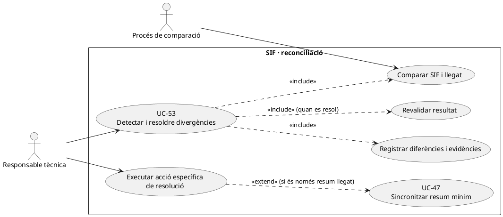
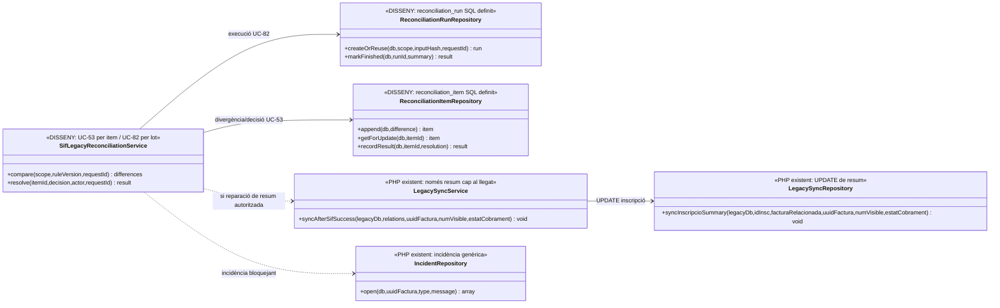
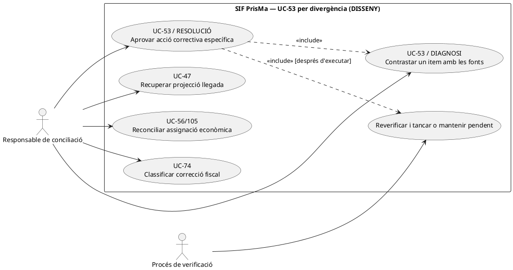
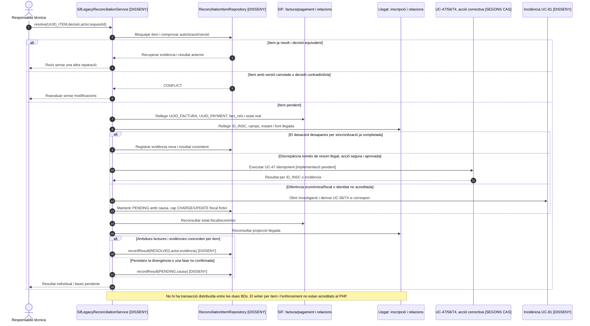

# UC-53 · Detectar i resoldre divergències SIF–llegat

**Objectiu:** comparar dades fiscals, econòmiques i referències d'inscripcions entre la BD fiscal del SIF i el sistema llegat, identificar els desacords, investigar-ne la causa i resoldre'ls amb **operacions traçades**. **No** utilitzar el llegat per reescriure una factura fiscal ja emesa. UC-47 és la sincronització mínima en una direcció; UC-53 és la reconciliació de **dos estats potencialment divergents**.

**Estat contrastat:** existeixen `LegacySyncService`/`LegacySyncRepository` per escriure un resum al llegat, i les migracions defineixen `reconciliation_run` i `reconciliation_item`. **No s'ha identificat** un `ReconciliationService` executable que compari tots els registres i persisteixi resultats, ni una pantalla final de resolució; les classes i seqüències de reconciliació són **disseny**. El codi de UC-47 mostra dos riscos reals: `OBSERVACIONS` s'afegeix de nou en cada reintent i `FACTURA_RELACIONADA` conserva la primera dada per `COALESCE` encara que sigui contradictòria.

## 1. Fitxa específica

| Element | Regla del cas |
| --- | --- |
| Actor | Procés programat per detectar diferències i responsable tècnica/operador autoritzat per classificar i executar la reparació segons permís. |
| Abast de comparació | `UUID_FACTURA`, `NUM_VISIBLE`, `fact_rels` i `source_id` d'inscripció, `IDPAG`/`DS_ORDER`, import fiscal, `payment_transaction`, `payment_allocation`, estats de factura/AEAT/cobrament i estat acadèmic del llegat. |
| Font de veritat | SIF per número, línies, registres fiscals i pagaments confirmats; llegat per informació acadèmica, amb conciliació de les relacions d'origen. **Una discrepància no dóna permís per modificar directament imports fiscals.** |
| Run de reconciliació (esquema definit) | `reconciliation_run` desa `UUID_RUN`, tipus/sistema, hash d'entrada, clau idempotent, `STATUS`, actor, correlació, inici/final i `SUMMARY_JSON`. La migració **no implementa el procés** que l'ha de poblar. |
| Item de reconciliació (esquema definit) | `reconciliation_item` conté `UUID_ITEM`, `UUID_RUN`, tipus, referència llegat, UUID factura/pagament, `RESULT`, codi/JSON de diferència i dades de resolució; `RESOLUTION_STATUS=PENDING` per defecte. |
| Resultat | Inventari de diferències per objecte i un expedient de resolució per cada cas, correlacionat amb operacions fiscals/econòmiques quan s'executin. |
| Fons per inscripció | Comparar **imports ingressats i atribuïts**, no només `A_PAGAR` o una nota `OBSERVACIONS`. El ledger quantitatiu proposat encara no existeix; per tant, aquest control està pendent d'implementar completament. |

### 1.1. Flux objectiu

1. El procés defineix abast temporal, factures, inscripcions, pagaments i versió de dades. Calcula hash d'entrada per `reconciliation_run`, amb clau idempotent per evitar runs duplicats indistinguibles.
2. Llegeix les dades del SIF **sense modificar-les** i enllaça identitats del llegat per `fact_rels`, identificador d'inscripció, `IDPAG` i referències externes pertinents. No presumeix correspondència 1:1 entre factura i inscripció, ni entre `IDPAG` i intent TPV.
3. Classifica diferències específiques: factura SIF absent al llegat, relació llegada apuntant a una factura diferent, import/estat de cobrament discrepant, import compartit entre N inscripcions no atribuït, cobrament Redsys confirmat sense sincronització acadèmica, o notes `OBSERVACIONS` duplicades.
4. Desa un `reconciliation_item` per divergència amb evidència abans/després i marca la revisió que cal. **Això és flux objectiu, no un repositori escrit localitzat al PHP actual**.
5. La responsable selecciona una resolució: repetir una sincronització mínima idempotent al llegat, crear l'enllaç que falta, investigar un pagament, fer una operació econòmica/fiscal específica o mantenir la incidència pendent. Cada acció apunta al cas d'ús corresponent i conserva actor, motiu i UUID.
6. La reparació del llegat no pot tocar `factura` ni alterar un registre fiscal immutable; una modificació real d'import o receptor s'ha de classificar per UC-05/30/31 quan correspongui.
7. Es repeteix la comparació sobre els mateixos objectes i només es tanca l'item quan el resultat reconciliat està provat. **Afegir una nota SIF a `OBSERVACIONS` sense comparar la resta no és prova de resolució.**

### 1.2. Matriu de discrepàncies i reparació

| Discrepància | Resolució objectiu que NO s'ha de substituir per un UPDATE fiscal |
| --- | --- |
| `FACTURA_RELACIONADA` no apunta a la factura SIF correcta | Comprovar història llegat i `fact_rels`; si ja hi ha una relació diferent, elevar conflicte, no sobreescriure-la sense evidència. |
| `OBSERVACIONS` conté N còpies de la mateixa referència SIF | Risc documentat de `LegacySyncRepository` no idempotent; eliminar duplicats només amb política d'edició no fiscal i traça, i corregir el writer per no reproduir-los. |
| Factura de grup amb un participant no sincronitzat | Investigar únicament la relació/inscripció afectada; no duplicar factura o cobrament global perquè un participant falta. |
| Transferència real assignada a factura però sense import per inscripció | En el ledger objectiu crear una atribució interna justificada de **l'UUID_PAYMENT existent**, no un `CHARGE` bancari nou. |
| Pagament Redsys existeix en SIF però inscripció llegada en estat pendent | Conservar el pagament, investigar la sincronització/alta acadèmica, no esborrar ni tornar a cobrar la factura. |
| Factura abans de cobrar amb `A_PAGAR` antic | Consultar `payment_transaction` i `payment_allocation`; `A_PAGAR` no prova un `REFUND` ni una entrada bancària. |
| Resultat AEAT divergent de l'indicador visual a intranet | Consultar `factura_registres.ESTAT_AEAT` i evidència de resposta; corregir resum/indicador sense manipular registre fiscal. |

**Proves necessàries, no executades:** fixtures de factura simple, pack/grup, pagament fraccionat, factura emesa abans de pagar, canvis/baixes, sync duplicada, inscripció absent i fallo entre BDs. Cal verificar `reconciliation_run`/`item` idempotents, resolució per actor i cap doble comptabilització.

### 1.3. Discrepàncies provocades per operacions ordinàries del llegat

**Origen concret dels desacords.** Les pantalles llegades permeten desar directament `A_PAGAR`, `PAGAMENT`, `DATA PAG`, `IDPAG`, `FRACCIO` i `FACTURA_RELACIONADA`; `Passar pagaments` també pot crear/actualitzar una factura històrica i repartir imports per membre de grup. El SIF, en canvi, confirma el moviment econòmic amb `payment_transaction` i l'atribució a factura amb `payment_allocation`; la sincronització existent només escriu una referència fiscal i una nota. La comparació ha d'identificar **quin camí ha canviat quin camp i quan**, sense tractar com a error fiscal automàtic tota diferència d'`A_PAGAR` respecte al total de la factura emesa.

**Matriu operativa més precisa.** (1) Factura `EMESA_ABANS_COBRAMENT=1` i camp llegat `PAGAMENT=0`: pot ser estat **coherent**, no incidència per si sola. (2) SIF `CHARGE` confirmat amb llegat sense `DATA PAG`: sincronització/assignació acadèmica pendent. (3) Llegat `PAGAMENT>0` sense `UUID_PAYMENT`: investigar transferència bancària, CSV TPV i `DS_ORDER`; no crear el cobrament només per fer quadrar la pantalla. (4) `FACTURA_RELACIONADA` agrupa diversos documents A/R històrics: consultar `fact_rels` i `factura_rectificacio`; la seva coincidència numèrica no estableix un vincle 1:1. (5) Grup/pack amb una factura i N inscrits: separar incoherència fiscal del **repartiment econòmic individual** encara no modelat. (6) Callback validat però worker en `RETRY`: resultat de cua pendent, no «ingrés absent» ni autorització per registrar-lo manualment de nou.

**Criteri de reparació.** Per cada diferència, enregistrar sistema origen, valor anterior/actual, instant de lectura, `UUID_FACTURA`, `UUID_PAYMENT`, `ID_INSC`, responsable i acció autoritzada. L'event de reparació ha de referenciar el mateix item en un reintent, comprovar després l'estat de **les dues fonts** i deixar `PENDING` si queda una dimensió sense resoldre. Si es modifica la distribució de diners ja registrats, executar UC-56/105 amb la **mateixa transacció real**; una nota afegida a `OBSERVACIONS` no equival a reparar un import ni a restablir accés Moodle.

### 1.4. Proves de comparació de fonts (no executades)

| ID | Escenari | Resultat exigible |
| --- | --- | --- |
| DV-01 | Factura prèvia existent i inscripció sense `PAGAMENT` | Coherència possible; cap ingrés afegit per defecte. |
| DV-02 | Redsys cobrat, worker confirmat, llegat pendent | Incidència de sincronització/accés; no segon `CHARGE`. |
| DV-03 | `FACTURA_RELACIONADA` compartida entre A i R | Relacions fiscals explícites per UUID, no equiparació per número històric. |
| DV-04 | Pagament llegat positiu però banc/SIF no contrastats | Investigació amb evidència i estat pendent, cap moviment inventat. |
| DV-05 | N inscripcions de grup i una sense enllaç | Reparar només inscripció afectada, sense recrear factura global. |
| DV-06 | Item de discrepància reparat però accés Moodle pendent | Tancar només l'aspecte fiscal/econòmic verificat; mantenir la fase acadèmica pendent. |

## 2. Diagrama UML de casos d'ús



## 3. Subdiagrama de classes: coordinador compartit amb UC-82, codi existent i disseny pendent

**Frontera amb UC-82:** UC-82 identifica i versiona una **execució de comparació** SIF–llegat, amb múltiples items; UC-53 és el **diagnòstic i la decisió de resolució d'un desacord** (també quan es detecta puntualment sense lot). No són dos sistemes de conciliació ni dos serveis PHP implementats. El nom `SifLegacyReconciliationService` és el **mateix coordinador proposat** per a totes dues fitxes. El repo de la capçalera `reconciliation_run` i el dels items `reconciliation_item` són responsabilitats diferents; les taules SQL estan definides, però aquests repositoris i el coordinador no han estat localitzats al PHP.



## 4. Seqüència — detecció i resolució (DISSENY)

```mermaid
sequenceDiagram
autonumber
actor T as Responsable tècnica
participant R as SifLegacyReconciliationService [DISSENY; compartit UC-82]
participant SIF as BD SIF
participant L as BD llegat
participant Run as ReconciliationRunRepository [DISSENY]
participant Items as ReconciliationItemRepository [DISSENY]
participant Sync as LegacySyncService [PHP existent]
participant Inc as IncidentRepository [PHP existent]
T->>R: compare(scope,ruleVersion,requestId)
R->>SIF: Llegir factura, fact_rels, registres i moviments
R->>L: Llegir inscripcions, IDPAG, FACTURA_RELACIONADA i estats
R->>R: Comparar UUIDs, relacions, quantitats i estats
R->>Run: createOrReuse(db,scope,inputHash,requestId) [UC-82; DISSENY]
R->>Items: append(db,difference) per divergència [DISSENY]
Items-->>T: Llista d'items PENDING amb evidència
T->>R: resolve(itemId,action,reason)
alt Divergència només de resum llegat i acció segura
 R->>Sync: syncAfterSifSuccess(...)
 Note over R,Sync: El servei actual és no idempotent a OBSERVACIONS; cal reparar-lo abans de reintents
 R->>SIF: Rellegir dades fiscals originals intactes
 R->>L: Verificar resum real i nombre de files
 R->>Items: recordResult(db,itemId,RESOLVED) només si la comparació passa
else Incidència fiscal/econòmica o conflicte d'identitat
 R->>Inc: open(uuidFactura,type,message)
 R->>Items: Mantenir PENDING fins a reparació específica
end
R-->>T: Resultat i incidències pendents
```

### 4.1. Acció independent: diagnosticar i resoldre un item individual (UC-53) — DISSENY

**Disparador:** un `UUID_ITEM` de UC-82 o una alerta puntual mostra una discrepància entre fonts. **Actors:** responsable tècnica autoritzada per aprovar la **reparació específica** i procés de verificació posterior; un worker de comparació no queda autoritzat a modificar imports fiscals perquè ha trobat una divergència. **Precondicions:** instant i origen de les dues lectures documentats, identitat fiable (`UUID_FACTURA`/`UUID_PAYMENT`/`ID_INSC`) i causa delimitada. **Postcondició:** `RESOLVED` només si s'ha executat la via apropiada i una lectura posterior confirma el resultat; en cas contrari, `PENDING`/incidència. No crear una factura ni un `CHARGE` per quadrar un indicador llegat.





**Contrast SQL específic:** `reconciliation_run` té `IDEMPOTENCY_KEY` única per run; `reconciliation_item` té `UUID_ITEM` única i index `UUID_RUN,RESULT`, **però no una restricció única de parella run + referència d'origen + tipus de discrepància**. La deduplicació d'items equivalents i el reús d'un item anterior són garanties de disseny que s'han de provar, no garanties automàtiques de la migració. `DIFFERENCE_JSON` pot conservar valors comparats, però no hi ha una columna que imposi automàticament verificació posterior de totes dues fonts.

| ID de prova pendent | Escenari | Resultat exigible |
| --- | --- | --- |
| DV-53-07 | Dos intents de resoldre el mateix UUID_ITEM amb accions incompatibles | Una sola decisió vàlida per versió; conflicte visible per a l'altra. |
| DV-53-08 | El resum llegat s'ha sincronitzat entre lectura i ordre de reparació | Revalidar i tancar per evidència, sense una segona concatenació d'OBSERVACIONS. |
| DV-53-09 | Pagament bancari no acreditat però llegat indica pagat | Mantenir item pendent; no crear `CHARGE` ni modificar factura per fer concordar estats. |
| DV-53-10 | Reparació parcial a llegat i fallada abans de confirmar-ne la resposta | Reconsultar el llegat i recuperar amb mateixa referència, no repetir cegament una nota o factura. |

## 5. Traçabilitat

[UC-53 original](../06-fitxes-funcionals/uc-053.md) · [UC-47 codi de sincronització](uc-047-sincronitzar-estat-cap-llegat.md) · [UC-08 incidències](uc-008-gestionar-incidencia-sif.md) · [Migració reconciliation_run/item](../../sif/database/migrations/2026_09_15_000003_add_functional_audit_control.sql) · [LegacySyncService](../../sif/src/Service/LegacySyncService.php) · [LegacySyncRepository](../../sif/src/Repository/LegacySyncRepository.php) · [Model de fons](00-revisio-moviments-inscripcions.md).
