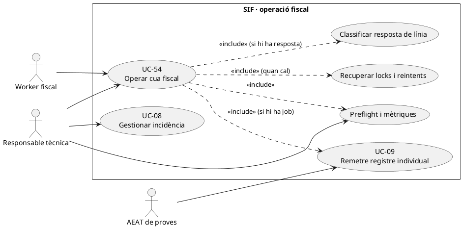
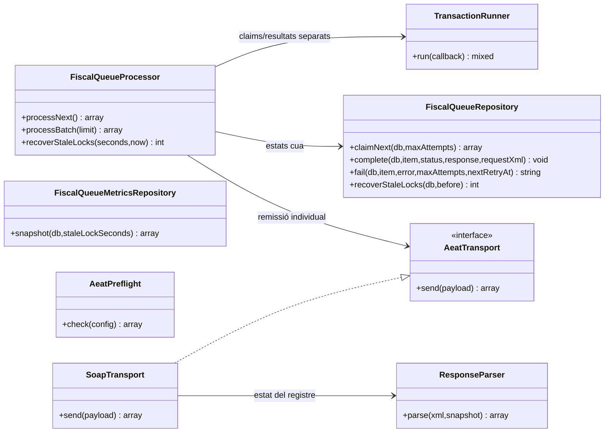
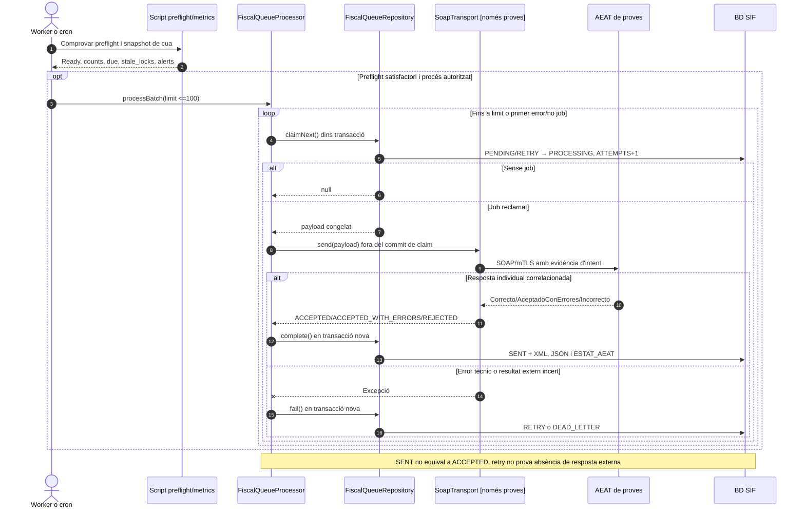
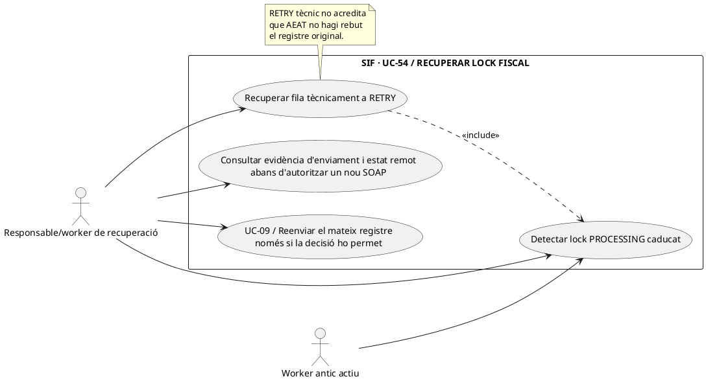
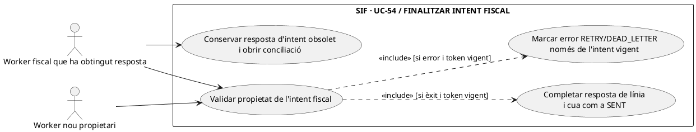
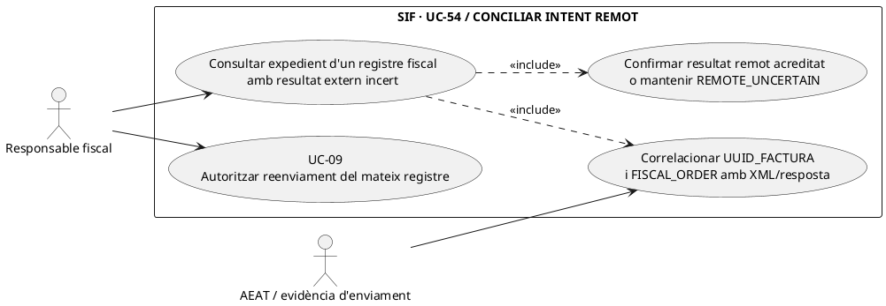

# UC-54 · Operar la cua fiscal i tractar les respostes AEAT

**Frontera.** UC-09 descriu **una remissió** de registre congelat; UC-54 cobreix l'**operació de la cua en conjunt**: seguiment de pendents, preflight, lots, recuperació de locks, `RETRY`/`DEAD_LETTER` i encaminament de respostes que requereixen decisió. **No** crea factures ni decideix automàticament si toca UC-30/31/05.

**Estat verificat:** `FiscalQueueProcessor`, `FiscalQueueRepository`, `FiscalQueueMetricsRepository`, `AeatPreflight`, el script `sif/scripts/preflight-aeat-worker.php` i un transport SOAP **només de proves** existeixen. No s'ha acreditat un panell final amb autorització/assignació ni enviament real de producció.

## 1. Fitxa del cas

| Fase | Dades i comportament revisats |
| --- | --- |
| Actor | Worker programat i responsable tècnica que consulta les mètriques i resol incidències; AEAT només intervé quan UC-09 envia. |
| Preflight | `AeatPreflight::check()` revisa extensions, URLs HTTPS, XSD, certificat llegible, contrasenya i identificadors de l'emissor/SIF; **no** valida confiança/revocació de certificat ni autorització efectiva davant AEAT. |
| Mètriques | `FiscalQueueMetricsRepository::snapshot()` compta `PENDING`, `PROCESSING`, `RETRY`, `SENT`, `DEAD_LETTER`, jobs disponibles `due`, locks obsolets i data de la tasca accionable més antiga. |
| Alertes CLI | `preflight-aeat-worker.php` calcula `DEAD_LETTER_THRESHOLD`, `DUE_QUEUE_THRESHOLD`, `STALE_WORKER_LOCK`; llindars per defecte: 1 `DEAD_LETTER`, 100 `due`, 900 segons de lock. Són paràmetres del script, no garanties de notificació a un operador. |
| Reclamació | `FiscalQueueRepository::claimNext` reclama `PENDING`/`RETRY` degudament disponibles, limita per intents i usa `FOR UPDATE` en transacció. |
| Límits de lot | `FiscalQueueProcessor::processBatch(limit)` admet 1–100, s'atura si no hi ha job o si es produeix una fallada. |
| Transport | `SoapTransport` només permet `TEST_ENDPOINT`, exigeix snapshot `aeat`, conserva evidència d'intent i retorna el resultat de la línia correlacionada; no inferir disponibilitat productiva. |
| Èxit de remissió | La cua es marca `SENT` fins i tot si la resposta de línia és `REJECTED`; `factura_registres.ESTAT_AEAT` i `factura.ESTAT_AEAT` guarden el resultat de línia. |
| Fallada tècnica | `FiscalQueueProcessor::failure()` usa retard exponencial inicial 60 s, màxim 3600 s i 3 intents per defecte; `RETRY` o `DEAD_LETTER` segons límit. |
| Recuperació lock | `recoverStaleLocks(olderThanSeconds)` exigeix mínim 60 s, torna `PROCESSING` antics a `RETRY`; **una resposta externa pot haver arribat abans de perdre el lock**. |

### 1.1. Flux funcional d'operació

1. El worker o la responsable consulta `preflight-aeat-worker.php`/mètriques; si el preflight no és satisfactori, **no** presentar el sistema com a preparat. El script de preflight **no fa cap enviament**.
2. Un procés programat crida `processNext()` o `processBatch()`; la selecció i actualització a `PROCESSING` són transaccionals amb la BD SIF.
3. `AeatTransport::send()` opera fora del commit de reclamació, amb el payload fiscal congelat; `SoapTransport` genera XML i registra evidència privada per intent.
4. Es valida identitat/operació de la resposta AEAT amb `ResponseParser`. `FiscalQueueRepository::complete()` desa XML/JSON i estat del registre individual, i marca la cua `SENT` encara que el resultat sigui `REJECTED` o `ACCEPTED_WITH_ERRORS`.
5. La responsable consulta els jobs per estat. Un `REJECTED`, `ACCEPTED_WITH_ERRORS`, un duplicat detectat o un `DEAD_LETTER` **requereix revisió**; no s'ha acreditat un `IncidentWorkflowService` que assigni o resolgui automàticament tots aquests casos.
6. Davant `RETRY`, abans de reenviar es valora si l'últim intent pot haver-se entregat externament; la recuperació tècnica no és una prova de no-recepció. Davant `DEAD_LETTER`, s'investiga evidència i motiu abans d'una acció controlada posterior.
7. La classificació funcional posterior pot iniciar UC-30, UC-31 o UC-05 quan realment correspongui; **no** reescriu el registre original ni genera un nou pagament.

### 1.2. Matriu de decisió i riscos

| Estat observat | Significat i següent pas |
| --- | --- |
| `PENDING` | Registre fiscal generat i en cua; encara no demostra enviament. |
| `PROCESSING` | Worker ha reclamat feina; no pressuposa enviament extern complet. |
| `RETRY` | Error tècnic o lock recuperat, disponibilitat programada; risc de resposta externa incerta. |
| `SENT` + `ACCEPTED` | Registre individual acceptat segons resposta persistida. |
| `SENT` + `ACCEPTED_WITH_ERRORS` | Ha arribat resposta d'acceptació amb errors; revisar contingut de línia. |
| `SENT` + `REJECTED` | Ha arribat resposta de rebuig; **no** és un error de xarxa que s'hagi de reintentar a cegues. |
| `DEAD_LETTER` | S'ha esgotat la política de reintents; factura/registres passen a `ERROR` segons el repositori. |
| `SENT` sense evidència esperada | Revisar coherència de fitxer privat, XML i resposta; el nombre de files de `fiscal_queue` no és una prova d'acceptació AEAT. |

**Observació de codi:** la recuperació de `PROCESSING` obsolet a `RETRY` no executa, per si sola, una consulta d'estat a l'AEAT ni una conciliació del fitxer d'evidència. La política d'autoreintent en resultat incert i la traça operativa fins a resolució continuen pendents de validació.

**Proves existents però no executades:** `FiscalQueueProcessorTest` i `FiscalQueueMetricsRepositoryTest` amb BD de proves/transport simulat; `AeatWorkerPreflightScriptTest` comprova el script. No equivalen a proves d'enviament real ni del panell d'operació.

### 1.3. Panell «Registres AEAT» i separació de cues

**Operació prevista per PrisMa.** La documentació funcional situa els registres a `pay.prisma.cat/sif/registres-aeat`, amb filtres de **període, estat AEAT, número de factura i UUID**. La pantalla consulta `factura_registres`, `fiscal_queue` i `factura`; només pot modificar l'estat d'una tasca de `fiscal_queue` en un **reintent autoritzat**. La fitxa especifica aquest **contracte de pantalla pendent**, no afirma que el panell ni els seus permisos estiguin connectats al processador PHP.

**Matriu de resultats visibles.** A més del número, la taula ha de mostrar `UUID_FACTURA`, `FISCAL_ORDER`, tipus de registre, `fiscal_queue.STATUS`, `ATTEMPTS/NEXT_RETRY_AT`, `factura_registres.ESTAT_AEAT` i evidència/causa consultable segons rol. `PENDING` no és error remot; `RETRY` pot correspondre a una fallada tècnica **després** d'un enviament real; `SENT+REJECTED` no és un job que encara esperi transport. Un operador sense autorització de reintent té **consulta**, no un botó funcional per reobrir o crear registres.

**Recuperació controlada.** Abans de reactivar un `DEAD_LETTER` o un lock obsolet, comprovar `UUID_FACTURA` + `FISCAL_ORDER`, payload immutable, historial d'intents i si existeix resposta remota ja rebuda o incerta. Un clic de reintent **no** torna a executar UC-01/05, no renumera factures i no crea un registre nou per simplificar el reprocessament. Les decisions de subsanació/registre d'anul·lació es tramiten amb el cas corresponent **després de classificar la causa**, no com a efecte automàtic d'un retry.

**Alertes amb valor probatori limitat.** `FiscalQueueMetricsRepository` i el preflight CLI exposen nombres de pendents, due, locks i dead-letter. Les alertes per llindar són observabilitat; **no** acrediten que el registre estigui acceptat o que s'hagi tramitat la incidència. Si el panell mostra «enviat», presentar el resultat real de la **línia AEAT** al costat, especialment per `ACCEPTED_WITH_ERRORS` i `REJECTED`.

### 1.4. Proves de panell i recuperació (no executades)

| ID | Escenari | Resultat exigible |
| --- | --- | --- |
| CQF-01 | Filtrar per número, UUID i període | Retornar registre i job correlacionats, no barrejar ordres fiscals de la mateixa factura. |
| CQF-02 | SENT amb ACCEPTED_WITH_ERRORS | Veure estat doble i advertiment/revisió per la resposta. |
| CQF-03 | Rol només consulta demana RETRY | Denegació al servidor, cap canvi de cua. |
| CQF-04 | DEAD_LETTER amb possible enviament anterior | Reconciliar evidència/estat remot abans de reactivar. |
| CQF-05 | Panell mostra mètrica de jobs due a zero però hi ha REJECTED | El rebuig segueix visible per revisió; no donar el sistema per «sense incidències». |

## 2. UML de casos d'ús



## 3. UML de classes operatives reals



`FiscalQueueMetricsRepository` i `AeatPreflight` són usats per **script d'operació/preflight**, no s'han dibuixat com a dependències inexistents del processador fiscal.

## 4. Seqüència — lot i resultat del registre



### 4.1. Acció independent: recuperar una tasca fiscal amb lock caducat sense reenviar-la encara — PHP existent / decisió externa pendent

**Actor i disparador:** un operador o procés crida `FiscalQueueProcessor::recoverStaleLocks(olderThanSeconds,now)` per a una fila `PROCESSING` amb `LOCKED_AT` anterior al llindar. **Precondició objectiu:** consultar `UUID_FACTURA`, `FISCAL_ORDER`, payload congelat, intents de transport i estat remot acreditat. **Postcondició PHP real:** `FiscalQueueRepository::recoverStaleLocks()` passa indiscriminadament les files elegibles de `PROCESSING` a `RETRY`, elimina `LOCKED_AT` i `NEXT_RETRY_AT` i escriu `LAST_ERROR='Recovered stale worker lock'`. No desa identificador de worker/generació i **no investiga** si la petició SOAP d'aquella mateixa fila ja ha arribat a AEAT. El mètode exigeix llindar mínim de **60 segons**, sense afirmar que 60 s sigui el valor de producció.

**Conseqüència operativa:** deixar `NEXT_RETRY_AT=NULL` fa la tasca elegible de seguida per `claimNext()` si `ATTEMPTS < maxAttempts`; si la petició externa anterior ja es va tramitar, tornar a enviar el mateix registre sense conciliació pot provocar un altre intent extern. A més, el worker anterior pot continuar treballant: la recuperació del lock no li cancel·la `AeatTransport::send()`.



```mermaid
sequenceDiagram
autonumber
actor A as Worker A
actor B as Worker B / recuperació
participant P as FiscalQueueProcessor [PHP]
participant Q as FiscalQueueRepository [PHP]
participant DB as fiscal_queue [SQL]
participant E as Evidència transport/AEAT [EXTERN/LECTURA]
A->>P: processNext() per J
P->>Q: claimNext(db,maxAttempts)
Q->>DB: BEGIN; PENDING -> PROCESSING,ATTEMPTS=1,LOCKED_AT; COMMIT
P->>E: send(payload fiscal de J) fora del lock
Note over A,E: AEAT pot rebre la petició mentre A continua treballant
B->>P: recoverStaleLocks(threshold,now)
P->>Q: recoverStaleLocks(db,lockedBefore)
Q->>DB: UPDATE J a RETRY,LOCKED_AT=NULL,NEXT_RETRY_AT=NULL
Q-->>B: 1 fila recuperada [PHP]
B->>E: Investigar XML/resposta i identitat UUID_FACTURA+FISCAL_ORDER [DISSENY]
alt Estat remot confirmat o incert
 E-->>B: Possible enviament anterior
 B-->>B: Suspendre nou SOAP fins a conciliació [DISSENY, no guard del claim actual]
else Evidència acredita que no es va enviar
 E-->>B: Política d'un nou intent autoritzat [DISSENY]
 B->>P: processNext() [PHP pot executar-se també sense aquest guard]
 P->>Q: claimNext de J si intents disponibles
end
Note over P,Q: El PHP actual no fa la consulta E abans de reclamar o reenviar un RETRY recuperat.
```

### 4.2. Acció independent: persistir la resposta només des de l'intent vigent — PHP actual sense propietari / DISSENY de fencing

**Actor i disparador:** després de `send()`, l'execució A obté `ACCEPTED`/`ACCEPTED_WITH_ERRORS`/`REJECTED`, o una excepció tècnica; vol executar `complete()` o `fail()`. **Precondició objectiu:** comprovar amb un identificador de generació/propietari de l'intent que la fila encara està reclamada per aquella execució i que la resposta correspon al `UUID_FACTURA+FISCAL_ORDER` original. **Postcondició:** només l'intent actual modifica cua, registre i resum de factura; l'intent obsolet conserva la seva evidència i va a conciliació sense sobreescriure el nou resultat.

**Comportament PHP comprovat:** `claimNext()` retorna una còpia de la fila, incrementa `ATTEMPTS` i desa `LOCKED_AT=NOW()`, però **no desa `LOCKED_BY` ni token d'intent**. `complete()` actualitza `fiscal_queue` amb `WHERE ID=?`, **sense** `STATUS=PROCESSING` ni comprovació de propietari, i escriu la resposta a `factura_registres` per `UUID_FACTURA+FISCAL_ORDER` i l'estat resum de `factura`. `fail()` també actualitza per `ID` sense filtre d'estat. Així, A pot marcar `SENT` quan B ha reclamat J, o B pot marcar `RETRY/DEAD_LETTER` **després** d'un `SENT` d'A. Si B arriba a `DEAD_LETTER`, `fail()` pot posar `ESTAT_AEAT=ERROR` al registre i factura que A havia marcat acceptat: `ERROR` **reflectiria una fallada de processament local d'un altre intent, no un rebuig extern comprovat**.



```mermaid
sequenceDiagram
autonumber
actor A as Worker A lent
actor B as Worker B després de recuperar J
participant Q as FiscalQueueRepository [PHP]
participant DB as fiscal_queue + factura_registres + factura [SQL]
participant T as AeatTransport [EXTERN]
A->>Q: claimNext(J): ATTEMPTS=1,PROCESSING
A->>T: send(registre J), queda lent
B->>Q: recoverStaleLocks(J) + claimNext(J): ATTEMPTS=2,PROCESSING
B->>T: send(registre J) [PHP sense conciliació prèvia]
T-->>A: resposta acceptada de l'intent d'A
A->>Q: complete(J,ACCEPTED,responseA,xmlA)
Q->>DB: BEGIN; UPDATE fiscal_queue SET SENT WHERE ID=J
Q->>DB: UPDATE factura_registres i factura = ACCEPTED; COMMIT
T--xB: excepció del segon intent
B->>Q: fail(J,errorB,maxAttempts=2,retryAt)
Q->>DB: BEGIN; UPDATE fiscal_queue SET DEAD_LETTER WHERE ID=J
Q->>DB: UPDATE factura_registres i factura = ERROR; COMMIT
Q-->>B: DEAD_LETTER malgrat resposta ACCEPTED d'A
Note over A,DB: maxAttempts=2 és una configuració possible, no el valor per defecte (3). Aquesta cursa es dedueix del WHERE actual; no s'ha executat.
```

**Control proposat:** assignar `attempt_token` únic i propietari per claim; exigir-los en `complete/fail` dins la mateixa transacció de registre i aplicar una política de reconciliació d'intents remots. L'error `STALE_ATTEMPT` no ha d'executar `failure()` sobre el job actual ni eliminar evidència de resposta d'AEAT; el fencing de BD no impedeix per si sol una segona transmissió externa, que requereix consulta/conciliació prèvia.

### 4.3. Acció independent: conciliar resultat extern incert abans de reactivar un RETRY/DEAD_LETTER — DISSENY

**Actor i disparador:** hi ha excepció de xarxa després d'un possible enviament, caiguda entre SOAP i `complete()`, o una fila recuperada que pot haver rebut resposta. **Entrades:** `UUID_FACTURA`, `FISCAL_ORDER`, payload immutable, XML/evidència local d'intents, resposta correlacionada i estat remot quan es pugui obtenir. **Postcondició:** `REMOTE_CONFIRMED`, `REMOTE_REJECTED`, `NOT_SENT` o `REMOTE_UNCERTAIN` són **resultats de diagnosi proposats**, no estats actuals del repositori. Conservar l'evidència de cada intent i recuperar/registrar la resposta que realment pertoqui o mantenir quarantena de reenviament si és incerta; ni reemetre factura ni fabricar una acceptació en absència de prova.



```mermaid
sequenceDiagram
autonumber
actor R as Responsable fiscal
participant G as FiscalSubmissionAttemptReconciler [DISSENY]
participant E as EvidenceStore / consulta de resposta [LECTURA/EXTERN]
participant F as factura_registres + fiscal_queue [LECTURA]
participant Q as FiscalQueueRepository [PHP actual]
R->>G: review(uuidFactura,FISCAL_ORDER,queueId)
G->>F: Llegir payload immutable, estat de registre/cua i intents
G->>E: Correlacionar XML i resposta real de cada intent
alt Resposta remota acreditada amb mateix registre
 E-->>G: ACCEPTED/ACCEPTED_WITH_ERRORS/REJECTED amb correlació
 G-->>R: Recuperar resposta via transició de conciliació idempotent [DISSENY], no nou SOAP
else Evidència acredita que no s'ha iniciat cap enviament
 E-->>G: NOT_SENT amb prova suficient
 G-->>R: Autoritzar retry del mateix registre i payload [DISSENY]
else Enviament possible però resultat extern no aclarit
 E-->>G: REMOTE_UNCERTAIN
 G-->>R: Retenir decisió; investigar, no deduir ERROR/REJECTED ni enviar a cegues
end
Note over G,Q: L'actual recoverStaleLocks i fail no consulten evidència remota; no hi ha reconciliador PHP acreditat.
```

| Prova pendent | Escenari | Resultat exigible |
| --- | --- | --- |
| FQ-54-06 | A envia, supera el llindar, B recupera la fila mentre A encara treballa | Recuperar lock no autoritza reenviament remot automàtic; reconèixer execució A activa/estat incert. |
| FQ-54-07 | A completa ACCEPTED després que B reclami, B falla quan la política maxAttempts=2 | El codi actual pot acabar DEAD_LETTER i ERROR local malgrat acceptació registrada per A; guard objectiu evita marques d'intent obsolet. |
| FQ-54-08 | Petició SOAP arribada externament però el worker cau abans del commit local | Quarantena d'estat incert i recuperació per evidència abans de reenviar el mateix registre. |
| FQ-54-09 | Dos intents donen respostes diferents del mateix registre | Conservar la correlació de cada intent i decisió auditada, mai aplicar l'últim resultat per ordre d'arribada sense comprovació. |
| FQ-54-10 | Operador reactiva un DEAD_LETTER amb document fiscal ja emès | Reutilitzar el mateix UUID_FACTURA+FISCAL_ORDER i payload; mai nova numeració per reparar transport. |

## 5. Evidència i traçabilitat

[UC-54 original](../06-fitxes-funcionals/uc-054.md) · [UC-09 individual](uc-009-remetre-registre-aeat.md) · [UC-08 incidència](uc-008-gestionar-incidencia-sif.md) · [FiscalQueueProcessor](../../sif/src/Service/FiscalQueueProcessor.php) · [FiscalQueueRepository](../../sif/src/Repository/FiscalQueueRepository.php) · [FiscalQueueMetricsRepository](../../sif/src/Repository/FiscalQueueMetricsRepository.php) · [Preflight script](../../sif/scripts/preflight-aeat-worker.php) · [SoapTransport](../../sif/src/Aeat/SoapTransport.php) · [FiscalQueueProcessorTest](../../sif/tests/Integration/FiscalQueueProcessorTest.php).
