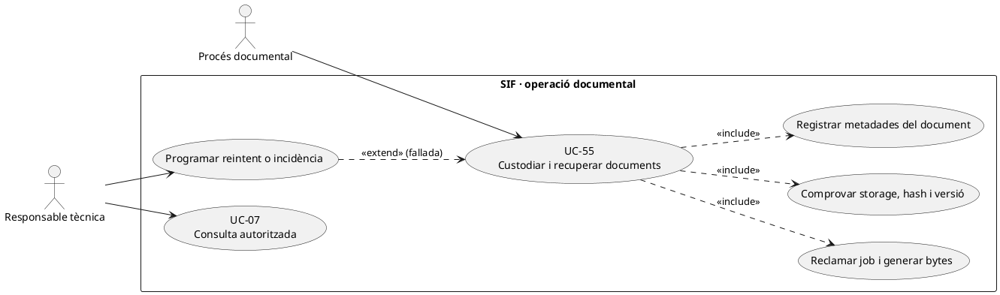
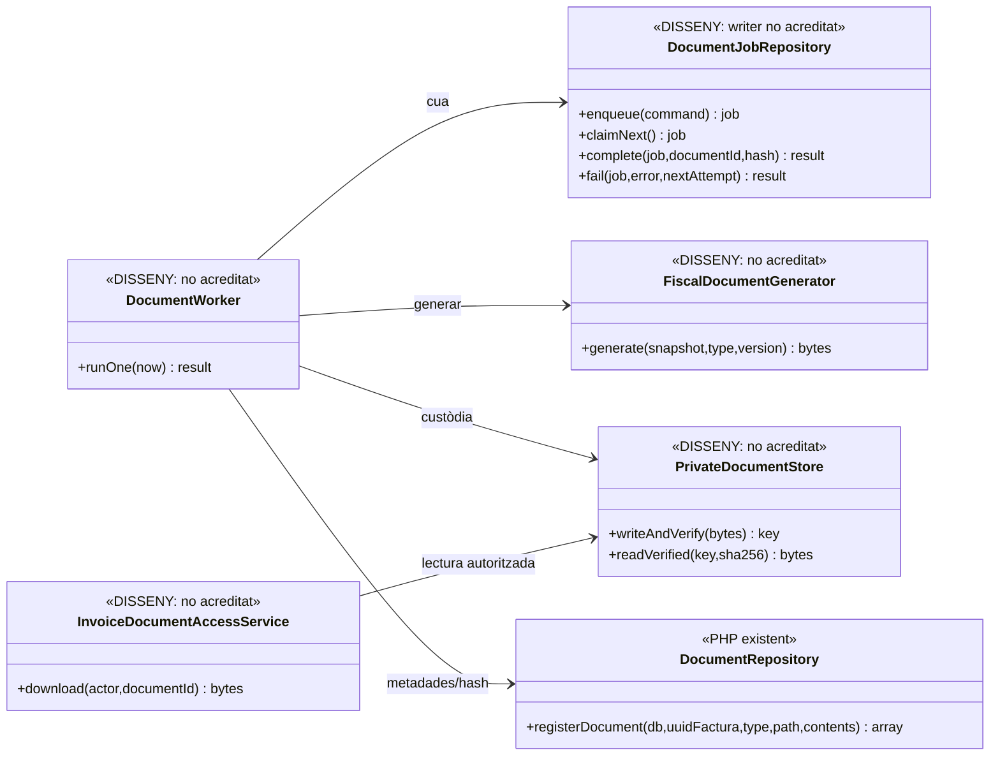
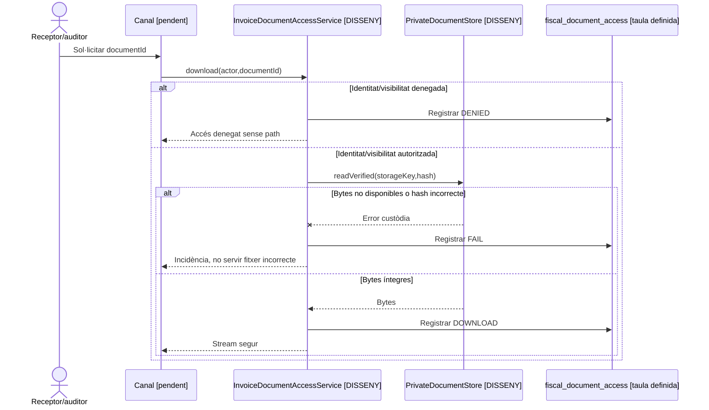

# UC-55 · Generar, reintentar i custodiar documents fiscals

**Frontera funcional.** UC-36 defineix la generació/consulta d'un PDF, QR o XML concret; UC-55 gestiona **la cua documental, els reintents, la versió del generador, la integritat i la custòdia**. UC-07 controla qui pot veure/baixar el document. La factura fiscal, un cop emesa, no s'anul·la ni es reemet perquè falli el PDF.

**Evidència revisada:** `DocumentRepository::registerDocument()` existeix i registra a `factura_documents` tipus, path i SHA-256 dels bytes **rebuts**; `document_job` i `fiscal_document_access` estan definits en una migració SQL. **No s'ha identificat el generador final de PDF/QR/XML, el worker de `document_job`, el gestor d'emmagatzematge privat ni l'endpoint autoritzat de descàrrega** com a implementacions PHP completes. Per tant, el cicle complet dibuixat a continuació és **DISSENY/PARCIAL**, no prova de desplegament.

## 1. Fitxa de cas d'ús

| Camp | Comportament específic |
| --- | --- |
| Actor | Procés documental i responsable tècnica amb permís d'operació; receptor/auditor accedeix posteriorment sota UC-07. |
| Disparador | Factura/rectificativa confirmada, document absent, o recuperació d'un job fallit. |
| Entrada immutable | UUID i snapshot fiscal de la factura, tipus documental, versió del generador i correlació; no consultar el preu mutable del curs per «reconstruir» el document anterior. |
| Job definit al SQL | `document_job` té `UUID_JOB`, `UUID_FACTURA`, `DOCUMENT_TYPE`, `IDEMPOTENCY_KEY` única, `GENERATOR_VERSION`, `STATUS=PENDING`, `ATTEMPTS`, `MAX_ATTEMPTS=5` per defecte, lock, reintent, `FACTURA_DOCUMENT_ID`, `STORAGE_KEY`, `OUTPUT_HASH`, `LAST_ERROR` i `CORRELATION_ID`. **No és un worker ja implementat.** |
| Metadades implementades | `DocumentRepository::registerDocument(db,uuidFactura,type,path,contents)`: tipus `PDF/XML/QR`, SHA-256 i metadata `CREATED`. La funció **no desa els bytes** en storage ni prova que el path existeixi. |
| Resultat objectiu | Fitxer privat verificat, metadades i hash coherents, feina acabada amb referència al document, i accés posterior autoritzat/auditat. |
| Efecte fiscal/econòmic | Cap factura, registre AEAT o `CHARGE` nou com a efecte d'un reintent documental; la factura original continua emesa si el document falla. |

### 1.1. Flux objectiu de generació i custòdia

1. Després del commit de factura, l'orquestrador **proposat** encola un job idempotent identificat per factura, tipus i versió, conservant font fiscal congelada i correlació.
2. El worker **pendent** reclama un job i encarrega els bytes al generador versionat. Per al QR, llegenda i formats finals s'ha de verificar la regla oficial aplicable abans d'afirmar conformitat; `XmlCodec` de remissió AEAT no és per si sol un generador universal de documents de factura.
3. Desa els bytes en storage privat, torna a llegir o verifica integritat i calcula SHA-256. Només aleshores crida el mètode **existent** `DocumentRepository::registerDocument()`; un `HASH_FITXER` a BD no prova per si sol que el fitxer estigui custodiat.
4. El worker **proposat** enllaça `FACTURA_DOCUMENT_ID` i `STORAGE_KEY` al job i marca finalització, sense sobreescriure silenciosament un document de versió anterior.
5. En error de generació, storage, hash o inserció, conserva `LAST_ERROR`, programa un reintent idempotent o obre incidència UC-08. **La política efectiva i el writer de retries encara no s'han acreditat al PHP.**
6. A la consulta, UC-07 torna a autoritzar per actor, rol, receptor i document, serveix des de storage privat i deixa traça `fiscal_document_access`. Aquest pas és pendent de servei de lectura/descàrrega.

### 1.2. Alternatives i invariants

| Escenari | Resposta |
| --- | --- |
| PDF falla després d'emetre factura | Factura fiscal intacta; job pendent/incidència i posterior generació, **sense un altre número de factura**. |
| Mateixa petició repetida | Reutilitzar el job/document quan coincideixen UUID, tipus, versió i bytes; la clau SQL única no acredita el writer idempotent fins que s'implementi. |
| Fitxer desat però falla l'INSERT de metadata | Detectar fitxer orfe i reprendre sense perdre hash/versió; no mostrar `CREATED` fals. |
| Metadata `CREATED` sense bytes o amb SHA-256 diferent | Bloquejar descàrrega, incidència de custòdia i recerca de la còpia correcta. |
| Canvi de plantilla/versió | Preservar la còpia històrica i justificar una nova representació; no modificar factura ni hash anterior. |
| Rectificativa | Document propi de la nova factura, vinculat a la factura original sense reemplaçar-ne el document. |
| Grup/empresa | UC-07 restringeix la consulta segons receptor i visibilitat: disposar d'un UUID o d'un path no concedeix accés. |
| Error de QR/XML | Verificar que el resultat correspon al snapshot correcte i al tipus documental, sense confondre XML de remissió amb XML lliurable. |

**Proves detectades, no executades:** `DocumentsAndIncidentsTest` comprova metadades i hash de `DocumentRepository`, però no el cicle de storage, reintents, permisos o generació real del PDF/QR.

### 1.3. Prioritat del document de factura prèvia i coherència amb el correu

**Necessitat del circuit d'empresa.** A `/alumnes/genera-factura-abans-pagar/`, PrisMa emet una factura **real** que pot necessitar-se per enviar al responsable/empresa i cobrar més endavant. El pas de `issueInvoice()` confirma `UUID_FACTURA/NUM_VISIBLE` encara que la generació del PDF/QR sigui asíncrona. El contracte de pantalla ha de mostrar **factura emesa + document `PENDING`** quan el worker encara no ha desat els bytes i prioritzar el job documental de la factura prèvia segons l'operativa acordada; no ajornar l'existència de la factura fins que estigui llest el PDF.

**Tall del lliurament.** Si un correu al responsable ha d'incloure el PDF o l'enllaç de consulta, no crear una notificació que presenti l'adjunt com a disponible fins que es comprovi el document real i l'autorització del receptor (UC-49/58/80). Si falla només el PDF, reprendre **el mateix `document_job`/UUID_FACTURA**; si el correu ha fallat després de generar els bytes, reprendre només la notificació. Ni una incidència documental ni un canvi d'`E_FACT` impliquen tornar a generar el registre fiscal o registrar cobrament nou.

**Origen immutable davant regeneració llegada.** El llegat exposa `mostraModalPrevFactura_Factures.php`, `descarregaFactura.php` i `generaFactura($id,true)`, que poden reconstruir un PDF amb dades vives; `eliminarArxiu.php` rep un nom de fitxer temporal per esborrar-lo. A la ruta SIF, el document s'ha de generar del snapshot fiscal congelat i conservar un hash dels **bytes realment escrits** en storage privat. No convertir el generador llegat ni la neteja via filename en la ruta de custòdia de la factura fiscal original.

**Original, rectificativa i nou renderitzat.** La factura original i la rectificativa són dos `UUID_FACTURA` i requereixen documents independents. Si es modifica una plantilla, conservar identificador de versió i la representació anterior; reintentar un job fallit de **la mateixa versió** no ha de sobreescriure silenciosament un document custodiat ni retornar dos PDFs originals incompatibles.

### 1.4. Proves addicionals de disponibilitat i comunicació (no executades)

| ID | Escenari | Resultat exigible |
| --- | --- | --- |
| DC-55-01 | Factura real abans de cobrar confirmada, PDF encara PENDING | Mostrar UUID/número i document pendent; no reemetre per obtenir PDF. |
| DC-55-02 | Job documental falla, cua AEAT/ingrés ja confirmats | Reintentar document exclusivament; conservar estats extern i econòmic. |
| DC-55-03 | Correu de factura requereix PDF però bytes absents | Comunicació documental pendent o avís adequat sense afirmar PDF disponible. |
| DC-55-04 | PDF original existent i rectificativa emesa | Dos UUIDs i dos documents, sense substituir el primer. |
| DC-55-05 | Fitxer antic eliminat amb nom procedent de GET | La ruta nova no accepta esborrat d'artefactes fiscals per filename aportat pel navegador. |

## 2. Diagrama UML de casos d'ús



## 3. Diagrama de classes — PHP existent i disseny separat



## 4. Seqüència principal — generació i error recuperable (DISSENY)

```mermaid
sequenceDiagram
autonumber
participant Inv as Factura SIF ja emesa
participant J as DocumentJobRepository [DISSENY]
participant W as DocumentWorker [DISSENY]
participant G as FiscalDocumentGenerator [DISSENY]
participant Store as PrivateDocumentStore [DISSENY]
participant R as DocumentRepository [EXISTENT]
Inv->>J: Encolar UUID_FACTURA + tipus + versió
W->>J: claimNext() idempotent
J-->>W: Job amb font immutable
W->>G: generate(snapshot,type,version)
alt Generació/custòdia correctes
 G-->>W: bytes
 W->>Store: writeAndVerify(bytes)
 Store-->>W: path privat, SHA-256 verificat
 W->>R: registerDocument(db,UUID_FACTURA,type,path,bytes)
 R-->>W: Metadata factura_documents
 W->>J: complete(job,documentId,hash)
else Error de bytes, storage o metadata
 G--xW: Error
 W->>J: fail(job,error,nextAttempt)
 Note over W,J: Incidència/retry pendents d'implementar
end
Note over Inv,R: DocumentRepository existeix; la resta del workflow és OBJECTIU
```

## 5. Seqüència de custòdia i descàrrega (DISSENY)



## 6. Traçabilitat

[UC-55 original](../06-fitxes-funcionals/uc-055.md) · [UC-36 generació puntual](uc-036-generar-consultar-documents.md) · [UC-07 accés](uc-007-consultar-factura-estat-document.md) · [UC-08 incidències](uc-008-gestionar-incidencia-sif.md) · [DocumentRepository](../../sif/src/Repository/DocumentRepository.php) · [Migració document_job/access](../../sif/database/migrations/2026_09_15_000003_add_functional_audit_control.sql) · [DocumentsAndIncidentsTest](../../sif/tests/Integration/DocumentsAndIncidentsTest.php).
