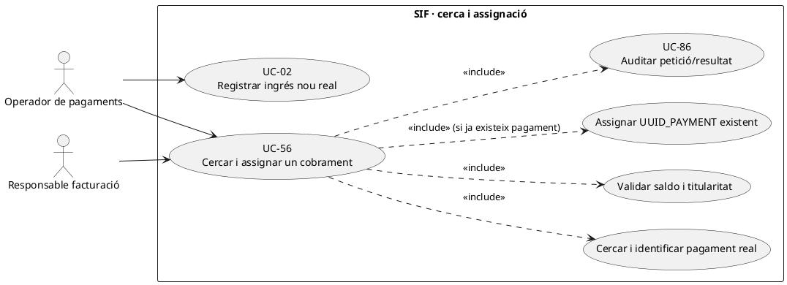
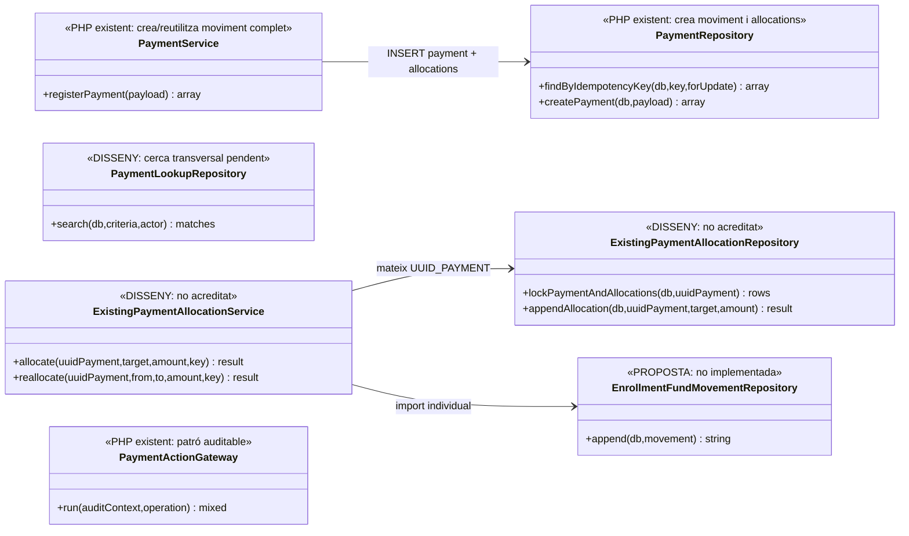

# UC-56 · Cercar i assignar un cobrament existent

**Objectiu del catàleg:** cercar una operació econòmica per NIF/NIE, regal, factura, `IDPAG` o referència i **assignar-la idempotentment a una factura existent**, sense tornar-la a registrar com si el banc hagués ingressat diners dues vegades. UC-25 analitza fitxers TPV; UC-25a compara identitats `IDPAG`; UC-86 audita accions de consulta/assignació.

**Estat contrastat:** `PaymentService::registerPayment()`, `PaymentRepository::createPayment()` i `payment_allocation` existeixen per **crear una transacció nova i les seves assignacions alhora**. `PaymentRepository::createPayment()` insereix `payment_transaction` i després les `payment_allocation` del payload; `PaymentService` reutilitza per `IDEMPOTENCY_KEY`. **No s'ha identificat en aquestes classes un mètode per buscar transversalment per NIF/regal/`IDPAG`, ni un mètode `allocateExistingPayment(uuidPayment,...)` que assigni el saldo d'un `UUID_PAYMENT` ja existent sense crear un CHARGE nou.** Aquest és el buit central d'UC-56.

## 1. Fitxa específica

| Aspecte | Regla i estat |
| --- | --- |
| Actors | Operador autoritzat; responsable de facturació per assignació ambigüa o entre receptors diferents; auditori de lectura segons permís. |
| Cerca | Per UUID_PAYMENT, referència bancària/`PROVIDER_REF`, `DS_ORDER`, `IDPAG`, UUID/número de factura, NIF/NIE del receptor o regal; el cercador compost **no** és servei executable verificat. El NIF de la factura no prova automàticament que aquella persona pagués un regal/grup. |
| Identitat monetària | `payment_transaction.UUID_PAYMENT`, `IDEMPOTENCY_KEY`, `TIPUS_MOVIMENT`, `IMPORT`, `METODE`, data, `PROVIDER_REF`, `DS_ORDER`, `IDPAG`, `PAYLOAD_HASH` i `ESTAT`. |
| Assignació fiscal | `payment_allocation` relaciona `UUID_PAYMENT` amb `UUID_FACTURA`, `IMPORT_ASSIGNAT` i `TIPUS_ASSIGNACIO`; la factura conserva `ESTAT_COBRAMENT` propi. |
| Diferència crítica | Registrar **un cobrament nou** (UC-02) i **assignar/reassignar una part d'un cobrament que ja existeix** (UC-56) són operacions diferents. Cridar `registerPayment` amb una nova clau per «assignar» un `UUID_PAYMENT` antic crearia un altre moviment bancari fals. |
| Saldo assignable objectiu | Suma de moviment original menys imports ja assignats, ajustant tipus de moviment i devolucions/compensacions segons regles; tots els càlculs en decimals i control de concurrència. No donar per disponible un import que ja ha sortit via `REFUND` o que pertany a una altra factura. |
| Traça per inscripció | Per grup/pack un pagament pot assignar-se a una sola factura i a N inscripcions individualment. `payment_allocation` **no identifica l'import de cada inscripció**, per la qual cosa cal el ledger quantitatiu proposat, sense un nou `CHARGE`. |

### 1.1. Flux objectiu distingit del PHP actual

1. L'operador consulta per una o més claus. El servei de cerca **pendent** retorna candidats amb origen, pagador conegut, estat, factures associades, assignacions i saldo assignable; minimitza dades personals segons rol.
2. Si no hi ha pagament al SIF però s'ha acreditat ingrés real en banc/TPV, es tramita un **nou CHARGE justificant referència**, per UC-02 o el canal pertinent. Això és una operació diferent d'assignar una transacció existent.
3. Si `UUID_PAYMENT` ja existeix, l'operador el selecciona i indica factura de destí, import i, si afecta N inscripcions, desglossament per cadascuna.
4. El servei d'assignació **pendent** bloqueja el pagament i les assignacions rellevants, verifica titularitat, divisa, tipus i import disponible. Evita repetir la mateixa assignació per reintent o introduir una assignació contradictòria amb el mateix identificador de comanda.
5. Una assignació nova crea un vincle `payment_allocation` al **mateix `UUID_PAYMENT`** (o una correcció traçada de l'enllaç anterior quan correspongui), actualitza l'estat de cobrament de les factures afectades i registra `payment_action_event` amb `ALLOCATE`/`REALLOCATE`/`UNALLOCATE`. La mutació sobre assignació existent no ha d'esborrar silenciosament la història.
6. Si l'import s'atribueix a més d'una inscripció, crea/reutilitza moviments interns per `ID_INSC` amb origen i quantitat precisos. La suma dels imports econòmics atribuïts no ha de superar el pagament real efectiu menys retorns/aplicacions ja comptades.
7. Després del commit SIF, la sincronització al llegat UC-47/53 ha de reflectir el resultat, sense afirmar èxit acadèmic per l'existència de la factura.

### 1.2. Alternatives, errors i controls obligatoris

| Escenari | Resultat |
| --- | --- |
| Transferència de 180 € ja registrada per tres inscripcions | Reutilitzar **un `UUID_PAYMENT`**; assignar/importar trams totals 180 € a la factura o factures pertinents i tres atribucions individuals justificades; no crear tres `CHARGE` de 60 € ficticis. |
| Pagament confirmat de 100 €, 80 € ja assignats | Només 20 € de saldo assignable **si no hi ha altres afectacions**; bloquejar una nova assignació de 40 €. |
| Assignació introduïda dues vegades | Reutilitzar el resultat anterior per la mateixa comanda o detectar duplicat; `payment_allocation` del SQL revisat **no té una clau idempotent pròpia** de l'assignació i cal definir-la al contracte nou. |
| Reassignació de factura A cap a B | No crear un segon pagament ni modificar factura fiscal original; deixar traça de desassignació i assignació, recomputar els estats econòmics A/B i les atribucions per inscripció. |
| `IDPAG` coincideix però referència bancària difereix | No assumir que es tracta del mateix moviment; UC-25a compara la identitat real. |
| Pagament d'empresa per un grup | Comprovar pagador i receptor de factura; no exposar tota la factura a cada participant ni atribuir automàticament a l'alumne el dret a un retorn. |
| Reús de `IDEMPOTENCY_KEY` amb payload diferent | **Buit verificat:** `PaymentService::existingResult` no compara import, assignacions o hash de l'entrada; el canal i el servei final han de detectar el conflicte, no declarar la nova petició equivalent. |

**Proves a implementar/validar:** cerca per totes les claus del catàleg, permisos, pagament existent sense assignació, assignació parcial i concurrent, saldo insuficient, reassignació A→B, pack/grup amb N inscripcions, pagador d'empresa, retorn previ i clau repetida amb payload diferent. **No s'han executat proves** en aquesta revisió.

## 2. Diagrama UML de casos d'ús



## 3. Diagrama de classes — el límit exacte del PHP actual



**No** es dibuixa un mètode `appendAllocation` al `PaymentRepository` actual: només existeix com a **mètode privat** de `createPayment()`, inseparable de la inserció de la transacció en el servei públic revisat.

## 4. Seqüència — assignar un pagament ja existent (DISSENY)

```mermaid
sequenceDiagram
autonumber
actor O as Operador
participant UI as Intranet de pagaments [pendent]
participant Search as PaymentLookupRepository [DISSENY]
participant S as ExistingPaymentAllocationService [DISSENY]
participant Repo as ExistingPaymentAllocationRepository [DISSENY]
participant L as Registre de fons per inscripció [PROPOSTA]
participant DB as BD SIF
O->>UI: Cercar pagament per IDPAG, factura o referència
UI->>Search: search(criteria,actor)
Search->>DB: SELECT payment_transaction + allocations i fact_rels
Search-->>UI: UUID_PAYMENT, import, assignat, saldo i candidats
O->>UI: Assignar part real del mateix UUID_PAYMENT a factura F / inscripció A
UI->>S: allocate(uuidPayment,F,amount,requestId)
S->>Repo: lockPaymentAndAllocations(uuidPayment)
Repo->>DB: SELECT ... FOR UPDATE
alt Import excedeix disponible o titularitat no acreditada
 Repo-->>S: Conflicte
 S-->>UI: Rebutjar i auditar; cap import creat
else Validació coherent
 S->>Repo: appendAllocation(uuidPayment,F,amount)
 Repo->>DB: INSERT payment_allocation (UUID_PAYMENT existent)
 S->>DB: Recalcular ESTAT_COBRAMENT de F
 S->>L: append(EXTERNAL→A,amount,UUID_PAYMENT existent) si escau
 S-->>UI: Assignació idempotent i UUID_PAYMENT original
end
Note over S,L: Operació objectiu, no mètode implementat de PaymentRepository.
Note over DB,L: No INSERT a payment_transaction en aquesta seqüència.
```

## 5. Traçabilitat

[UC-56 original](../06-fitxes-funcionals/uc-056.md) · [UC-02 cobrament nou](uc-002-registrar-cobrament-factura.md) · [UC-25 fitxer](uc-025-analitzar-fitxer-tpv.md) · [UC-25a IDPAG](uc-025a-comprovar-idpag-duplicats.md) · [UC-86 auditoria](uc-086-auditar-accio-pagament.md) · [Revisió fons](00-revisio-moviments-inscripcions.md) · [PaymentService](../../sif/src/Service/PaymentService.php) · [PaymentRepository](../../sif/src/Repository/PaymentRepository.php) · [Migració payment_transaction/allocation](../../sif/database/migrations/2026_06_02_000001_create_sif_core.sql).
