# UC-56 · Cercar i assignar un cobrament existent

**Objectiu del catàleg:** cercar una operació econòmica per NIF/NIE, regal, factura, `IDPAG` o referència i **assignar-la idempotentment a una factura existent**, sense tornar-la a registrar com si el banc hagués ingressat diners dues vegades. UC-25 analitza fitxers TPV; UC-25a compara identitats `IDPAG`; UC-86 audita accions de consulta/assignació.

**Estat contrastat:** `PaymentService::registerPayment()`, `PaymentRepository::createPayment()` i `payment_allocation` existeixen per **crear una transacció nova i les seves assignacions alhora**. `PaymentRepository::createPayment()` insereix `payment_transaction` i després les `payment_allocation` del payload; `PaymentService` reutilitza per `IDEMPOTENCY_KEY`. **No s'ha identificat en aquestes classes un mètode per buscar transversalment per NIF/regal/`IDPAG`, ni un mètode `allocateExistingPayment(uuidPayment,...)` que assigni el saldo d'un `UUID_PAYMENT` ja existent sense crear un CHARGE nou.** Aquest és el buit central d'UC-56.

## 1. Fitxa específica

| Aspecte | Regla i estat |
| --- | --- |
| Actors | Operador autoritzat; responsable de facturació per assignació ambigüa o entre receptors diferents; auditori de lectura segons permís. |
| Cerca | Per UUID_PAYMENT, referència bancària/`PROVIDER_REF`, `DS_ORDER`, `IDPAG`, UUID/número de factura, NIF/NIE del receptor o regal; el cercador compost **no** és servei executable verificat. El NIF de la factura no prova automàticament que aquella persona pagués un regal/grup. |
| Identitat monetària | `payment_transaction.UUID_PAYMENT`, `IDEMPOTENCY_KEY`, `TIPUS_MOVIMENT`, `IMPORT`, `METODE`, data, `PROVIDER_REF`, `DS_ORDER`, `IDPAG`, `PAYLOAD_HASH` i `ESTAT`. |
| Assignació fiscal | `payment_allocation` relaciona `UUID_PAYMENT` amb `UUID_FACTURA`, `IMPORT_ASSIGNAT` i `TIPUS_ASSIGNACIO`; la factura conserva `ESTAT_COBRAMENT` propi. |
| Diferència crítica | Registrar **un cobrament nou** (UC-02) i **assignar/reassignar una part d'un cobrament que ja existeix** (UC-56) són operacions diferents. Cridar `registerPayment` amb una nova clau per «assignar» un `UUID_PAYMENT` antic crearia un altre moviment bancari fals. |
| Saldo assignable objectiu | Suma de moviment original menys imports ja assignats, ajustant tipus de moviment i devolucions/compensacions segons regles; tots els càlculs en decimals i control de concurrència. No donar per disponible un import que ja ha sortit via `REFUND` o que pertany a una altra factura. |
| Traça per inscripció | Per grup/pack un pagament pot assignar-se a una sola factura i a N inscripcions individualment. `payment_allocation` **no identifica l'import de cada inscripció**, per la qual cosa cal el ledger quantitatiu proposat, sense un nou `CHARGE`. |

### 1.1. Flux objectiu distingit del PHP actual

1. L'operador consulta per una o més claus. El servei de cerca **pendent** retorna candidats amb origen, pagador conegut, estat, factures associades, assignacions i saldo assignable; minimitza dades personals segons rol.
2. Si no hi ha pagament al SIF però s'ha acreditat ingrés real en banc/TPV, es tramita un **nou CHARGE justificant referència**, per UC-02 o el canal pertinent. Això és una operació diferent d'assignar una transacció existent.
3. Si `UUID_PAYMENT` ja existeix, l'operador el selecciona i indica factura de destí, import i, si afecta N inscripcions, desglossament per cadascuna.
4. El servei d'assignació **pendent** bloqueja el pagament i les assignacions rellevants, verifica titularitat, divisa, tipus i import disponible. Evita repetir la mateixa assignació per reintent o introduir una assignació contradictòria amb el mateix identificador de comanda.
5. Una assignació nova crea un vincle `payment_allocation` al **mateix `UUID_PAYMENT`** (o una correcció traçada de l'enllaç anterior quan correspongui), actualitza l'estat de cobrament de les factures afectades i registra `payment_action_event` amb `ALLOCATE`/`REALLOCATE`/`UNALLOCATE`. La mutació sobre assignació existent no ha d'esborrar silenciosament la història.
6. Si l'import s'atribueix a més d'una inscripció, crea/reutilitza moviments interns per `ID_INSC` amb origen i quantitat precisos. La suma dels imports econòmics atribuïts no ha de superar el pagament real efectiu menys retorns/aplicacions ja comptades.
7. Després del commit SIF, la sincronització al llegat UC-47/53 ha de reflectir el resultat, sense afirmar èxit acadèmic per l'existència de la factura.

### 1.2. Alternatives, errors i controls obligatoris

| Escenari | Resultat |
| --- | --- |
| Transferència de 180 € ja registrada per tres inscripcions | Reutilitzar **un `UUID_PAYMENT`**; assignar/importar trams totals 180 € a la factura o factures pertinents i tres atribucions individuals justificades; no crear tres `CHARGE` de 60 € ficticis. |
| Pagament confirmat de 100 €, 80 € ja assignats | Només 20 € de saldo assignable **si no hi ha altres afectacions**; bloquejar una nova assignació de 40 €. |
| Assignació introduïda dues vegades | Reutilitzar el resultat anterior per la mateixa comanda o detectar duplicat; `payment_allocation` del SQL revisat **no té una clau idempotent pròpia** de l'assignació i cal definir-la al contracte nou. |
| Reassignació de factura A cap a B | No crear un segon pagament ni modificar factura fiscal original; deixar traça de desassignació i assignació, recomputar els estats econòmics A/B i les atribucions per inscripció. |
| `IDPAG` coincideix però referència bancària difereix | No assumir que es tracta del mateix moviment; UC-25a compara la identitat real. |
| Pagament d'empresa per un grup | Comprovar pagador i receptor de factura; no exposar tota la factura a cada participant ni atribuir automàticament a l'alumne el dret a un retorn. |
| Reús de `IDEMPOTENCY_KEY` amb payload diferent | **PHP main:** `PaymentService::assertSamePayload()` compara import i assignacions en hash V1/V2 per K i retorna conflicte quan el payload canvia; **pendent:** comparar identitat bancària entre K distintes i reservar saldo d'un P existent per una altra factura. |

**Proves a implementar/validar:** cerca per totes les claus del catàleg, permisos, pagament existent sense assignació, assignació parcial i concurrent, saldo insuficient, reassignació A→B, pack/grup amb N inscripcions, pagador d'empresa, retorn previ i clau repetida amb payload diferent. **No s'han executat proves** en aquesta revisió.

### 1.3. Cerca a «Passar pagaments» i reconeixement del cobrament existent

**Entrada operativa real del llegat.** A `/alumnes/pagaments/`, les consultes i el modal de «Passar pagaments» permeten localitzar la persona, una factura o una operació; el procediment antic `efectuarPagament()` pot crear/actualitzar factura i resum de pagaments. Per factures ja generades, `efectuarPagamentFacturaGenerada()` consulta `buscarPagamentsByFact` i les dades `A_PAGAR`, `PAGAMENT`, `FACTURA_RELACIONADA`, `FRACCIO`, `IDPAG` i receptor. El càlcul llegat de pendent a partir d'aquestes columnes **no garanteix** que s'hagin consultat totes les assignacions, retorns, compensacions o cobraments Redsys en curs al SIF.

**Primer, la identitat de l'entrada externa.** Si el banc/TPV ja ha confirmat un ingrés, consultar `DS_ORDER`, referència bancària, `UUID_PAYMENT`, canal i `IDPAG` amb les seves inscripcions/factures; el fitxer TPV antic només comparava amb `web.factures`, no acreditava un `payment_transaction`. Si el mateix `UUID_PAYMENT` ja existeix però falta una atribució a factura, **no cridar `PaymentService::registerPayment()` amb una altra clau** per omplir el buit: aquest mètode crea un moviment nou i totes les seves `payment_allocation`. En el codi consultat no existeix el writer `allocateExistingPayment`; la cerca i el pas de conciliació han de quedar marcats com a **pendents**.

**Una transferència, diverses factures.** El xat i els procediments preveuen que una transferència d'una escola/empresa pugui cobrir diversos cursos o factures ja emeses, o que una factura rebi diversos cobraments fraccionats. El resultats han de mostrar l'ingrés extern **un sol cop** i la imputació concreta a cada `UUID_FACTURA`, identificant el pagador i la part de cada `ID_INSC` quan es conegui. Una coincidència de CIF, `FACTURA_RELACIONADA` o `IDPAG` no és permís per imputar automàticament la transferència a totes les factures candidates, ni per dividir-la a parts iguals entre alumnes.

**Conflicte semàntic d'idempotència a main.** `PaymentService::assertSamePayload()` compara el PAYLOAD_HASH de la petició nova amb el moviment original (V1/V2) abans de retornar un UUID_PAYMENT reutilitzat: import/factura/assignacions nous amb la mateixa K → CONFLICT. Això **no acredita** que un fet bancari amb una K diferent no s'hagi registrat, ni que un mateix P tingui saldo encara assignable: cal consulta del moviment i dels seus trams i guard del fet extern, titularitat i retorns.

### 1.4. Proves operatives addicionals (no executades)

| ID | Escenari | Resultat exigible |
| --- | --- | --- |
| CA-01 | Transferència existent per dues factures d'empresa | Un `UUID_PAYMENT`, imputacions separades i cap segon CHARGE. |
| CA-02 | Factura prèvia amb ingrés real però resum llegat `PAGAMENT=0` | Localitzar factura i cobrament SIF, reparar resum després; no emetre factura nova. |
| CA-03 | Callback Redsys validat amb job en RETRY | Recuperar processament original, no registrar nova transferència/TPV fictícia. |
| CA-04 | N factures candidates amb el mateix CIF o IDPAG | Revisió i selecció explícita de destí/quantitats; cap distribució automàtica. |
| CA-05 | Mateixa clau idempotent i import/assignacions diferents | Conflicte de payload, no reutilització silenciosa d'una assignació incompatible. |
| CA-06 | Ja hi ha UUID_PAYMENT i cal completar una assignació | Operació específica pendent, no un nou `registerPayment()`. |

## 2. Diagrama UML de casos d'ús

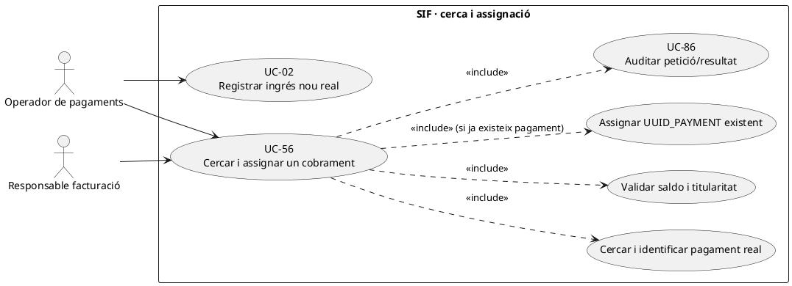

### Vista de casos d’ús per a GitHub (Mermaid)

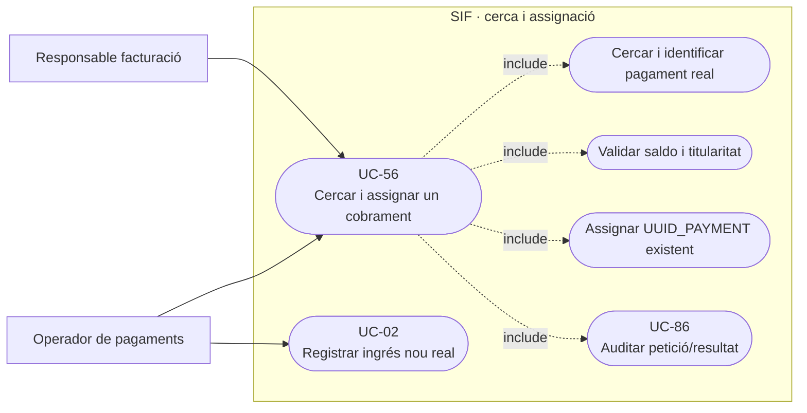

## 3. Diagrama de classes — el límit exacte del PHP actual

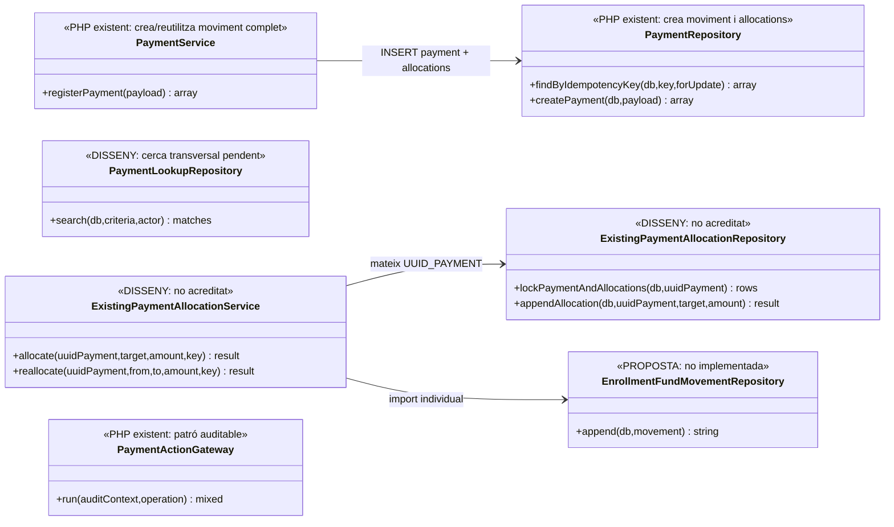

**No** es dibuixa un mètode `appendAllocation` al `PaymentRepository` actual: només existeix com a **mètode privat** de `createPayment()`, inseparable de la inserció de la transacció en el servei públic revisat.

## 4. Seqüència — assignar un pagament ja existent (DISSENY)

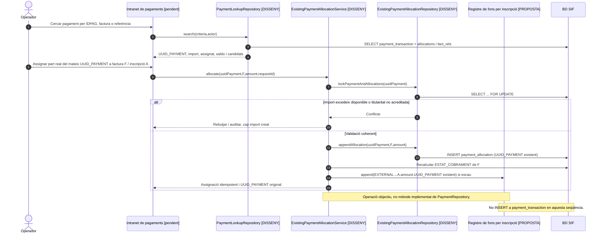

### 4.1. Acció independent: cercar/identificar el cobrament sense modificar-lo — DISSENY

La matriu de pantalles distingeix «Cercador general de pagaments» i «Cercar pagament per NIF/NIE». Ambdós es poden vincular a **UC-56 en la seva modalitat de cerca**, però cal distingir aquesta consulta d'`assignar` o de registrar un `CHARGE` nou. El codi de `PaymentService`/`PaymentRepository` revisat **no implementa** aquest cercador transversal. Les claus `NIF/NIE`, `IDPAG`, `DS_ORDER`, número de factura, regal i referència no són equivalents: un pagador d'empresa o de regal pot no ser l'alumne ni el receptor fiscal.

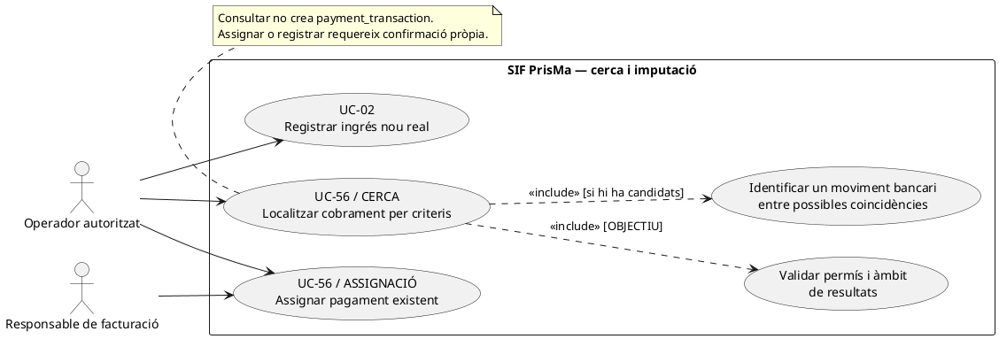

### Vista de casos d’ús per a GitHub (Mermaid)

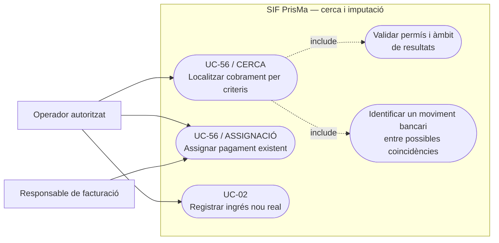

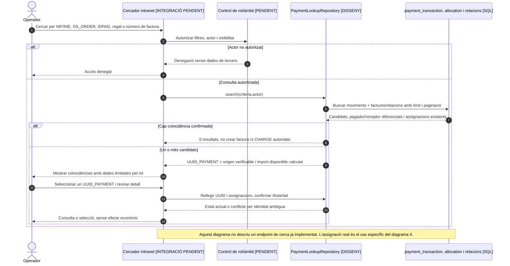

**Proves concretes pendents de la consulta:** buscar NIF de pagador d'empresa diferent de participant; `IDPAG` amb diversos `DS_ORDER`; dues factures amb receptor diferent i un pagador; regal amb beneficiari diferent del comprador; resultat paginat; usuari sense permís; cerca buida; import retornat prèviament; consulta simultània amb reassignació. Cada cerca ha de mostrar **l'estat actual** sense generar factura ni pagament.
### 4.2. Acció independent: calcular el saldo realment no assignat d'un moviment existent — PHP de lectura agregada pendent

**Actor/disparador:** l'operador selecciona `UUID_PAYMENT=P` i vol aplicar a F2 una part d'una única entrada real, ja parcialment atribuïda a F1. **Precondicions:** identificar la mateixa entrada externa i tipus `CHARGE`, comprovar el seu import nominal real, assignacions persistides, possibles sortides/retorns i titularitat. **Postcondició:** un `available_amount` de diagnosi, calculat en cèntims i amb estat `ALLOCATABLE`, `FULLY_ASSIGNED`, `OVERALLOCATED` o `NEEDS_REVIEW` **proposats**; no escriure `CHARGE` ni `payment_allocation` només per consultar.

**Contrast amb el PHP:** `PaymentPayloadValidator::validate()` exigeix imports **numèrics** i almenys una assignació, però **no comprova** `amount > 0`, `allocations[n].amount > 0` ni `SUM(allocations.amount) <= amount`. `PaymentRepository::createPayment()` insereix els imports que rep i recalcula per factura **a partir de les assignacions**, no de l'import nominal del moviment. La migració bàsica de `payment_allocation` té FKs però cap `CHECK` de positivitat ni una unicitat/idempotència de partida. Així, el fet que només existeixi un `UUID_PAYMENT` no demostra que el seu total assignat sigui econòmicament possible. La fórmula `P.IMPORT - SUM(payment_allocation.IMPORT_ASSIGNAT)` és **només el saldo comptable provisional d'un CHARGE coherent**: un valor negatiu denuncia sobreatribució; un valor positiu no és saldo distribuïble sense verificar l'entrada externa, titular i retorns. Per a `REFUND` o `COMPENSATION`, cal una política diferenciada, no la mateixa fórmula interpretada com a nou ingrés lliure.

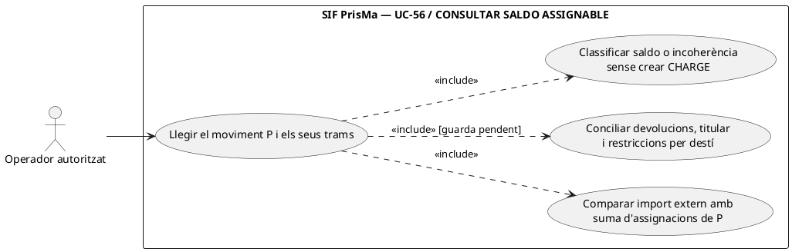

### Vista de casos d’ús per a GitHub (Mermaid)

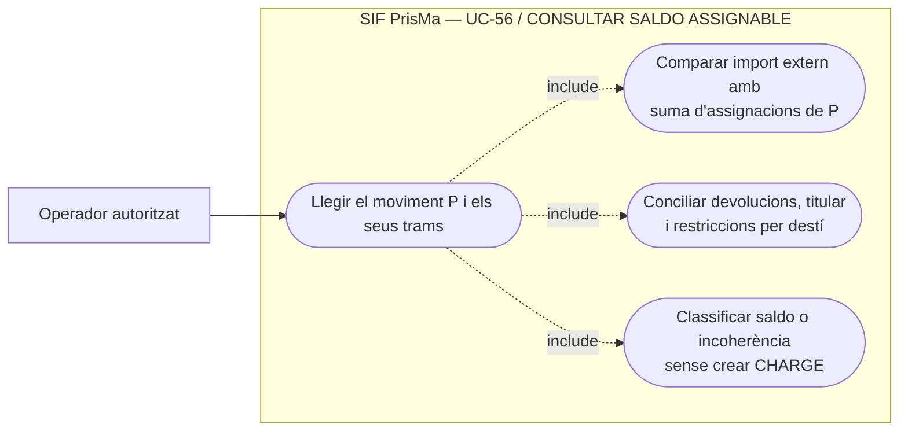

```mermaid
sequenceDiagram
autonumber
actor O as Operador
participant L as PaymentAvailableBalanceReader [DISSENY]
participant P as payment_transaction [LECTURA]
participant A as payment_allocation [LECTURA]
participant E as Conciliació de fet extern i retorns [DISSENY]
O->>L: previewAvailable(UUID_PAYMENT=P)
L->>P: Llegir P, IMPORT=100,TIPUS_MOVIMENT=CHARGE, estat/origen
L->>A: Llegir SUM(IMPORT_ASSIGNAT) de totes les files del mateix P
alt Assignacions F1/80, F2/80: suma 160 > nominal 100
 A-->>L: 160
 L-->>O: OVERALLOCATED: -60 comptables, no permetre F3 ni donar saldo 20
else Assignacions F1/80: suma 80 de nominal 100
 A-->>L: 80
 L->>E: Comprovar ingrés real 100, titular, retorns i altres drets
 alt Origen o import extern no acreditat, o disponibilitat compromesa
  E-->>L: NEEDS_REVIEW
  L-->>O: No assignar els 20 encara que la resta aritmètica sigui positiva
 else Ingrés 100 acreditat i 20 disponibles per a F2
  E-->>L: VALIDATED
  L-->>O: ALLOCATABLE 20 sota lock nou a l'aplicació final
 end
else Assignacions F1/100: suma 100
 A-->>L: 100
 L-->>O: FULLY_ASSIGNED; assignar a F2 exigiria UC-105 de reassignació, no saldo nou
end
Note over L,E: La consulta/guard no existeix al PaymentRepository actual. La previsualització NO reserva saldo; recalcular-lo sota lock a l'aplicació.
```

### 4.3. Acció independent: atribuir el saldo no assignat a una factura sense registrar un segon ingrés — DISSENY

**Actor/disparador:** després de la consulta, s'ordena atribuir 20 € del moviment P de 100 € (80 € assignats a F1) a F2. **Precondicions transaccionals:** bloquejar P i el conjunt de trams corrents, validar idempotència de l'ordre d'assignació, prova del pagador i de la factura F2, suma actual dins de l'import acreditat i tractament separat de devolucions/compensacions. **Postcondició:** **el mateix `UUID_PAYMENT=P`**, una nova imputació F2/20 i el seu assentament d'història, recalcular `ESTAT_COBRAMENT` de F2, cap inserció a `payment_transaction`. Si l'entrada inicial era de 100 €, assignar-la a dues factures per 80+80 **no** esdevé correcte perquè s'hagi reutilitzat P.

**Límit executiu:** `PaymentRepository::createAllocation()` és **privat** i s'invoca des de `createPayment()` per un moviment nou; `PaymentService::registerPayment()`, quan troba la clau existent, **retorna el UUID sense afegir cap imputació**. La classe `ExistingPaymentAllocationService` i el writer històric són disseny, no PHP actual.

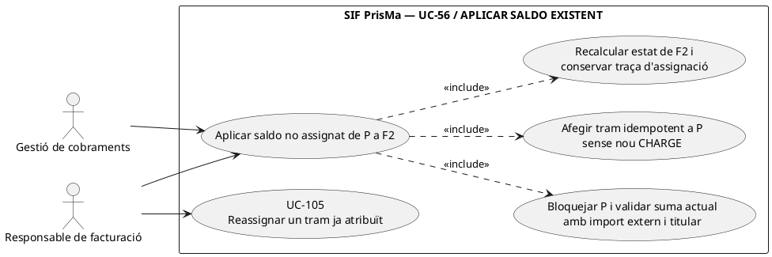

### Vista de casos d’ús per a GitHub (Mermaid)

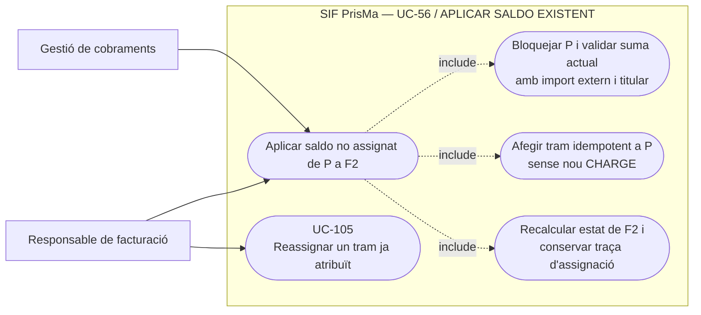

```mermaid
sequenceDiagram
autonumber
actor G as Gestió
participant S as ExistingPaymentAllocationService [DISSENY]
participant R as ExistingPaymentAllocationRepository [DISSENY]
participant DB as payment_transaction + payment_allocation [SQL]
participant E as EnrollmentFundMovementRepository [PROPOSTA]
G->>S: allocate(P,F2,20,requestId)
S->>R: lockPaymentAndAllocations(P)
R->>DB: BEGIN; SELECT P i trams FOR UPDATE
R-->>S: CHARGE 100, F1/80, sense retorn ni saldo compromès
S->>S: Validar fet real, pagador, F2, import i requestId contra història
alt Mateixa ordre ja aplicada amb mateix destí/import
 S-->>G: REUSED sobre tram anterior, cap INSERT
else Import demanat > 20 o P/F2 contradictoris
 S-->>G: CONFLICT i ROLLBACK, cap segon CHARGE
else 20 legítims no assignats
 S->>R: appendAllocation(P,F2,20,requestId) [writer pendent]
 R->>DB: INSERT tram F2/20 al P existent, recalcular F2
 S->>E: append atribució individual coherent [PROPOSTA]
 E-->>S: event/partida idempotent
 R->>DB: COMMIT conjunt amb història SIF
 S-->>G: P amb F1/80 + F2/20; saldo pendent 0
end
Note over S,DB: Esquema i mètode d'història per tram no implementats. En error, garantir rollback abans de respondre èxit.
```

| Prova pendent | Escenari | Resultat exigible |
| --- | --- | --- |
| SA-56-07 | CHARGE P/100 amb F1/80 i F2/80 des del mateix payload | Detectar assignació nominal de 160/100 com a `OVERALLOCATED`; cap saldo per a F3. El validator actual no en rebutja la suma. |
| SA-56-08 | CHARGE P/100 amb F1/80 i F2 sense tram | Amb origen extern confirmat, assignar com a màxim 20 a F2 sobre el mateix P; cap segon CHARGE. |
| SA-56-09 | CHARGE P/100 amb assignació F1/-20 o F1/0 | Rebutjar imports de partida no positius; el validator actual només comprova `is_numeric`. |
| SA-56-10 | Dues comandes concurrents reclamen els mateixos 20 restants per F2 i F3 | Serialitzar P i les assignacions, autoritzar com a màxim 20 en total, registrar conflicte de la perdedora. |
| SA-56-11 | P apareix amb 20 comptables sense assignar però hi ha retorn extern/compromís pendent | `NEEDS_REVIEW`, no donar els 20 per lliures fins a comprovar retorn i titularitat. |

## 5. Traçabilitat

[UC-56 original](../06-fitxes-funcionals/uc-056.md) · [UC-02 cobrament nou](uc-002-registrar-cobrament-factura.md) · [UC-25 fitxer](uc-025-analitzar-fitxer-tpv.md) · [UC-25a IDPAG](uc-025a-comprovar-idpag-duplicats.md) · [UC-86 auditoria](uc-086-auditar-accio-pagament.md) · [Revisió fons](00-revisio-moviments-inscripcions.md) · [PaymentService](../../sif/src/Service/PaymentService.php) · [PaymentRepository](../../sif/src/Repository/PaymentRepository.php) · [Migració payment_transaction/allocation](../../sif/database/migrations/2026_06_02_000001_create_sif_core.sql).
