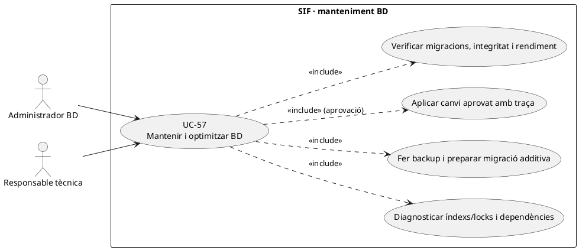
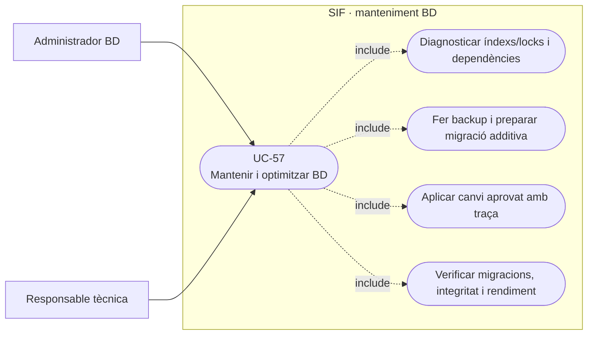
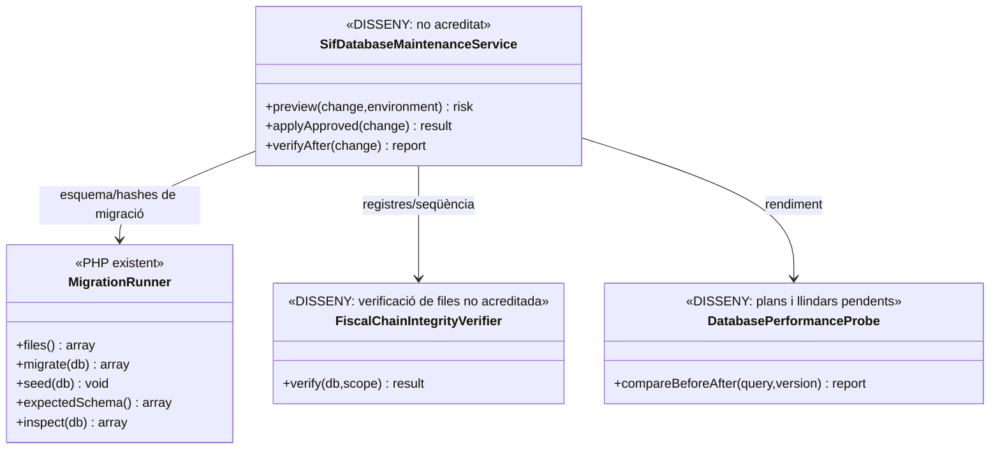
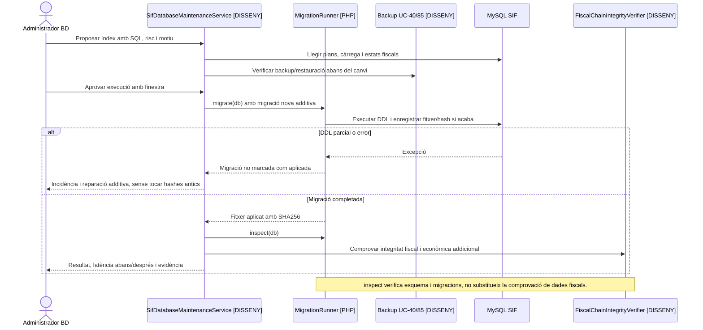

# UC-57 · Mantenir i optimitzar la base de dades SIF sense perdre evidència fiscal

**Objectiu original:** índexs, retenció i manteniment **sense esborrar evidència fiscal ni trencar hashes**. **Estat [DISSENY/PARCIAL].** `MigrationRunner` ja inspecciona les migracions i les columnes esperades, però això no és un gestor complet de manteniment/retenció ni un auditor de la integritat de cada registre fiscal.

## 1. Evidència PHP i límits

`MigrationRunner::migrate()` manté `sif_schema_migration(MIGRATION_FILE,SHA256,APPLIED_AT)`, rebutja migracions ja aplicades que hagin canviat o desaparegut i executa els fitxers SQL pendents ordenats. El mateix codi adverteix que el DDL MySQL fa **commits implícits** i que no s'ha de marcar un fitxer parcialment fallit com a complet. `inspect()` contrasta el ledger de migracions i les taules/columnes declarades, **no** comprova que un índex sigui òptim, que una consulta estigui lliure de locks ni que tots els `HASH_FACT_ANT` s'hagin recalculat correctament.

Les taules fiscals `factura`, `factura_linia`, `factura_registres`, `fiscal_chain_state`, `fiscal_sequence`, `fiscal_queue`, `payment_transaction` i `payment_allocation` tenen **dependències històriques** entre sí i amb la BD llegada. No s'ha acreditat un servei PHP de política de retenció/purga fiscal, ni una migració que autoritzi suprimir evidència o escurçar la cadena. La política concreta de conservació i d'accés s'ha d'aprovar abans de qualsevol esborrat.

## 2. Fitxa funcional específica

| Tasca | Regla |
| --- | --- |
| Diagnòstic | Mesurar consulta/índex/locks, ús de disc, cardinalitat, latència per canal i cua; guardar entorn, versió BD, esquema i evidència abans/després. Un coll d'ampolla de packs PHP **no queda demostrat** com a problema SQL per defecte. |
| Canvi d'esquema | Crear **nova migració additiva** amb nom/hashes propis, pla d'índexs i reversió de codi compatible. No editar una migració ja aplicada ni modificar el seu SHA256 del ledger per «fer-la passar». |
| Dades fiscals | No executar `UPDATE` de número, import, receptor o hash de factura/registres ni `DELETE` de registres per compactar; les correccions van a UC-74/75/76. Si canvia retenció, aplicar criteris aprovats per classe de dada/entorn sense destruir traça exigida. |
| Seguretat | Operacions de DBA restringides, credencials diferenciades de l'API emissora i registre d'actor, motiu, script, instant i versió; no donar accés de DBA a un auditor temporal UC-59. |
| Disponibilitat | Fer backup i **prova de restauració** UC-40/85 abans d'un canvi amb risc, planificar locks/finestres sobre emissió, callback i worker AEAT; si cal pausa, reprendre només després de verificar què ha passat al banc/AEAT. |
| Rendiment funcional | Comparar consultes de `fact_rels`, `payment_allocation` i `IDPAG` sobre dades representatives sense duplicar cobraments o atribucions. La traça individual `enrollment_fund_movement` continua **proposta**, no taula que es pugui reindexar actualment. |
| Verificació | Inspeccionar migracions, integritat referencial, coherència de registres/cadena i cues/assignacions, i executar proves funcionals de curs, grup, pack, fracció, rectificació, devolució i retries. `inspect()` **només cobreix estructura i hashes de fitxers de migració**. |

### Flux objectiu i proves

1. Gestió tècnica obre una proposta específica: índex lent de `payment_allocation`, creixement de `fiscal_queue`, retenció de logs o canvi de tipus d'una columna. Recollir consulta original, pla d'execució, càrrega de producció **sense exposar dades personals**, motivació i risc d'integritat.
2. Preparar nova migració/script compatible amb el codi, estimar locks i impacte en la cadena fiscal; provar en una còpia aïllada i recuperar si cal. **No** executar un `OPTIMIZE` genèric sense estimar bloqueig/espai/càrrega del motor i les dependències reals.
3. Obtenir aprovació i backup verificat; coordinar workers/TPV i aplicar només l'operació autoritzada, recollint versió de SQL, operador, resultat i temps.
4. Executar `MigrationRunner::inspect()` i controls addicionals **pendents** sobre cadena, seqüència, imports, idempotència i referències llegades; comparar plans/latències abans/després i obrir incidència si hi ha degradació.
5. Davant una migració DDL parcial, **no marcar-la aplicada manualment ni editar el fitxer anterior**; preparar reparació additiva verificada i reconciliar estats. Reversió de codi/dades no pot perdre factures o cobrament real posterior al backup.
6. Provar: migració ja aplicada alterada, DDL parcial, índex nou que bloqueja `issueInvoice`, purga de `factura_registres` proposada, restauració que perd job AEAT, doble callback durant manteniment i lectura d'auditor en taules amb permisos insuficients.

**Pendents:** política de manteniment/retenció per classe de dades, approval de DBA, inventari d'índexs/queries reals, auditories d'invariants fiscals/econòmics, proves de migració en línia i finestres de recuperació. No s'han executat migracions ni proves de rendiment aquí.

## 3. UML de casos d'ús

### Vista de casos d’ús per a GitHub (Mermaid)

## 4. UML de classes — migracions existents, manteniment pendent

## 5. UML de seqüència — índex nou i migració parcial (OBJECTIU/PARCIAL)

## 6. Traçabilitat

[UC-57 original](../06-fitxes-funcionals/uc-057.md) · [UC-40 backup](uc-040-backup-restauracio.md) · [UC-85 restauració](uc-085-backup-restauracio-reconciliacio.md) · [UC-39 gate](uc-039-proves-gate-go-no-go.md) · [UC-74 correcció fiscal](uc-074-classificar-correccio-fiscal.md) · [MigrationRunner](../../sif/src/Database/MigrationRunner.php) · [Esquema fiscal](../../sif/database/migrations/2026_06_02_000001_create_sif_core.sql).
