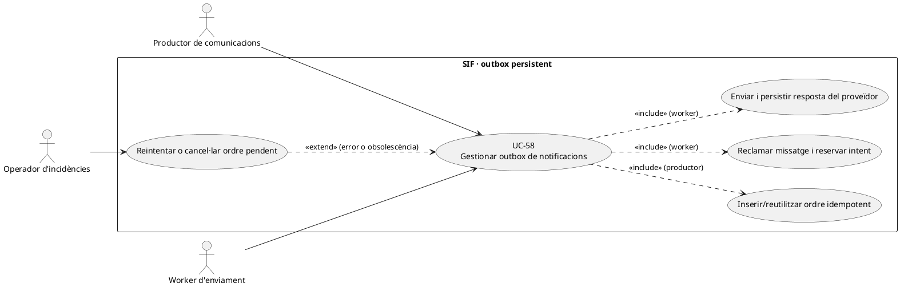
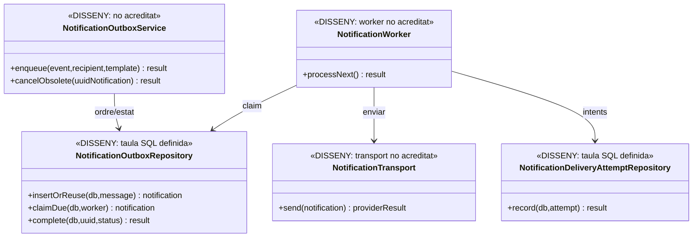
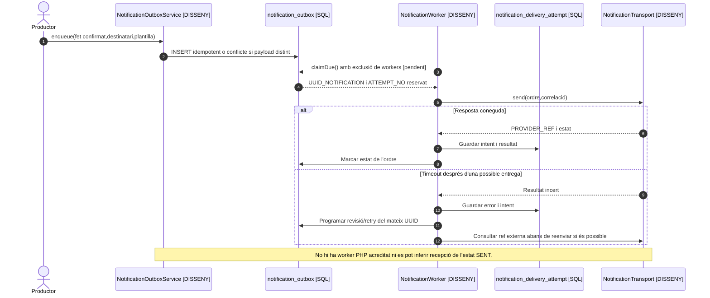

# UC-58 · Gestionar l'outbox de notificacions i els reintents

**Objectiu del catàleg:** missatge persistent, retries, plantilla, destinatari i resultat auditables. **Estat [DISSENY].** UC-43 planifica avisos; UC-49 compon un correu concret; UC-79 decideix una comunicació fiscal; **UC-58 és el mecanisme de lliurament persistent i idempotent**, no un altre emissor de factures o cobrador.

## Evidència de l'esquema

La migració d'auditoria defineix `notification_outbox` amb `UUID_NOTIFICATION`, `IDEMPOTENCY_KEY` **únic**, `TEMPLATE_CODE/VERSION`, `RECIPIENT_TYPE/HASH`, `PAYLOAD_JSON`, `UUID_FACTURA/UUID_PAYMENT` opcionals, `STATUS`, `NEXT_ATTEMPT_AT`, `SENT_AT` i correlació. `notification_delivery_attempt` conserva `ATTEMPT_NO`, `CHANNEL`, `PROVIDER_REF`, resultat i errors, amb unicitat per notificació+número d'intent. **No s'ha acreditat** un repositori/worker PHP SIF que reclami, enviï, reintenti i completi aquestes files; tampoc s'ha acreditat una taula/contracte específic de locks per a aquest outbox. No afirmar que l'enviament està implementat perquè existeix el SQL.

## Fitxa funcional específica

| Etapa | Regla i risc |
| --- | --- |
| Encolar | Comanda només **després de persistir el fet** que justifica el missatge: factura emesa, cobrament real, canvi acadèmic confirmat o avís elegible. Clau idempotent per fet+plantilla/versió+destinatari+finalitat; si una mateixa clau arriba amb `PAYLOAD_JSON` o destinatari diferents, **conflicte**, no reús silenciós. |
| Destinatari | Identitat i permís verificats **abans de serialitzar** dades fiscals al payload. Conservar hash del destinatari no protegeix el contingut de `PAYLOAD_JSON` si s'hi copien NIF, token o dades de tercers. |
| Reclamar | Worker pendent reclama una notificació vencida amb bloqueig/lease i numeració d'intent atòmics, garantint que dos workers no envien alhora el mateix job; `NEXT_ATTEMPT_AT` existeix, però **no s'ha acreditat columna LOCKED_AT ni protocol de claim** a `notification_outbox`. |
| Enviar | Usar plantilla/versionat congelats i canal autoritzat, registrar intent amb `PROVIDER_REF`, inici i final; no guardar credencials ni secret d'enllaç de pagament. `SENT` és resultat del canal segons contracte, **no prova universal de recepció/lectura**. |
| Reintentar | Davant error recuperable, backoff/limitat i **mateix `UUID_NOTIFICATION`**. Davant timeout després d'un possible enviament, conciliar referència del proveïdor o usar idempotència del canal si està disponible abans d'un reenviament. La política de màxims, dead-letter i reclamació de locks és pendent. |
| Cancel·lar | Si el deute ja està pagat, el token ha caducat, el responsable ha canviat o l'avís acadèmic és obsolet, cancel·lar **la notificació pendent**, no la factura o el cobrament original. Preservar els intents ja efectuats. |
| Separacions | Reenviar email no crea `CHARGE/REFUND`, no crea `factura_registres`, no reexecuta UC-01 i no altera `ESTAT_AEAT`. Error de comunicació és UC-81 i reintent de missatge, no segona emissió fiscal. |

### Flux objectiu i proves

1. El productor UC-43/49/79 crea un event d'outbox amb factura/pagament **ja confirmats**, destinatari permès i plantilla/versió. Si productor i outbox són a transaccions/BDs diferents, definir outbox durable o saga idempotent **pendent**, no afirmar atomicitat inexistents.
2. El worker reclama un job elegible en estat pendent/retry, reserva una numeració d'intent única i verifica que l'avís segueix essent aplicable quan depèn de saldo/estat canviant.
3. Crida el transport amb clau/correlació; registra la resposta exacta a `notification_delivery_attempt`. No marcar «llegit» perquè el proveïdor retorna `SENT`.
4. En error, desa causa i reintenta la mateixa notificació segons política, amb control de concurrència i possibles resultats incerts. En cancel·lació, deixa traça i no envia un avís caducat.
5. Provar: dos workers pel mateix UUID, reús de clau amb payload distint, pagament executat abans d'un recordatori, timeout després d'enviament, fallada BD després de transport, URL documental revocada i notificació de grup a alumne no autoritzat.

**Pendents:** worker/claims i locks, idempotència de productor entre BDs, passarel·la d'email, política de retries, cancel·lació d'avis obsolets, proveïdor i traça efectiva d'intents. No s'han executat proves de lliurament.

## UML de casos d'ús

## UML de classes

## UML de seqüència — timeout amb resposta remota incerta

## Traçabilitat

[UC-58 original](../06-fitxes-funcionals/uc-058.md) · [UC-43 recordatoris](uc-043-gestionar-notificacions-recordatoris.md) · [UC-49 correu](uc-049-enviar-factura-document-avis-correu.md) · [UC-79 comunicació fiscal](uc-079-comunicacio-fiscal-auditable.md) · [UC-81 incidències](uc-081-cicle-complet-incidencia.md) · [DDL notification_outbox/delivery_attempt](../../sif/database/migrations/2026_09_15_000003_add_functional_audit_control.sql).
