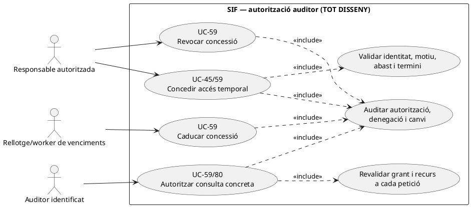
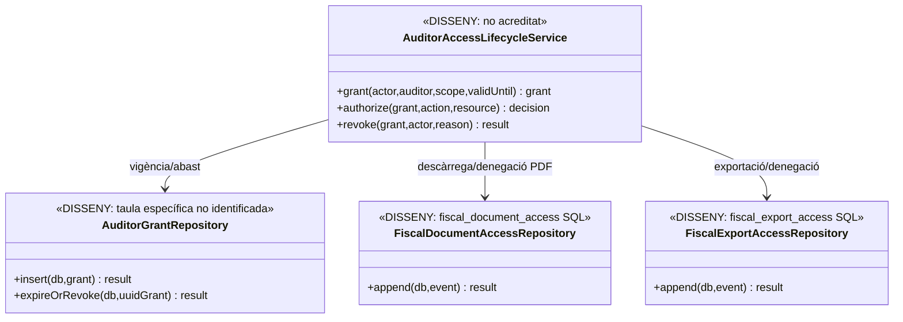
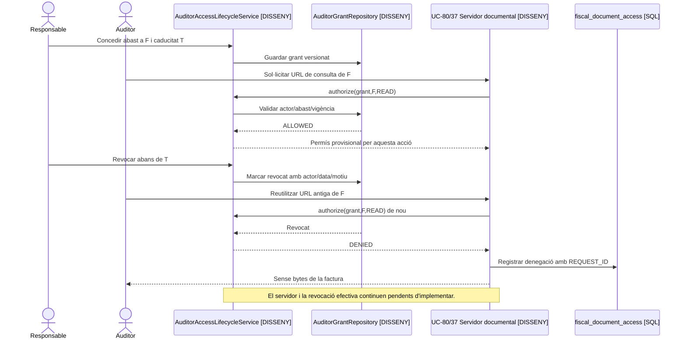
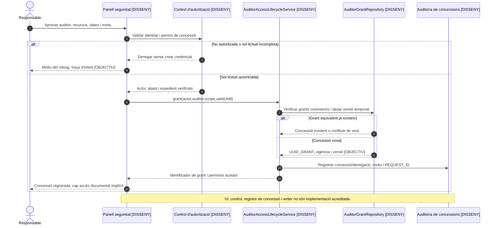
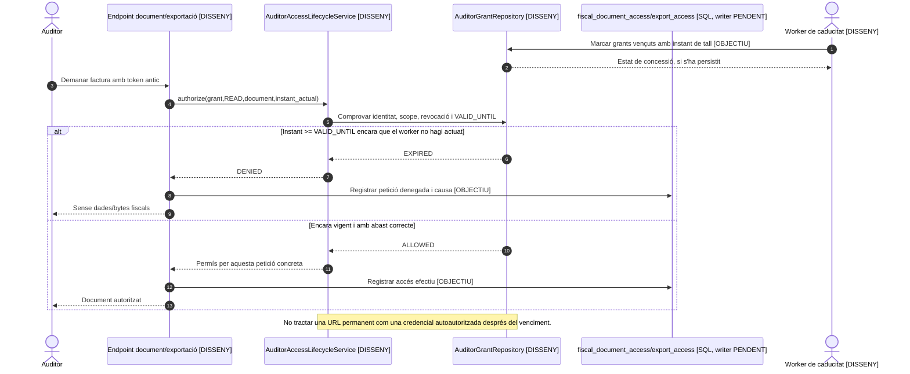
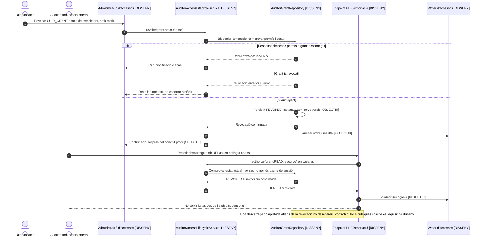

# UC-59 · Concedir, caducar i revocar l'accés d'un auditor

**Objectiu original:** només lectura, abast temporal i registre de consultes/exportacions. **Estat [DISSENY].** UC-45 descriu l'activació inicial d'un auditor; UC-59 cobreix el **cicle complet de l'autorització**, incloent revalidació a cada accés, caducitat, revocació i revisió del que realment s'ha consultat. Una sessió oberta no pot conservar permisos després de la revocació.

## 1. Evidència real i buit de control

Les taules SQL `fiscal_document_access` i `fiscal_export_access` poden registrar intents, denegacions i descàrregues. `sif_audit_event` permet consignar actor, rol, acció, recurs i resultat. **No s'ha identificat** en l'esquema revisat una taula específica de grants temporals d'auditor amb abast i `EXPIRES_AT`, ni un `AuditorAccessService` PHP que atorgui o revoki credencials a `pay.prisma.cat`. L'existència d'`ACTOR_ROLE` en un event no concedeix permís de lectura ni el revoca.

## 2. Fitxa funcional per acció

| Acció | Contracte |
| --- | --- |
| Concedir | Responsable autoritzat comprova identitat i finalitat, fixa recursos/emissor/període/permisos exactes, `VALID_FROM/VALID_UNTIL`, canals i motiu; desar concessió versionada amb actor i correlació. **El model de concessió és proposta**, no taula SQL acreditada. |
| Llegir | Cada accés UC-80 i exportació UC-37/84 ha de comprovar **en servidor** la vigència i l'abast del grant i de l'actor, també si el navegador presenta una URL/token emès anteriorment. El rol de només lectura no permet executar API de cobrament, correcció, enviament o edició. |
| Caducar | A l'instant final aprovat, invalidar futures consultes i tokens; la retirada no elimina el document fiscal ni pot esborrar una exportació ja descarregada. |
| Revocar | Responsable justificat marca revocació anticipada, motiu i instant efectiu; invalidar sessions i accessos existents al següent control, sense esperar a la caducitat nominal. |
| Auditar | Guardar tant accés permès com rebutjat amb `REQUEST_ID`, actor/rol, recurs, abast i motiu tipificat; les taules de traça SQL no acrediten que el controlador hagi registrat totes les descàrregues. |
| Separació | Dret d'auditoria fiscal **no equival** a permís per veure evidències mèdiques de descomptes, dades d'un tercer fora d'abast ni secrets de BD/TPV. Concedir o revocar no mou diners ni modifica factures. |

### Flux principal i controls

1. L'administrador aprova una petició amb identitat verificada, `REQUEST_ID`, motiu i abast mínim; el gestor pendent crea grant amb secret opac, emmagatzemant-ne només hash, i evita credencials compartides.
2. UC-80/37/84 demana autorització en **cada operació**, no només a l'inici de sessió. Registrar la consulta i el resultat a la taula d'accés corresponent; per una denegació, no exposar dades de la factura sol·licitada.
3. Caducitat i revocació modifiquen el grant i invaliden tokens/sessions que en depenen; els fitxers privats no poden tenir una URL pública permanent. Conservar història dels accessos anteriors.
4. Al final de l'auditoria, generar relació de recursos consultats/descàrregues a partir de la traça **realment recollida**; si el writer no existeix, no declarar una auditoria d'accessos completa.
5. Provar: auditor amb abast d'un trimestre vol document d'altre període, dos emissors, URL de PDF anterior a la revocació, consulta concurrent amb caducitat, reintent de descàrrega, atac directe a API de modificació i eliminació d'un grant sense esborrar rastre.

**Pendents:** model de grants, revalidació servidor per ruta, invalidació de sessió, control DB de només lectura, writer d'accessos, política de delegació, prova completa de permisos i retenció de l'historial.

## 3. UML de casos d'ús — cada acció del cicle té un disparador propi

**UC-45** és la fitxa detallada d'activació inicial; **UC-59** agrupa la concessió en el cicle, la comprovació a cada consulta, la caducitat i la revocació. En aquest diagrama, *revocar* no és una extensió obligatòria de *concedir*: és una comanda diferent de la responsable. *Caducar* respon al venciment temporal, sense necessitat d'un clic de revocació.

## 4. UML de classes — autorització no inferible de logs

## 5. UML de seqüència — URL emesa abans de revocar

### 5.1. Acció independent: concedir temporalment un accés — UC-45/59, DISSENY

**Actor i disparador:** responsable autoritzada rep una sol·licitud d'accés amb expedient; l'auditor no pot crear-se el seu propi grant. **Precondicions:** identitat comprovada, permisos d'aprovació al servidor, emissor/període/recursos/accions i durada motivats. **Resultat:** concessió única, versionada, amb traça de l'aprovador, **sense** consulta fiscal ni bytes lliurats en el mateix pas. No hi ha un servei `AuditorAccessLifecycleService` PHP executable ni una taula específica de grants identificada al SQL revisat.

### 5.2. Acció independent: caducar automàticament un grant — UC-59, DISSENY

**Disparador:** s'assoleix `VALID_UNTIL` o una petició arriba després d'aquest límit; el tall d'accés **no pot dependre** que un worker hagi actualitzat a temps la fila de grant. **Postcondició:** les peticions posteriors són denegades a servidor i registrades; un fitxer que l'auditor ja hagi descarregat no es pot recuperar retroactivament.

### 5.3. Acció independent: revocar anticipadament i bloquejar sessió activa — UC-59, DISSENY

**Actor/disparador:** responsable autoritzada revoca un grant encara vigent per motiu justificat. **Postcondicions:** revocació persistida amb versió/instant i actor; ús de token antic denegat a la pròxima comprovació **al servidor**; la denegació no s'ha de basar únicament a ocultar botons del navegador. El cas ja disposa del diagrama 5 sobre URL prèviament emesa; aquesta seqüència concreta la comanda de revocació i la concurrència.

| ID de prova pendent | Escenari | Resultat exigible |
| --- | --- | --- |
| AU-01 | Auditor intenta atorgar-se abast nou o ampliar el període | Rebuig i traça; cap canvi al grant. |
| AU-02 | Comprovació a instant de venciment, sense worker executat | Denegació immediata, independent de l'actualització asíncrona. |
| AU-03 | Sessió i URL prèvies a revocació; petició PDF posterior | Reautorització en servidor i denegació sense bytes. |
| AU-04 | Revocació coincident amb consulta en curs | Regla d'ordenació definida i provada: cap inici de nova lectura després del tall efectiu. |
| AU-05 | Auditor amb emissor/període parcial intenta exportació global | Denegació de l'abast aliè i traça de l'intent; cap fuga per accés directe a API. |
| AU-06 | Concessió/revocació repetides amb el mateix REQUEST_ID | Resultat idempotent o conflicte detectat; no grants duplicats ni pèrdua d'històric. |
## 6. Traçabilitat

[UC-59 original](../06-fitxes-funcionals/uc-059.md) · [UC-45 activació inicial](uc-045-activar-auditor-temporal.md) · [UC-80 accés PDF](uc-080-servir-registrar-acces-document-fiscal.md) · [UC-37 exportació](uc-037-exportar-periode-fiscal.md) · [UC-84 paquet](uc-084-crear-paquet-fiscal-auditoria.md) · [Taules d'accés/auditoria](../../sif/database/migrations/2026_09_15_000003_add_functional_audit_control.sql).
