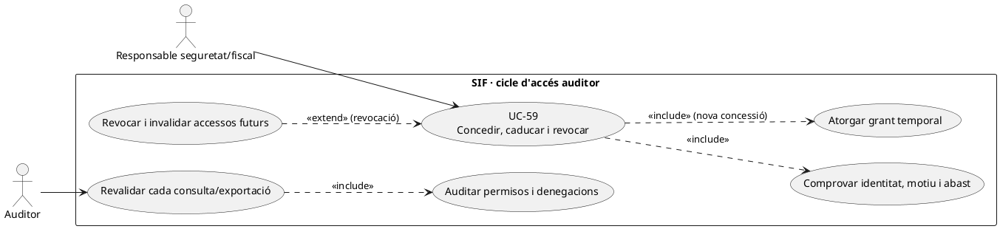
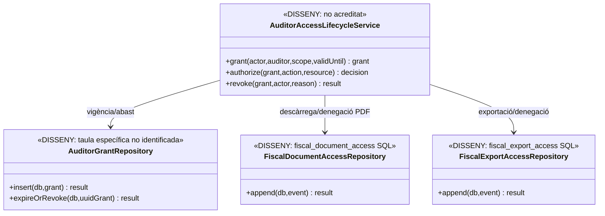
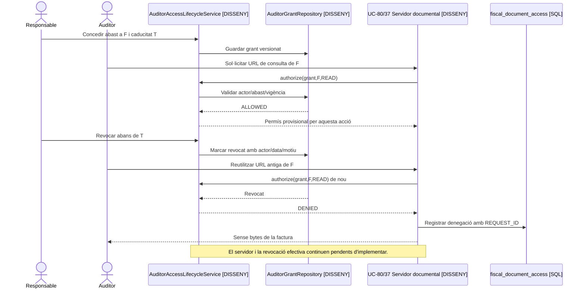

# UC-59 · Concedir, caducar i revocar l'accés d'un auditor

**Objectiu original:** només lectura, abast temporal i registre de consultes/exportacions. **Estat [DISSENY].** UC-45 descriu l'activació inicial d'un auditor; UC-59 cobreix el **cicle complet de l'autorització**, incloent revalidació a cada accés, caducitat, revocació i revisió del que realment s'ha consultat. Una sessió oberta no pot conservar permisos després de la revocació.

## 1. Evidència real i buit de control

Les taules SQL `fiscal_document_access` i `fiscal_export_access` poden registrar intents, denegacions i descàrregues. `sif_audit_event` permet consignar actor, rol, acció, recurs i resultat. **No s'ha identificat** en l'esquema revisat una taula específica de grants temporals d'auditor amb abast i `EXPIRES_AT`, ni un `AuditorAccessService` PHP que atorgui o revoki credencials a `pay.prisma.cat`. L'existència d'`ACTOR_ROLE` en un event no concedeix permís de lectura ni el revoca.

## 2. Fitxa funcional per acció

| Acció | Contracte |
| --- | --- |
| Concedir | Responsable autoritzat comprova identitat i finalitat, fixa recursos/emissor/període/permisos exactes, `VALID_FROM/VALID_UNTIL`, canals i motiu; desar concessió versionada amb actor i correlació. **El model de concessió és proposta**, no taula SQL acreditada. |
| Llegir | Cada accés UC-80 i exportació UC-37/84 ha de comprovar **en servidor** la vigència i l'abast del grant i de l'actor, també si el navegador presenta una URL/token emès anteriorment. El rol de només lectura no permet executar API de cobrament, correcció, enviament o edició. |
| Caducar | A l'instant final aprovat, invalidar futures consultes i tokens; la retirada no elimina el document fiscal ni pot esborrar una exportació ja descarregada. |
| Revocar | Responsable justificat marca revocació anticipada, motiu i instant efectiu; invalidar sessions i accessos existents al següent control, sense esperar a la caducitat nominal. |
| Auditar | Guardar tant accés permès com rebutjat amb `REQUEST_ID`, actor/rol, recurs, abast i motiu tipificat; les taules de traça SQL no acrediten que el controlador hagi registrat totes les descàrregues. |
| Separació | Dret d'auditoria fiscal **no equival** a permís per veure evidències mèdiques de descomptes, dades d'un tercer fora d'abast ni secrets de BD/TPV. Concedir o revocar no mou diners ni modifica factures. |

### Flux principal i controls

1. L'administrador aprova una petició amb identitat verificada, `REQUEST_ID`, motiu i abast mínim; el gestor pendent crea grant amb secret opac, emmagatzemant-ne només hash, i evita credencials compartides.
2. UC-80/37/84 demana autorització en **cada operació**, no només a l'inici de sessió. Registrar la consulta i el resultat a la taula d'accés corresponent; per una denegació, no exposar dades de la factura sol·licitada.
3. Caducitat i revocació modifiquen el grant i invaliden tokens/sessions que en depenen; els fitxers privats no poden tenir una URL pública permanent. Conservar història dels accessos anteriors.
4. Al final de l'auditoria, generar relació de recursos consultats/descàrregues a partir de la traça **realment recollida**; si el writer no existeix, no declarar una auditoria d'accessos completa.
5. Provar: auditor amb abast d'un trimestre vol document d'altre període, dos emissors, URL de PDF anterior a la revocació, consulta concurrent amb caducitat, reintent de descàrrega, atac directe a API de modificació i eliminació d'un grant sense esborrar rastre.

**Pendents:** model de grants, revalidació servidor per ruta, invalidació de sessió, control DB de només lectura, writer d'accessos, política de delegació, prova completa de permisos i retenció de l'historial.

## 3. UML de casos d'ús

## 4. UML de classes — autorització no inferible de logs

## 5. UML de seqüència — URL emesa abans de revocar

## 6. Traçabilitat

[UC-59 original](../06-fitxes-funcionals/uc-059.md) · [UC-45 activació inicial](uc-045-activar-auditor-temporal.md) · [UC-80 accés PDF](uc-080-servir-registrar-acces-document-fiscal.md) · [UC-37 exportació](uc-037-exportar-periode-fiscal.md) · [UC-84 paquet](uc-084-crear-paquet-fiscal-auditoria.md) · [Taules d'accés/auditoria](../../sif/database/migrations/2026_09_15_000003_add_functional_audit_control.sql).
