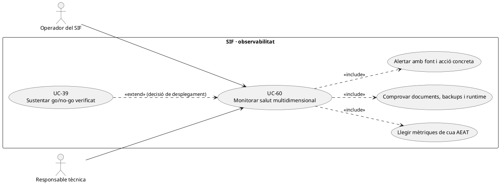
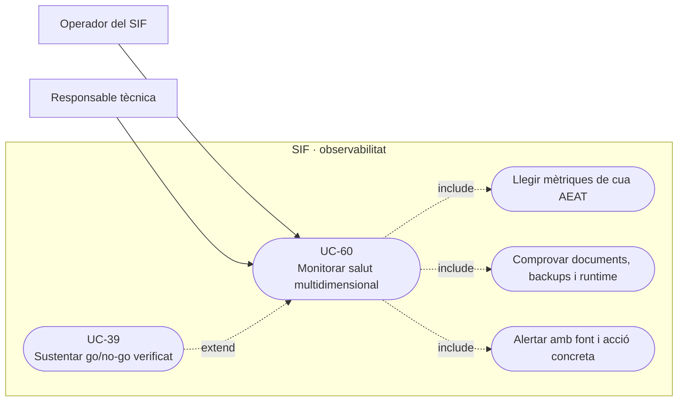
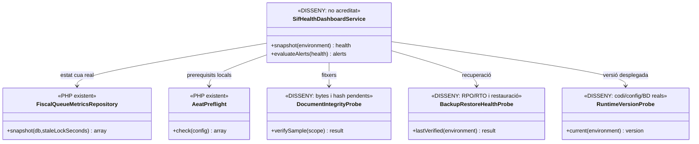
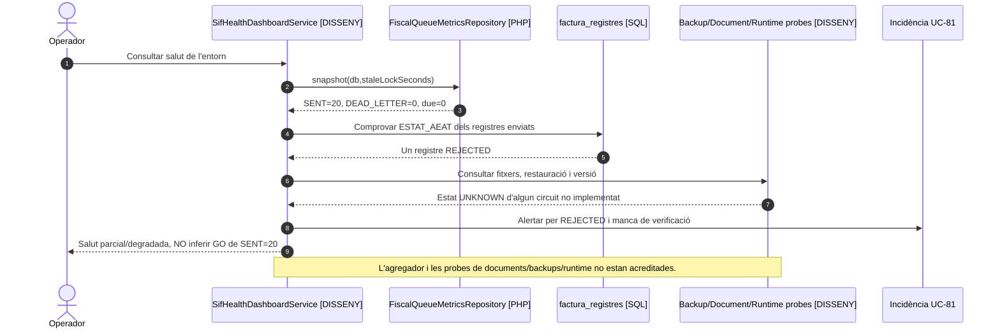

# UC-60 · Monitorar salut, cues, documents, backups i versió activa

**Objectiu original:** panell basat en dades reals, alertes accionables i **cap fals `GO`**. **Estat [DISSENY/PARCIAL].** El SIF té mètriques i un preflight de cua AEAT executables, però no s'ha acreditat un quadre de comandament PHP que verifiqui també documents físics, restauracions, versions/desplegament, diners per inscripció i estat de dependències externes.

## 1. Font contrastada i interpretació dels estats

`FiscalQueueMetricsRepository::snapshot(PDO,staleLockSeconds)` retorna recomptes `PENDING/PROCESSING/RETRY/SENT/DEAD_LETTER`, `due`, `stale_locks` i `oldest_actionable_at`. `preflight-aeat-worker.php` combina `AeatPreflight::check()` amb aquestes mètriques i genera alertes `DEAD_LETTER_THRESHOLD`, `DUE_QUEUE_THRESHOLD` i `STALE_WORKER_LOCK` segons llindars d'entorn. **No comprova que els registres `SENT` estiguin `ACCEPTED`**, ni que hi hagi fitxers de PDF reals, que s'hagi restaurat un backup o que el codi productiu coincideixi amb `sif_version`. `AeatPreflight.ready=true` només acredita prerequisits locals, no resposta de l'AEAT.

`document_job`, `notification_outbox`, `backup_restore_evidence`, `sif_version`, `sif_declaration`, `reconciliation_run/item` i `sif_incident_action` estan **definides a SQL**, però el seu emplenament i els serveis end-to-end d'alguns circuits no s'han acreditat. Un recompte de zero errors en una taula que encara no rep esdeveniments **no és senyal de salut**.

## 2. Fitxa funcional específica

| Dimensió | Mesura i evidència exigides |
| --- | --- |
| Cua fiscal | Comptar jobs pendents/executables, retry, locks antics i dead-letter **amb PHP existent**; separar `STATUS=SENT` de `ESTAT_AEAT=ACCEPTED/ACCEPTED_WITH_ERRORS/REJECTED` i d'una resposta remota incerta. |
| Cua de cobrament | Notificacions Redsys pendents, errors, duplicats, ordres/intent iniciat i idempotència del `UUID_PAYMENT`; un callback en cua no és cobrament confirmat. Cal definir mètriques de cua/worker i reconciliació bancària reals. |
| Documents i comunicacions | Comptar `document_job` i `notification_outbox` quan hi ha writers reals; revisar fitxer/hash físic i prova de canal. `factura_documents.CREATED` o outbox `SENT` per si sols no certifiquen arxiu disponible o destinatari notificat. |
| Backups | Darrer backup amb hash, **última restauració verificada**, resultats d'integritat i RPO/RTO observats; una fila SQL `STATUS=SUCCESS` sense artefacte/manifest no acredita recuperació. |
| Versió i configuració | `sif_version` aparentment activa **versus** hash del codi/config/BD/worker real i declaració associada. La presència d'un número de versió no prova que el runtime hi coincideixi. |
| Incidències i conciliació | Pendents/assignades/dead-letter, items de conciliació amb dades comparables, permisos de l'operador i antiguitat; no declarar `GO` si un circuit essencial és `UNKNOWN/NOT_IMPLEMENTED`. |
| Economia | Monitorar moviment extern real i atribucions per `ID_INSC` quan existeixi el ledger proposat; no multiplicar un `CHARGE` de grup per nombre d'inscripcions. El ledger individual continua **no implementat**. |

### Flux objectiu

1. Recollir cada mesura amb **font, entorn, versió, data de lectura i estat de completitud**: `HEALTHY/DEGRADED/ERROR/UNKNOWN` són categories **de disseny**, no enum SQL identificat. No usar un valor antic en memòria com a dada actual si el lector falla.
2. Obtenir mètriques reals de cua fiscal amb `FiscalQueueMetricsRepository` i errors de `preflight-aeat-worker.php`, conservant el llindar efectiu emprat. Comprovar per separat les respostes/estats AEAT dels registres, sobretot `REJECTED`.
3. Reunir cua Redsys, integritat documental, notificacions, incidències, backup restaurat i versió/runtime mitjançant adaptadors/consultes **pendents**; els models SQL disponibles no garanteixen que aquestes dades s'actualitzin.
4. Classificar alertes per responsable i acció: dead-letter→UC-77/81; fitxer absent→UC-78; divergència banc/SIF→UC-82; backup sense restauració→UC-85; versió inconsistent→UC-83. Una alerta no crea automàticament `CHARGE`, corrector fiscal o reintent remot.
5. Fer que el go/no-go UC-39 exigeixi comprovacions d'integritat/funcionalitat i evidència per **l'entorn objectiu**; un dashboard «verd» basat en preflight local o taules buides no autoritza producció.
6. Provar: cua `SENT` amb registre `REJECTED`, `document_job` buit però PDF absent, backup recent però restauració fallida, dos `sif_version.STATUS=ACTIVE`, worker bloquejat, DB llegada inaccessible, notificació enviada però entrega incerta, i mateixa factura d'empresa amb tres participants.

**Pendents:** adaptadors de cada mètrica, llindars i alertes aprovats, agregació amb timestamps, autenticació de panell, disponibilitat de fitxers privats i comprovació de codi desplegat, tests d'alerta i absència de falsos `GO`.

### 2.1. Quatre divergències que el comptador de cua no detecta

**Abast exacte de la mètrica disponible.** `FiscalQueueMetricsRepository::snapshot()` agrupa `fiscal_queue` per `STATUS`, compta jobs executables amb `PENDING/RETRY` i `NEXT_RETRY_AT`, identifica locks `PROCESSING` antics i obté el primer instant accionable. `preflight-aeat-worker.php` transforma aquests comptadors en alertes segons llindars d'entorn. **No consulta en aquesta instantània la resposta individual de `factura_registres.ESTAT_AEAT`**, el sistema de fitxers del PDF, el resultat físic d'una restauració, ni el codi de versió realment servit. La fitxa del dashboard ha de publicar **per separat** què és «mètrica executable avui» i què és «lector/contracte pendent»; no sintetitzar un únic semàfor verd a partir del comptador de cua.

**Cas 1 — la cua s'ha buidat però hi ha un rebuig extern.** Un registre pot acabar amb `fiscal_queue.STATUS=SENT` i `factura_registres.ESTAT_AEAT=REJECTED`. Mostrar el job transportat, el registre rebutjat, resposta concreta i incidència UC-09/35/81; una suma de `due=0` **no** prova que el període fiscal estigui regularitzat. Un `ACCEPTED_WITH_ERRORS` tampoc es pot agrupar sense detall dins d'`ACCEPTED`.

**Cas 2 — el document té metadades però no és descarregable.** `DocumentRepository::registerDocument()` desa `HASH_FITXER` i `PATH_FITXER` sense escriure'n els bytes. Comptar `factura_documents.ESTAT=CREATED` o `document_job` buit **no acredita** la presència física del document. La mètrica de disponibilitat exigeix comprovar storage privat, versió i hash de bytes d'una mostra definida o dels documents afectats, informar del denominador real i obrir UC-78/80 quan falla.

**Cas 3 — el backup existeix però no s'ha provat recuperar-lo.** Una data o hash de backup sense restauració aïllada, integritat de BD/fitxers i reconciliació del delta Redsys/AEAT no acredita RPO/RTO ni permet obrir workers. El panell ha d'indicar **últim backup acreditat** i **última restauració comprovada** com a dues dates/estats independents; la font `backup_restore_evidence` prevista no demostra per si sola un runner executat (UC-85).

**Cas 4 — hi ha versió ACTIVE a SQL però el runtime és un altre.** `sif_version.STATUS=ACTIVE` és una afirmació del registre, no una mesura dels bytes PHP, migracions, configuració efectiva, worker i declaració corresponent. Abans d'un «GO», comparar versió declarada i codi efectiu **a cada procés que pot emetre, cobrar o transmetre** amb UC-83/101. Quan una font no està integrada o falla, mostrar `UNKNOWN / no comprovat` com a classificació funcional, no zero incidències.

### 2.2. Proves de senyal falsament favorable (no executades)

| ID | Escenari | Resultat exigible |
| --- | --- | --- |
| SL-60-01 | `due=0`, jobs SENT i una resposta AEAT REJECTED | Registrar alertes separades; cap estat global «AEAT acceptat». |
| SL-60-02 | `factura_documents` indica CREATED però falta el fitxer | Disponibilitat negativa i incidència documental, no comptar-lo com a PDF descarregable. |
| SL-60-03 | Backup recent amb fallada a l'última restauració | Salut de recuperació degradada/desconeguda, sense GO per data recent. |
| SL-60-04 | Versió SQL ACTIVE diferent del worker que processa Redsys | Bloquejar declaració d'estat homogeni i iniciar investigació del desplegament. |
| SL-60-05 | `notification_outbox` és buida perquè el writer encara no està connectat | No mostrar «tots els correus lliurats»; font/circuit no acreditats. |
| SL-60-06 | Tres alumnes vinculats al mateix CHARGE de grup | Import extern únic; no triplicar ingressos en el resum del dashboard. |

## 3. UML de casos d'ús

### Vista de casos d’ús per a GitHub (Mermaid)

## 4. UML de classes — mètrica real i agregador pendent

## 5. UML de seqüència — cua enviada però AEAT rebutja (DISSENY/PARCIAL)

## 6. Traçabilitat

[UC-60 original](../06-fitxes-funcionals/uc-060.md) · [UC-77 AEAT](uc-077-operar-enviament-aeat-retry-dead-letter.md) · [UC-78 documents](uc-078-generar-custodiar-pdf-qr-xml.md) · [UC-85 restauració](uc-085-backup-restauracio-reconciliacio.md) · [UC-83 versió](uc-083-registrar-activar-versio-declaracio.md) · [UC-39 gate](uc-039-proves-gate-go-no-go.md) · [FiscalQueueMetricsRepository](../../sif/src/Repository/FiscalQueueMetricsRepository.php) · [preflight-aeat-worker.php](../../sif/scripts/preflight-aeat-worker.php) · [Esquema d'observabilitat](../../sif/database/migrations/2026_09_15_000003_add_functional_audit_control.sql).
