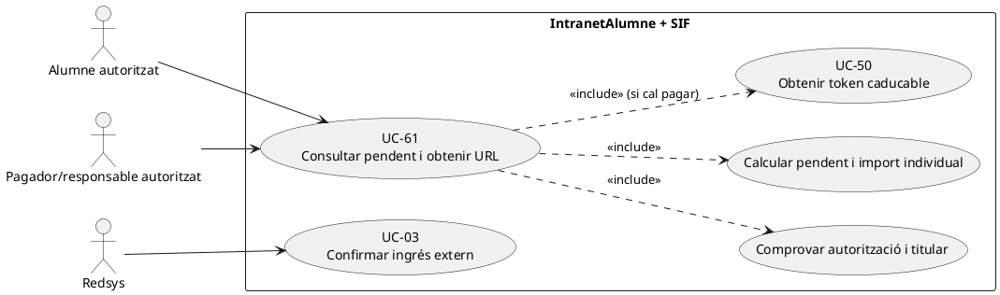
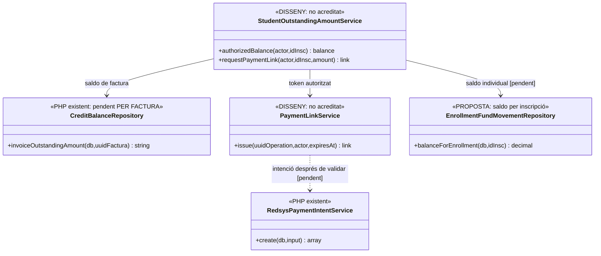

# UC-61 · Consultar l'import pendent i obtenir un enllaç de pagament

**Objectiu canònic:** `IntranetAlumne` mostra l'import pendent i `pay.prisma.cat` ha de crear un **token segur i caducable** amb una intenció de pagament coherent. L'accés de l'alumne **no equival** a permís sobre qualsevol factura o pagament que contingui el mateix `IDPAG` o correu electrònic. En un grup o factura d'empresa, cal distingir el deute del **receptor/pagador** i el valor atribuït a cada inscripció.

## 1. Estat contrastat

`CreditBalanceRepository::invoiceOutstandingAmount()` és codi PHP que calcula un pendent **per factura**: `max(0,TOTAL - SUM(CHARGE,COMPENSATION) + SUM(REFUND))` a través de `payment_allocation` i `payment_transaction`; usa cèntims després de llegir quantitats i no identifica **saldo individual per `ID_INSC`** ni pagador. El càlcul està utilitzat per l'aplicació de crèdit, no és un endpoint d'`IntranetAlumne` acreditat.

`RedsysPaymentIntentService::create()` crea/reutilitza una intenció `PENDING` amb `DS_ORDER`, import, divisa, terminal i snapshot; la migració defineix `payment_link`, però **no s'ha acreditat** un servei PHP d'enllaços, la lectura/autorització d'alumnat ni el lligam end-to-end entre `IntranetAlumne`, `payment_link` i Redsys. `PaymentPayloadValidator` exigeix almenys una `allocation` a factura: un ingrés que cal atribuir a N inscrits no es pot convertir automàticament en N cobraments.

## 2. Fitxa funcional específica

| Element | Contracte |
| --- | --- |
| Actors | Alumne autenticat, pagador autoritzat o responsable d'empresa/grup, SIF, Redsys; rol d'alumne **no** s'ha d'equiparar al rol administratiu de la intranet. |
| Identificació | `ID_INSC`, producte/edició, `UUID_OPERATION`, `UUID_FACTURA` i `UUID_PAYMENT` quan existeixen, persona legitimada i la seva relació amb pagador/receptor. |
| Pendent fiscal | Per factura, saldo de `TOTAL` menys assignacions de cobraments/compensacions i amb retorns aplicables; cal reconciliar moviments en tràmit, imports excedents i restriccions de factures rectificades. El mètode de `CreditBalanceRepository` és **una base de càlcul existent**, no un contracte complet de pantalla. |
| Pendent d'inscripció | Si una factura cobreix N participants, `fact_rels` els vincula però no diu quin import pagat/pendent correspon a cadascun. Cal **ledger quantitatiu proposat** i regla de titularitat abans de publicar «has de pagar X» per `ID_INSC`. |
| URL | `payment_link` definida a SQL amb `TOKEN_HASH`, `PAYER_PARTY_KEY`, import, venciment i estat. UC-50 ha de verificar secret/titular/estat **al servidor**, revalidar saldo al clic i només després UC-63 iniciar una intenció TPV. |
| Efecte fiscal/econòmic | Consultar i generar URL no emet factura ni registra un `CHARGE`. Si es tracta de factura abans de cobrar, el número fiscal **ja existeix**; l'ingrés posterior s'assigna a aquella factura, no n'emet una altra. |

### Flux objectiu

1. L'alumne/pagador s'autentica pel canal que li correspongui. El SIF valida **l'autorització per a la inscripció i per al deute**, no només que el navegador aporta `IDPAG`, `NIF` o `UUID_FACTURA`.
2. Es consulten factura/es, `payment_allocation` i transaccions reals, eventual crèdit aplicat i pagaments Redsys en curs. Per un grup, es presenta únicament la informació individual o de responsable **autoritzada**, separant deute de factura i quota atribuïda a l'inscrit.
3. La pantalla mostra import pendent i venciment amb timestamp/versió, sense suposar que el deute fiscal és la variable llegada `A_PAGAR`. Si hi ha una intenció activa, evitar mostrar un segon botó que provoqui doble captura sense conciliació.
4. En demanar pagar, el gestor UC-50 **pendent** crea/reutilitza enllaç lligat a `UUID_OPERATION`, titular i import del **deute actual**; defineix caducitat i comunica token opac. Cap secret en logs o URLs reutilitzables públicament sense protecció.
5. En obrir la URL, tornar a comprovar estat/venciment/autorització i import actual abans d'UC-63; si ha canviat el saldo, desactivar o substituir la URL i demanar nova acceptació, no cobrar el total antic.
6. El callback UC-03 verifica intenció i el worker registra l'**únic ingrés bancari real** sobre factura existent; l'orquestració individual proposada atribueix exactament el tram a `ID_INSC`.
7. L'alumne torna a consultar l'estat **real** del seu saldo. No marcar «pagat» per una intenció `PENDING` o URL visitada; si SIF i llegat divergeixen, deixar incidència UC-53.

### Alternatives i proves específiques

| Cas | Control |
| --- | --- |
| Factura d'empresa de 300 € per tres inscrits, alumne consulta la seva matrícula | Sense dret explícit a pagar/veure tota la factura d'empresa; quota individual i qui paga s'han de validar, no dividir 300 € automàticament entre tres. |
| Factura de 100 € amb 60 € ja registrats | Consultar 40 € de pendent **si no hi ha altres afectacions**; una URL antiga de 100 € no autoritza recaptar 100 € de nou. |
| Pagament iniciat a Redsys però callback pendent | Mostra estat en tràmit i reús de l'operació, no un segon `DS_ORDER` sense control. |
| Accés a URL revocada/caducada | UC-33/50 bloqueja noves captures, però no altera factura ni ignora un eventual callback tardà d'intenció anterior. |
| Factura emesa abans del pagament | UC-04/21: el cobrament posterior és UC-02/24, **no** UC-01 d'emissió nova. |
| Pagador d'un regal consulta el deute de la inscripció bescanviada | No duplicar l'ingrés de regal ni transformar una aplicació de valor prepagat en nou cobrament extern. |

**Pendents:** autorització alumne/pagador, ledger individual, cerca de factures relacionades, estat de TPV en curs, API d'URL segura, idempotència de saldo parcial i proves de privacitat en grup/empresa.

### 2.1. Consulta de participant cobert per factura d'empresa — xat original

Quan l'entitat o responsable ja ha assumit el pagament de la inscripció mitjançant una factura abans de cobrar, el participant pot continuar consultant **la seva matrícula i l'estat de cobertura que li correspongui**, però no s'ha de mostrar com a **deute personal pagable** el pendent de la factura d'empresa ni oferir un enllaç TPV individual que pugui generar una segona factura/cobrament. El xat demana un missatge que expliqui que l'import el pagarà l'entitat corresponent. Evitar mostrar el CIF, els altres participants o la factura conjunta al rol d'alumne; només el receptor/responsable autoritzat pot consultar aquest document complet (UC-07/21).

Si el responsable encara no ha pagat, la pantalla pot mostrar **«pagament de l'entitat pendent»** en lloc de «inscripció pagada»; la cobertura del pagador i la confirmació bancària són fets diferents. Si la factura de l'entitat es paga parcialment, no atribuir automàticament el cobrament total a tots els participants ni activar la possibilitat de pagament individual per completar el deute global. Si la inscripció deixa de quedar coberta després d'un canvi/baixa, la recuperació d'una via de pagament requereix decisió de gestió, una obligació vàlida i UC-50 amb import i token nous; no reactivar la URL antiga automàticament.

**Proves addicionals no executades:** matrícula coberta per empresa amb factura PENDING no mostra TPV individual; factura d'empresa PAID mostra cobertura confirmada i no el PDF global a l'alumne; factura d'empresa PARTIAL no reparteix sense criteri l'import entre inscrits; URL individual revocada presenta missatge autoritzat i no inicia DS_ORDER; retirada del participant no reactiva cap URL obsoleta.
## 3. UML de casos d'ús



## 4. UML de classes — càlcul existent i portal pendent



## 5. UML de seqüència — factura amb cobrament parcial (OBJECTIU)

```mermaid
sequenceDiagram
autonumber
actor A as Alumne/pagador autoritzat
participant UI as IntranetAlumne [integració pendent]
participant S as StudentOutstandingAmountService [DISSENY]
participant DB as Factura i payment_allocation [SQL]
participant L as Ledger per inscripció [PROPOSTA]
participant Link as PaymentLinkService [DISSENY]
participant I as RedsysPaymentIntentService [PHP]
participant W as Redsys callback/worker UC-03
A->>UI: Consultar inscripció i deute
UI->>S: authorizedBalance(actor,ID_INSC)
S->>DB: Consultar factura, CHARGE/COMPENSATION/REFUND
S->>L: Determinar tram individual i titularitat
S-->>UI: Pendent acreditat, estat de TPV i autorització
A->>UI: Sol·licitar pagar pendent
UI->>Link: issue(UUID_OPERATION,actor,venciment)
Link->>DB: Revalidar saldo i estat de l'operació
alt Sense deute o sense autorització
 Link-->>UI: Denegació / NO_CHANGE
else Pendent coherent
 Link-->>A: Token opac, caducable i import actual
 A->>Link: Obrir token i confirmar import
 Link->>I: create(DS_ORDER,snapshot,import pendent)
 I-->>A: Intenció PENDING
 W-->>S: Ingrés real confirmat o incidència
end
Note over S,W: Mostrar saldo no equival a cobrar, no crear segon CHARGE per inscripció
```

## 6. Traçabilitat

[UC-61 original](../06-fitxes-funcionals/uc-061.md) · [UC-50 URL](uc-050-cicle-enllac-pagament.md) · [UC-33 revocació](uc-033-desactivar-url-pagament.md) · [UC-56 assignació](uc-056-cercar-assignar-cobrament.md) · [UC-03 Redsys](uc-003-processar-cobrament-redsys-asincron.md) · [UC-104 excedent](uc-104-gestionar-exces-cobrament.md) · [CreditBalanceRepository](../../sif/src/Repository/CreditBalanceRepository.php) · [PaymentPayloadValidator](../../sif/src/Service/PaymentPayloadValidator.php) · [Esquema payment_link](../../sif/database/migrations/2026_09_16_000004_add_commercial_operation_and_fiscal_fields.sql) · [Traça individual](00-revisio-moviments-inscripcions.md).
