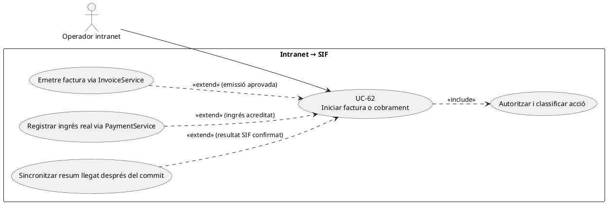
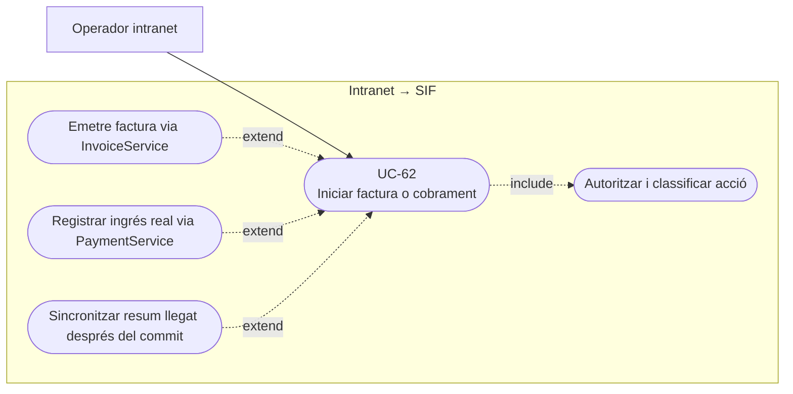
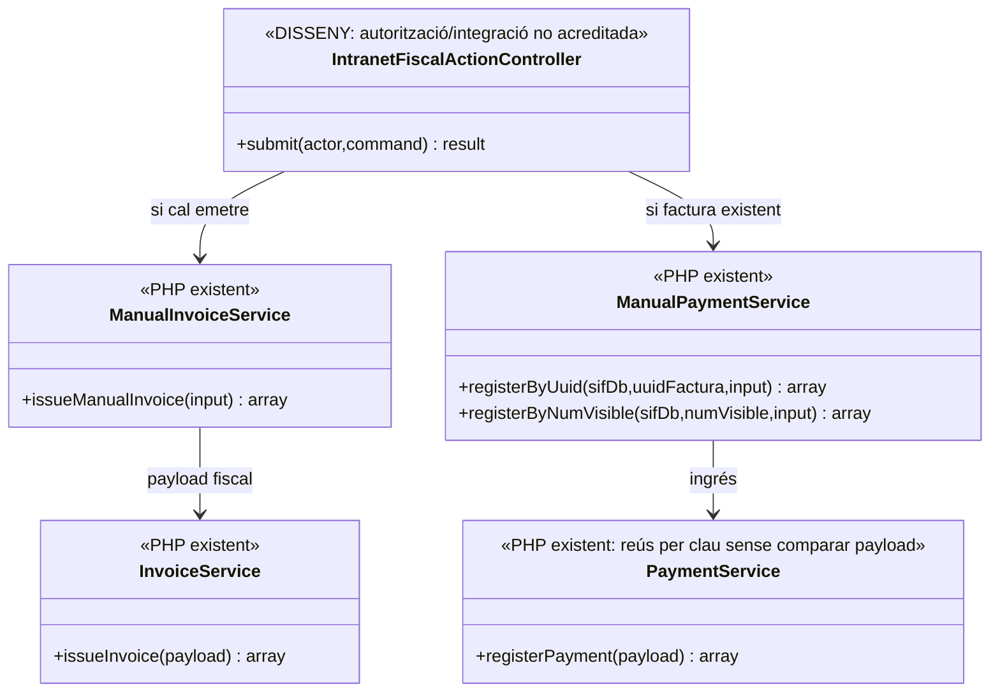
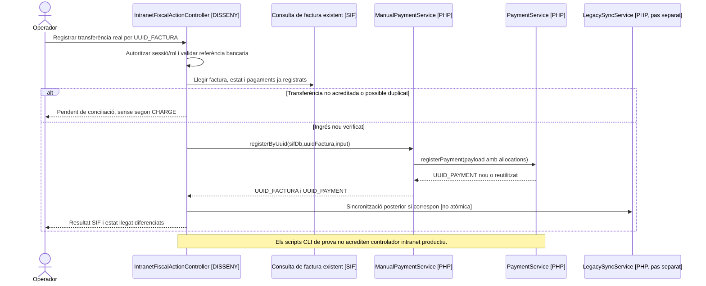

# UC-62 · Iniciar una factura o un cobrament des de la intranet

**Objectiu original:** l'adaptador de la intranet ha d'enviar una ordre autenticada a `InvoiceService` o `PaymentService`; no hi pot haver una segona via d'escriptura fiscal. **Estat [LEGACY/DISSENY] del canal:** el nucli PHP existeix, però no s'ha acreditat un controlador integrat i autoritzat de la intranet productiva.

## 1. Evidència executable i límits

`ManualInvoiceService::issueManualInvoice()` transforma dades amb `ManualInvoicePayloadBuilder` i crida `InvoiceService::issueInvoice()`. El builder marca `source_channel=INTRANET`, `source_type=MANUAL`, requereix usuari intern i prepara opcionalment un bloc `payment`. **Que el payload digui INTRANET no acredita que la petició provingui d'una sessió autenticada de la intranet.**

`ManualPaymentService::registerByUuid()/registerByNumVisible()` localitza factura existent i registra un `CHARGE` mitjançant `ManualPaymentPayloadBuilder` i `PaymentService`; no emet un nou registre fiscal en aquesta funció. `process-manual-invoice.php`, `process-manual-course.php` i `process-manual-payment.php` són scripts **CLI que rebutgen `SIF_ENV=production`**; no constitueixen endpoints web productius. `sif/public/api/payments/register.php` exposa `PaymentService::registerPayment()` a partir de JSON i, en el codi consultat, **no s'hi identifica cap comprovació de sessió/rol de la intranet**: no equiparar disponibilitat d'API amb autorització.

## 2. Regles específiques

| Decisió de l'operador | Comanda i invariant |
| --- | --- |
| Emetre abans de cobrar | UC-04/69 confirma receptor, import, inscripcions i línies; el payload inicial **sense `payment`** crea factura i cua fiscal, amb cobrament pendent. No registrar `CHARGE` anticipat. |
| Emetre amb ingrés ja acreditat | `ManualInvoiceService` pot rebre bloc `payment`; només incloure'l quan s'ha contrastat la referència/valor real del moviment i que no existeix un `UUID_PAYMENT` previ. No inventar ingrés perquè el formulari té `PAGAMENT=1`. |
| Registrar ingrés d'una factura existent | `ManualPaymentService` reutilitza `UUID_FACTURA` i no crida `issueInvoice()`; mostrar pendent i comprovar quantia i titular del pagament real abans de confirmar. |
| Idempotència | La clau de factura i la de cobrament són diferents. `PaymentService` retorna un pagament existent per clau **sense comparar-ne el payload nou**; una nova clau per la mateixa transferència pot crear segon `CHARGE`. Cal comparar proveïdor/referència/import/data i respondre conflicte si és contradictori. |
| Autorització i auditoria | El servidor valida sessió, rol, `ID_INSC` o entitat i capacitat d'emetre o cobrar. `PaymentActionGateway` pot escriure events per accions que **hi passen**, però la ruta `public/api/payments/register.php` revisada instancia `PaymentService` directament: no afirmar traça del gateway universal. |
| Grup/pack | Una factura pot contenir múltiples participants i un cobrament extern únic; `fact_rels` i `payment_allocation` no acrediten import atribuït a cadascun. No duplicar `CHARGE` per alumne. |

### Flux objectiu

1. L'operador obre una inscripció o factura en la intranet; el **gateway pendent** comprova usuari i permís, consulta dades vigents i identifica si ja existeix factura/pagament per aquell fet.
2. Previsualitza **acció única** (emetre, emetre abans de cobrar o registrar cobrament d'una factura existent), receptor, imports per línia i evidència bancària; si hi ha divergència, pendent UC-82.
3. Construir ordre amb `REQUEST_ID`, origen verificat, `IDEMPOTENCY_KEY` i snapshot congelat; rebutjar clau reutilitzada amb contingut diferent.
4. Executar servei SIF una vegada, conservar `UUID_FACTURA` i `UUID_PAYMENT` si realment existeixen. La sincronització al llegat és **posterior i no atòmica** amb la transacció SIF.
5. Rellegir resultat i mostrar separadament estat fiscal, monetari, documental i acadèmic. Si només falla el resum llegat, **no repetir emissió/cobrament**.

**Proves:** usuari sense permís que crida API directament; factura pendent pagada en dos trams; grup de tres persones amb un sol ingrés; clau idempotent repetida amb import diferent; `SIF_ENV=production` en script CLI; error de sync llegat després de commit SIF.

### Punt de tall entre els AJAX antics i la comanda SIF autoritzada

**Dues pantalles, dues operacions diferents.** `/alumnes/genera-factura-abans-pagar/` obté inscripcions, receptor i concepte i crida `generaFacturaElectronica_Factures.php`, que al llegat crea una **factura real sense cobrament**. `/alumnes/pagaments/` cerca per `buscarInfomacioPagament.php` i, després del modal `mostrarModalConfPag.php` quan escaigui, crida `efectuarPagament.php` amb identificador, tipus, import, data, banc, observacions, número de factura i indicador `efact`. El primer circuit correspon a UC-04 i el segon a UC-02 **si existeix factura SIF**, no a un `issueInvoice()` universal per cada petició.

**Frontera d'autorització i dades.** A les pantalles antigues, `tePermisEdicio` i imports/dates es comproven en JS; el pagament es recalcula visualment des de l'HTML i la factura prèvia calcula `preuTotal` del DOM. El futur adaptador ha de **validar de nou al servidor** sessió/rol, entitat o `ID_INSC`, origen bancari i quantia, curs/edició, factura ja existent i receptor fiscal. El nom `source_channel=INTRANET` en un builder PHP o la ruta genèrica `public/api/payments/register.php` **no acredita autenticació ni autorització de l'usuari de la intranet**.

**Resultat recuperable i sincronització.** Si es confirma `issueInvoice()` però falla PDF, email o resum `web.inscripcions`, respondre amb `UUID_FACTURA` i fase pendent, mai crear una factura local alternativa. Si es confirma `registerPayment()` però falla `updPayInscr` o l'actualització acadèmica, recuperar `UUID_PAYMENT` i reprendre UC-47/53. El pas de «Passar pagaments» pot tocar inscripció individual, grup, pack o regal, però N línies operatives no justifiquen N `CHARGE` si només hi ha una transferència real.

**Reutilització i contradicció.** Un reintent de doble clic amb la **mateixa operació i payload** ha de recuperar identificadors, mentre que mateixa clau amb receptor/import/assignacions canviats és conflicte. Ni `PaymentService` ni `InvoiceService` acrediten comparació semàntica completa en la seva branca de reús; la comprovació transversal és part de l'adaptador pendent. `E_FACT` és un indicador administratiu diferent de l'emissió abans de cobrar.

### Proves d'entrada intranet (no executades)

| ID | Escenari | Resultat exigible |
| --- | --- | --- |
| IN-62-01 | Invocar `efectuarPagament.php` sense permís de la pantalla | Denegar al servidor; no registrar cap moviment. |
| IN-62-02 | Factura prèvia d'empresa seguida de transferència | Una factura i un cobrament posterior amb UUIDs diferents, cap duplicat fiscal. |
| IN-62-03 | Manipular al DOM `preuTotal` o `PAGAMENT` | Recalcular/validar al backend amb prova econòmica real. |
| IN-62-04 | SIF confirma però falla sync llegat | Recuperar UUID i reintentar només fase de sincronització. |
| IN-62-05 | Grup amb tres inscripcions pagat amb una única transferència | Un `UUID_PAYMENT` i atribucions internes reals, no tres ingressos ficticis. |
| IN-62-06 | Reús de clau amb import o receptor incompatible | Conflicte de payload, no èxit silenciós. |

## UML de casos d'ús

### Vista de casos d’ús per a GitHub (Mermaid)

## UML de classes

## UML de seqüència — factura ja emesa, transferència posterior

## Traçabilitat

[UC-62 original](../06-fitxes-funcionals/uc-062.md) · [UC-04 factura pendent](uc-004-emetre-factura-abans-cobrar.md) · [UC-86 auditar pagament](uc-086-auditar-accio-pagament.md) · [UC-82 conciliació](uc-082-reconciliar-sif-bd-llegada.md) · [ManualInvoiceService](../../sif/src/Service/ManualInvoiceService.php) · [ManualPaymentService](../../sif/src/Service/ManualPaymentService.php) · [PaymentService](../../sif/src/Service/PaymentService.php) · [Ruta pública de pagament](../../sif/public/api/payments/register.php) · [Script CLI manual](../../sif/scripts/process-manual-payment.php).
