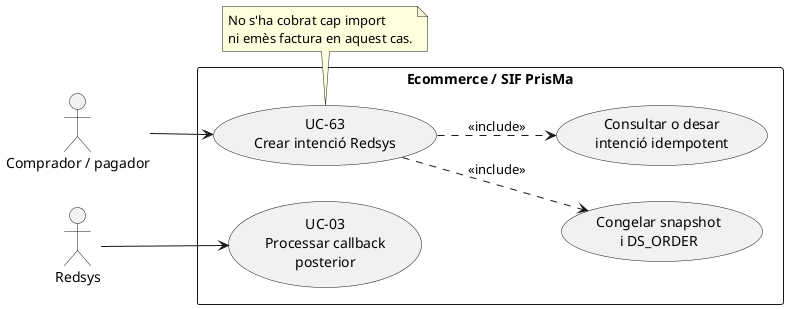
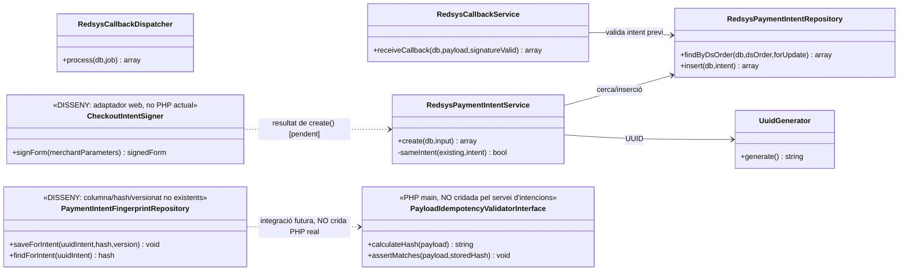
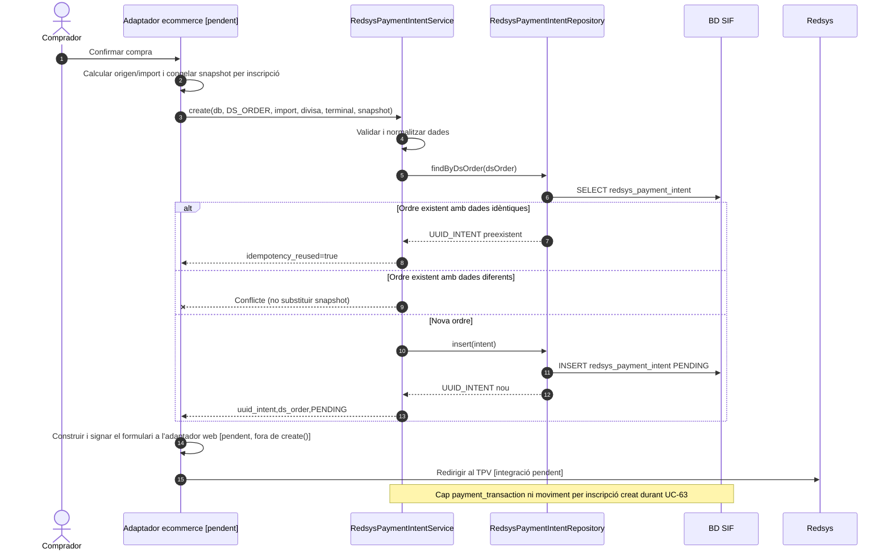

# UC-63 · Crear intenció Redsys des de l'ecommerce — fitxa i UML integrats

**Objectiu:** congelar i identificar l'operació **abans** de redirigir el pagador a Redsys. **No és un cobrament confirmat ni una factura emesa.** Relacions: UC-03 (callback/worker), UC-14/15/16/17/19a (origen de compra), UC-01/02 (factura i moviment posteriors), UC-51 (callbacks anòmals).

**Estat del codi:** `RedsysPaymentIntentService` i `RedsysPaymentIntentRepository` existeixen; la migració defineix `redsys_payment_intent`; la integració de l'ecommerce que genera el `DS_ORDER` i el snapshot correctes per tots els canals **no s'acredita** per aquests serveis. Una intenció no acredita ni resposta autoritzada de Redsys ni cobrament per inscripció.

## 1. Fitxa del cas

| Element | Contracte verificat |
| --- | --- |
| Actors | Comprador/pagador via ecommerce; adaptador web servidor (pendent de verificar); Redsys només participa en el pas posterior de redirecció/callback. |
| Precondicions | Identificar producte, import previst, participants/titular, descompte, divisa, terminal i origen abans d'entrar al TPV. |
| Camps exigits pel servei | `ds_order` no buit (fins a 40 caràcters), `source_type` de `CURS`, `PACK`, `GRUP`, `REGAL` o `USOC_ALUMNE`, `source_id` no buit (fins a 64), `expected_amount > 0`, divisa de 3 caràcters, `terminal` no buit (fins a 20) i `snapshot` array no buit serialitzable. |
| Dades addicionals | `idpag` numèric positiu quan es proporciona; `created_by`, `expires_at`; per `REGAL`, `source_id` ha de ser numèric. |
| Persistència | `redsys_payment_intent`: UUID, `DS_ORDER`, `SOURCE_TYPE`, `SOURCE_ID`, import/divisa/terminal previstos, `SNAPSHOT_JSON`, estat `PENDING` i dades addicionals. |
| Resultat | `uuid_intent`, `ds_order`, `status`, `idempotency_reused`. Cap `UUID_PAYMENT` ni `UUID_FACTURA` en aquesta fase. |

### 1.1. Flux principal

1. El comprador confirma la compra. L'adaptador servidor ha de determinar `DS_ORDER` i congelar el snapshot de producte, participants, import, descomptes, receptor i procedència que utilitzarà el worker. **Aquesta preparació no es pot atribuir al servei PHP simplement perquè accepti un array `snapshot`.**
2. `RedsysPaymentIntentService::create(db,input)` valida estructura/camps, normalitza import a dues decimals i serialitza el snapshot.
3. `RedsysPaymentIntentRepository::findByDsOrder()` cerca una intenció existent. Si existeix, `sameIntent()` compara IDPAG, origen, import, divisa, terminal, snapshot canonicalitzat, autor i caducitat.
4. Si coincideix tot, retorna el mateix UUID amb `idempotency_reused=true`. Si `DS_ORDER` ja existeix amb dades diferents, retorna conflicte; **no sobrescriu el snapshot antic**.
5. Si és una intenció nova, `RedsysPaymentIntentRepository::insert()` desa la fotografia i l'estat `PENDING`.
6. L'adaptador web inicia la redirecció a Redsys amb les dades adequades. **La signatura del formulari de sortida i la seva integració concreta s'han de verificar al canal; `create()` no envia cap cobrament a Redsys.**
7. Quan arriba notificació signada, UC-03 la correlaciona amb `DS_ORDER`, valida import/divisa/terminal i, si està autoritzada, encua el processament del snapshot. La factura i el cobrament neixen **més tard**, no durant UC-63.

### 1.2. Alternatives, errors i diners per inscripció

| Cas | Resultat |
| --- | --- |
| Duplicat exacte de `DS_ORDER` | Recupera la mateixa intenció; no crea una segona fotografia econòmica. |
| Ordre igual amb import/producte/snapshot diferent | Conflicte; cal revisió, no substituir silenciosament la intenció. |
| Import zero o negatiu, terminal absent o snapshot buit | Rebuig per validació. |
| `source_type=REGAL` i `source_id` no numèric | Rebuig de la intenció. |
| El client abandona el TPV | Pot quedar intenció `PENDING`; **no** registrar ni `CHARGE` ni `enrollment_fund_movement` per una intenció no pagada. |
| Callback contradictori o tardà | UC-51/03, sense reescriure la intenció ni emetre doble factura. |
| Pack/grup amb diverses inscripcions | El snapshot ha de conservar import per participant/inscripció. UC-63 no crea atribucions monetàries; UC-03/01 ho ha de fer **només després del cobrament real**. |
| Falla l'enviament del formulari després del commit d'intenció | Es pot reprendre la redirecció amb la mateixa intenció si continua vàlida; no recrear `DS_ORDER` amb dades canviades sense nou intent. |

**Proves localitzades, no executades ara:** `RedsysPaymentIntentTest`; cal prova d'extrem a extrem amb el canal i cada handler de compra real.

### 1.3. Factura prèvia, intents repetits i canvis sobre l'operació — contrast amb el xat original

**I-PRE — crear una intenció no decideix si cal emetre factura.** Abans de redirigir el pagador, l'adaptador consulta la cobertura fiscal **per inscripció i operació**: una empresa pot haver emès una factura real `EMESA_ABANS_COBRAMENT=1`, encara pendent, i conservar un enllaç específic per pagar-la. En aquest cas el callback posterior ha de registrar `CHARGE` contra `UUID_FACTURA` **existent**; no emetre una segona factura amb el handler ordinari de compra. El servei `RedsysPaymentIntentService::create()` congela `DS_ORDER`, origen, import i snapshot, però **no acredita aquesta comprovació de factura prèvia ni una ruta universal de cobrament sobre factura existent**. El snapshot objectiu ha d'incloure factura i parts d'inscripció cobertes quan pertoqui, i el dispatcher ha de distingir l'obligació ja emesa d'una venda pendent d'emissió.

**I-ORDRE — mateix IDPAG, diverses DS_ORDER.** En el llegat una inscripció ja existeix **abans** de pagar i el mateix `IDPAG` pot mantenir-se després d'un intent Redsys denegat i un altre acceptat, o durant fraccions legítimes. Una intenció denegada no és un `CHARGE`, però no s'ha de deduplicar l'acceptada només per IDPAG. `DS_ORDER` identifica cadascun dels intents; cada intent necessita import/estat/snapshot congelats i la relació amb el deute real. Una comanda antiga no es reutilitza per cobrar de nou amb un producte, import o responsable diferent.

**I-VIGÈNCIA — curs, edició, baixa o canvi entre preparació i captura.** El snapshot que el worker usarà després de Redsys no es pot reconstruir a partir del preu o estat acadèmic actual. Això **no autoritza** processar cegament una compra que ha perdut la plaça, ha estat cancel·lada, està coberta per empresa o ha estat substituïda per un canvi de curs. Cal revalidar disponibilitat/cobertura abans de presentar el TPV i deixar una via de conciliació si arriba una notificació tardana d'una ordre ja iniciada (UC-51/52/71/72/127). Una revocació d'URL impedeix **nous intents**, però no elimina un ingrés que Redsys ja hagi confirmat.

**I-SOURCE — tipus no reconeguts al servei actual.** Els `SOURCE_TYPE` executables d'UC-63 són `CURS`, `PACK`, `GRUP`, `REGAL` i `USOC_ALUMNE`. El xat també contempla pagament d'una **diferència per canvi de curs** i cobrament de **factura prèvia**: el contracte documental els distingeix, però el servei actual **no admet com a tipus executables** `CANVI_CURS_DIFERENCIA` ni `FACTURA_ABANS_COBRAR` en la seva llista; cal adaptar intenció/dispatcher i assignació abans d'oferir-los com a vies de pagament integrades.

### 1.4. Proves de pre-TPV addicionals (no executades)

| ID | Escenari | Resultat exigible |
| --- | --- | --- |
| RI-01 | Empresa emet factura prèvia i inicia TPV propi | Intent relacionat amb UUID_FACTURA existent i callback posterior sense nova factura. |
| RI-02 | Mateix IDPAG: un DS_ORDER denegat i un de nou acceptat | Només l'intent confirmat genera ingrés; no deduplicar per IDPAG. |
| RI-03 | Mateix IDPAG: dues fraccions legítimes acceptades | Dos fets bancaris identificables i atribuïts sense duplicació de factura. |
| RI-04 | URL individual coberta per factura d'empresa | Bloqueig de nova intenció al servidor; no confiar en ocultació del botó. |
| RI-05 | Ordre iniciada abans d'una baixa/canvi i callback posterior | Evidència del cobrament real i conciliació del destí; no processar compra obsoleta a cegues. |
| RI-06 | SOURCE_TYPE de diferència de curs o factura prèvia | Adaptador/dispatcher específic requerit; no declarar-lo disponible en UC-63 actual. |

### 1.5. Contrast de la proposta v2: hash d'intenció i formulari signat — PHP main / disseny

L'adjunt Redsys v2 proposa que RedsysPaymentIntentService generi DS_MERCHANT_ORDER, calculi HMAC-SHA256, desi payload_hash mitjançant PayloadIdempotencyValidatorInterface i retorni el formulari. **Cap d'aquests quatre passos no l'executa aquesta classe a main**: create(PDO,array) rep ds_order de l'adaptador, genera UUID_INTENT, valida l'import i el snapshot, reutilitza només quan sameIntent() troba dades equivalents i persisteix STATUS=PENDING. RedsysPaymentIntentRepository no desa PAYLOAD_HASH i la migració redsys_payment_intent no defineix aquesta columna. RedsysSignatureValidator::decodeAndVerify() verifica la signatura **entrant** del callback, no signa el formulari sortint des del servei d'intencions. PENDENT/COMPLETADA/DENEGADA són noms narratius de l'adjunt, no estats SQL acreditats de la intenció.

**Contracte real de main:** PayloadIdempotencyValidatorInterface només exposa calculateHash(array|string):string i assertMatches(array|string,storedHash):void. No té storeHash(operationId,hash), validate(operationId,payload) ni cap repositori. InvoiceService i PaymentService la fan servir per a les seves **peticions d'emissió/pagament**, però RedsysPaymentIntentService encara no la crida. El hash de l'oferta abans de la redirecció i el hash dels Ds_MerchantParameters de la notificació posterior **no corresponen al mateix payload**: la notificació incorpora codi de resposta i camps del TPV. No comparar hashes complets de missatges diferents; validar signatura entrant, DS_ORDER i coincidència d'import/divisa/terminal, i deduplicar la notificació/job amb els seus identificadors.

**Integració pendent:** l'adaptador de checkout congela ordre i snapshot comercial UC-112, crida create() i, de manera separada, prepara i signa el formulari de Redsys amb dades de la mateixa intenció i configuració vigent. Si s'aprova afegir un PAYLOAD_HASH a redsys_payment_intent, definir abans l'abast exacte dels camps, la serialització/versionat, migració i compatibilitat històrica. Dues DS_ORDER per la mateixa reserva continuen exigint UC-107/115, i una notificació tardana no deixa de representar un possible ingrés perquè hi hagi una intenció nova.

| Prova pendent | Resultat |
| --- | --- |
| RI-07 | create() rep DS_ORDER i retorna UUID_INTENT/PENDING, sense formulari ni signatura. |
| RI-08 | Mateix DS_ORDER i snapshot equivalent amb claus JSON reordenades reutilitza; snapshot diferent rebutja. |
| RI-09 | Callback vàlid amb dades de resposta noves no es compara per hash complet contra el formulari; correlació per ordre/import/divisa/terminal. |
| RI-10 | Si falla el formulari després del commit, cap CHARGE; reiniciar només amb intenció encara vigent i equivalent. |
| RI-11 | Futur hash d'intenció: provar migració, versió, dades històriques i el writer/reader abans de descriure'l com a implementat. |

## 2. Diagrama UML de casos d'ús

## 3. Subdiagrama de classes — codi existent

**Nota:** la recepció del callback i el processament del worker són fases posteriors independents. El worker invoca el despatxador i no fa una crida directa a `RedsysCallbackService`; [vegeu UC-03](uc-003-processar-cobrament-redsys-asincron.md).

## 4. Seqüència — congelar la intenció abans del TPV

## 5. Traçabilitat

[Fitxa anterior UC-63](../06-fitxes-funcionals/uc-063.md) · [UC-03 callback i worker](uc-003-processar-cobrament-redsys-asincron.md) · [Revisió d'atribució dels fons](00-revisio-moviments-inscripcions.md) · [RedsysPaymentIntentService](../../sif/src/Service/RedsysPaymentIntentService.php) · [RedsysPaymentIntentRepository](../../sif/src/Repository/RedsysPaymentIntentRepository.php) · [Migració d'intencions](../../sif/database/migrations/2026_06_19_000002_create_redsys_payment_intent.sql) · [RedsysPaymentIntentTest](../../sif/tests/Integration/RedsysPaymentIntentTest.php).
