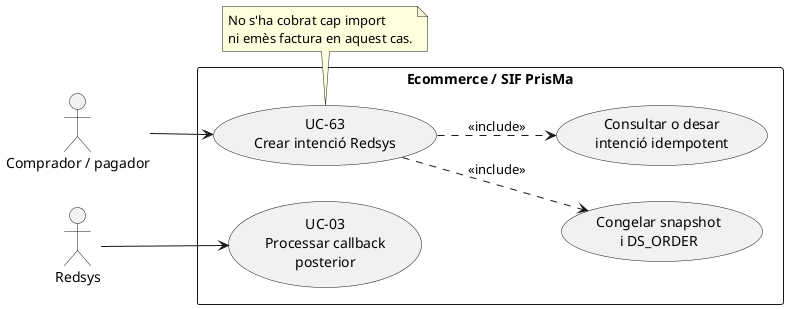
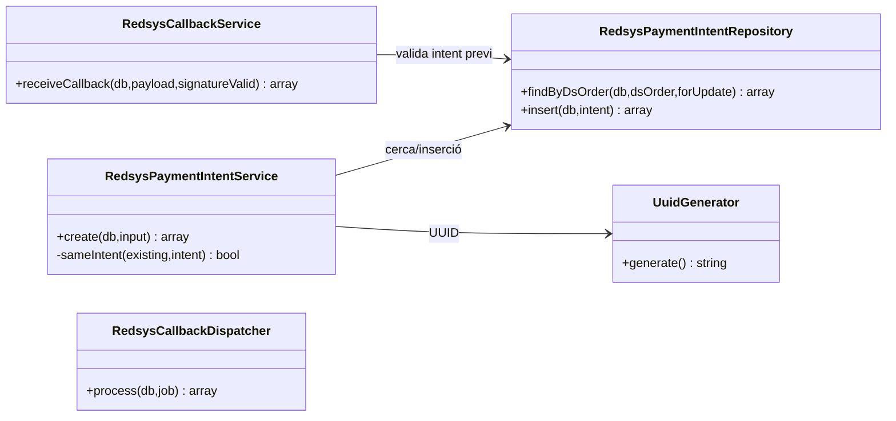
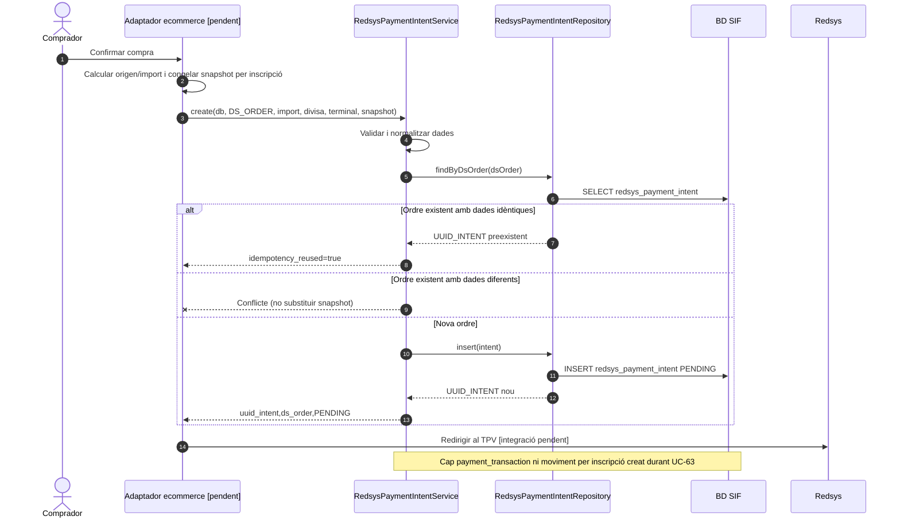

# UC-63 · Crear intenció Redsys des de l'ecommerce — fitxa i UML integrats

**Objectiu:** congelar i identificar l'operació **abans** de redirigir el pagador a Redsys. **No és un cobrament confirmat ni una factura emesa.** Relacions: UC-03 (callback/worker), UC-14/15/16/17/19a (origen de compra), UC-01/02 (factura i moviment posteriors), UC-51 (callbacks anòmals).

**Estat del codi:** `RedsysPaymentIntentService` i `RedsysPaymentIntentRepository` existeixen; la migració defineix `redsys_payment_intent`; la integració de l'ecommerce que genera el `DS_ORDER` i el snapshot correctes per tots els canals **no s'acredita** per aquests serveis. Una intenció no acredita ni resposta autoritzada de Redsys ni cobrament per inscripció.

## 1. Fitxa del cas

| Element | Contracte verificat |
| --- | --- |
| Actors | Comprador/pagador via ecommerce; adaptador web servidor (pendent de verificar); Redsys només participa en el pas posterior de redirecció/callback. |
| Precondicions | Identificar producte, import previst, participants/titular, descompte, divisa, terminal i origen abans d'entrar al TPV. |
| Camps exigits pel servei | `ds_order` no buit (fins a 40 caràcters), `source_type` de `CURS`, `PACK`, `GRUP`, `REGAL` o `USOC_ALUMNE`, `source_id` no buit (fins a 64), `expected_amount > 0`, divisa de 3 caràcters, `terminal` no buit (fins a 20) i `snapshot` array no buit serialitzable. |
| Dades addicionals | `idpag` numèric positiu quan es proporciona; `created_by`, `expires_at`; per `REGAL`, `source_id` ha de ser numèric. |
| Persistència | `redsys_payment_intent`: UUID, `DS_ORDER`, `SOURCE_TYPE`, `SOURCE_ID`, import/divisa/terminal previstos, `SNAPSHOT_JSON`, estat `PENDING` i dades addicionals. |
| Resultat | `uuid_intent`, `ds_order`, `status`, `idempotency_reused`. Cap `UUID_PAYMENT` ni `UUID_FACTURA` en aquesta fase. |

### 1.1. Flux principal

1. El comprador confirma la compra. L'adaptador servidor ha de determinar `DS_ORDER` i congelar el snapshot de producte, participants, import, descomptes, receptor i procedència que utilitzarà el worker. **Aquesta preparació no es pot atribuir al servei PHP simplement perquè accepti un array `snapshot`.**
2. `RedsysPaymentIntentService::create(db,input)` valida estructura/camps, normalitza import a dues decimals i serialitza el snapshot.
3. `RedsysPaymentIntentRepository::findByDsOrder()` cerca una intenció existent. Si existeix, `sameIntent()` compara IDPAG, origen, import, divisa, terminal, snapshot canonicalitzat, autor i caducitat.
4. Si coincideix tot, retorna el mateix UUID amb `idempotency_reused=true`. Si `DS_ORDER` ja existeix amb dades diferents, retorna conflicte; **no sobrescriu el snapshot antic**.
5. Si és una intenció nova, `RedsysPaymentIntentRepository::insert()` desa la fotografia i l'estat `PENDING`.
6. L'adaptador web inicia la redirecció a Redsys amb les dades adequades. **La signatura del formulari de sortida i la seva integració concreta s'han de verificar al canal; `create()` no envia cap cobrament a Redsys.**
7. Quan arriba notificació signada, UC-03 la correlaciona amb `DS_ORDER`, valida import/divisa/terminal i, si està autoritzada, encua el processament del snapshot. La factura i el cobrament neixen **més tard**, no durant UC-63.

### 1.2. Alternatives, errors i diners per inscripció

| Cas | Resultat |
| --- | --- |
| Duplicat exacte de `DS_ORDER` | Recupera la mateixa intenció; no crea una segona fotografia econòmica. |
| Ordre igual amb import/producte/snapshot diferent | Conflicte; cal revisió, no substituir silenciosament la intenció. |
| Import zero o negatiu, terminal absent o snapshot buit | Rebuig per validació. |
| `source_type=REGAL` i `source_id` no numèric | Rebuig de la intenció. |
| El client abandona el TPV | Pot quedar intenció `PENDING`; **no** registrar ni `CHARGE` ni `enrollment_fund_movement` per una intenció no pagada. |
| Callback contradictori o tardà | UC-51/03, sense reescriure la intenció ni emetre doble factura. |
| Pack/grup amb diverses inscripcions | El snapshot ha de conservar import per participant/inscripció. UC-63 no crea atribucions monetàries; UC-03/01 ho ha de fer **només després del cobrament real**. |
| Falla l'enviament del formulari després del commit d'intenció | Es pot reprendre la redirecció amb la mateixa intenció si continua vàlida; no recrear `DS_ORDER` amb dades canviades sense nou intent. |

**Proves localitzades, no executades ara:** `RedsysPaymentIntentTest`; cal prova d'extrem a extrem amb el canal i cada handler de compra real.

## 2. Diagrama UML de casos d'ús

## 3. Subdiagrama de classes — codi existent

**Nota:** la recepció del callback i el processament del worker són fases posteriors independents. El worker invoca el despatxador i no fa una crida directa a `RedsysCallbackService`; [vegeu UC-03](uc-003-processar-cobrament-redsys-asincron.md).

## 4. Seqüència — congelar la intenció abans del TPV

## 5. Traçabilitat

[Fitxa anterior UC-63](../06-fitxes-funcionals/uc-063.md) · [UC-03 callback i worker](uc-003-processar-cobrament-redsys-asincron.md) · [Revisió d'atribució dels fons](00-revisio-moviments-inscripcions.md) · [RedsysPaymentIntentService](../../sif/src/Service/RedsysPaymentIntentService.php) · [RedsysPaymentIntentRepository](../../sif/src/Repository/RedsysPaymentIntentRepository.php) · [Migració d'intencions](../../sif/database/migrations/2026_06_19_000002_create_redsys_payment_intent.sql) · [RedsysPaymentIntentTest](../../sif/tests/Integration/RedsysPaymentIntentTest.php).
