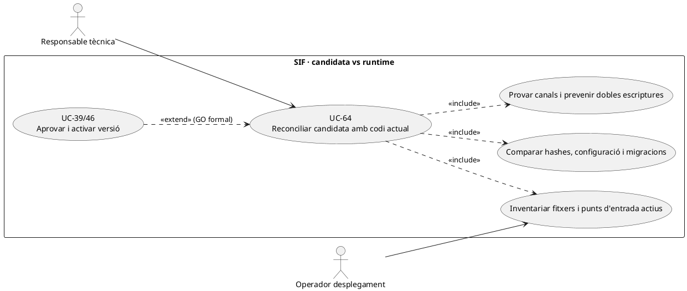
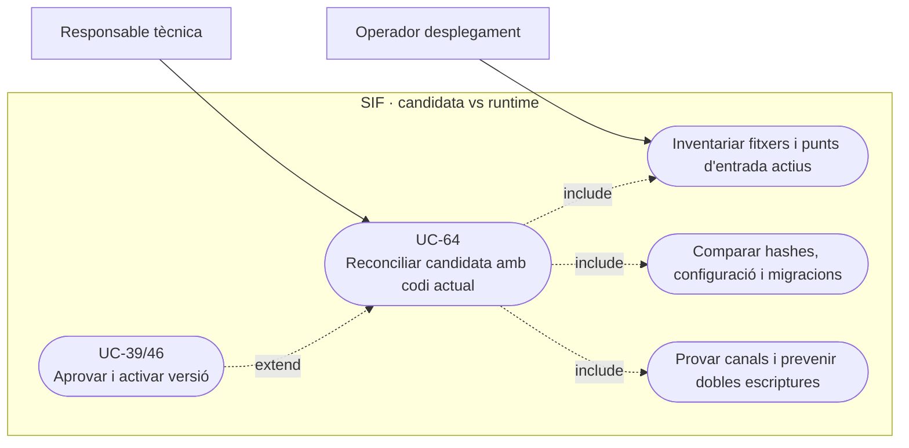
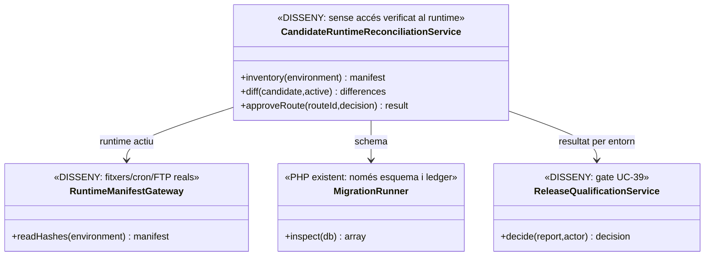
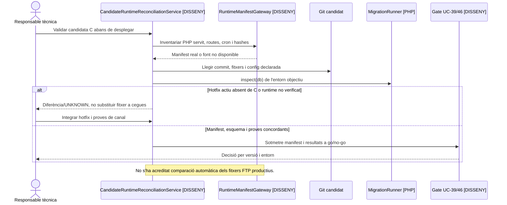

# UC-64 · Reconciliar la candidata amb el codi actual abans del desplegament

**Objectiu original:** preservar canvis vigents, seleccionar fitxers actius i provar cada canal abans de desplegar. **Estat [CONTROL/PENDENT].** «Candidata» és una versió de codi/configuració i migracions: aquest cas **no és UC-82**, que reconcilia dades econòmiques entre SIF i llegat. Tampoc consisteix a copiar en bloc tota la branca documental a producció.

## Evidència contrastada

La branca conté els executors `sif/scripts/process-manual-{invoice,course,payment}.php` que rebutgen `SIF_ENV=production`, la ruta web `sif/public/api/payments/register.php` que instancia directament `PaymentService`, i `sif/public/api/redsys/callback.php` amb verificació de signatura i cua. `MigrationRunner::inspect()` verifica migracions esperades i hash del ledger d'esquema, però no compara fitxers del lloc productiu o crides llegades actives. `go-no-go-preproduction.php` és un gate de preproducció. **No s'ha acreditat** un inventari executable de tots els punts d'entrada de la web/FTP productius ni una comparació de hashes amb el servidor actual.

## Contracte per component

| Component | Comparació necessària |
| --- | --- |
| Codi actiu | Hash/versió dels PHP efectivament servits (web, intranet, `pay.prisma.cat`, workers i cron) vs candidata. No assumir que Git `main` és idèntic al servidor FTP. |
| Routes i callbacks | Inventariar formularis, API, notificació Redsys, comandaments manuals, endpoints antics i planificats; identificar **quins poden crear factura o `CHARGE`** i quin adaptador SIF substituirà cadascun. |
| Esquema/BD | Comparar migracions, taules/índexs i dades que s'han d'utilitzar, amb compatibilitat entre codi vell i nou. `MigrationRunner.inspect()` és un punt de control d'estructura, no equival a revisió de totes les dades. |
| Secrets i configuració | Comprovar referències de secrets, entorn, emissor, sèries, endpoint AEAT i certificat **sense copiar-ne el valor** a manifest o PR. |
| Comportament | Provar per canal curs, grup, pack, regal, venda manual, pagament posterior, fracció, rectificativa, refund i callback tardà/duplicat. Els scripts CLI de prova no certifiquen autenticació de la intranet ni producció. |
| Governança | Documentar diferències candidat/actual, decisió per fitxer i ruta, responsable i hash verificat; UC-39 exigeix GO/NO_GO per entorn abans d'activar UC-46/83. |

### Flux objectiu

1. Congelar hashes de **candidata i codi desplegat real** amb instant, entorn, versions BD i llista de rutes/jobs actius. Quan no es pot accedir al FTP, registrar l'abast com a **no verificat**, no suposar equivalència amb `main`.
2. Construir una matriu per component: conservar canvi vigent, integrar canvi nou, desactivar origen antic o mantenir-lo transitoriament amb owner i condició de retirada. Detectar especialment doble escriptura fiscal i doble processament de notificacions Redsys.
3. Fer anàlisi de compatibilitat de payload/DDL/config i proves de contracte de **cada punt d'entrada**, inclòs control de rol en APIs i idempotència de `UUID_PAYMENT` i `DS_ORDER`.
4. En cas de conflicte, deixar candidata bloquejada fins a resoldre diferència; no sobrescriure PHP del servidor perquè «ja és a Git» ni tocar migracions ja aplicades.
5. Després de GO/NO_GO i pla de rollback, desplegar sota UC-46/83 i **tornar a comparar** hash de runtime, secrets de referència, esquema i routes habilitades.
6. Si hi ha operacions que arriben durant el canvi, reconciliar efectes fiscals/bancaris reals abans de recuperar workers antics o reemetre.

**Proves:** codi FTP amb hotfix absent de Git, script CLI no productiu copiat com a endpoint, dos callbacks simultanis, BD migrada però worker antic, `PaymentService` cridat sense gateway d'auditoria, divergència de config i rollback amb ingrés bancari posteriors al tall.

## UML de casos d'ús

### Vista de casos d’ús per a GitHub (Mermaid)

## UML de classes

## UML de seqüència — hotfix productiu no recollit a la candidata

## Traçabilitat

[UC-64 original](../06-fitxes-funcionals/uc-064.md) · [UC-39 gate](uc-039-proves-gate-go-no-go.md) · [UC-46 activació](uc-046-activar-versio-declaracio-responsable.md) · [UC-68 retirada callbacks original](../06-fitxes-funcionals/uc-068.md) · [MigrationRunner](../../sif/src/Database/MigrationRunner.php) · [CLI manual](../../sif/scripts/process-manual-invoice.php) · [API cobrament](../../sif/public/api/payments/register.php) · [Callback SIF](../../sif/public/api/redsys/callback.php).
