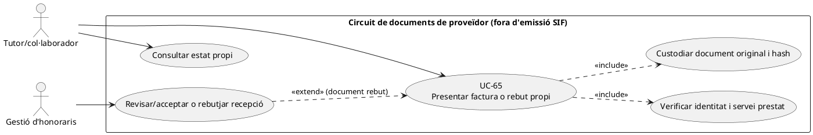
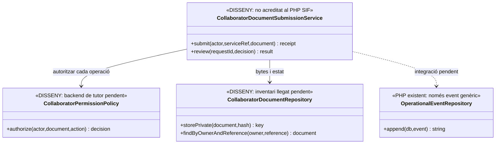
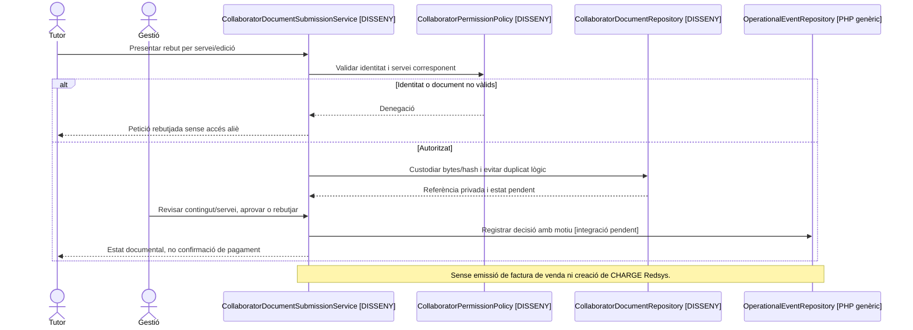

# UC-65 · Presentar una factura o rebut de col·laborador

**Finalitat del catàleg:** permetre a un tutor/col·laborador presentar un document propi d'honoraris en el **circuit adjacent de proveïdors**, separat de la facturació de vendes del SIF. **Estat [LEGACY/ADJACENT]:** les pantalles i els camps productius reals d'honoraris no s'han inventariat íntegrament; cap repositori PHP específic de recepció documental de col·laboradors s'ha acreditat en la revisió de `sif/src`.

## Evidència, abast i separacions

La fitxa original classifica expressament UC-65 com a **no generador de registre fiscal de venda**. `OperationalEventRepository::append()` existeix com a writer **genèric** d'`operational_event` amb actor, motiu, `FISCAL_IMPACT/ECONOMIC_IMPACT`, snapshots i hashes; la taula `sif_audit_event` és SQL definit. **No s'ha acreditat una crida efectiva d'aquest writer des de la intranet de col·laboradors**, ni un servei de custòdia/revisió del document aportat. El fet que un tutor emeti una factura com a proveïdor **no significa** que PrisMa hagi fet una venda ni que hagi rebut un `CHARGE` bancari.

| Fase | Contracte propi del cas |
| --- | --- |
| Presentació | Identificar col·laborador autenticat, activitat/edició o servei prestat, emissor del document de proveïdor, receptor de la prestació, número/data/import i referència d'origen. No inferir la identitat fiscal del document només de l'usuari de Moodle. |
| Validació documental | Evitar fitxer buit o repetit, conservar bytes en storage privat, hash, tipus, estat i permisos, i separar `PRESENTAT/PENDENT_REVISIO/VALIDAT/REBUTJAT` com a **estats de disseny**, no enums SQL acreditats. |
| Revisió | Gestió comprova que el document correspon al servei i període del col·laborador i que no està ja registrat. Una factura de proveïdor **no es reemet** com a factura de venda de la sèrie A/R de PrisMa. |
| Consulta i notificació | El col·laborador pot veure el **seu** document i la decisió autoritzada, però no factures de cursos d'alumnes, dades de tercers ni l'arxiu fiscal complet. |
| Pagament posterior | UC-66 segueix honors/bestretes/estat separats. Presentar un document no acredita que s'hagi fet una transferència al col·laborador, i **no** registra `payment_transaction.CHARGE` del TPV de venda. |
| Auditoria | Registrar recepció/decisió amb `SOURCE_TYPE=COLLABORATOR_DOCUMENT` **proposat**, hash/actor/motiu i correlació; no donar per existent un worker ni una integració a `operational_event` sense provar-ne la crida. |

### Flux i alternatives

1. Tutor autenticat carrega el document per servei real; el servidor compara identitat, activitat i títol de consulta/actualització.
2. El servei **pendent** valida tipus/bytes, referència de proveïdor i eventual duplicitat, conserva fitxer en repositori privat i crea una petició per revisió amb `UUID_REQUEST` **proposat**.
3. Gestió examina document i relació amb encàrrec/honoraris; rebutja amb motiu o valida **només la recepció/document**. L'event d'auditoria pot reutilitzar `OperationalEventRepository` si s'integra al canal.
4. El tutor rep estat real de revisió. El pagament dels honoraris es gestiona posteriorment segons UC-66, sense invocar `InvoiceService::issueInvoice()`, `fiscal_queue` ni `RedsysCallbackWorker`.
5. Provar fitxer duplicat amb nom canviat, un col·laborador accedint al document d'un altre, rebut sense referència de prestació, validació dues vegades, pagament registrat sense document, i document pendent mentre una factura de venda d'alumne existeix pel mateix curs.

**Pendents:** inventariar el formulari i repositori llegats, contracte documental, control de dades personals, rols reals del tutor/gestió, storage i política de retenció, integració d'auditoria i proves en un entorn segregat.

## UML de casos d'ús

## UML de classes — servei de proveïdors pendent vs auditories genèriques

## UML de seqüència — recepció no equival a pagament

## Traçabilitat

[UC-65 original](../06-fitxes-funcionals/uc-065.md) · [UC-66 honoraris original](../06-fitxes-funcionals/uc-066.md) · [UC-99 tutors original](../06-fitxes-funcionals/uc-099.md) · [OperationalEventRepository](../../sif/src/Repository/OperationalEventRepository.php) · [Migració d'auditoria](../../sif/database/migrations/2026_09_15_000003_add_functional_audit_control.sql).
