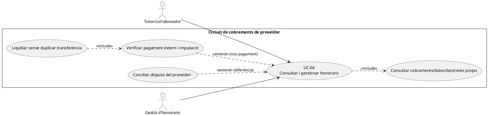
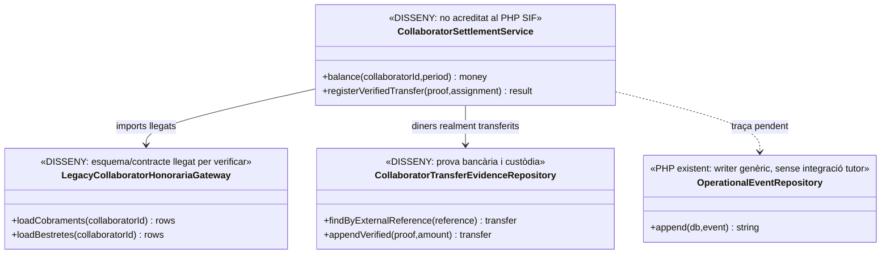
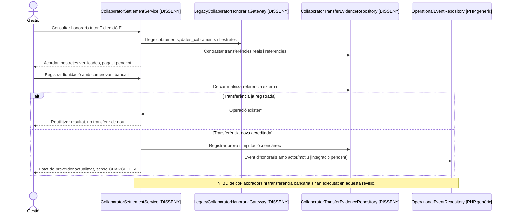

# UC-66 · Consultar i gestionar cobraments d'un col·laborador

**Objectiu del catàleg:** consultar els imports d'honoraris, `cobraments`, `dates_cobraments`, `bestretes` i l'estat gestionat del col·laborador. **Estat [LEGACY/ADJACENT].** En aquest cas «cobrament del col·laborador» és **diners que rep el proveïdor**, no un cobrament de venda de cursos per TPV; no s'ha acreditat un mòdul PHP SIF que llegeixi i gestioni aquestes estructures de l'intranet llegada.

## 1. Evidències i distinció de moviments

La [fitxa original](../06-fitxes-funcionals/uc-066.md) anomena literalment `cobraments`, `dates_cobraments` i `bestretes` com a dades del circuit adjacent. La seva estructura SQL, les claus i el tractament actual dels pagaments **no s'han verificat** en les migracions SIF; no es poden donar per implementades al nou sistema. `PaymentService::registerPayment()` i `PaymentRepository::createPayment()` registren `payment_transaction` i assignacions a **factures de venda**, no transferències d'honoraris a tutors. `OperationalEventRepository::append()` pot conservar un event genèric amb imports/snapshots/actor/causa, però no s'ha acreditat que la intranet de col·laboradors l'utilitzi.

| Fet del col·laborador | Regla per executar-lo |
| --- | --- |
| Consulta d'honoraris | Identificar tutor/proveïdor autenticat, servei/edició, quantitat acordada, documents UC-65 i import pendent desglossat, sense exposar informació de factures de venda d'alumnes. |
| Bestreta concedida | Registrar data, import **realment transferit** quan hi hagi prova, destinatari i encàrrec al qual s'imputa; una bestreta promesa no és una sortida bancària. **No** crear `payment_transaction.CHARGE` ni `payment_allocation` de factura de venda. |
| Pagament final | Calcular honoraris acordats menys bestretes realment aplicades i pagaments prèviament acreditats amb cèntims; verificar la transferència al titular legítim. Un rebut presentat no prova el pagament. |
| Diferència i disputa | Si document i quantia acordada discrepen, retenir l'estat «pendent de revisió» i registrar motiu/abans-després; no editar silenciosament import pagat ni duplicar una transferència al reintentar. |
| Accés i privacitat | Tutor veu únicament els **seus** conceptes i dates autoritzades; gestió verifica rol i accés per proveïdor/encàrrec, no només un filtre al navegador. |
| Auditoria | Enllaçar comprovants de transferència en custòdia privada, `REQUEST_ID`, actor, font, identificador de bestreta/pagament, hash de document i resultat de conciliació; la integració amb `operational_event` és **pendent**. |

### Flux funcional individual

1. L'usuari autenticat selecciona un encàrrec o període. El controlador **pendent** aplica la relació real amb el proveïdor i llegeix les dades llegades `cobraments/dates_cobraments/bestretes` amb identificadors reals, no per coincidència de nom o email.
2. Mostra imports acordats, bestretes, transferències confirmades i pendent calculat **separats**; si falta data/evidència bancària, no etiquetar com a cobrat.
3. Gestió valida una bestreta o pagament nou amb transferència externa, registra referència única i correlació; davant reintent del mateix banc, mostrar l'operació anterior sense una segona sortida.
4. El canvi no emet `factura` SIF, no incorpora `factura_registres` i no altera `fiscal_chain_state`. Si el mateix tutor també està matriculat com a alumne, els recursos i les operacions **no es fusionen**.
5. En desacord, deixar incidència pendent de conciliació del circuit de proveïdor; UC-82 resol únicament les divergències SIF/llegat que realment l'afectin i no converteix honoraris en `CHARGE` de cursos.

**Proves:** dues bestretes i una liquidació, bestreta concedida però no transferida, referència bancària repetida, tutor que intenta veure un altre proveïdor, duplicat per retry del formulari, rebut UC-65 rebutjat després de bestreta i mateixa persona amb rol d'alumne.

**Pendents:** esquema real de les taules llegades, el càlcul vigent de saldos, fonts bancàries, rols, endpoint de consulta/escriptura, política de bestretes, conciliació i proves. Aquesta fitxa no afirma que s'hagin executat transferències.

## UML de casos d'ús

## UML de classes — circuit adjacent, no PaymentService de venda

## UML de seqüència — bestreta i liquidació posterior

## Traçabilitat

[UC-66 original](../06-fitxes-funcionals/uc-066.md) · [UC-65 document del tutor](uc-065-presentar-factura-rebut-collaborador.md) · [UC-99 intranet tutors original](../06-fitxes-funcionals/uc-099.md) · [PaymentService · circuit diferent](../../sif/src/Service/PaymentService.php) · [OperationalEventRepository](../../sif/src/Repository/OperationalEventRepository.php) · [Migració de traça general](../../sif/database/migrations/2026_09_15_000003_add_functional_audit_control.sql).
