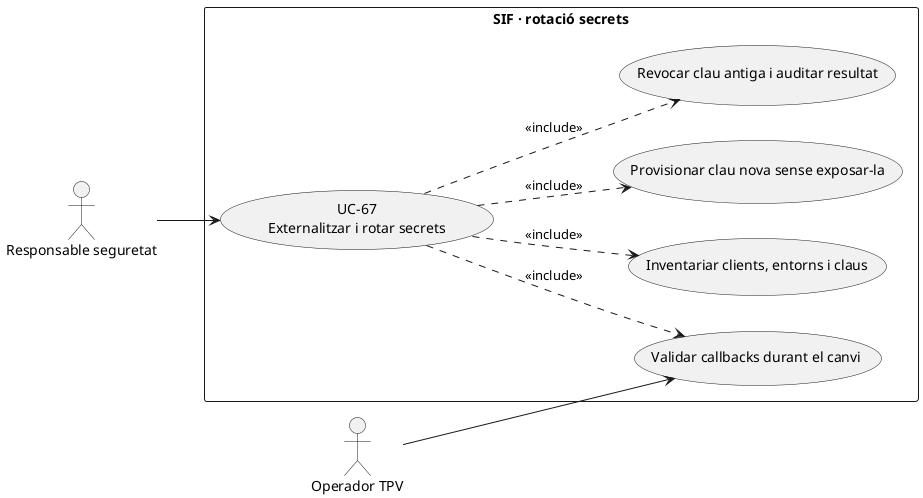
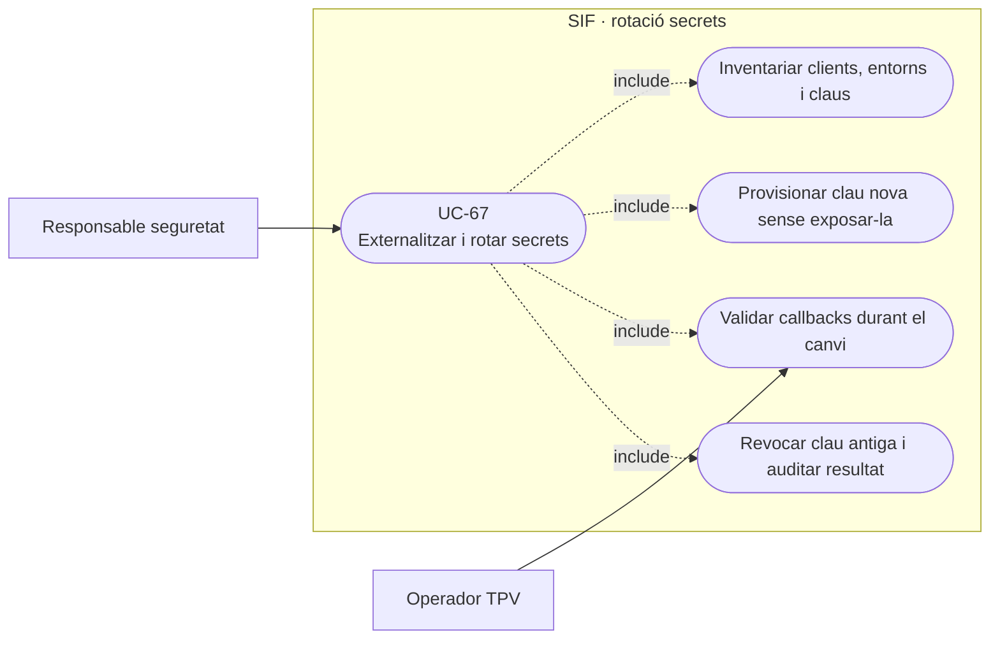
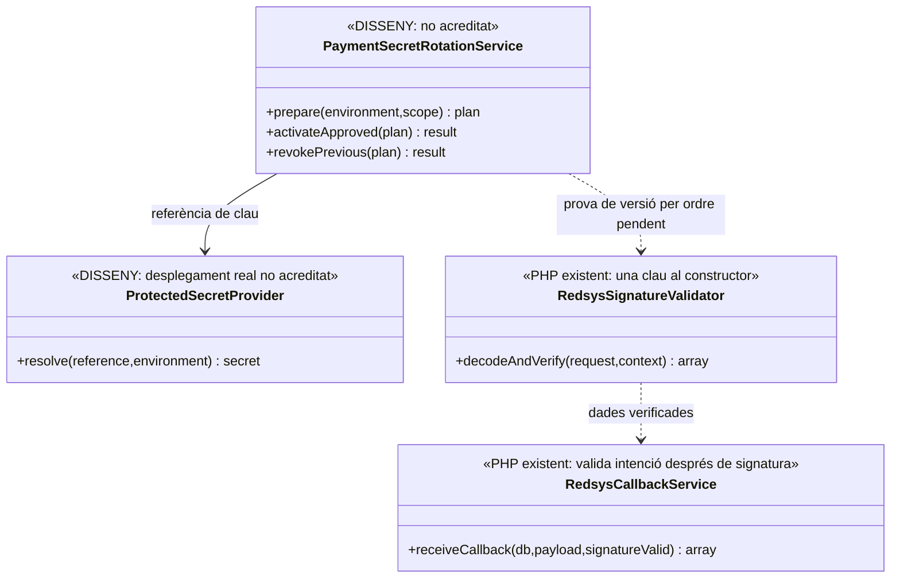
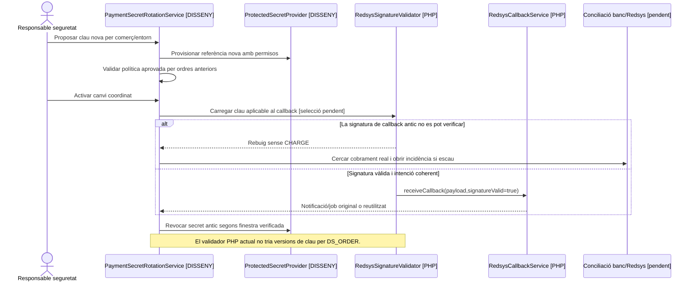

# UC-67 · Externalitzar i rotar els secrets de pagament

**Objectiu original:** cap clau Redsys ni credencial al codi/webroot; secret protegit i rotació provada. **Estat [PENDENT/BLOQUEJANT] del cicle complet.** La configuració existent llegeix el secret des de l'entorn, però no prova que el desplegament real el guardi amb permisos adequats ni que es pugui rotar sense rebutjar callbacks vàlids.

## Evidència revisada

`sif/config/sif.php` obté `SIF_REDSYS_MERCHANT_KEY` amb `getenv()`, així com DSN/usuaris/passwords de BD i ruta/password del P12 AEAT. `sif/public/api/redsys/callback.php` construeix `RedsysSignatureValidator` amb la clau carregada i comprova la signatura **abans** de lliurar el callback a `RedsysCallbackService`; aquest últim consulta la intenció `DS_ORDER`, valida import/divisa/terminal i crea notificació/job idempotents. `RedsysSignatureValidator` utilitza la **clau que rep al constructor**: no s'ha acreditat en aquesta classe un `key_id`, una finestra de coexistència de claus ni un circuit de rotació. Cap secret real s'ha llegit o exposat en aquesta fitxa.

## Contracte operatiu de rotació

| Fase | Regla |
| --- | --- |
| Inventariar | Identificar secret Redsys del comerç/terminal i entorn, usuaris/passwords SIF i llegat, certificat AEAT i clients/workers que depenen de cadascun. Una clau de preproducció **no** autoritza operacions de producció. |
| Custodiar | Referència opaca en magatzem/variable d'entorn protegit, fitxers fora de webroot, permisos mínims i registre de qui pot llegir-la. No guardar valor a Git, `sif_audit_event`, traça d'error, screenshot, payload de callback o PR. |
| Preparar Redsys | Coordinar versió de clau i data efectiva amb el proveïdor; establir política **aprovada** per validar notificacions d'intencions creades abans del canvi. No afegir «acceptar qualsevol de les dues claus» indefinidament ni suposar que el validador PHP actual ja ho fa. |
| Activar | Canviar referència/configuració als punts d'entrada i workers afectats, verificar handshake/signatura de prova, mantenir `DS_ORDER` i `UUID_INTENT` originals. No reemetre factura ni crear `CHARGE` perquè ha canviat la clau. |
| Tancar finestra | Revocar credencial antiga quan no queda trànsit legítim pendent, auditar el canvi per hash/fingerprint i actor **sense valor secret**, provar rollback segur davant error de signatura i actualitzar UC-38/39. |
| Error de callback | Una signatura invàlida **no es converteix en ingrés confirmat** ni s'accepta sense comprovació per «no perdre el pagament». Si hi ha cobrament bancari real però notificació rebutjada durant la rotació, obrir conciliació UC-82. |

### Flux objectiu

1. Gestió tècnica prepara inventari de secrets, entorns, clients i notificacions/ordres TPV en vol; registrar versió i fingerprint no reversible, actor i pla de tall.
2. Provisionar secret nou en magatzem protegit, assegurar que `config/sif.php` i el callback el llegeixen segons entorn i desplegament actual; verificar permisos i que cap error mostra la clau.
3. Validar notificacions de proves i definit política explícita de coexistència o tall per ordres antigues; **l'actual `RedsysSignatureValidator` no implementa per si sol selecció de claus per ordre**.
4. Coordinar activació dels productors de pagament i receptors de callbacks, monitorar errors/duplicats; en incertesa, recuperar l'estat real de Redsys/banc abans de crear cap moviment.
5. Registrar prova d'activació, revocar clau anterior i comprovar que retries de callbacks ja validats es processen amb la mateixa notificació/job; la rotació no canvia la cadena fiscal.

**Proves:** clau absent/incorrecta, secret exposat per log, callback d'ordre antiga després de rotació, dues instàncies amb claus distintes, replay, `DS_ORDER` conegut però import no coincident, timeout bancari amb resposta signada rebutjada, rollback sense doble `CHARGE`.

### 1.1. Rotació de Redsys amb ordres ja iniciades i callbacks en vol

**El fitxer PHP disposa d'una sola clau en la verificació.** `sif/public/api/redsys/callback.php` instancia `RedsysSignatureValidator` amb la clau carregada de `SIF_REDSYS_MERCHANT_KEY`; el constructor de `RedsysSignatureValidator` rep **un únic `merchantKey`**, deriva la signatura a partir de `Ds_Order` i compara valors amb `hash_equals()`. El `payload_hash` de la notificació és el hash dels `MerchantParameters`, **no** un identificador de versió de secret. El codi inspeccionat no consulta `redsys_payment_intent` per triar la clau abans de validar ni registra un `KEY_ID` associat a la transacció. Substituir la variable d'entorn mentre hi ha operacions pendents pot afectar callbacks d'ordres creades anteriorment, però **no es pot afirmar** sense contrastar amb el proveïdor quina clau signarà cada notificació.

**Inventari de l'activació que cal preparar.** Abans de rotar, obtenir per **comerç/terminal/entorn** la clau efectiva dels processos reals, la configuració acordada amb Redsys, els `DS_ORDER` pendents i les notificacions `VALIDATED/QUEUED/PROCESSING`. Les notificacions **ja verificades i persistides** han de poder completar el worker amb la seva evidència original sense tornar a inventar un cobrament; les peticions HTTP noves amb signatura desconeguda no es poden donar per pagades només per trobar un `DS_ORDER` local. La coexistència temporal de versions és **contracte i implementació pendents**, no una opció implícita del constructor PHP.

**Error de signatura després del tall: canal d'incidència, no bypass.** Si la nova clau rebutja un callback que el banc afirma haver tramitat, registrar l'intent i la causa sense valors secrets, comprovar l'ordre i els diners a una font independent i derivar a UC-82/81. No desactivar `hash_equals`, substituir la signatura pel valor esperat, aceptar sense verificar el `MerchantParameters` original ni generar una factura per compensar la fallada. Si l'ingrés existeix i es reconcilia, conservar `DS_ORDER`, `UUID_PAYMENT` i factura prèvia quan n'hi ha; el reintent de notificació ha d'evitar duplicar l'efecte.

**Secret actiu en diferents processos.** La verificació del callback i els productors del formulari TPV poden executar-se amb configuració/cache diferents durant un desplegament parcial. L'evidència de rotació ha d'indicar **instant i versió efectiva per procés**, env/terminal, prova de callback de l'entorn correcte i criteri de retirada de la clau antiga; el valor de la clau queda **fora** de Git, observabilitat i del manifest d'evidències. Una prova de preproducció no garanteix que el servidor productiu llegeixi la mateixa referència ni que el callback de producció estigui habilitat.

### 1.2. Proves d'ordres en vol durant la rotació (no executades)

| ID | Escenari | Resultat exigible |
| --- | --- | --- |
| CL-67-01 | `DS_ORDER` pendent és anterior al canvi, callback arriba després | Signatura verificada segons política de versions comprovada; si falla, conciliació externa sense bypass. |
| CL-67-02 | Notificació validada/en cua abans de rotar, worker l'executa després | Mateixa evidència `DS_ORDER` i idempotència; cap segon CHARGE per canvi de clau. |
| CL-67-03 | Dos processos callback serveixen claus diferents per desplegament parcial | Divergència d'entorn/versió visible, alertada i resolta sense acceptació de signatura falsa. |
| CL-67-04 | Callback amb `DS_ORDER` coneguda i signatura invàlida | No acceptar ingrés pel sol identificador; incident i consulta bancària quan pertoqui. |
| CL-67-05 | Secret accidentalment inclòs en evidència/log d'activació | Redacció i resposta d'exposició; cap còpia del valor en auditoria o PDF. |
| CL-67-06 | Proves del nou secret només a preproducció | Producció manté estat no verificat fins a prova pròpia de runtime/canal. |

## UML de casos d'ús

### Vista de casos d’ús per a GitHub (Mermaid)

## UML de classes

## UML de seqüència — callback antic després de rotació (DISSENY/PARCIAL)

## Traçabilitat

[UC-67 original](../06-fitxes-funcionals/uc-067.md) · [UC-38 config/certificat](uc-038-configurar-sif-certificat.md) · [UC-77 AEAT](uc-077-operar-enviament-aeat-retry-dead-letter.md) · [UC-82 conciliació](uc-082-reconciliar-sif-bd-llegada.md) · [config/sif.php](../../sif/config/sif.php) · [RedsysSignatureValidator](../../sif/src/Service/RedsysSignatureValidator.php) · [Callback web](../../sif/public/api/redsys/callback.php) · [RedsysCallbackService](../../sif/src/Service/RedsysCallbackService.php).
