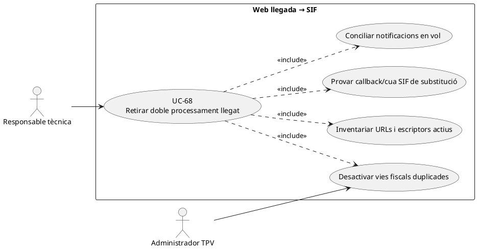
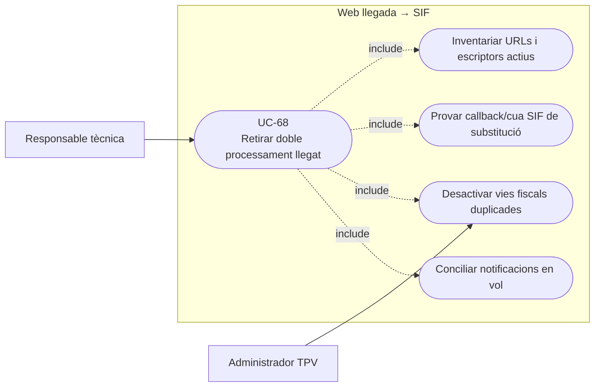
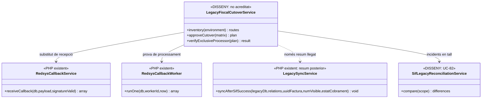
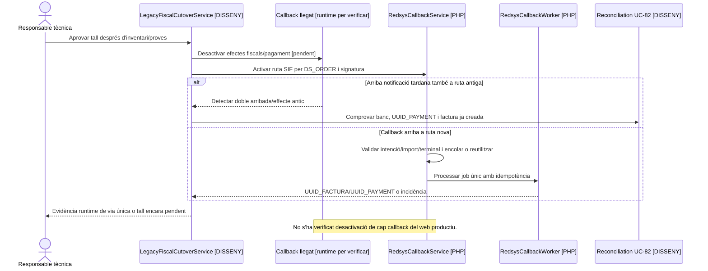

# UC-68 · Retirar callbacks i escriptures fiscals llegades sense duplicar ingressos

**Objectiu original:** cada punt de processament actiu ha de tenir substitut, prova i evidència abans de retirar-lo; no poden quedar **dues vies que facturen o registren el mateix pagament**. **Estat [DISSENY].** El SIF ja disposa de callback i cua Redsys propis, però el repositori consultat **no acredita quins callbacks/escriptures de la web llegada són realment actius a producció** ni que s'hagin desactivat.

## Evidència de la via nova i limitacions

`sif/public/api/redsys/callback.php` verifica signatura amb `RedsysSignatureValidator` i passa dades a `RedsysCallbackService::receiveCallback()`; el servei relaciona `DS_ORDER` amb la intenció, comprova import/divisa/terminal, registra notificació i encola el job només davant resposta validada. `RedsysCallbackWorker::runOne()` reclama un job, el delega a `RedsysCallbackDispatcher` i marca processat/retry/incidència segons el resultat. Aquests components **no demostren per si sols que el callback llegat no segueixi executant escriptures**.

`LegacySyncService` és **una via de resum posterior al resultat SIF** que actualitza `FACTURA_RELACIONADA` i afegeix text a `OBSERVACIONS`; no s'ha d'utilitzar com a segon emissor fiscal. El sync actual amb `COALESCE` i `CONCAT` pot conservar una referència llegada contradictòria o duplicar una nota en retry. La retirada de callbacks **no implica retirar tota lectura o sincronització acadèmica llegada**.

## Contracte de retirada per punt d'entrada

| Pas | Invariant |
| --- | --- |
| Inventari | Localitzar **URLs de notificació Redsys configurades al comerç**, PHP web/intranet, crons, scripts de botiga i mètodes que emeten número/PDF, escriuen a les taules de facturació o marquen `PAGAMENT`. No suposar que tots són al directori `sif/`. |
| Matriu substitutiva | Per cada callback antic: origen, tipus d'operació, `IDPAG/DS_ORDER`, efecte fiscal/econòmic/acadèmic, substitut SIF concret, proves i data de tall. Definir si roman un adaptador de **lectura o resum no fiscal**. |
| Exclusivitat | Redirigir el flux perquè hi hagi un únic responsable del `CHARGE` i de l'emissió fiscal. Duplicat de la mateixa notificació Redsys ha de reusar `UUID_JOB/UUID_PAYMENT`, no executar emissor vell i nou. |
| Trànsit en vol | Acceptar/conciliar notificacions antigues o tardanes segons prova bancària, fins i tot després de canviar URL; no ignorar diners reals perquè l'edició o ruta antiga s'ha tancat. |
| Rollback | Si falla el SIF, no tornar a activar un escriptor fiscal llegat sense aïllar els efectes ja produïts. Qualsevol recuperació exigeix UC-82 i un pla de no duplicació. |
| Evidència final | Hash/codi de l'antiga ruta, configuració de comerç, proves negatives d'escriptura antiga, trànsit de callback nou, monitoratge i rollback aprovat. Sense accés al runtime real l'estat resta **pendent de verificació**. |

### Flux objectiu

1. Inventariar el **codi real en servei** (UC-64), la configuració Redsys i els canals manual, web i telèfon; per cada punt antic identificar qui modificava `inscripcions.PAGAMENT`, emetia factura/número o registrava un càrrec.
2. Construir una matriu de correspondència per canal i provar equivalent del nou SIF: signatura/intenció, cua, factura única, ingrés únic, pagaments parcials, packs/grups, callbacks duplicats, retorns i sync acadèmic posterior.
3. Preparar tall controlat de callback i flags/escriptures llegades amb exclusivitat del processador; registrar instant i correlació per als jobs previs/en vol. **No** executar automàticament codi de migració que marqui els cobraments antics com a nous `CHARGE`.
4. Reproduir en prova callback antic/tardà i mateix `DS_ORDER` repetit: la nova cua ha de reusar o reconciliar sense una factura ni pagament duplicats. El banc és la referència del moviment extern, el SIF la del registre fiscal.
5. Desactivar l'escriptura fiscal llegada i verificar des del **runtime**, DBs i configuració de Redsys que no es produeix doble efecte. Conservar només lectures/sync de resum autoritzades i idempotents.
6. Si una via antiga segueix escrivint o arriba un ingrés que no es pot atribuir, obrir incidència i bloquejar la duplicació; corregir posteriorment el llegat per comanda auditada, no reemetre documents originals.

**Proves:** dos callbacks a URLs diferents pel mateix cobrament, callback signat tardà després de canviar URL, intenció absent, transacció d'empresa/grup amb diversos inscrits, worker antic del cron encara actiu, sync llegat repetit i rollback amb pagaments posteriors.

### Tall per origen: callback real, escriptor manual i importador històric

**Callback llegat identificat, configuració activa no verificada.** El procediment de curs normal recupera `realitzaPagamentAutomatic.php`: rep `Ds_MerchantParameters/Ds_Signature`, cerca la inscripció per `IDPAG`, i en autorització pot construir un número local `A{any}/{ordre}`, inserir `web.factures`, posar `Ds_Order` a `NUM_COMANDA`, actualitzar `PAGAMENT/FACTURA_RELACIONADA/DATA PAG/FRACCIO` i enviar avisos. El document indica que es calcula la signatura, però **no acredita que es compari correctament abans de modificar BD**. Identificar **al runtime** quina URL/comerç crida actualment Redsys i quins PHP/cron encara poden arribar al mateix escriptor; el fet de trobar el codi al repositori **no demostra** que es mantingui actiu ni que s'hagi desactivat en producció.

**Els canals manuals són punts d'entrada diferenciats.** `/alumnes/pagaments/` invoca `efectuarPagament.php`, i `/alumnes/genera-factura-abans-pagar/` invoca `generaFacturaElectronica_Factures.php`. Aquests fluxos poden crear/actualitzar `web.factures` o resum de cobrament històric **sense passar pel callback Redsys**; canviar només l'URL de notificació TPV no elimina les vies manuals d'escriptura fiscal duplicada. Per cadascun, registrar ruta/handler real, tipus d'operació, entrada signada o autoritzada, font de diners, substitut de SIF, resum llegat admissible i prova negativa que l'antic writer ja no emet ni crea un cobrament nou.

**Importar històric no és un tercer emissor.** UC-11 té `HistoricalInvoiceMigrationService` i `HistoricalInvoiceMigrationRepository`: inserta documents `HISTORICAL/NO_VERIFACTU` però no crida el nucli d'emissió, no incrementa `fiscal_sequence`, no afegeix `factura_registres/fiscal_queue` i no registra un `CHARGE`. El pla de tall ha de **mantenir separat** aquest importador de la substitució dels punts d'entrada operatius: carregar `web.factures` antigues no pot fer-los passar com a nous registres ni provocar que un job Redsys antic torni a facturar una venda ja coberta. La seva execució completa i reconciliació d'origen segueixen pendents.

**Tall amb notificacions en vol i rollback.** Per cada `DS_ORDER` que arribés a l'antiga i a la nova URL, comprovar evidència del cobrament extern i identificar únicament un `UUID_PAYMENT`. Si la factura ja va ser emesa abans de cobrar a un responsable, assignar-li el pagament sense una segona A; un `IDPAG` amb dos intents legítims no són dues factures automàticament. Un rollback de codi o BD ha de reconciliar factures i efectes Redsys posteriors al tall abans de tornar a habilitar qualsevol emissor llegat, encara que la pàgina antiga sembli mostrar `PAGAMENT=0`.

### Proves addicionals per via d'escriptura (no executades)

| ID | Escenari | Resultat exigible |
| --- | --- | --- |
| CT-68-01 | Dues URLs reben el mateix `DS_ORDER` | Un cobrament real i un sol resultat fiscal, amb ruta antiga sense doble escriptura. |
| CT-68-02 | Es retira callback però continua actiu `efectuarPagament.php` | Detectar el segon writer i bloquejar la retirada fins a substitució/prova. |
| CT-68-03 | Factura prèvia d'empresa i callback individual iniciat abans del tall | Reconciliar ingrés real sobre factura existent o incidència, no nova A. |
| CT-68-04 | Executar importador històric mentre entren cobraments nous | NO_VERIFACTU per documents antics, cap registre/CHARGE retrospectiu. |
| CT-68-05 | Runtime FTP no contrastat amb branca del GitHub | Estat del tall no verificat, no declarar escriptors antics desactivats. |
| CT-68-06 | Restauració d'un backup anterior a un callback cobrat | Reconciliar banc/SIF abans d'obrir workers o emissor llegat. |

## UML de casos d'ús

### Vista de casos d’ús per a GitHub (Mermaid)

## UML de classes

## UML de seqüència — callback duplicat durant canvi d'URL (DISSENY/PARCIAL)

## Traçabilitat

[UC-68 original](../06-fitxes-funcionals/uc-068.md) · [UC-64 candidata](uc-064-reconciliar-candidata-codi-actual.md) · [UC-82 conciliació](uc-082-reconciliar-sif-bd-llegada.md) · [UC-77 AEAT](uc-077-operar-enviament-aeat-retry-dead-letter.md) · [Callback SIF](../../sif/public/api/redsys/callback.php) · [RedsysCallbackService](../../sif/src/Service/RedsysCallbackService.php) · [RedsysCallbackWorker](../../sif/src/Service/RedsysCallbackWorker.php) · [LegacySyncService](../../sif/src/Service/LegacySyncService.php).
