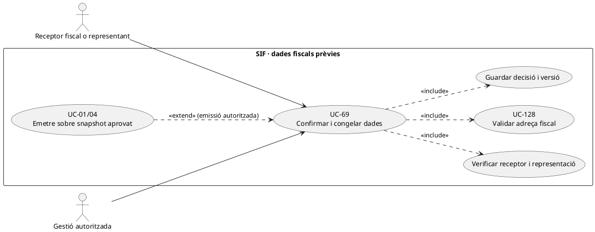
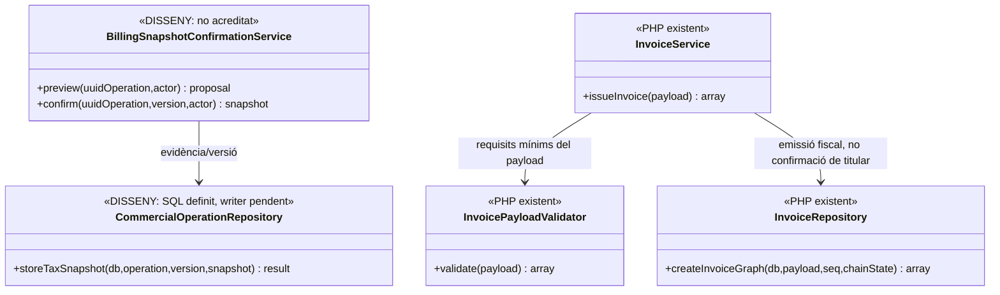
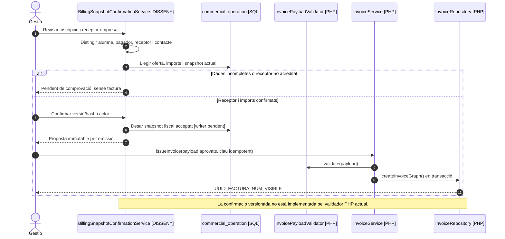

# UC-69 · Confirmar i congelar dades fiscals abans d'emetre

**Abast del catàleg:** receptor i contacte diferenciats; snapshot validat, identificat i versionat abans d'emetre. **Estat: [DISSENY/PARCIAL].** `InvoicePayloadValidator` i `InvoiceRepository` ja validen i persisteixen dades d'emissió, però no són un procés interactiu de verificació de titularitat, consentiment de receptor, versió de proposta o normalització postal. UC-69 és la decisió prèvia; UC-01 és l'emissió.

## 1. Contracte i dades de la decisió

| Element | Comportament exigible |
| --- | --- |
| Persona beneficiària | `ID_INSC` i curs/edició. No suposar que l'alumne és el **receptor fiscal** si paga una empresa o responsable de grup. |
| Receptor i pagador | Separar nom/raó social, NIF/CIF, adreça, país i contacte de lliurament del titular dels diners i de l'alumne. `BILLING_EMAIL` no és identificador de persona ni permís per consultar factura. |
| Previsualització | Mostrar receptor, línies/preu/tributació i total del snapshot comercial, indicar dades mancants i qui pot aprovar-les. Els imports són del servidor i es validen abans d'emetre; no confiar en el total que retorna el navegador. |
| Evidència d'acceptació | **DISSENY:** `UUID_OPERATION`, versió/hash del snapshot, qui confirma i amb quin rol, moment, `REQUEST_ID/CORRELATION_ID` i nova acceptació si un camp material canvia. Les migracions `commercial_operation` i `billing_profile_history` contemplen snapshots i versions del perfil fiscal (`UUID_PROFILE_VERSION`, `VERSION_NO`, `BILLING_SNAPSHOT_JSON`, `SNAPSHOT_HASH`, vigència i causa), però no s'ha acreditat el writer/confirmador complet ni el vincle obligatori d'aquesta versió amb cada factura. |
| Validació PHP existent | `InvoicePayloadValidator::validate()` exigeix `billing.name`, `billing.nif`, sèrie/tipus, totals numèrics i almenys una línia amb imports. **No comprova** que el NIF pertanyi al receptor ni la coherència postal entre país, CP i població. |
| Persistència fiscal existent | `InvoiceService::issueInvoice()` valida payload i crida `InvoiceRepository::createInvoiceGraph()` en transacció: factura, línies, registre `ALTA`, cadena, cua i relacions. `InvoiceRepository::insertInvoice()` grava els camps `BILLING_*` a la factura emesa. |
| Diners | Confirmar dades **no registra `CHARGE`**. Si `issueInvoice()` rep un bloc `payment` amb ingrés ja acreditat pot registrar-lo; en factura abans de cobrar `InvoiceBeforePaymentPayloadBuilder` prohibeix aquest bloc inicial. |

### Flux propi i excepcions

1. Des de l'alta/compra, recuperar el **receptor legítim** segons origen: particular, empresa, grup o tercer que paga; consultar operacions obertes i detectar camps fiscals en conflicte amb UC-126/128.
2. Preparar una previsualització de **dades fiscals i línies** al servidor, distingint dades de contacte/lliurament del receptor. Si manca informació imprescindible, deixar operació pendent de validació; `InvoicePayloadValidator` per si sol no resol autorització o identitat.
3. Registrar una versió de snapshot i la confirmació explícita del subjecte/operador habilitat. Si canvien receptor, imports o edició després d'haver creat `DS_ORDER`, UC-112/121 classifica si cal una oferta nova; **no reescriure** el snapshot sota la mateixa ordre.
4. Només després, UC-01/04 emet des de les dades aprovades. La factura queda identificada amb `UUID_FACTURA` i valors originals; el mateix `ID_INSC` o `IDPAG` no justifica per si sol crear dos documents.
5. Si les dades són corregides **després d'emetre**, iniciar UC-70/74 o UC-120 segons si canvia catàleg, receptor fiscal històric o només contacte vigent. No fer `UPDATE factura.BILLING_*`.

**Proves pendents:** alumne i empresa amb emails compartits, canvi de receptor a l'últim pas, reintent concurrent, dades postals estrangeres, `DS_ORDER` antic, factura abans de cobrament, mateixa inscripció amb dos pagadors i verificació de snapshot/permís. No s'han executat proves PHP del flux de confirmació complet.

### 1.1. Confirmació del receptor real a la pantalla de factura prèvia

**Entrades que ofereix el llegat.** A `/alumnes/genera-factura-abans-pagar/`, l'operador cerca inscripcions per NIF/NIE, afegeix els `ID_INSC` seleccionats i tria una entitat abans d'emetre. El JS històric guarda `entitatMarcada` com a **text visible**, calcula `preuTotal` dels elements `#apagar-{id}` i comprova al navegador que hi hagi un sol curs/edició. `concepte2` arriba d'una crida asíncrona. Cap d'aquestes dades del navegador és, per si sola, una **confirmació fiscal definitiva** de receptor, línies i import.

**Validació objectiu per operació.** L'adaptador ha de reconstruir al servidor `ID_INSC` únics i consultar curs/edició, preu/descomptes aplicables i factura ja existent per cada inscrit; recuperar l'entitat escollida per **ID intern** i un snapshot complet de les dades fiscals `CIF/RAO/ADRECA/CP/POBLACIO`. El contacte `entitats_resp.CORREU` pot servir per lliurar factura o URL de pagament **quan estigui autoritzat**, però no substitueix el receptor ni n'acredita la representació. La confirmació ha de mostrar clarament que s'emet una **factura real abans de cobrar**, no una proforma ni necessàriament `E_FACT=1`.

**Intenció TPV i canvi posterior.** Si ja existeix una `DS_ORDER` d'empresa o d'una persona i es canvia receptor, curs o import mentre el pagament és possible, no modificar la instantània d'aquella ordre. Cal classificar si es pot revocar el nou intent i preservar un callback d'un intent anterior que pugui arribar tard. Si la factura ja és emesa per aquells `ID_INSC`, no utilitzar una altra clau idempotent per crear-ne una segona: recuperar `UUID_FACTURA` o obrir conflicte, i per un ingrés posterior cridar UC-02.

**Prova de la decisió.** `InvoicePayloadValidator` només verifica camps estructurals bàsics i `billing.name/nif` no buits; `billing_profile_history` és esquema de versions **pendent de writer/confirmador**. Registrar identitat i rol de qui aprova, identificador d'entitat, versions de dades i regla/preu usats constitueix el contracte objectiu d'UC-69, **no una traça ja generada pel formulari antic**.

### 1.2. Proves específiques de la confirmació prèvia (no executades)

| ID | Escenari | Resultat exigible |
| --- | --- | --- |
| CF-69-01 | Receptor es passa com a text `entitatMarcada` | Resolver ID/versió al servidor i mostrar CIF/raó/domicili abans d'emetre. |
| CF-69-02 | `preuTotal` o curs/edició manipulats al DOM | Recalcular i validar contra BD, sense confiar en la previsualització HTML. |
| CF-69-03 | Correu del responsable no correspon al receptor | Contacte/permís de lliurament separats de la identitat fiscal de factura. |
| CF-69-04 | Una inscripció ja té factura d'empresa amb una altra clau | Recuperar cobertura o incidència; no nova factura. |
| CF-69-05 | Canvi material després d'iniciar `DS_ORDER` | No reescriure snapshot original ni acceptar l'ordre antiga per una oferta nova. |

### 1.3. Contrast AEAT v2: la confirmació funcional no és el hash de petició ni l'assignació de número fiscal

L'adjunt AEAT v2 proposa un InvoiceService::confirmAndFreezeInvoice(invoiceId) que recupera un esborrany, congela FiscalRecord i **després** assigna el número definitiu. **Aquesta API i aquesta successió no estan acreditades al PHP de main**. UC-69 continua sent la validació/acceptació funcional del receptor, les línies, preu i fiscalitat abans de l'emissió; InvoiceService::issueInvoice(payload) és l'operació diferent UC-01 que obté la seqüència fiscal, crea factura, línies, registre encadenat, fiscal_queue i relacions dins de la transacció. No representar una factura fiscal amb número ja emès com un simple esborrany editable.

A main, InvoiceRepository::insertInvoice() desa IDEMPOTENCY_PAYLOAD_HASH calculat sobre **la petició completa validada**, inclòs el bloc payment si existeix, per comparar una petició repetida de **la mateixa clau** a InvoiceService. Aquest hash de reús **no substitueix** la petjada fiscal HASH_FACT encadenada ni l'evidència que una persona habilitada hagi confirmat el receptor correcte abans de l'emissió. La migració 2026_09_21_000007 incorpora el camp de hash de petició i el reús de factures antigues sense hash falla tancat; **no** implementa per si sola el writer versionat de billing_profile_history/commercial_operation ni els permisos de confirmació.

**Frontera amb UC-77:** FiscalQueueProcessor a main ja contrasta fiscal_queue.PAYLOAD_JSON amb factura_registres.PAYLOAD_JSON i recalcula HASH_FACT abans d'enviar. El hash de cua versionat és una extensió pendent, no el guard executable actual. Ni el hash de reús UC-01 ni el d'integritat UC-77 proven que el NIF, el titular del deute o la classificació tributària de l'oferta inicial fossin correctes: cal la verificació humana/funcional que descriu UC-69.

| Prova pendent | Resultat exigible |
| --- | --- |
| CF-69-06 | Receptor d'empresa diferent del de l'alumne: confirmació explícita del receptor fiscal i rol abans d'emetre, no equivalència assumida pel hash. |
| CF-69-07 | Canvi de receptor després de crear DS_ORDER però abans d'emetre: nova acceptació/gestió UC-112/121, no mutació silenciosa de snapshot. |
| CF-69-08 | Reintent de la mateixa clau d'emissió amb receptor diferent: assertMatches() a main rebutja petició completa; el fet que el primer hash sigui vàlid no acredita receptor legítim. |

## 2. UML de casos d'ús

## 3. UML de classes — validació existent vs confirmació pendent

## 4. UML de seqüència — receptor empresa abans de facturar (DISSENY/PARCIAL)

## 5. Traçabilitat

[UC-69 original](../06-fitxes-funcionals/uc-069.md) · [UC-01 emissió](uc-001-emetre-o-reutilitzar-factura.md) · [UC-04 abans de cobrar](uc-004-emetre-factura-abans-cobrar.md) · [UC-112 snapshot TPV](uc-112-congelar-snapshot-abans-tpv.md) · [UC-128 adreça](uc-128-normalitzar-adreca-cp-poblacio-abans-factura.md) · [InvoicePayloadValidator](../../sif/src/Service/InvoicePayloadValidator.php) · [InvoiceRepository](../../sif/src/Repository/InvoiceRepository.php) · [Esquema comercial](../../sif/database/migrations/2026_09_16_000004_add_commercial_operation_and_fiscal_fields.sql).

## Addenda transversal UC-77 — frontera entre confirmació i tramesa (disseny pendent)

**UC-69 confirma i versiona dades abans de l'emissió; no executa la tramesa AEAT.** La previsualització confirmada ha de fixar el receptor legítim, les línies, els imports, la versió del snapshot i la identitat de qui confirma. L'emissor UC-01/75/76 usa aquesta fotografia sense recalcular-la des de dades vives i, **en la mateixa transacció local**, crea registre fiscal encadenat, payload original i job de cua; a main la comparació de payload de cua amb el registre immutable i la recalculació del hash fiscal ja són executables. El hash propi/versionat de cua és una extensió pendent. El worker UC-77 només reclama el job després del commit i contrasta contingut/identitat amb el registre immutable abans del transport. Enviar SOAP abans del commit o refer la fotografia sota la mateixa clau de reintent incompleix el contracte.

**Traça:** [UC-77 · especificació i diagrama modificats](uc-077-operar-enviament-aeat-retry-dead-letter.md#7-fitxa-específica-ampliada-integritat-del-payload-congelació-i-dlq). La confirmació versionada del receptor comercial i el hash propi/versionat de cua no estan acreditats al PHP de main, però el guard de cua/registre/hash fiscal **sí**. El hash de petició d'emissió de main és una garantia diferent. Prova pendent: rollback d'emissió no deixa cap job enviable; crash post-commit permet reprendre el mateix job/hash.
