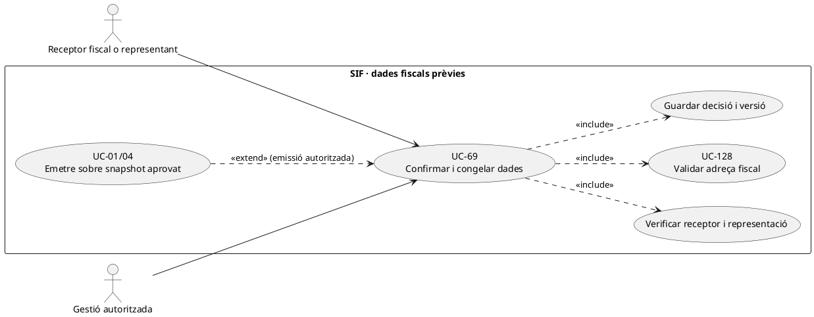
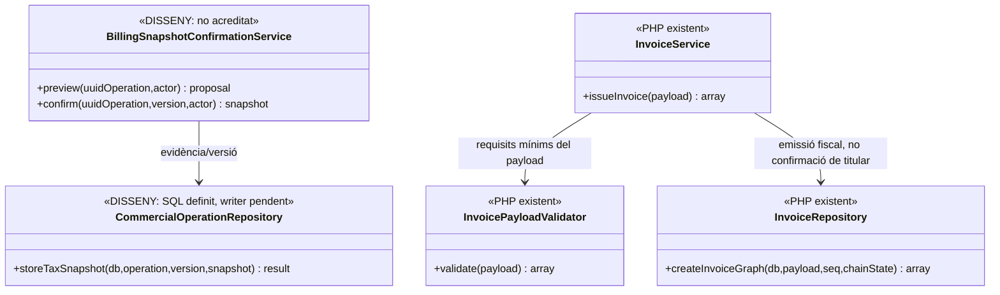
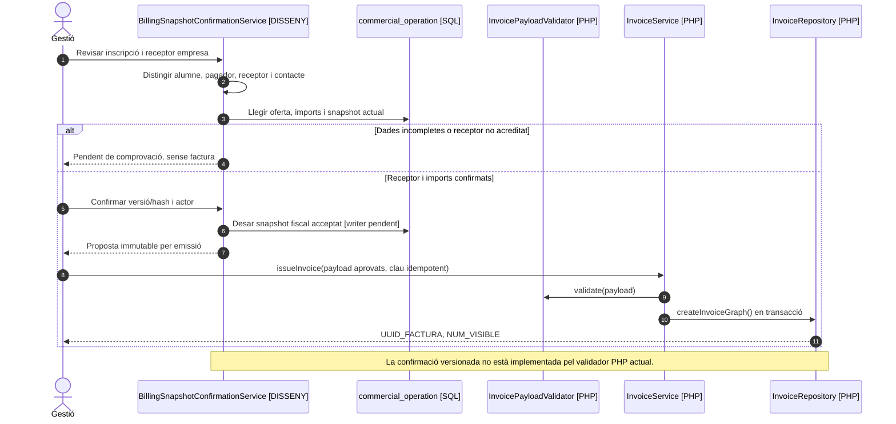

# UC-69 · Confirmar i congelar dades fiscals abans d'emetre

**Abast del catàleg:** receptor i contacte diferenciats; snapshot validat, identificat i versionat abans d'emetre. **Estat: [DISSENY/PARCIAL].** `InvoicePayloadValidator` i `InvoiceRepository` ja validen i persisteixen dades d'emissió, però no són un procés interactiu de verificació de titularitat, consentiment de receptor, versió de proposta o normalització postal. UC-69 és la decisió prèvia; UC-01 és l'emissió.

## 1. Contracte i dades de la decisió

| Element | Comportament exigible |
| --- | --- |
| Persona beneficiària | `ID_INSC` i curs/edició. No suposar que l'alumne és el **receptor fiscal** si paga una empresa o responsable de grup. |
| Receptor i pagador | Separar nom/raó social, NIF/CIF, adreça, país i contacte de lliurament del titular dels diners i de l'alumne. `BILLING_EMAIL` no és identificador de persona ni permís per consultar factura. |
| Previsualització | Mostrar receptor, línies/preu/tributació i total del snapshot comercial, indicar dades mancants i qui pot aprovar-les. Els imports són del servidor i es validen abans d'emetre; no confiar en el total que retorna el navegador. |
| Evidència d'acceptació | **DISSENY:** `UUID_OPERATION`, versió/hash del snapshot, qui confirma i amb quin rol, moment, `REQUEST_ID/CORRELATION_ID` i nova acceptació si un camp material canvia. Les migracions `commercial_operation` i `billing_profile_history` contemplen snapshots i versions del perfil fiscal (`UUID_PROFILE_VERSION`, `VERSION_NO`, `BILLING_SNAPSHOT_JSON`, `SNAPSHOT_HASH`, vigència i causa), però no s'ha acreditat el writer/confirmador complet ni el vincle obligatori d'aquesta versió amb cada factura. |
| Validació PHP existent | `InvoicePayloadValidator::validate()` exigeix `billing.name`, `billing.nif`, sèrie/tipus, totals numèrics i almenys una línia amb imports. **No comprova** que el NIF pertanyi al receptor ni la coherència postal entre país, CP i població. |
| Persistència fiscal existent | `InvoiceService::issueInvoice()` valida payload i crida `InvoiceRepository::createInvoiceGraph()` en transacció: factura, línies, registre `ALTA`, cadena, cua i relacions. `InvoiceRepository::insertInvoice()` grava els camps `BILLING_*` a la factura emesa. |
| Diners | Confirmar dades **no registra `CHARGE`**. Si `issueInvoice()` rep un bloc `payment` amb ingrés ja acreditat pot registrar-lo; en factura abans de cobrar `InvoiceBeforePaymentPayloadBuilder` prohibeix aquest bloc inicial. |

### Flux propi i excepcions

1. Des de l'alta/compra, recuperar el **receptor legítim** segons origen: particular, empresa, grup o tercer que paga; consultar operacions obertes i detectar camps fiscals en conflicte amb UC-126/128.
2. Preparar una previsualització de **dades fiscals i línies** al servidor, distingint dades de contacte/lliurament del receptor. Si manca informació imprescindible, deixar operació pendent de validació; `InvoicePayloadValidator` per si sol no resol autorització o identitat.
3. Registrar una versió de snapshot i la confirmació explícita del subjecte/operador habilitat. Si canvien receptor, imports o edició després d'haver creat `DS_ORDER`, UC-112/121 classifica si cal una oferta nova; **no reescriure** el snapshot sota la mateixa ordre.
4. Només després, UC-01/04 emet des de les dades aprovades. La factura queda identificada amb `UUID_FACTURA` i valors originals; el mateix `ID_INSC` o `IDPAG` no justifica per si sol crear dos documents.
5. Si les dades són corregides **després d'emetre**, iniciar UC-70/74 o UC-120 segons si canvia catàleg, receptor fiscal històric o només contacte vigent. No fer `UPDATE factura.BILLING_*`.

**Proves pendents:** alumne i empresa amb emails compartits, canvi de receptor a l'últim pas, reintent concurrent, dades postals estrangeres, `DS_ORDER` antic, factura abans de cobrament, mateixa inscripció amb dos pagadors i verificació de snapshot/permís. No s'han executat proves PHP del flux de confirmació complet.

## 2. UML de casos d'ús

## 3. UML de classes — validació existent vs confirmació pendent

## 4. UML de seqüència — receptor empresa abans de facturar (DISSENY/PARCIAL)

## 5. Traçabilitat

[UC-69 original](../06-fitxes-funcionals/uc-069.md) · [UC-01 emissió](uc-001-emetre-o-reutilitzar-factura.md) · [UC-04 abans de cobrar](uc-004-emetre-factura-abans-cobrar.md) · [UC-112 snapshot TPV](uc-112-congelar-snapshot-abans-tpv.md) · [UC-128 adreça](uc-128-normalitzar-adreca-cp-poblacio-abans-factura.md) · [InvoicePayloadValidator](../../sif/src/Service/InvoicePayloadValidator.php) · [InvoiceRepository](../../sif/src/Repository/InvoiceRepository.php) · [Esquema comercial](../../sif/database/migrations/2026_09_16_000004_add_commercial_operation_and_fiscal_fields.sql).
