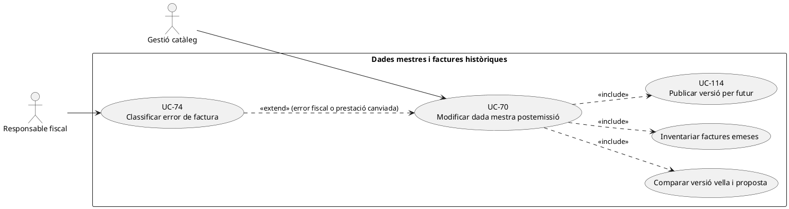
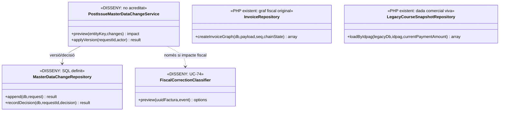
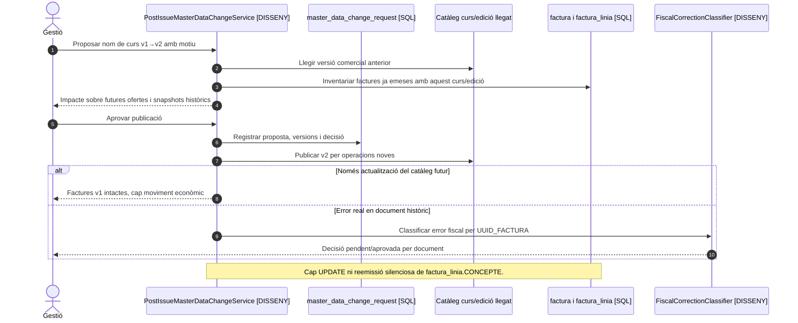

# UC-70 · Modificar dades mestres després d'emetre una factura

**Objectiu canònic:** conservar història **abans/després** i decidir quina informació vigent es propaga a nous usos, sense reescriure el snapshot de cap factura emesa. **Estat: [DISSENY].** UC-114 tracta la versió del producte/edició i l'impacte sobre **operacions obertes**; UC-70 parteix expressament de l'existència d'un **document fiscal ja emès**. No tots els canvis de catàleg originen un corrector fiscal: cal classificar el fet real (UC-74).

## 1. Base acreditada

`InvoiceRepository::createInvoiceGraph()` conserva `billing`, imports, concepte, detall, edició/relacions aportades al payload i registra `ALTA`, hash i cua AEAT en crear la factura. `LegacyCourseSnapshotRepository::loadByIdpag()` en canvi recupera dades **vives** d'`inscripcions` i `curs`; tornar a construir el payload des del llegat **després de canviar una edició** pot produir un contingut diferent del que es va facturar. El número de factura, línies i registre anteriors **no s'han de reconstruir ni editar** per reflectir una nova denominació o data.

La migració defineix `billing_profile_history` per conservar versions del perfil fiscal (`UUID_PROFILE_VERSION`, `VERSION_NO`, `BILLING_SNAPSHOT_JSON`, `SNAPSHOT_HASH` i vigència); això no autoritza a actualitzar el receptor d'una factura emesa ni acredita un writer PHP. La migració defineix `master_data_change_request` amb `ENTITY_TYPE`, `ENTITY_KEY`, versions base/proposta, `CHANGESET_JSON`, `AFFECTED_OPEN_OPERATIONS_JSON`, decisió, actor i correlació. `personal_data_change_request` cobreix canvis del perfil vigent. **No s'ha acreditat** un `PostIssueMasterDataChangeService` PHP que consulti factures històriques, registri proposta/aprovació i classifiqui els efectes fiscals.

## 2. Fitxa funcional específica

| Canvi | Límit i derivació |
| --- | --- |
| Nom comercial o descripció de curs per a edicions futures | Publicar versió de catàleg (UC-114) i mantenir `factura_linia.CONCEPTE/DETALL` antics. No cal deduir, només del canvi de catàleg, que hi ha hagut una correcció del servei ja prestat. |
| Data, hores o edició d'un curs ja venut | Distingir correcció de dada mestra **vigent** d'un **canvi real de la prestació contractada**. Aquest últim necessita UC-71/127 i UC-74 si afecta factura emesa; l'impacte monetari individual és una decisió separada. |
| Dades del receptor o contacte | UC-120 gestiona dades actuals de la persona; `factura.BILLING_*` històric no es modifica. Si hi ha un **error fiscal del document original**, UC-74 determina la via de correcció, no el formulari de perfil. |
| Preu, descompte o règim fiscal de catàleg | La nova regla afecta ofertes noves; una factura ja emesa conserva import/règim original. Si el preu real acceptat era incorrecte, UC-73/74 valora l'ajust i document corrector. |
| Rols i sistemes | Gestió proposa, responsable comercial/academic aprova dades mestres i responsable fiscal classifica correcció de factures afectades. El permís per editar catàleg **no és** permís per emetre un registre d'anul·lació. |
| Efecte monetari | No crear `CHARGE`, `REFUND`, `COMPENSATION` ni transferència entre `ID_INSC` per modificar títol, dates o email en un catàleg. Si canvia el contracte de l'inscrit, derivar a cas econòmic concret amb import i titular acreditats. |

### Flux objectiu

1. Rebre proposta de canvi amb `ENTITY_KEY`, versió anterior/proposada, camp/s, motiu, actor i instant d'efecte. Recuperar snapshot històric de factura/es, relacions de `ID_INSC` i operacions encara obertes; no comparar només amb el catàleg vigent.
2. Generar **dos inventaris**: ofertes/reserves encara pendents (UC-114/121), i factures **ja emeses** amb `UUID_FACTURA`, número, línia i data originals. Una mateixa edició pot requerir actuacions diferents per cada inscrit.
3. Aprovar/publicar nova versió de dades mestres sense modificar les files fiscals originals. Guardar `CHANGESET_JSON`, autor, versions i què s'ha propagat al llegat. Si la propagació falla, mantenir incidència i recuperar **només** la destinació pendent.
4. Per cada document existent, decidir si el canvi és merament informatiu o si es descobreix un error/alteració del servei original; **només en el segon supòsit i amb classificació aprovada** derivar a UC-74. No executar `InvoiceService::issueInvoice()` sobre l'antic `ID_INSC` per «actualitzar» la factura.
5. Si hi ha reassignació de plaça, baixa o diferència d'import, UC-71/72/105 ha de traçar **l'import efectivament atribuït a cada inscripció**, sense duplicar l'entrada bancària del pack/grup.

### Casos de prova

| Escenari | Resultat |
| --- | --- |
| Canviar el títol del curs després de facturar | La factura antiga mostra el concepte històric; les noves operacions veuen versió nova. |
| Rectificar una errada real del concepte de factura | UC-89/74 determina si cal document/registre corrector; no editar el PDF ni el payload original aïlladament. |
| Edició ajornada amb un participant pagat i un altre només reservat | Primera operació: decidir prestació/fons/document existent; segona: oferta i plaça UC-121 sense refund fictici. |
| Reintent del canvi per timeout | Reutilitzar mateixa versió/decisió, sense tornar a emetre factures ni repetir transferències. |
| Propagació al llegat confirmada però SIF no actualitzat | Registrar discrepància de dades **vigents** i no reconstruir les factures emeses per reparar-la. |

**Pendents:** matriu d'impacte per camp, comandes de propagació per sistema, política de consentiment en canvis contractuals, traça item a item de documents emesos i proves d'idempotència entre BDs.

### Edició de l'entitat i dades d'alumne després d'una factura real

**Dos punts de modificació del llegat.** `/alumnes/genera-entitat/` modifica la raó social, CIF, domicili i responsable a través de `actualitzaEditaEntitat.php`, que avui s'invoca per `GET` amb dades en la URL. `/alumnes/mostrar-alumne/` permet `guardarDadesPersonals_resultatCerca()` i la documentació afirma que el canvi operatiu només afecta inscripcions **pendents de començar**. Aquests són canvis de perfils vius amb abast diferent; **cap dels dos acredita una correcció de factura ja emesa**.

**Inventari diferenciat abans d'aplicar.** Abans d'editar un receptor, consultar l'entitat per **ID intern** i vigència del responsable, operacions encara obertes/TPV iniciat, inscripcions cobertes, factures ja emeses i missatges pendents de lliurar. Per al perfil d'alumne, separar cursos nous/pendents d'inscripcions acabades, documents individuals i factures d'empresa on la persona només és participant. Mostrar qui és el **receptor fiscal històric** i qui és el contacte actual evita que una modificació de `CORREU` alteri el dret de consulta del PDF o els destinataris d'email en cua sense nova autorització.

**Efectes posteriors controlats.** La nova dada mestra alimenta futures ofertes i factures; una factura existent conserva `BILLING_*`, línies, número i document immutable. Si l'edició posa al descobert que el receptor o el concepte **ja era incorrecte en el moment d'emetre**, obrir classificació UC-74/05, i per cada operació oberta decidir si cal una nova confirmació de dades UC-69 o una intenció amb nou `DS_ORDER`. Un canvi de contacte pot requerir UC-58/120/126 per notificacions i identitat, però **no** un nou cobrament ni la substitució silenciosa de l'XML fiscal original.

### Proves addicionals de dades mestres postemissió (no executades)

| ID | Escenari | Resultat exigible |
| --- | --- | --- |
| DM-70-01 | Entitat canvia raó social després de factura emesa correcta | Futures operacions amb versió vigent; factura anterior intacta. |
| DM-70-02 | Es detecta CIF erroni al document original | Expedient fiscal UC-74/05, no UPDATE de `factura.BILLING_NIF_CIF`. |
| DM-70-03 | Alumne canvia DNI i té factura de grup d'empresa | El participant no esdevé receptor ni obté el PDF per canvi de perfil. |
| DM-70-04 | Operació oberta amb DS_ORDER anterior al canvi de receptor | Oferta/instantània antiga preservada i nova decisió si canvia el contracte. |
| DM-70-05 | Falla propagació del perfil vigent després d'aprovar el canvi | Reintentar només destinació pendent, no tornar a emetre documents fiscals. |

## 3. UML de casos d'ús

## 4. UML de classes — dada mestra vs document fiscal

## 5. UML de seqüència — canvi de títol després d'una emissió (DISSENY)

## 6. Traçabilitat

[UC-70 original](../06-fitxes-funcionals/uc-070.md) · [UC-114 versió d'edició](uc-114-versionar-producte-edicio.md) · [UC-74 classificar](uc-074-classificar-correccio-fiscal.md) · [UC-89 concepte original](../06-fitxes-funcionals/uc-089.md) · [UC-71 canvi](uc-071-registrar-canvi-curs-complet.md) · [InvoiceRepository](../../sif/src/Repository/InvoiceRepository.php) · [LegacyCourseSnapshotRepository](../../sif/src/Repository/LegacyCourseSnapshotRepository.php) · [Migració de dades mestres](../../sif/database/migrations/2026_09_16_000005_add_operation_lifecycle_tables.sql).
