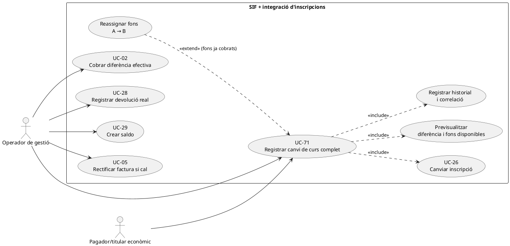
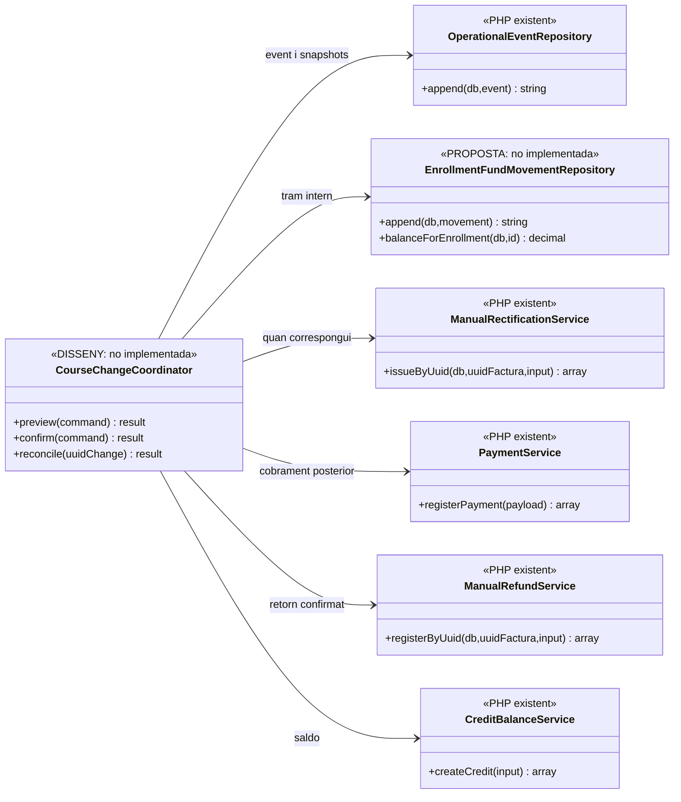

# UC-71 · Registrar un canvi de curs complet — fitxa de cas d'ús i UML

**Naturalesa:** expedient de negoci que coordina canvi administratiu, responsabilitat econòmica, relacions entre inscripcions i eventual correcció fiscal. **Estat:** DISSENY/PARCIAL. El catàleg i la fitxa original defineixen el cas; la migració conté `course_change_event` i existeix `OperationalEventRepository`, però **no s'ha acreditat un servei SIF que executi tot UC-71**. No s'ha creat cap classe ni taula nova amb aquest document.

**Límit respecte a UC-26:** UC-26 és l'acció administrativa de canviar curs; UC-71 és el registre integral d'origen/destí, diferència, decisions, moviments i resultats. UC-05, UC-02, UC-28, UC-29 i UC-29a són operacions específiques que l'expedient pot necessitar; no s'executen totes per defecte.

## 1. Fitxa funcional específica

| Camp | Contracte objectiu |
| --- | --- |
| Actor principal | Operador de gestió autoritzat; una decisió de retorn/saldo exigeix identificar el titular del dret, que pot ser un tercer pagador. |
| Disparador | Una inscripció canvia de curs, edició o grup; se'n vol deixar constància completa, no únicament actualitzar el curs actual. |
| Identitat i concurrència | Referència inequívoca a inscripció origen i destinació, identificador únic de la petició/correlació i versió o bloqueig de les dades llegides, **pendents d'implementar**. |
| Dades abans/després | Inscripció, curs i edició antics/nous, descomptes aplicats i futura elegibilitat, import anterior i nou, despeses de gestió, saldo ja **cobrat i atribuït**, saldo pendent i factura/rectificatives afectades. |
| Resultat administratiu | Historial conservat i relació origen/destí, sense sobreescriure la història d'inscripció ni reescriure línies d'una factura fiscal emesa. |
| Resultat econòmic | Desglossament entre fons ja cobrats traspassats a destinació, diferència pendent de cobrar, retorn confirmat i saldo creat. Cada tram que s'executi genera un assentament **per inscripció** al model proposat; els imports només previstos no ho fan. |
| Resultat fiscal | Classificació expressa de si cal UC-05 o un altre efecte fiscal. El mateix preu no garanteix que la descripció del servei facturat sigui inalterada. |

### 1.1. Flux principal del cas **objectiu**

1. L'operador selecciona inscripció origen i destí, indica el motiu i sol·licita previsualització; es consulta el titular del cobrament, el detall de participant i factura, la disponibilitat del destí i el descompte que correspon.
2. La previsualització separa: import/curs original, import/curs de destinació, despeses de gestió i descomptes, **fons realment atribuïts a l'origen** i import encara pendent. No equipara `A_PAGAR` del llegat a diners ingressats.
3. Abans de confirmar, es verifica que la mateixa sol·licitud no s'ha executat, que l'origen encara és vigent, que el destí pot rebre la inscripció i que el traspàs no excedeix fons disponibles. **Validacions objectiu, no demostrades pel codi existent.**
4. Es registra una operació/event amb snapshots i identitat; el model previst `course_change_event` exigeix `UUID_OPERATIONAL_EVENT`, `SOURCE_ENROLLMENT_ID`, `TARGET_ENROLLMENT_ID` si existeix, `SOURCE_COURSE_ID`, `TARGET_COURSE_ID`, `ORIGINAL_AMOUNT`, `TARGET_AMOUNT`, `MANAGEMENT_FEE`, `DIFFERENCE_AMOUNT`, decisions econòmica/fiscal i UUID de factura/pagament resultat.
5. Es realitza el canvi administratiu mantenint origen/destí. **La persistència de `course_change_event` i la coordinació amb la BD llegada no estan acreditades per l'existència de `OperationalEventRepository::append()`.**
6. Si hi ha diners cobrats atribuïts a l'origen i consumits pel destí, es registra **una reassignació interna A→B** pel valor efectiu, amb l'UUID del cobrament original; **no** un segon `CHARGE`. Un traspàs parcial i un retorn/saldo poden coexistir com a diversos trams diferenciats.
7. Si el nou import excedeix els fons que li pertoquen, es registra **deute pendent**, no cobrament fictici; quan arribi el cobrament es tramita UC-02/22/23 amb `payment_transaction CHARGE` nou i assignació a la inscripció destí.
8. Si sobren fons atribuïts a l'origen, es decideix qui té dret a retorn o saldo: devolució confirmada UC-28, creació de saldo UC-29 o justificació de cap retorn. Un retorn monetari real i una conversió en saldo són efectes diferenciats.
9. Si el concepte, el servei, les línies o l'import fiscalment emesos canvien, es classifica i inicia UC-05 o la via que pertoqui; no es modifica en lloc el document original. Es correlacionen resultat administratiu, economic i fiscal.
10. S'exposa a l'operador què s'ha confirmat i què continua pendent. Un error de la rectificació o de la conciliació externa **no es dissimula** declarant tot el cas complet.

### 1.2. Escenaris diferenciats

| Situació | Operacions concretes |
| --- | --- |
| Canvi sense cap factura emesa | Històric de la inscripció i nova obligació; cap rectificativa d'una factura inexistent. Si ja s'havien ingressat fons, conservar-ne origen i atribució. |
| Mateix preu amb factura emesa | Verificar si la descripció o el servei facturat canvien; el preu igual no elimina l'anàlisi fiscal. Pot haver-hi traspàs de fons A→B **sense nou cobrament**. |
| Curs de destinació més car | Reassignar només fons ja ingressats i marcar diferència pendent; el cobrament addicional és una altra transacció. |
| Curs de destinació més barat | Reassignar import aplicable a B; excedent a retornar, convertir en saldo o conservar segons justificació i titular. |
| Empresa/responsable com a pagador | El destinatari del retorn/saldo no es pressuposa igual que l'alumne inscrit; revisió de titularitat i permisos. |
| Pagament originari fraccionat | Identificar **quins** imports s'han cobrat de debò i quines parts poden traspassar-se; les quotes futures no es mouen com si fossin diners disponibles. |
| Dos canvis concurrents sobre la mateixa inscripció | Bloqueig/versió i idempotència abans de generar trams nous; si la segona petició no coincideix amb l'estat llegit, aturar i conciliar. |
| Error després d'event però abans de completar el llegat o l'efecte fiscal | Registrar fase pendent i incidència, reprendre idempotentment i conciliar; no afirmar una transacció única entre diferents BDs. |

### 1.3. Obligació de registre dels fons per inscripció

**[Revisió transversal dels fons i esquema proposat](00-revisio-moviments-inscripcions.md).** El `course_change_event.DIFFERENCE_AMOUNT` és la diferència comercial, no una traça quantitativa de cada import reassignat. La proposta de `enrollment_fund_movement` registra per tram `UUID_PAYMENT_ORIGIN`, origen/destí, import, motiu, correlació i event; **encara no hi ha migració ni classe PHP implementades**. Exigir reconciliació dels fons abans/després i evitar duplicats o imports negatius. Ni la baixa d'una inscripció ni una rectificativa fiscal fan aparèixer per elles mateixes diners ingressats.

### 1.4. Evidència existent i punts pendents

El codi `OperationalEventRepository::append()` persisteix `operational_event` amb `OPERATION_TYPE`, `FISCAL_IMPACT`, `ECONOMIC_IMPACT`, `REASON_CODE`, `CORRELATION_ID` i snapshots abans/després. La migració `2026_09_15_000003_add_functional_audit_control.sql` defineix `course_change_event` com a taula vinculada. `ManualRectificationService`, `PaymentService`, `ManualRefundService` i `CreditBalanceService` ofereixen **peces separades**; **no** acredita la transacció completa UC-71 ni la relació quantitativa de fons. A la fitxa original `uc-071.md` consta `NOT_COMPLETE`.

### 1.5. Cadena de canvis i reversió d'un expedient — OBJECTIU PENDENT

El xat original descriu canvis **consecutius** de curs, ocasionalment per corregir errors de gestió, i la possibilitat de desfer un canvi des de la fitxa de l'alumne. El contracte UC-71 ha de conservar la cadena A→B→C i determinar quin event continua vigent abans de recàlcul, retorn o cobrament. El segon canvi no pot utilitzar de nou un tram de fons ja reassignat o retornat pel primer. Una reversió crea un **nou event relacionat amb el canvi que supera** i deixa consultable tot l'històric; no elimina ni modifica els cobraments o factures anteriors.

**Dades a relacionar (proposta, no camps presents acreditats en la migració):** UUID de l'event anterior i de l'event revertit; inscripcions d'origen, destí i estat vigent; imports realment atribuïts per tram; diferència pendent i diferència cobrada; eventual retorn, saldo o compensació; referències a factures i rectificatives. Per als ajustos manuals, separar import/despesa calculats d'import/despesa autoritzats, motiu i actor. Abans d'afegir columnes noves, revisar les relacions que ja es poden expressar amb course_change_event i operational_event; enrollment_fund_movement continua sent PROPOSTA, sense repositori o migració operatius acreditats.

**Decisió inversa:** si A→B encara no ha generat fons, factura o correcció posterior, pot autoritzar-se una reversió només administrativa amb event nou i verificació de plaça. Si ja hi ha moviments, devolució, saldo consumit o rectificativa, l'operador ha de veure cada efecte i tramitar una regularització independent, evitant un segon CHARGE artificial o la restauració fictícia de diners retornats. Si B→C ha substituït A→B, no aplicar una reversió com si B encara fos l'estat vigent; primer resoldre la cadena real.

**Callback de diferència tardà:** l'intent de cobrament creat per un canvi ja revertit o superat no pot assignar automàticament el CHARGE al curs antic. Si el banc ha cobrat, conservar el moviment i l'evidència, identificar el titular i obrir conciliació per decidir destinació/retorn/saldo sense una segona factura no relacionada.
## 2. Diagrama UML de casos d'ús (PlantUML)



Els casos de cobrament, devolució, saldo i rectificació són **accions posteriors condicionades** a la decisió i als fets; les relacions del diagrama no signifiquen que totes es disparin juntes ni que hi hagi un orquestrador executant-les avui.

## 3. Subdiagrama de classes: existent vs proposta



La migració de `course_change_event` és una taula SQL; **no** es dibuixa com a classe executada. Les dependències que surten de `CourseChangeCoordinator` són **disseny objectiu**.

## 4. Diagrama de seqüència del cas complet (DISSENY/PARCIAL)

```mermaid
sequenceDiagram
autonumber
actor O as Operador
participant UI as Intranet [integració pendent]
participant C as CourseChangeCoordinator [DISSENY]
participant Legacy as Inscripcions llegades
participant E as OperationalEventRepository [existent]
participant L as EnrollmentFundMovementRepository [PROPOSTA]
participant F as Classificador fiscal [DISSENY]
participant IS as ManualRectificationService [existent]
participant P as PaymentService [existent]
participant R as ManualRefundService [existent]
participant S as CreditBalanceService [existent]
O->>UI: Escollir A, destí B i motiu
UI->>C: preview(command)
C->>Legacy: Obtenir inscripcions, curs, edició i descomptes
C->>L: Atribució monetària disponible a A
L-->>C: Imports cobrats i origen
C->>F: Comparar efecte fiscal antic/nou
F-->>C: Classificació o revisió pendent
C-->>UI: Previsualització: canvi + fons + diferència + fiscalitat
O->>UI: Confirmar amb petició idempotent
UI->>C: confirm(command i versió llegida)
C->>C: Validar autorització, destí, versió, titular i imports
alt Canvi invàlid / concurrent
 C-->>UI: Bloqueig i incidència, sense moviment
else Canvi validat
 C->>E: append(event abans/després, actor, correlació)
 E-->>C: UUID_OPERATIONAL_EVENT
 C->>Legacy: Actualitzar origen/destí amb històric
 opt Fons reassignats
  C->>L: append(A→B, import, pagament original i event)
  L-->>C: UUID_MOVEMENT
 end
 opt Diferència pendent
  C->>C: Registrar obligació; encara no CHARGE
 end
 opt Pagament addicional confirmat posteriorment
  C->>P: registerPayment(CHARGE de la diferència)
  C->>L: append(EXTERNAL→B, import, UUID_PAYMENT nou)
 end
 opt Excedent retornat efectivament
  C->>R: registrar REFUND existent
  C->>L: append(A→EXTERNAL, import, UUID_PAYMENT retorn)
 end
 opt Excedent convertit en saldo
  C->>S: createCredit(titular, import i origen)
  C->>L: append(A→CREDIT, import, UUID_CREDIT)
 end
 opt Correcció fiscal classificada
  C->>IS: Iniciar UC-05, vincular factura original
 end
 C-->>UI: Fases confirmades i pendents correlacionats
end
Note over C,Legacy: No hi ha transacció única acreditada entre BD llegada, SIF i processos externs
```

## 5. Seqüència d'error i recuperació (DISSENY)

```mermaid
sequenceDiagram
actor O as Operador
participant C as Coordinador [DISSENY]
participant Ev as Historial operatiu
participant L as Registre de fons [PROPOSTA]
participant Legacy as BD inscripcions
participant Inc as Incidències SIF [parcial]
O->>C: Confirmar canvi amb correlació X
C->>Ev: Registrar comanda / event X
C->>L: Crear reassignació A→B idempotent
L-->>C: UUID_MOVEMENT
C->>Legacy: Aplicar canvi administratiu
alt Falla la sincronització del llegat
 Legacy--xC: Error
 C->>Inc: Obrir incidència de conciliació X
 C-->>O: Canvi no tancat; fons traçats i sincronització pendent
else Llegat confirma
 Legacy-->>C: Confirmació
 C-->>O: Fase administrativa completada
end
Note over C,L: La reexecució amb X ha de reutilitzar l'assentament, no moure diners dues vegades
```

### 5.1. Seqüència de cadena i reversió (DISSENY)

```mermaid
sequenceDiagram
autonumber
actor O as Gestió
participant C as Coordinador canvi [DISSENY]
participant H as course_change_event [esquema, writer pendent]
participant L as Fons per inscripció [PROPOSTA]
participant P as Pagaments/rectificatives existents
O->>C: Desfer A→B o corregir A→B→C
C->>H: Llegir cadena d'events i estat vigent
C->>L: Consultar imports ja atribuïts i sortides
C->>P: Consultar diferències cobrades, retorns, saldos, factures
alt Reversió només administrativa
 C->>H: Afegir event invers referenciat [integració pendent]
 C-->>O: Nou estat i historial intacte
else Existeixen efectes econòmics o fiscals
 C-->>O: Mostrar trams i correccions necessàries; prohibir update directe
 opt Usuari confirma cada regularització pertinent
  C->>P: Tramitar nova operació específica idempotent
  C->>H: Correlacionar resultat i pendents [writer pendent]
 end
else Estat vigent/plaça/titular dubtós
 C-->>O: Incidència, cap moviment automàtic
end
Note over C,L: No hi ha transacció global acreditada entre BD SIF i llegat.
```

### 5.2. Proves addicionals de canvi successiu i reversió (no executades)

| ID | Escenari | Criteri verificable |
| --- | --- | --- |
| CC-10 | A→B→C amb diferència del primer canvi parcialment cobrada | Cadena d'events i imports per tram; cap reutilització del mateix ingrés. |
| CC-11 | Desfer A→B sense factura ni cobrament posterior | Event invers, plaça validada i historial anterior preservat. |
| CC-12 | Desfer A→B amb saldo/refund/rectificativa ja executats | Cap UPDATE INSC_CURS directe; noves operacions amb referències als originals. |
| CC-13 | Callback tardà de diferència d'un canvi revertit | No imputació al destí antic; evidència del cobrament i incidència. |
| CC-14 | Dos canvis concurrents de la mateixa inscripció | Control de versió/idempotència, cap segon traspàs o doble diferència. |
## 6. Proves funcionals requerides (no executades)

- Canvi al mateix preu però amb concepte diferent; canvi més car amb cobrament posterior; més barat amb devolució/saldo; canvi abans de la factura; canvi amb fraccions pendents; pagador empresa; primer/segon canvi i despeses de gestió.
- Per cada escenari, comparar suma de pagaments externs, atribucions origen/destí i rectificatives, verificar idempotència i reproduir fallades entre SIF i BD llegada.
- Cap cas es declara complet fins que el diagrama de seqüència del **flux real de la intranet** i les proves el corroborin.

## 7. Fonts i enllaços

[Fitxa original UC-71](../06-fitxes-funcionals/uc-071.md) · [UC-26 revisada](uc-026-canviar-de-curs.md) · [Revisió de fons per inscripció](00-revisio-moviments-inscripcions.md) · [Fluxos de canvi](../03-canvis-pendents/04-fluxos-facturacio.md) · [Seqüències generals](../04-estat-final/32-diagrames-sequencia-sif.md) · [Migració d'events](../../sif/database/migrations/2026_09_15_000003_add_functional_audit_control.sql) · [OperationalEventRepository](../../sif/src/Repository/OperationalEventRepository.php) · [UC-05](uc-005-rectificar-factura.md) · [UC-28](uc-028-registrar-devolucio.md) · [UC-29](uc-029-crear-saldo.md).
