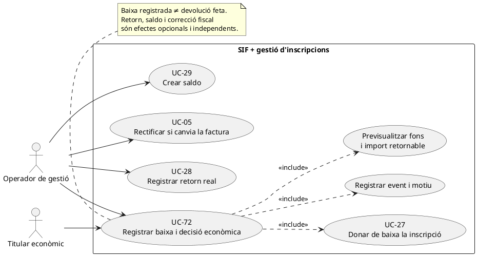
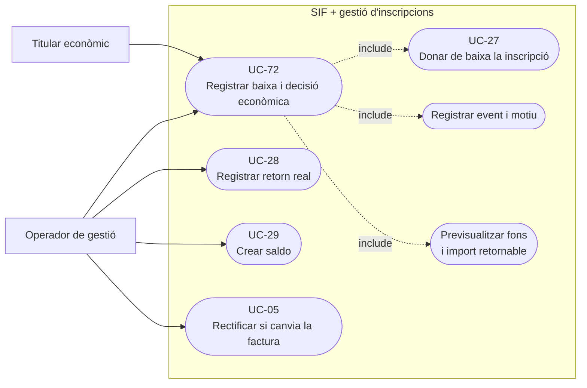
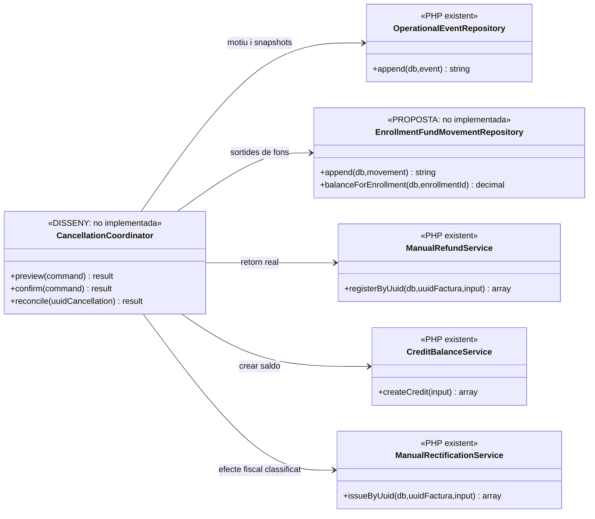
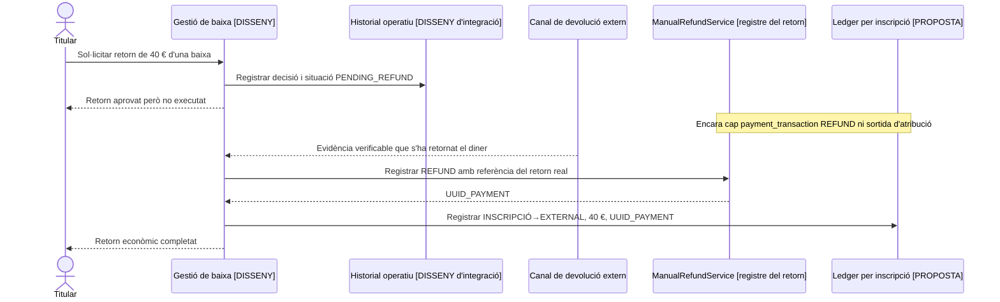
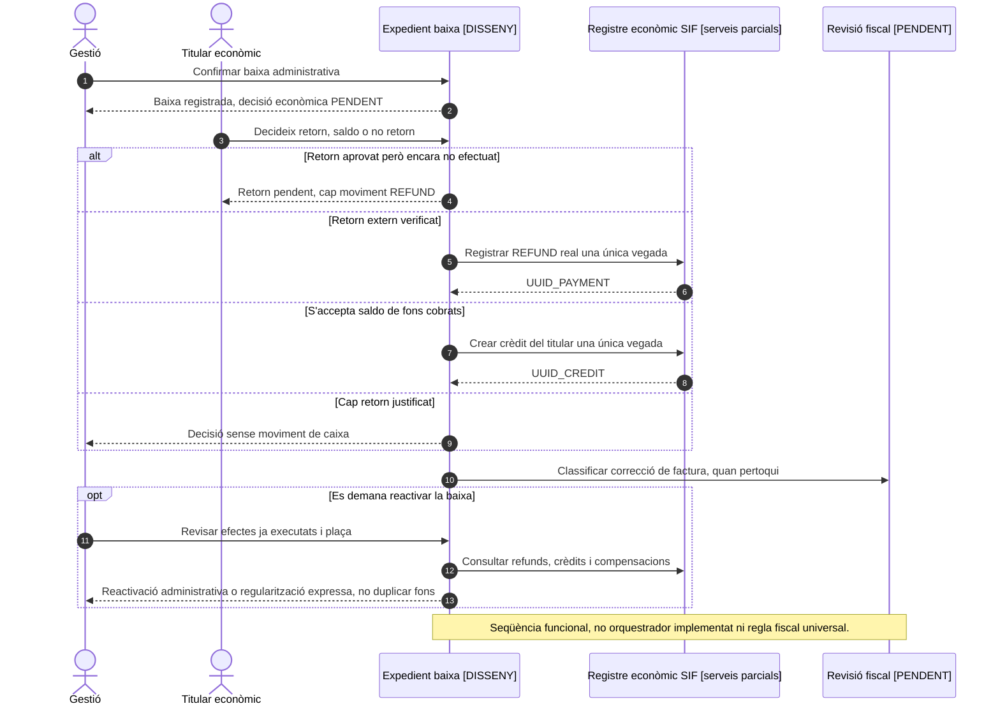

# UC-72 · Registrar baixa i decisió econòmica — fitxa de cas d'ús i UML

**Naturalesa:** expedient que registra la **baixa administrativa** d'una inscripció i la decisió econòmica i fiscal, que poden executar-se en moments diferents. **Estat: DISSENY/PARCIAL.** El catàleg, la migració `enrollment_cancellation_event` i els serveis econòmics parcials existeixen; la fitxa antiga marca `NOT_COMPLETE`. No s'ha acreditat un orquestrador executable de la baixa completa.

**Relacions:** UC-27 (baixa administrativa), UC-06 (decisió econòmica), UC-28 (registrar devolució real), UC-29 (crear saldo), UC-29a (consum posterior) i UC-05 (correcció de factura quan sigui procedent). UC-71 és un **canvi**, no una baixa: no s'han de reutilitzar els moviments A→B quan no existeix inscripció destí.

## 1. Fitxa de cas d'ús

| Camp | Definició del cas |
| --- | --- |
| Actors | Operador de gestió amb permís i titular del dret econòmic (alumne, empresa o responsable segons el pagament original). |
| Disparador | Confirmació de baixa d'una inscripció; el titular ha de triar, quan pertoqui, retorn monetari, saldo o absència de retorn justificada. |
| Entrada administrativa | Inscripció, curs/edició, motiu de baixa, data efectiva, actor i estat anterior; no confondre morositat, anul·lació de curs i cancel·lació d'un registre fiscal. |
| Entrada econòmica | Imports facturats, cobrats i **realment atribuïts a aquesta inscripció**, pagaments fraccionats pendents, pagador/titular i quantitats retornables, retingudes i convertibles en saldo. |
| Entrada fiscal | Identificadors de factura original, estat, servei prestat i classificació de si cal rectificativa o cap canvi fiscal; una baixa no dispara `RegistroAnulacion` d'AEAT. |
| Resultat | Event de baixa i, si n'hi ha, trams de retorn/saldo executats, cadascun amb UUID, import i justificació; incidències i tasques pendents visibles sense fingir completitud. |

### 1.1. Flux funcional objectiu

1. L'operador identifica la inscripció i motiu; es consulten factura, pagaments, titular econòmic i fons atribuïts. Cal calcular import pendent/realment cobrat sense assumir que `A_PAGAR` és diner que es pugui retornar.
2. Es presenta una **previsualització** que separa efecte administratiu de la baixa, import **ja cobrat atribuït**, possible import no retornable i efecte econòmic/fiscal. No es pot mostrar una «devolució feta» si només s'ha aprovat retornar en el futur.
3. La confirmació administrativa registra dades abans/després i identificador de correlació. La migració `enrollment_cancellation_event` permet enllaçar `UUID_OPERATIONAL_EVENT`, `ENROLLMENT_ID`, `CANCELLATION_REASON`, `EFFECTIVE_AT`, `ECONOMIC_DECISION`, `RETURN_AMOUNT`, `CREDIT_AMOUNT`, `NON_RETURN_REASON`, `FISCAL_DECISION`, `UUID_RECTIFYING_INVOICE`, `UUID_REFUND_PAYMENT` i `UUID_CREDIT`.
4. El canvi d'estat de l'alumne/inscripció es coordina amb el llegat i es conserva la traça: **l'esquema de la taula no demostra un writer PHP ni una transacció conjunta amb el llegat.**
5. Es classifica i registra **una decisió econòmica**: `NO_RETORN`, `RETORN`, `SALDO` o repartiment justificat. El titular legítim no es dedueix automàticament de l'alumne inscrit, especialment si pagava una empresa.
6. Si hi ha retorn de diners, **primer** es confirma el reemborsament extern pel canal corresponent i es registra UC-28 amb `payment_transaction REFUND`, import i factura afectada. Només quan hi ha un retorn real es crea la sortida `INSCRIPCIÓ → EXTERNAL` per l'import corresponent.
7. Si el client accepta saldo procedent de fons cobrats, es registra UC-29 a nom del titular correcte i, en el model proposat, `INSCRIPCIÓ → CREDIT` amb import i referència al crèdit. Si no s'han cobrat diners però s'atorga un avantatge comercial, és una **bonificació** diferenciada, no entrada de caixa fictícia.
8. Si la baixa redueix o anul·la el servei/obligació **ja facturats**, es determina l'actuació fiscal apropiada, eventualment UC-05. Si no hi ha variació del servei facturat, no s'emet una rectificativa automàticament només per modificar l'estat acadèmic.
9. L'expedient mostra per separat: baixa registrada, devolució pendent o confirmada, saldo creat/disponible, factura/rectificativa i incidències. No es declara complet mentre falta una fase obligatòria.

### 1.2. Variants i errors

| Escenari | Resposta funcional |
| --- | --- |
| Sense pagament previ | Registrar baixa i decisió; **cap `REFUND` monetari, traspàs ni saldo procedent de diner cobrat** si no hi havia ingressos. |
| Baixa sense retorn segons condicions | Registrar `NON_RETURN_REASON` i l'efecte fiscal revisat; si no hi ha retorn efectiu, **cap sortida fictícia** de fons. |
| Retorn parcial | Desglossar import retornat i import que queda; no suposar que tot el pagament associat a una factura de grup pertany a l'alumne de baixa. |
| Retorn parcial i saldo | Dos trams amb orígens, destins i imports explícits; suma de sortides no superior als fons atribuïts. |
| Pagador empresa | Verificar autorització i titular del retorn/saldo; el nom de l'alumne no identifica per si mateix el creditor. |
| Pagament encara pendent o Redsys en procés | Suspendre o condicionar la decisió monetària fins conèixer el cobrament real; callbacks posteriors han de conciliar-se sense reactivar inscripció automàticament. |
| Baixa de participant d'una factura conjunta | Conservació de factura de tercers; valorar UC-05/16b per la part afectada, i imputació del retorn **només** a l'inscrit que causa baixa. |
| Fallada entre baixa i devolució | Estat administratiu confirmat, operació econòmica pendent, correlació/incidència; no alterar el pagament original ni crear moviment `REFUND` abans del reemborsament real. |
| Sol·licitud repetida | Consultar idempotència/versió de baixa; no crear un segon `credit_balance` ni repetir `REFUND`/sortida per una mateixa operació; control pendent d'implementar. |

### 1.3. Dades i invariant monetària obligatòria

[Revisió de moviments per inscripció](00-revisio-moviments-inscripcions.md). `enrollment_cancellation_event.RETURN_AMOUNT` i `CREDIT_AMOUNT` són imports declarats al context de la decisió; **no substitueixen** les files executades amb `UUID_PAYMENT` o `UUID_CREDIT` i amb inscripció origen. Per exemple, baixa d'inscripció amb 120 € atribuïts: 40 € realment retornats i 80 € reservats com a saldo requereixen **dues sortides diferents**, cap nou `CHARGE`, i total final d'atribució a la inscripció de 0 €. El moviment d'exterior ha d'enllaçar a `REFUND` confirmat i el saldo a `credit_balance`.

**Garanties pendents:** titularitat, disponibilitat per inscripció, política de retorn, idempotència i coordinació amb sistemes diferents. No s'ha afegit cap classe o migració real en aquesta documentació.

### 1.4. Decisió diferida, saldo antic i reactivació — contrast amb el xat original

**Fases del negoci declarades al xat:** (1) la baixa només modifica inicialment l'estat de la inscripció; (2) gestió consulta al client si vol retorn, saldo o no retorn; (3) el retorn bancari/manual es confirma efectivament o el client accepta la creació de saldo; (4) el SIF registra els moviments realment executats; (5) la correcció fiscal s'avalua i tramita si escau; (6) comunicacions i conciliació reflecteixen el resultat. Adam i Pablo intervenen històricament en el procediment, però els permisos finals del SIF s'han de verificar. L'ordre històric d'execució d'una rectificativa no és, per si mateix, una regla normativa general.

**Saldo de baixa antic:** l'usuària estableix que els saldos de baixa **no caduquen automàticament**. Si secretaria detecta un saldo molt antic, per exemple de més de cinc anys, el revisa manualment abans d'usar-lo o tancar-lo. Això **no** estableix una caducitat exacta als cinc anys ni autoritza a esborrar el crèdit. El registre objectiu ha de conservar titular, import d'origen, ja aplicat, disponible, decisió, responsable i data de revisió. No es dona per acreditat que CreditBalanceService o la pantalla ja implementin aquesta alerta.

**Reactivació després de la decisió econòmica:** abans de permetre la reversió administrativa UC-27 cal veure si el retorn és pendent o ja confirmat, si existeix saldo encara disponible o ja consumit, si hi ha compensacions i si s'ha rectificat la factura. No tornar a crear el mateix saldo ni duplicar REFUND; els diners retornats no reapareixen per reactivar una inscripció. Si la reactivació requereix una nova obligació o correcció, crear operacions noves i correlacionades, amb titular i autorització validats; mai reescriure els registres originals.

**Estats funcionals de l'expedient proposats, no codis ni columnes implementats:** BAIXA_CONFIRMADA, DECISIÓ_ECONÒMICA_PENDENT, RETORN_PENDENT, RETORN_CONFIRMAT, SALDO_CREAT, REVISIÓ_FISCAL_PENDENT, TANCADA. L'estat administratiu INSC_CURS no substitueix aquest seguiment; tampoc no es declara TANCADA una baixa si falta una fase obligatòria o hi ha una incidència oberta.
## 2. Diagrama UML de casos d'ús — PlantUML



### Vista de casos d’ús per a GitHub (Mermaid)



## 3. Diagrama de classes: existent i model objectiu



`enrollment_cancellation_event` és un esquema SQL, **no** un `CancellationCoordinator` implementat. Les dependències de l'orquestrador són flux objectiu; les peces existents només implementen subprocessos.

## 4. Diagrama de seqüència — baixa amb devolució o saldo (DISSENY/PARCIAL)

```mermaid
sequenceDiagram
autonumber
actor O as Operador
participant UI as Intranet [pendent]
participant C as CancellationCoordinator [DISSENY]
participant Legacy as BD inscripcions
participant E as OperationalEventRepository [existent]
participant L as EnrollmentFundMovementRepository [PROPOSTA]
participant R as ManualRefundService [existent]
participant Cr as CreditBalanceService [existent]
participant F as Decisor fiscal [pendent]
participant Rect as ManualRectificationService [existent]
O->>UI: Sol·licitar baixa i motiu
UI->>C: preview(inscripció)
C->>Legacy: Consultar estat i pagaments/factura
C->>L: Consultar fons atribuïts a inscripció
L-->>C: Imports i procedència
C-->>UI: Previsualització amb efectes diferenciats
O->>UI: Confirmar baixa i decisió de titular
UI->>C: confirm(comanda idempotent)
C->>C: Validar permisos, versió, titular i disponibilitat
C->>E: append(event baixa, snapshots i correlació)
E-->>C: UUID_OPERATIONAL_EVENT
C->>Legacy: Registrar estat de baixa amb historial
alt Sense retorn o saldo executat
 C-->>UI: Baixa registrada, cap sortida de caixa
else Reemborsament bancari real confirmat
 C->>R: UC-28, registrar REFUND sobre factura afectada
 R-->>C: UUID_PAYMENT retorn
 C->>L: append(INSCRIPCIÓ→EXTERNAL, import, UUID_PAYMENT)
 L-->>C: UUID_MOVEMENT sortida
else Saldo creat de fons cobrats
 C->>Cr: UC-29, crear credit_balance per titular validat
 Cr-->>C: UUID_CREDIT
 C->>L: append(INSCRIPCIÓ→CREDIT, import, UUID_CREDIT)
 L-->>C: UUID_MOVEMENT saldo
end
opt Cal corregir factura emesa
 C->>F: Classificar efecte fiscal
 F-->>C: Via aprovada
 C->>Rect: Iniciar UC-05 si correspon
end
C-->>UI: Estat per fase, UUIDs i pendents
Note over UI,Legacy: Orquestració i registre per inscripció pendents. No suposar commit únic entre BDs.
```

## 5. Seqüència — decisió d'un retorn futur, encara no pagat



**La seqüència descriu el contracte objectiu**, no un callback bancari existent ni un servei que avui coordini aquests passos.

### 5.1. Seqüència — baixa, decisió diferida i eventual reactivació (OBJECTIU)


## 6. Proves mínimes exigibles (no executades)

Baixa sense pagament; baixa sense retorn justificat; pagador empresa; pagament parcial; baixa participant de grup; retorn pendent i posteriorment confirmat; combinació retorn+saldo; duplicate/callback tardà; error després del moviment econòmic; idempotència/reconciliació entre SIF i llegat. Per cada cas comprovar saldo abans/després per inscripció, pagament real, relacions a factura i no aparició de moviments inventats.

### 6.1. Matriu de proves específiques addicionals (no executades)

| ID | Escenari | Evidència exigible |
| --- | --- | --- |
| B72-01 | Baixa amb decisió del client encara pendent | Cap REFUND, saldo ni rectificativa automàtics per clicar baixa. |
| B72-02 | Baixa sense cap cobrament, amb possible factura pendent | No inventar un REFUND/saldo monetari; revisar l'efecte fiscal per separat. |
| B72-03 | Retorn aprovat, però no executat | Estat PENDENT i cap sortida econòmica fins que existeix comprovant. |
| B72-04 | Retorn parcial i saldo en la mateixa baixa | Moviments i imports diferents, suma no superior als fons atribuïts. |
| B72-05 | Saldo de baixa de més de cinc anys | Revisió manual per secretaria, sense caducitat ni eliminació automàtiques. |
| B72-06 | Pagament original d'empresa o responsable | Titular de retorn/saldo validat, no atribuït per defecte a l'alumne. |
| B72-07 | Reactivar amb retorn confirmat, saldo consumit o factura rectificada | Cap reversió de moviments per simple canvi d'estat; operacions noves correlacionades. |
| B72-08 | Doble confirmació de baixa, retorn o creació de saldo | Idempotència i reconciliació; no duplicar crèdit ni pagament REFUND. |
| B72-09 | Fallada de rectificativa/document després de baixa correcta | Fases pendents i incidència visibles; no declarar l'expedient complet. |
## 7. Traçabilitat

[Fitxa anterior UC-72](../06-fitxes-funcionals/uc-072.md) · [UC-27 baixa](uc-027-donar-de-baixa.md) · [UC-06 decisió econòmica](uc-006-devolucio-saldo-compensacio.md) · [Revisió de moviments](00-revisio-moviments-inscripcions.md) · [Fluxos de facturació](../03-canvis-pendents/04-fluxos-facturacio.md) · [Operació i incidències](../04-estat-final/18-estat-final-operacio-incidencies.md) · [Migració d'events](../../sif/database/migrations/2026_09_15_000003_add_functional_audit_control.sql) · [OperationalEventRepository](../../sif/src/Repository/OperationalEventRepository.php) · [ManualRefundService](../../sif/src/Service/ManualRefundService.php) · [CreditBalanceService](../../sif/src/Service/CreditBalanceService.php).
