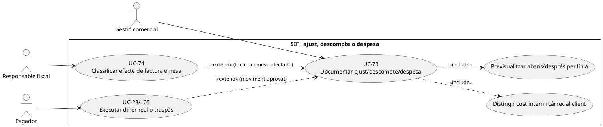
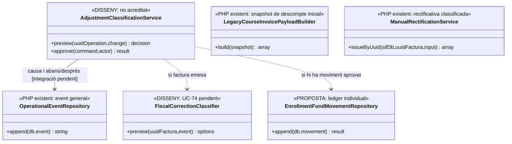
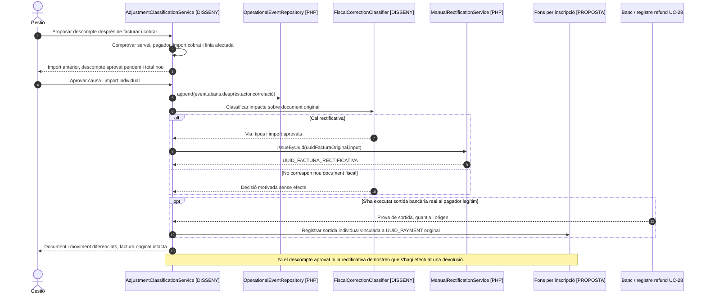

# UC-73 · Documentar un ajust, descompte o despesa amb causa i impacte real

**Objectiu canònic:** registrar valor **anterior/nou**, motiu, aprovació i **línia fiscal quan l'operació amb import ho exigeixi**. Una incidència o despesa administrativa no és automàticament un nou servei facturat. **Estat [DISSENY].** El PHP disposa de builders de factura i rectificativa, però **no s'ha acreditat** un servei d'aprovació general d'ajustos/despeses que classifiqui el seu destí fiscal i monetari abans d'invocar-los.

## 1. Tres naturaleses que no s'han de barrejar

| Fet | Tractament de la fitxa |
| --- | --- |
| Descompte acordat **abans de cobrar/emetre** | Validar elegibilitat i regla comercial; congelar `base`, `discount_amount`, `total`, `discount_origin`, `discount_text` al snapshot de la línia. `LegacyCourseInvoicePayloadBuilder::lineAmounts()` valida aritmètica base–descompte–total, però **no aprova** la causa comercial; el descompte no és un moviment bancari. |
| Ajust de preu **després d'emetre** | Conservar factura i línies antigues. Registrar per què ha canviat el preu del servei i presentar la diferència amb cèntims i `ID_INSC`; **UC-74** decideix document/registre fiscal adequat abans de cap emissió. `ManualRectificationPayloadBuilder` pot construir factura sèrie `R` a partir d'import/motiu/mode aportats, però **no decideix** per si sol si l'ajust ha de ser rectificat. |
| Despesa o càrrec de gestió | Distingir **cost intern de PrisMa**, càrrec comercial que s'ofereix al comprador o penalització/retenció sobre devolució. El primer no genera automàticament una línia a la factura de l'alumne; els altres requereixen contracte, import/base, receptor, règim i classificació concreta. La regla de quantia i quan es pot cobrar **no està acreditada** en el builder fiscal. |

### Camps de la decisió i fonts

`operational_event` està definit amb tipus, `UUID_FACTURA/UUID_PAYMENT` opcionals, `FISCAL_IMPACT`, `ECONOMIC_IMPACT`, causa, snapshot JSON abans/després, hashes, actor i correlació. `OperationalEventRepository::append(PDO, array)` és un writer PHP que pot afegir **l'event general**, però **no s'ha acreditat la connexió executable d'aquest repositori amb tots els formularis d'ajust** ni un validador comercial que apliqui regles específiques de despesa. `factura_linia` conserva concepte, import base, descompte i total del document real emès; **no** s'ha de mutar per anotar-hi un ajust posterior.

## 2. Flux propi de l'ajust

1. Gestió indica **quin fet** passa, a quina inscripció/servei i en quin moment: descompte abans d'emetre, modificació del preu ja facturat, taxa de gestió pactada o simple despesa interna. Consultar receptor, pagador i imports efectivament atribuïts al servei; un pack/grup exigeix identificar la línia/participant concret.
2. Previsualitzar valor original i nou, diferència amb decimals, regla/versió/justificació, qui assumeix l'import i si la variació és **fiscal**, **econòmica**, **acadèmica** o només informativa. Si no està aprovada la base del càrrec/descompte, deixar pendent sense inventar un total de factura.
3. Registrar event abans/després i actor. Per a una **oferta encara no emesa**, regenerar el snapshot comercial i obtenir nova acceptació UC-112/121 si canvia una intenció TPV. Un descompte de 20 € abans de facturar fa que el comprador pagui **el total net**; no registrar un `REFUND` fictici de 20 €.
4. Amb factura ja emesa, UC-74 determina si cal rectificativa, altre registre fiscal o cap efecte; prohibir `UPDATE factura.TOTAL` i `UPDATE factura_linia.DESC_IMPORT`. El fet de reduir un deute **no acredita per si sol** que hagi sortit una devolució bancària.
5. Si el canvi implica diners realment retornats o aplicats a una nova matrícula, UC-28/29/105 registra la sortida externa o el **traspàs intern per import individual**, vinculant l'origen bancari. Si un càrrec addicional es cobra realment, registrar el `CHARGE` nou **només quan l'ingrés existeixi**, associat a la factura correcta, sense recrear el cobrament de la inscripció anterior.
6. Comunicar al pagador autoritzat el resultat **de cada dimensió**: proposta revisada, factura/document corrector si existeix, saldo i retorn pendent/efectuat, inscripció i accés, en lloc d'un únic «ajust aplicat» que amagui fons pendents.

### Escenaris que s'han de provar

| Situació | Control |
| --- | --- |
| Descompte validat tard amb factura ja pagada | UC-90/74 decideix correcció; `REFUND` únicament després d'una sortida real. |
| Canvi de curs de 100 € a 80 € amb una taxa de gestió | Valorar **separadament** diferència del servei i eventual càrrec autoritzat, sense deduir taxes inexistents ni editar el document original. |
| Empresa paga un grup i només un alumne es dona de baixa | Analitzar import atribuït al participant i **titular del pagament**; no retornar el valor a una persona diferent per defecte. |
| Despesa bancària suportada per PrisMa | Comptabilitat interna segons circuit propi; **no** afegir-la automàticament a `factura_linia` com a prestació venuda. |
| Reintent d'un mateix ajust després d'un timeout | Recuperar event/document/moviment de la mateixa causa; no carregar dues vegades ni crear dos correctors. |

**Pendents:** matriu de regles comercials, autorització del càrrec/despesa, política d'ajusts tardans, classificació fiscal, vinculació de `operational_event` a canals/accions i ledger quantitatiu d'inscripcions. No s'han executat tests del flux complet.

### Particularitats del canvi de curs a PrisMa: descompte anterior i despeses incloses

**Fet del llegat.** En un canvi de curs, la intranet recalcula automàticament `A_PAGAR` en funció del nou curs i del descompte anterior **si continua sent aplicable**; si no, el procés el detecta. Les despeses de gestió es calculen segons el tipus de canvi; la documentació indica que el **primer canvi pot ser gratuït** i que en canvis posteriors es poden aplicar despeses segons el cas, sense establir en aquesta fitxa un import universal. L'operador també pot ajustar `A_PAGAR` o les despeses en situacions puntuals, amb un motiu obligatori.

**Representació econòmica històrica.** Les despeses de gestió del canvi de curs **actualment s'inclouen dins l'import final**, no com una línia separada de la factura llegada. Aquesta constatació **no determina** si el model fiscal final ha de fer una línia específica o documentar-ne la causa interna: abans d'emetre o rectificar, cal classificar naturalesa del càrrec, import, receptor i servei amb la persona responsable del criteri fiscal. No inventar una nova prestació facturada per cada cost administratiu intern.

**Comparació completa.** Conservar curs/edició i concepte antic/nou, import facturat inicial, import pendent i cobrat real, descompte antic i aplicabilitat al curs destí, despeses de gestió acordades, valor nou, diferència i decisió del titular econòmic sobre retorn o saldo. Si **l'import final coincideix però canvia el curs/concepte**, no declarar «sense efecte fiscal» per una comparació numèrica: UC-74 classifica si el document original ja no descriu el servei real. Si el curs nou és més car, la diferència només es registra com a `CHARGE` quan es cobra efectivament; si és més barat, la reducció del deute no és un `REFUND` fins que el retorn extern ha tingut lloc.

**Idempotència i historial.** Un mateix canvi pot generar event acadèmic, correcció fiscal, nova diferència pendent i moviment econòmic posterior en instants diferents. Conservar una referència estable al canvi i a cadascun dels seus efectes per recuperar un pas confirmat després d'error, sense tornar a aplicar despeses, descompte, cobrament o rectificativa per un reintent.

### Proves addicionals del canvi de curs (no executades)

| ID | Escenari | Resultat esperat |
| --- | --- | --- |
| AJ-01 | Descompte anterior aplicable al curs nou | Recalcular preu amb regla real i congelar imports abans de nova operació. |
| AJ-02 | Descompte anterior no aplicable al curs nou | Previsualitzar i justificar la variació; no mantenir reducció per simple còpia del camp. |
| AJ-03 | Primer canvi declarat gratuït segons condicions vigents | No afegir despeses de gestió per defecte. |
| AJ-04 | Despesa de gestió inclosa al total del llegat | Conservar origen i import; via de representació fiscal final classificada, no línia inventada automàticament. |
| AJ-05 | Curs/concepte canvia i el total és el mateix | Revisió UC-74 del document original, no només comparació aritmètica. |
| AJ-06 | Curs nou més barat i retorn encara pendent | Diferència i decisió registrades; cap REFUND fins al retorn real. |
| AJ-07 | Reintentar el mateix canvi després d'emetre rectificativa | Recuperar event/document i fons existents, sense repetir càrrec ni document. |

## 3. UML de casos d'ús

## 4. UML de classes — writer d'events existent, política pendent

## 5. UML de seqüència — descompte posterior amb cobrament real

## 6. Traçabilitat

[UC-73 original](../06-fitxes-funcionals/uc-073.md) · [UC-74 classificador](uc-074-classificar-correccio-fiscal.md) · [UC-90 descompte tardà original](../06-fitxes-funcionals/uc-090.md) · [UC-71 canvi de curs](uc-071-registrar-canvi-curs-complet.md) · [UC-28 devolució](uc-028-registrar-devolucio.md) · [OperationalEventRepository](../../sif/src/Repository/OperationalEventRepository.php) · [LegacyCourseInvoicePayloadBuilder](../../sif/src/Service/LegacyCourseInvoicePayloadBuilder.php) · [ManualRectificationService](../../sif/src/Service/ManualRectificationService.php) · [Migració operational_event](../../sif/database/migrations/2026_09_15_000003_add_functional_audit_control.sql).
