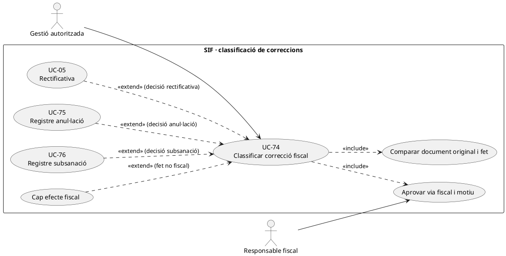
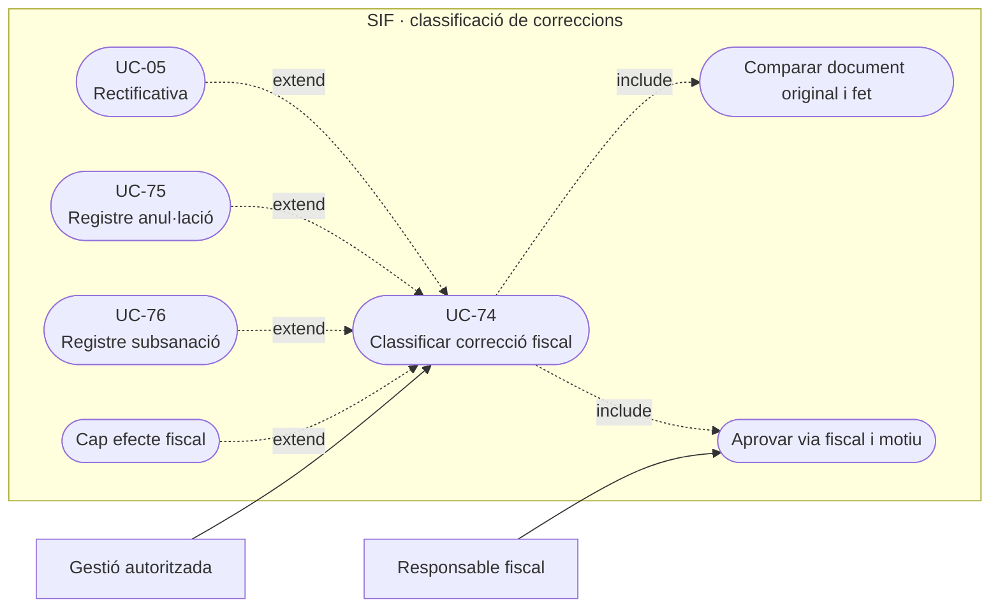
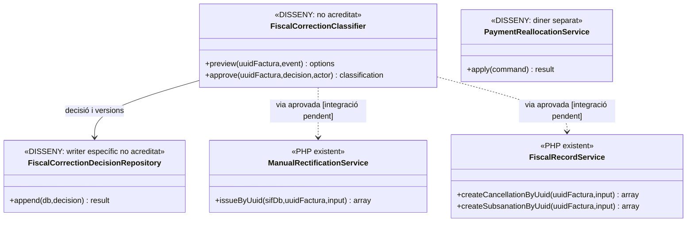
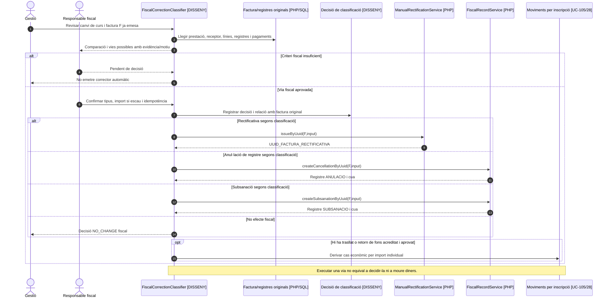

# UC-74 · Classificar una correcció fiscal abans d'executar-la

**Objectiu del catàleg:** distingir **rectificativa, complementària, registre d'anul·lació, registre de subsanació o cap efecte fiscal** segons el fet i les evidències de l'operació; impedir l'`UPDATE` directe de la factura emesa. **Estat [DISSENY/BLOQUEJANT]:** al PHP revisat existeixen **executors concrets** per rectificativa (UC-05), registre d'anul·lació (UC-75) i subsanació (UC-76), però **no s'ha acreditat un `FiscalCorrectionClassifier` que decideixi automàticament la via correcta** ni les condicions reals de cada escenari. Les denominacions del catàleg **no són per si soles una validació jurídica de cada branca**: cal decisió fiscal documentada per cas.

## 1. Dades i distincions

| Via considerada | Fet a documentar i límit contrastat |
| --- | --- |
| Sense efecte fiscal | Canvi de contacte, accés Moodle, preferència documental o moviment intern que **no modifica el contingut fiscal**. Registrar decisió i derivar al cas operatiu corresponent, sense crear `factura_registres` nou. |
| Rectificativa | Correcció de prestació, import, receptor o altra dada fiscal quan la classificació aprovada determina aquesta via. `ManualRectificationService` sí que construeix factura sèrie `R` i crea vincle a `factura_rectificacio`; **no** retorna diners automàticament. |
| Complementària | El catàleg contempla aquesta decisió però **no s'ha localitzat un executor PHP separat ni un contracte tancat de selecció de tipus/import**. No representar-la com a funció actual de `FiscalRecordService`. |
| Registre d'anul·lació | `FiscalRecordService::createCancellationByUuid()` pot crear `ANULACIO` sobre factura SIF amb registre previ. **No és** baixa acadèmica, devolució o rectificativa de servei cancel·lat. El classificador ha de justificar quan la factura/registre és improcedent segons el criteri fiscal validat. |
| Registre de subsanació | `FiscalRecordService::createSubsanationByUuid()` accepta tipus de subsanació concrets i crea registre encadenat; **no** canvia `factura_linia` ni documenta per si sol un servei nou o un ajust d'import. |
| Situació econòmica | `CHARGE`, `REFUND`, `COMPENSATION` i traspassos per `ID_INSC` s'analitzen **separadament**. Una decisió fiscal no acredita entrada/sortida bancària ni duplica un moviment existent. |

### Flux objectiu de classificació

1. Consultar factura original, número, `UUID_FACTURA`, tipus, registres fiscals i estat de cua/AEAT, línies i receptor **immutables**, esdeveniment operatiu que origina la revisió, persones afectades i estat de cobrament real.
2. L'operador previsualitza el **fet**: error de dada a la factura, error de registre, anul·lació d'una prestació, descompte tardà, canvi d'edició, duplicitat de factura o només canvi de contacte. Distingir el fet **econòmic** i la necessitat de retorn de diners del tipus de document/registre fiscal.
3. El classificador **pendent** demana les proves i criteri fiscal aplicables, data/tipus de correcció, receptor, import i registre anterior. Si manca criteri per triar via o l'original no és localitzable, estat `PENDING_DECISION`, sense emetre per intuïció.
4. Registrar decisió amb actor, motiu, abans/després, `REQUEST_ID/CORRELATION_ID`, `UUID_FACTURA` original i referència de l'event. El servei actual de registres d'anul·lació/subsanació **no invoca automàticament aquesta aprovació**.
5. Derivar **una única via fiscal** per la decisió aprovada a UC-05/75/76 o a un executor de complementària **no acreditat**, preservant el document original i els registres previs. Executar per clau idempotent i comprovar resultat existent abans de qualsevol reintent.
6. Derivar independentment, quan pertoqui, UC-28/29/105 per retornar, acreditar saldo o reassignar el valor **que realment correspon a cada inscripció**, sense crear `REFUND` únicament per haver emès una rectificativa ni un segon `CHARGE` per una subsanació.
7. Si la cua AEAT falla després de crear un registre fiscal, UC-77 opera el **mateix registre**, no torna a classificar la incidència com a nova factura.

**Proves pendents:** dos errors de naturalesa distinta en la mateixa factura; sol·licitud d'alumne però receptor empresa; document ja rectificat o cancel·lat; `NO_VERIFACTU` històrica; pagament parcial i devolució tardana; reintent concurrent del mateix event; codis de resposta AEAT. No afirmar que el classificador o la complementària estan implementats.

## 2. UML de casos d'ús

### Vista de casos d’ús per a GitHub (Mermaid)

## 3. UML de classes — classificador absent, executors PHP reals

## 4. UML de seqüència — canvi de curs amb diferència i document previ (DISSENY/PARCIAL)

## 5. Traçabilitat

[UC-74 original](../06-fitxes-funcionals/uc-074.md) · [UC-05 rectificativa](uc-005-rectificar-factura.md) · [UC-75 original](../06-fitxes-funcionals/uc-075.md) · [UC-76 original](../06-fitxes-funcionals/uc-076.md) · [UC-105 fons](uc-105-reassignar-repartir-pagament.md) · [ManualRectificationService](../../sif/src/Service/ManualRectificationService.php) · [FiscalRecordService](../../sif/src/Service/FiscalRecordService.php) · [FiscalRecordPayloadBuilder](../../sif/src/Service/FiscalRecordPayloadBuilder.php) · [Fluxos de facturació](../03-canvis-pendents/04-fluxos-facturacio.md).
