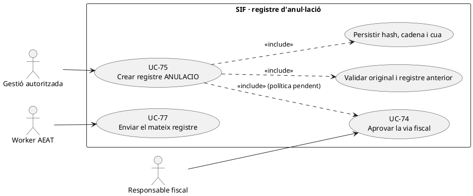
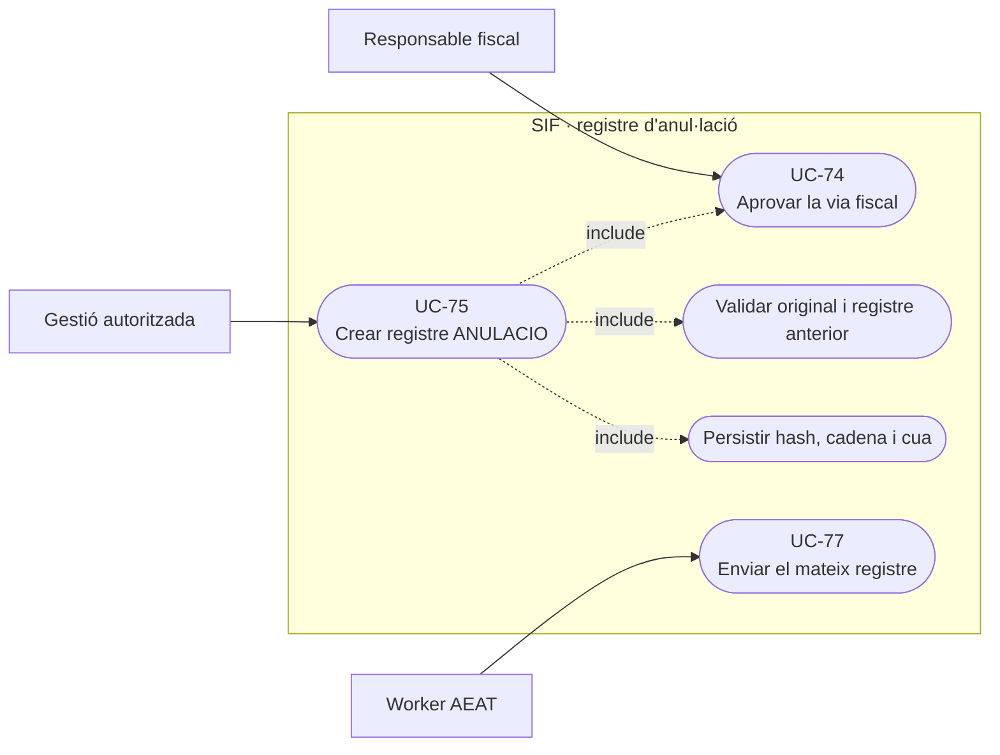
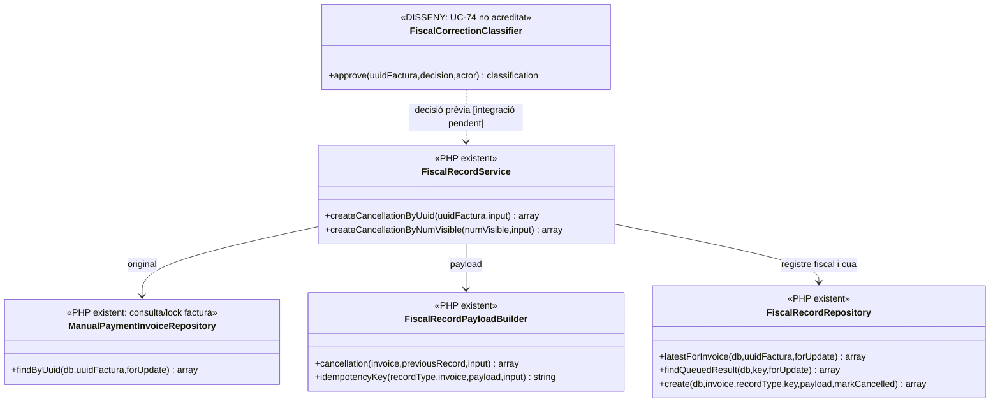
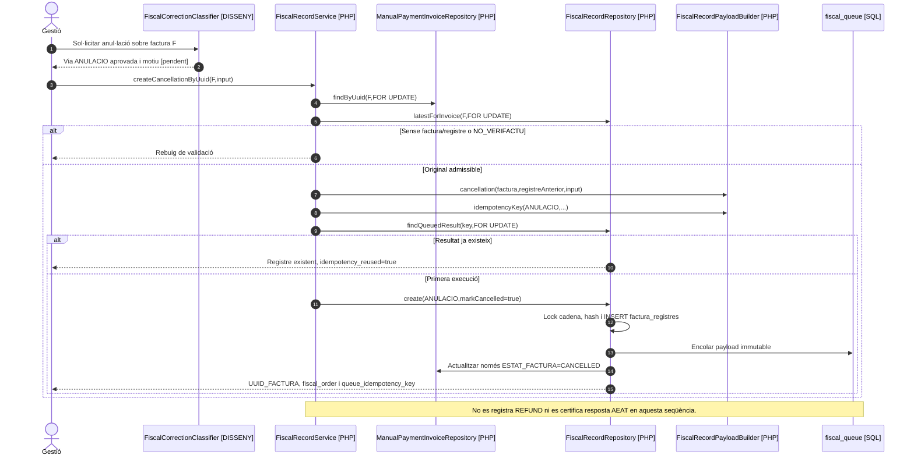

# UC-75 · Crear un registre fiscal d'anul·lació

**Objectiu canònic:** registrar una anul·lació fiscal immutable, encadenada, en cua i vinculada al document original **quan la classificació UC-74 determina que aquesta és la via correcta**. **Estat del catàleg: [DISSENY/BLOQUEJANT], però l'executor PHP de registre d'anul·lació sí existeix.** Pendent: condicions fiscals i circuit d'aprovació/autorització, proves de l'entorn real i coherència completa amb l'AEAT. No confondre amb cancel·lació de matrícula, devolució bancària o factura rectificativa.

## 1. Implementació acreditada i límits

`FiscalRecordService::createCancellationByUuid($uuidFactura,$input)` i `createCancellationByNumVisible()` anomenen el circuit intern `create('ANULACIO',...)`. Dins `TransactionRunner` es recupera la factura amb lock, es rebutja la històrica `NO_VERIFACTU`, es carrega **l'últim** `factura_registres`, es prepara el payload amb `FiscalRecordPayloadBuilder::cancellation()` i es calcula idempotència. Si no existeix registre anterior, es rebutja; si el darrer registre ja és `ANULACIO`, es rebutja una anul·lació nova **excepte si es reutilitza la clau ja trobada**.

`FiscalRecordRepository::create()` bloqueja `fiscal_chain_state`, afegeix **una fila `TIPUS_REGISTRE=ANULACIO`** a `factura_registres` referenciada a la **mateixa `UUID_FACTURA`**, calcula hash i anterior, actualitza cadena i insereix un job `AEAT|<idempotencyKey>` a `fiscal_queue`. També actualitza **`factura.ESTAT_FACTURA=CANCELLED`**; això és un canvi d'estat, **no una edició dels camps fiscals ni una eliminació física de la factura**. El servei retorna identificadors del registre i cua, però no acredita que l'AEAT ja l'hagi acceptat.

`FiscalRecordPayloadBuilder::cancellation()` construeix un payload que conté `aeat_record_type=RegistroAnulacion`, UUID i número de factura, estat original, dades del registre anterior (`ID`, `FISCAL_ORDER`, hash i estat AEAT), **motiu obligatori**, detall/actor/referència opcionals. Si no s'aporta referència, la clau és `ANULACIO|FACT:...|MOTIU:...`. **No s'ha acreditat** en aquest builder el contracte XML definitiu de l'AEAT ni una comprovació jurídica de la causa indicada.

## 2. Fitxa específica i invariants

| Element | Regla |
| --- | --- |
| Actors | Gestió/operador habilitat que demana la correcció, persona responsable del criteri fiscal i worker de la cua AEAT. El mètode PHP rep `input`; **no valida per si sol una aprovació de negoci per rol**. |
| Entrada | `UUID_FACTURA` o `NUM_VISIBLE`, motiu, detall/actor/referència, decisió UC-74, registre anterior i clau idempotent estable. Comprovar si hi ha factura rectificativa, ingrés o operació acadèmica que requeriria una altra via. |
| Persistència real | `factura_registres` append-only en l'ús del servei, hash anterior, `fiscal_chain_state`, `fiscal_queue` i `factura.ESTAT_FACTURA=CANCELLED`. El codi no fa `DELETE` d'`factura` ni `UPDATE` dels seus imports, receptor o línies en aquesta funció. |
| Idempotència | Cerca `fiscal_queue.IDEMPOTENCY_KEY` i reutilitza el mateix registre si el troba. **Risc pendent:** una referència proporcionada pot produir la mateixa clau fins i tot si canvia `reason`; el servei torna el resultat existent sense comprovar equivalència completa del payload nou. |
| Economia | Crear `ANULACIO` **no crea `REFUND`**, no esborra `CHARGE`, no mou imports entre inscripcions i no tramita una transferència bancària. Si hi ha diners implicats, UC-28/29/105 exigeix decisió i registre independent. |
| Estat AEAT | «En cua» no és «acceptat»; conservar eventual rebuig/intent posterior i operar UC-77 sense crear un segon registre per tornar-lo a enviar. |

### Flux funcional amb execució existent i aprovació pendent

1. UC-74 identifica el fet justificat i aprova explícitament que correspon **registre d'anul·lació**, no baixa o correcció ordinària d'una prestació; comprovar permisos i factura original. **Aquest classificador no és part de `FiscalRecordService`.**
2. L'adaptador crida `createCancellationByUuid()` amb motiu i referència idempotent vinculats a l'event. El servei obté factura, comprova `NO_VERIFACTU/HISTORICAL`, llegeix registre anterior i evita una segona anul·lació de l'original.
3. La transacció crea la nova fila fiscal i cua, actualitza la cadena i posa estat `CANCELLED`; si hi ha retry equivalent, retorna el registre de la mateixa clau.
4. El worker UC-77 tracta el job i guarda intents/resposta. L'estat fiscal del registre i l'acceptació efectiva s'han de consultar **separadament** de `ESTAT_FACTURA`.
5. Una inscripció que ja té cobrament **no es dona de baixa ni es retorna** perquè la factura passi a `CANCELLED`; cal expedient econòmic/acadèmic explícit i traça del valor per inscrit.

**Proves pendents:** referència idempotent amb motiu contradictori, anul·lació simultània, invoice `NO_VERIFACTU`, sense registre anterior, després de subsanació, amb pagaments reals, recuperació d'error de cua i contracte XML/AEAT. No s'han executat proves PHP en aquesta revisió.

## 3. UML de casos d'ús

### Vista de casos d’ús per a GitHub (Mermaid)

## 4. UML de classes — dependències PHP efectives

## 5. UML de seqüència — anul·lació real sense devolució

## 6. Traçabilitat

[UC-75 original](../06-fitxes-funcionals/uc-075.md) · [UC-74 classificador](uc-074-classificar-correccio-fiscal.md) · [UC-76 subsanació original](../06-fitxes-funcionals/uc-076.md) · [UC-77 cua original](../06-fitxes-funcionals/uc-077.md) · [FiscalRecordService](../../sif/src/Service/FiscalRecordService.php) · [FiscalRecordRepository](../../sif/src/Repository/FiscalRecordRepository.php) · [FiscalRecordPayloadBuilder](../../sif/src/Service/FiscalRecordPayloadBuilder.php) · [UC-28 retorn](uc-028-registrar-devolucio.md) · [Moviments per inscripció](00-revisio-moviments-inscripcions.md).
