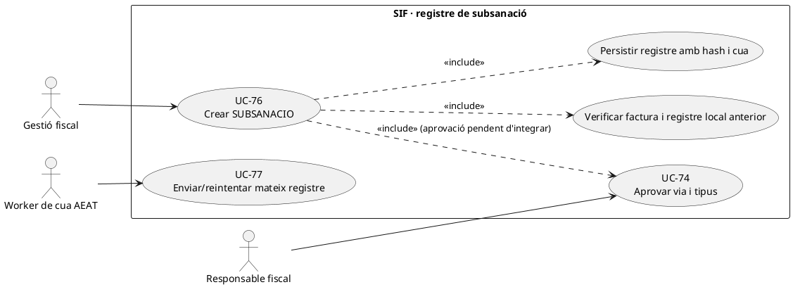
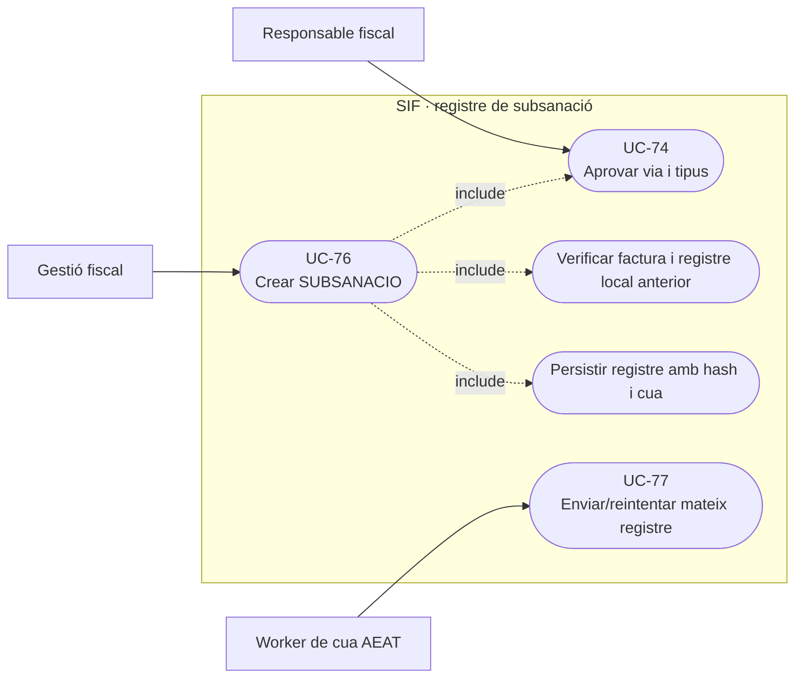
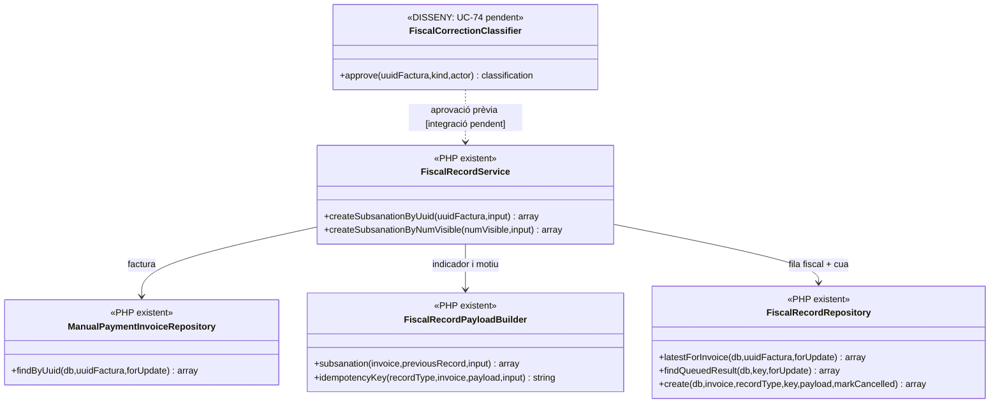
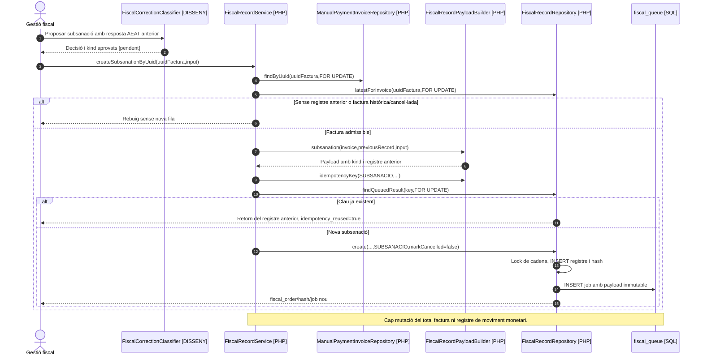

# UC-76 · Crear un registre fiscal de subsanació sense alterar la factura original

**Objectiu canònic:** conservar el registre fiscal anterior, afegir el corrector amb els indicadors corresponents i preservar hash, intents i resposta de l'AEAT. **Estat del catàleg: [DISSENY/BLOQUEJANT], però existeix un executor PHP de subsanació**; el criteri de quan procedeix, l'autorització i la comprovació de conformitat del missatge extern encara requereixen validació. No confondre amb rectificar una prestació o un import.

## 1. Implementació PHP contrastada

`FiscalRecordService::createSubsanationByUuid($uuidFactura,$input)` i `createSubsanationByNumVisible()` executen `create('SUBSANACIO',...)` dins una transacció: recuperen factura amb lock i últim `factura_registres`, rebutgen una factura històrica `NO_VERIFACTU` i una factura amb `ESTAT_FACTURA=CANCELLED`. `FiscalRecordPayloadBuilder::subsanation()` genera `record_type=SUBSANACIO`, `aeat_record_type=Subsanacion`, dades identificadores de l'original i del registre anterior, motiu obligatori i un `subsanation_kind` obligatori. Aquest últim només admet els valors del PHP **`SUBSANACION`, `RECHAZO_PREVIO` o `SIN_REGISTRO_PREVIO`** (amb alias de text `SUBSANACIO`/`SUBSANATION`).

La comprovació `SIN_REGISTRO_PREVIO` és un **valor de l'entrada**, però el servei **igualment exigeix que la factura tingui algun registre fiscal previ** abans de construir el payload. No s'ha acreditat una ruta per crear subsanació a partir d'una factura SIF sense cap registre local, ni que el builder validi les condicions de l'AEAT de cada tipus contra la resposta real del registre anterior.

`FiscalRecordRepository::create()` afegeix `TIPUS_REGISTRE=SUBSANACIO` a la **mateixa `UUID_FACTURA`** amb nou `FISCAL_ORDER`, hash i `HASH_FACT_ANT`, actualitza `fiscal_chain_state` i insereix `fiscal_queue`. **No actualitza `factura.ESTAT_FACTURA`** en aquesta branca (`markCancelled=false`), ni altera `factura_linia`, receptor o import. El fet que el registre estigui en cua no demostra acceptació AEAT.

## 2. Fitxa funcional

| Aspecte | Regla |
| --- | --- |
| Actors | Operador fiscal habilitat, persona responsable que aprova UC-74 i worker de tramesa AEAT; el mètode PHP **no comprova una decisió fiscal aprovada per rol** dins `createSubsanation...`. |
| Entrada | UUID/número de factura, registre anterior, estat/resposta AEAT coneguda, `subsanation_kind`, motiu, `correction_summary` opcional, detall, actor i referència idempotent. |
| Contingut del payload real | `previous_record.id/fiscal_order/tipus_registre/hash/estat_aeat`, `original_invoice_state`, `original_aeat_state`, motiu i indicador. **No** conté una nova línia detallada de factura ni recàlcul d'import. |
| Idempotència | Cerca `fiscal_queue.IDEMPOTENCY_KEY` i reutilitza resultat; si falta referència, clau per factura + motiu + tipus. **Risc pendent:** referència explícita repetida amb `correction_summary` o tipus canviat pot trobar la mateixa clau i retornar registre anterior sense comparar tot el nou payload. |
| Efecte fiscal | Un registre nou immutable per subsanació segons decisió aprovada; no crear rectificativa ni anul·lació per defecte. La decisió entre vies continua a UC-74, **no** al `subsanationKind()` que només valida un enum. |
| Efecte econòmic | `SUBSANACIO` **no emet `CHARGE` ni `REFUND`**, no compensa saldo i no modifica import atribuït a inscripcions; un error de cobrament es tracta al cas econòmic pertinent. |

### Flux real + passos pendents

1. UC-74 recopila factura, registre anterior i evidència de l'estat/retorn AEAT i determina **si aquesta correcció és una subsanació**, amb `subsanation_kind` justificat. Sense criteri o sense resposta verificable, pendent d'aprovació.
2. El canal crida `createSubsanationByUuid()` amb una referència d'operació estable. El servei verifica factura existent i que no és històrica/cancel·lada; carrega l'últim registre local i construeix payload.
3. Amb clau idempotent existent, retorna el registre d'aquella clau. Si es tracta d'un nou event, insereix registre encadenat i cua **en transacció**. Un reintent del mateix event no hauria de produir un segon registre.
4. El worker UC-77 processa el **mateix job** i registra resultat/intents; no convertir un error de transmissió en un segon `SUBSANACIO` sense revisió.
5. Documentar estat del registre anterior i del nou, però no representar `factura.ESTAT_FACTURA` com a «rectificada» per aquest sol canvi; tampoc modificar PDF o text fiscal de la factura original.

**Proves pendents:** kind `SIN_REGISTRO_PREVIO` sense fila local, `RECHAZO_PREVIO` sense resposta de rebuig comprovada, factura `CANCELLED`, clau explícita amb payload contradictori, retry concurrent, cues duplicades i XML/criteris AEAT aplicables. No s'han executat tests en aquesta revisió.

## 3. UML de casos d'ús

### Vista de casos d’ús per a GitHub (Mermaid)

## 4. UML de classes — serveis PHP existents

## 5. UML de seqüència — subsanació d'un registre previ (PHP + aprovació pendent)

## 6. Traçabilitat

[UC-76 original](../06-fitxes-funcionals/uc-076.md) · [UC-74 classificador](uc-074-classificar-correccio-fiscal.md) · [UC-75 anul·lació](uc-075-crear-registre-anullacio.md) · [UC-77 cua original](../06-fitxes-funcionals/uc-077.md) · [FiscalRecordService](../../sif/src/Service/FiscalRecordService.php) · [FiscalRecordPayloadBuilder](../../sif/src/Service/FiscalRecordPayloadBuilder.php) · [FiscalRecordRepository](../../sif/src/Repository/FiscalRecordRepository.php) · [Model de fons](00-revisio-moviments-inscripcions.md).
