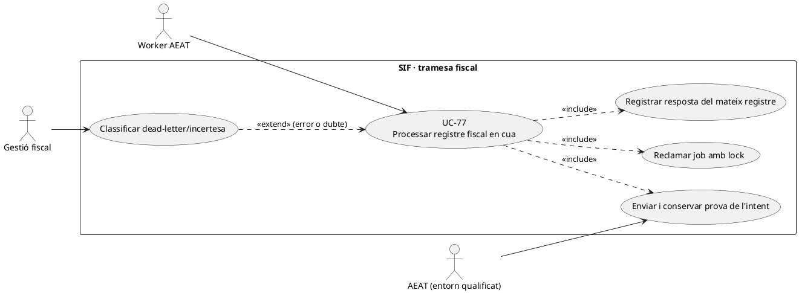
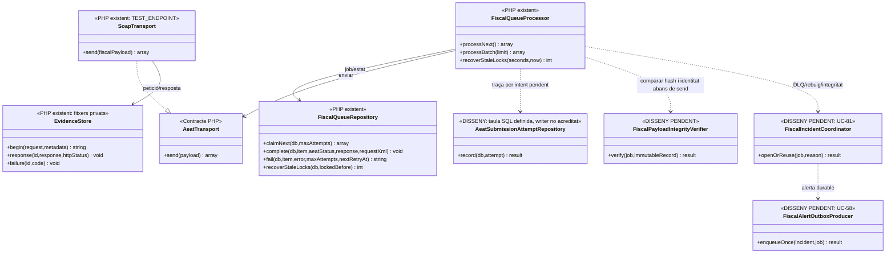

# UC-77 · Operar l'enviament AEAT, els reintents i el dead-letter

**Objectiu de la fitxa original:** persistir cada intent i resposta/CSV/error, reintentar de manera segura i convertir errors no recuperables en incidències. **Estat original: [DISSENY/BLOQUEJANT].** El repositori té una cua i un processador PHP reals; la integració definitiva amb l'AEAT, el circuit de revisió d'enviament incert i la traça SQL **per intent** no s'han d'inferir d'aquests components.

## 1. Implementació contrastada

`FiscalQueueProcessor::processNext()` reclama una entrada amb `FiscalQueueRepository::claimNext()` dins de `TransactionRunner`, envia el `PAYLOAD_JSON` mitjançant `AeatTransport::send()` i només admet `ACCEPTED`, `ACCEPTED_WITH_ERRORS` o `REJECTED` amb resposta estructurada. `FiscalQueueRepository::complete()` fixa `fiscal_queue.STATUS=SENT`, escriu `XML_PAYLOAD`, `AEAT_RESPONSE_JSON`, `ESTAT_AEAT` i `DATE_SENT` al **registre fiscal del mateix `fiscal_order`**, i actualitza `factura.ESTAT_AEAT`. Per tant, **`SENT` no vol dir `ACCEPTED`**: la resposta pot ser `REJECTED`.

Si el transport o el processament fallen, `fail()` posa `RETRY` amb ajornament exponencial o `DEAD_LETTER` en esgotar `maxAttempts` (per defecte 3); aquest últim cas marca `ESTAT_AEAT=ERROR`. `recoverStaleLocks()` retorna a `RETRY` un job que quedava a `PROCESSING`; el processador no pot garantir per si sol que un enviament remot **no s'hagués completat** abans de perdre la resposta.

**Límit especialment important:** `SoapTransport` està restringit pel constructor a `TEST_ENDPOINT` de preproducció; exigeix `payload['aeat']`, genera XML, usa certificat de client i `EvidenceStore` privat per a petició/resposta/errors. `EvidenceStore` pot guardar fitxers per intent, però `FiscalQueueRepository` **no escriu actualment cap fila a `aeat_submission_attempt`**. Aquesta taula existeix al SQL amb `FACTURA_REGISTRE_ID`, `FISCAL_QUEUE_ID`, número d'intent, entorn, hash, estat, HTTP, codi i CSV; falta acreditar-ne el writer i la correlació amb les evidències privades.

## 2. Regles funcionals específiques

| Fet | Contracte |
| --- | --- |
| Job original | `fiscal_queue.ID` + `UUID_FACTURA` + `fiscal_order` identifiquen el registre que s'envia. Un reintent de transport **no crea** una nova `factura`, `factura_registres` ni numeració. |
| Reclamació concurrent | Lock de la fila durant `claimNext()` i increment d'`ATTEMPTS`. Provar dos workers i crash entre petició SOAP i persistència de resposta. |
| Resposta remota | Separar transport fallit/incert, rebutjat, acceptat amb errors i acceptat. `SENT` expressa que `complete()` ha acabat, **no una acceptació**. No barrejar l'estat AEAT del registre amb el cobrament. |
| Traça de cada intent | **DISSENY PENDENT:** emplenar `aeat_submission_attempt` per enviament, vincular hash i prova privada real, conservar codi/CSV i temps sense desar secrets o contrasenya de certificat. L'`ATTEMPTS` agregat de la cua no equival a la història detallada. |
| Dead-letter | Immobilitzar reintents automàtics esgotats, crear expedient UC-81 i decidir si consultar l'estat del registre remot abans de **retransmetre el mateix payload**. No crear una subsanació només perquè ha fallat la xarxa. |
| Entorn i versió | Configuració i endpoints qualificats abans de producció (UC-38/39/83). Que `AeatPreflight::check()` retorni `ready=true` comprova prerequisits locals, **no** una acceptació de l'AEAT. |

### Flux, alternatives i proves

1. L'emissor UC-01 o els executors UC-75/76 creen **un registre fiscal i un job** en la mateixa operació local, abans de qualsevol enviament.
2. El worker reclama el job, obté `fiscal_order` del payload, valida transport configurat i prepara la petició; **pendent** crear una fila durable d'intent abans de sortir a xarxa.
3. Si arriba resposta coherent, es persisteix sobre **el mateix registre**. Amb `ACCEPTED_WITH_ERRORS` o `REJECTED`, el job també pot quedar `SENT`: cal obrir classificació/incidència pel contingut de la resposta, no tractar-lo com un error de connexió que es reintenta a cegues.
4. Davant un timeout, resposta SOAP amb error o lock recuperat, comprovar evidència i eventual estat remot abans del reintent quan el resultat sigui incert. El PHP actual aplica backoff i recuperació de lock, **no acredita una consulta remota de deduplicació**.
5. Quan s'esgoten intents, conservar factura i registre, exposar error, responsable i traça per UC-81; el reprocessament manual i criteri de reobertura del dead-letter són pendents.
6. Provar: cua amb dos workers, transport `REJECTED` amb job `SENT`, timeout després d'acceptació remota, crash després de SOAP i abans del commit, resposta no parsejable, `PAYLOAD_JSON` invàlid, dead-letter i recuperació de lock. **No s'han executat proves en aquesta revisió.**

### 2.1. Historial de cada intent i recuperació de resposta externa incerta

**Una cua no és l'historial d'intents.** `fiscal_queue.ATTEMPTS` compta reclamacions, però no conserva necessàriament **per cada intent** quan s'ha preparat l'XML, hash, entorn, identificador de transport, resposta/CSV ni motiu precís de fallada. La migració de `aeat_submission_attempt` preveu aquest vincle, però el `FiscalQueueRepository` inspeccionat actualitza només cua i registre i **no insereix una fila en aquesta taula**. `EvidenceStore` pot guardar evidències privades de l'intent: cal enllaçar-les a l'ID real del job i `FISCAL_ORDER`, sense assumir que el fitxer físic es reconcilia automàticament amb el SQL.

**Punt de tall entre BD i xarxa.** La reclamació `PROCESSING` i el completat `SENT` són dues transaccions locals diferents, amb `AeatTransport::send()` entremig. En una pèrdua de connexió o caiguda després d'enviar, `recoverStaleLocks()` pot retornar la tasca a `RETRY` **sense** consultar abans el servidor extern. Cal diferenciar `NO_ENVIAT_ACREDITAT`, `RESULTAT_INCERT` i `RESPOSTA_PERSISTIDA` com a **classificacions operatives proposades**, no enums actuals; abans de transmetre de nou una petició incerta, revisar evidència, identitat fiscal i possibilitats de consulta/verificació remota del mateix registre.

**DEAD_LETTER no autoritza una altra alta.** Quan s'esgoten els intents, `fail()` marca la cua `DEAD_LETTER` i el registre/factura en estat `ERROR` local. La factura i el registre original **continuen existint**. Una persona autoritzada ha de recuperar l'event original i decidir reobertura/consulta o cas de correcció fiscal separat, evitant tant una nova emissió `issueInvoice()` com una subsanació automàtica inventada. L'«error» local no és per si mateix una resposta de rebuig de l'AEAT.

### 2.2. Proves d'evidència per intent (no executades)

| ID | Escenari | Resultat exigible |
| --- | --- | --- |
| AF-01 | Timeout després que el servidor hagi rebut el registre | Mateix UUID/fiscal_order i evidència d'incertesa abans de decidir retransmissió. |
| AF-02 | Procés mor després de SOAP i abans de complete() | Reconciliar resposta/evidència; no crear una altra factura o registre. |
| AF-03 | Dos intents d'un mateix job tenen resultat extern diferent | Historial distingit per intent i investigació, sense sobreescriure la prova anterior. |
| AF-04 | DEAD_LETTER sense resposta remota acreditada | Incidència i recuperació controlada del mateix registre, no segona alta. |
| AF-05 | Job SENT + registre REJECTED | Classificació de rebuig, no reintent de xarxa automàtic per la mateixa causa. |

## 3. UML de casos d'ús



## 4. UML de classes — efectiu i proposat



## 5. UML de seqüència — contracte objectiu i diferències respecte del PHP actual

> **DISSENY PENDENT D'IMPLEMENTACIÓ/PROVA.** Les notes `[existent]` reflecteixen codi inspeccionat. Les accions `[pendent]` no s'han de donar per implementades per la mera presència al diagrama. El registre fiscal i la cua es creen prèviament i es confirmen en una transacció local; la crida externa AEAT es fa després del commit.

```mermaid
sequenceDiagram
    autonumber
    actor O as Operador autoritzat
    participant U69 as Confirmació snapshot (UC-69) [parcial]
    participant EM as Emissor SIF (UC-01/75/76) [existent/parcial]
    participant DB as BD SIF
    participant W as FiscalQueueProcessor [existent]
    participant V as Verificador integritat/idempotència [pendent]
    participant T as AeatTransport [existent]
    participant A as AEAT
    participant I as Gestió incidències (UC-81) [pendent]
    participant N as Outbox (UC-58) [pendent]
    O->>U69: Confirmar receptor, imports i versió
    U69-->>EM: Snapshot fiscal confirmat [contracte objectiu]
    EM->>DB: BEGIN; desar factura/registre encadenat i job<br/>amb PAYLOAD_JSON + PAYLOAD_HASH [hash pendent]
    DB-->>EM: COMMIT de registre i job [existent, sense hash de cua]
    Note over DB,W: Cap petició de xarxa abans del commit local.
    W->>DB: claimNext() amb lock, ATTEMPTS = ATTEMPTS + 1 [existent]
    DB-->>W: Job PROCESSING, identificador, registre, payload i hashes
    W->>V: Recalcular hash i contrastar còpia immutable<br/>del registre, identificador fiscal i hash original [pendent]
    alt Hash absent, diferent, registre discordant o altra execució completada
        V-->>W: Bloqueig / conflicte d'integritat o idempotència
        W->>DB: Registrar estat bloquejat i prova, sense enviar [pendent]
        W->>I: Obrir o reutilitzar incidència correlacionada [pendent]
        W->>N: Registrar una alerta idempotent, quan pertoqui [pendent]
    else Mateix registre i payload íntegre
        V-->>W: Validació correcta [pendent]
        W->>DB: Persistir inici intent a aeat_submission_attempt [pendent]
        W->>T: send() amb el mateix payload [existent]
        T->>A: Petició fiscal segons contracte d'integració
        alt Resposta fiscal ACCEPTED
            A-->>T: Resposta estructurada d'acceptació
            T-->>W: ACCEPTED, dades de resposta
            W->>DB: Guardar resposta i evidència; job SENT [complete() existent; detall intent pendent]
        else ACCEPTED_WITH_ERRORS
            A-->>T: Resposta estructurada amb errors
            T-->>W: ACCEPTED_WITH_ERRORS, dades de resposta
            W->>DB: Guardar resposta; job SENT [existent]
            W->>I: Obrir classificació i seguiment, si requereix actuació [pendent]
        else REJECTED formal
            A-->>T: Rebuig estructurat del registre
            T-->>W: REJECTED amb codi i detall
            W->>DB: Conservar resposta definitiva i historial [complete() existent]
            W->>DB: Classificar job DEAD_LETTER de revisió, sense reenvia cec [pendent]
            W->>I: Obrir incidència fiscal UC-81 [pendent]
            W->>N: Encolar alerta idempotent UC-58 [pendent]
        else Timeout, 5xx o resultat desconegut
            T-->>W: Error o resposta indeterminada
            W->>DB: Registrar intent i classificar incertesa [pendent]
            alt Es pot acreditar que no s'ha enviat i ATTEMPTS < maxAttempts
                W->>DB: RETRY; NEXT_RETRY_AT amb backoff [backoff existent]
            else Resultat remot incert
                W->>I: Conciliar evidències i estat remot abans de retransmetre [pendent]
                W->>DB: Retenir job per verificació sense segona alta [pendent]
            else ATTEMPTS >= maxAttempts
                W->>DB: DEAD_LETTER; immobilitzar retries [existent]
                W->>I: Crear o reutilitzar incidència UC-81 [pendent]
                W->>N: Desar alerta de l'error a l'outbox UC-58 [pendent]
            end
        end
    end
    Note over I,N: Incidència i outbox han de ser durables i deduplicables.<br/>Si no es poden registrar, cal una recuperació garantida; no donar l'alerta per enviada.
```

## 6. Traçabilitat

[UC-77 original](../06-fitxes-funcionals/uc-077.md) · [UC-75 anul·lació](uc-075-crear-registre-anullacio.md) · [UC-76 subsanació](uc-076-crear-registre-subsanacio.md) · [UC-81 incidència original](../06-fitxes-funcionals/uc-081.md) · [FiscalQueueProcessor](../../sif/src/Service/FiscalQueueProcessor.php) · [FiscalQueueRepository](../../sif/src/Repository/FiscalQueueRepository.php) · [SoapTransport](../../sif/src/Aeat/SoapTransport.php) · [EvidenceStore](../../sif/src/Aeat/EvidenceStore.php) · [Migració de traça d'intents](../../sif/database/migrations/2026_09_15_000003_add_functional_audit_control.sql).

## 7. Fitxa específica ampliada: integritat del payload, congelació i DLQ

**Estat:** especificació objectiu; **no és un cas verificat** fins a demostrar codi, migracions desplegades, proves i evidències d'AEAT en entorn habilitat. Aquesta secció concreta els punts de la fitxa original sense substituir les observacions de la secció 1.

| Camp | Contracte UC-77 |
| --- | --- |
| Actor principal | `FiscalQueueProcessor` (worker programat); gestió fiscal autoritzada actua només a les excepcions. |
| Disparador | Job `fiscal_queue` creat per l'emissor i confirmat amb el seu registre fiscal. |
| Precondicions | UC-69 ha confirmat i versionat el snapshot quan correspongui; l'emissor ha confirmat **en la mateixa transacció local** factura/registre encadenat/job; `UUID_FACTURA`, `fiscal_order`, hash fiscal i hash del payload original són coherents; credencials i entorn de UC-38 verificats. La integració actual no acredita encara tot el contracte de confirmació UC-69 ni l'ús del hash de cua. |
| Entrades | `fiscal_queue.ID`, `UUID_FACTURA`, `IDEMPOTENCY_KEY`, `PAYLOAD_JSON`, `PAYLOAD_HASH` fiable, identificador de registre/`fiscal_order`, estat i número d'intents, certificat/configuració de transport. |
| Èxit | Petició del mateix registre amb payload íntegre, resultat fiscal interpretat i resposta/evidència vinculades al registre i a l'intent; sense modificar la fotografia fiscal original ni crear una altra factura. |
| Sortides excepcionals | RETRY només en error recuperable amb reintent segur; resultat remot incert en revisió; conflicte d'integritat bloquejat; rebuig definitiu classificat; o DEAD_LETTER amb incidència i alerta persistides. |
| Prohibicions | No regenerar `PAYLOAD_JSON` des de dades vives, no calcular un nou hash com a nova “veritat” després de detectar discrepància, no generar una segona alta perquè hi ha timeout, rebuig o DLQ, ni fer una subsanació automàtica per un error purament de transport. |

### 7.1. Tres regles transversals exigibles

**R-77-01 · Integritat del payload i idempotència.** A l'alta del job, congelar el contingut a transmetre i calcular una empremta SHA-256 sobre una **representació definida i versionada**: bytes exactes persistits o JSON canonicalitzat de manera determinista, però sense barrejar els dos mètodes. Guardar `PAYLOAD_HASH` associat al registre immutable i comprovar-lo després del `claimNext()` i **abans de cada** `send()`. Contrastar també la identitat (`UUID_FACTURA`, `fiscal_order`, tipus ALTA/ANUL·LACIÓ) i el payload del registre de referència; comparar hashes en temps constant quan correspongui. La petjada d'encadenament `HASH_FACT` no es pot substituir pel hash del job. El camp `PAYLOAD_HASH` existeix a la migració `2026_09_16_000004`, però `InvoiceRepository::insertFiscalQueue()` no l'emplena i el processor no el comprova. Jobs antics amb hash nul requereixen migració/verificació contra la font fiscal íntegra o bloqueig, **mai** assumir integritat per absència de hash. Una coincidència de hash no substitueix el control de concurrència, l'estat terminal ni la correlació de reintents amb un eventual enviament extern ja acceptat.

**R-77-02 · Política DLQ i incidència.** `maxAttempts = 3` representa **tres enviaments totals** (inicial + dos reintents), no tres reintents addicionals. Comprovar `ATTEMPTS < maxAttempts` per reprogramar un altre enviament i `ATTEMPTS >= maxAttempts` per a exhauriment; `attempts++` s'efectua en reclamar el job, no dues vegades. Per errors inequívocament temporals, aplicar `min(3600, 60 * 2^(ATTEMPTS-1))` segons els valors per defecte del PHP actual. Un rebuig formal **definitiu** requereix guardar primer la resposta funcional i la seva evidència, classificar el registre i passar-lo a revisió `DEAD_LETTER` segons la política objectiu, obrir o reutilitzar incidència UC-81 i generar un **event** d'alerta idempotent a UC-58. No confondre `SENT` de transport amb acceptació AEAT: actualment `complete()` deixa `SENT` fins i tot amb `REJECTED`; la nova política i transició encara no estan implementades. `ACCEPTED_WITH_ERRORS` requereix classificació de les incidències concretes, no DLQ automàtica indiscriminada. No es pot afirmar que l'alerta s'hagi enviat perquè existeix una fila a l'outbox. L'entrada DLQ és la fila original de `fiscal_queue` amb `STATUS=DEAD_LETTER`; una cua física nova és opcional i no està acreditada.

**R-77-03 · Congelació i frontera transaccional.** UC-69 resol la **confirmació funcional** del snapshot abans d'emetre, mentre UC-01/75/76 persisteixen la fotografia fiscal immutable, la cadena i el job amb el seu hash de contingut dins una transacció local única. El worker només pot reclamar feina després del `COMMIT`. La xarxa/AEAT i l'enviament del correu es fan **fora** d'aquesta transacció; no prometre atomicitat de la BD amb AEAT ni amb el proveïdor de notificacions. Un canvi fiscal posterior exigeix el cas legal/fiscal adequat (UC-74/75/76) i mai un `UPDATE` silenciós del payload ja confirmat. La implementació existent confirma registre+job en l'emissió, però la confirmació versionada prèvia de UC-69 i el hash de cua queden pendents.

### 7.2. Flux i alternatives verificables

1. **Emissió confirmada.** Rebre el snapshot autoritzat de UC-69, crear el registre amb hash fiscal i serialitzar un payload estable. En la mateixa transacció local, desar registre, `PAYLOAD_JSON`, `PAYLOAD_HASH` i job. Fer commit abans d'activar el worker.
2. **Reclamació concurrent.** Reservar el job elegible i augmentar una sola vegada `ATTEMPTS`; tornar a comprovar estat terminal i identitat fiscal. Registrar inici d'intent a `aeat_submission_attempt` abans de la xarxa (writer pendent).
3. **Verificació prèvia.** Recalcular hash segons la versió definida; comparar amb hash inicial i còpia fiscal de confiança. Per discrepància, hash nul injustificat o identitat conflictiva: **cap enviament**, bloqueig, traça i incidència; no “reparar” modificant el job.
4. **Enviament i resposta.** Fer `send()` del mateix contingut. Interpretar resultat fiscal real (`ACCEPTED`, `ACCEPTED_WITH_ERRORS`, `REJECTED`), conservar resposta, referències/CSV quan realment constin, XML i dades de l'intent. HTTP 200 només indica èxit de transport HTTP.
5. **Rebuig definitiu.** Registrar resposta funcional, classificar causa i entrar al circuit DLQ/UC-81/UC-58 sense alterar el registre ni executar immediatament UC-76; la correcció/subsanació s'ha de determinar pel cas fiscal real.
6. **Fallada temporal o incertesa.** Un error inequívocament anterior a l'enviament pot generar RETRY segons límit i backoff. Timeout, 5xx, caiguda post-SOAP o recuperació de lock **no acrediten** que AEAT no hagi rebut l'alta: retenir/reconciliar evidència i estat remot abans d'un eventual reenviament del mateix registre. Exhaurit el límit, passar a `DEAD_LETTER`, obrir incidència i crear alerta persistent.
7. **Consistència d'alertes.** Estat DLQ, creació/deduplicació d'incidència i inserció de notificació han de tenir transició durable o mecanisme de compensació idempotent. Si fallen UC-81 o UC-58, registrar un pendent recuperable; no marcar com a complet un circuit d'alerta parcial.

### 7.3. Transicions d'estat (contracte objectiu, no enums acreditats)

| Condició | Cua fiscal | Estat de resposta fiscal | Incidència i notificació |
| --- | --- | --- | --- |
| Job íntegre, pendent i elegible | `PENDING/RETRY → PROCESSING` | Sense resposta nova | Traça d'intent. |
| Resposta `ACCEPTED` | `PROCESSING → SENT` | `ACCEPTED` | Desar evidència; sense alerta automàtica. |
| `ACCEPTED_WITH_ERRORS` | `PROCESSING → SENT` | `ACCEPTED_WITH_ERRORS` | Classificar els errors que requereixin actuació. |
| Rebuig formal definitiu | `PROCESSING → DEAD_LETTER` **[pendent]** | `REJECTED` i resposta original conservada | UC-81 i event d'alerta UC-58. |
| Error recuperable, enviament descartat i intents disponibles | `PROCESSING → RETRY` | Sense acceptació inferida | Backoff i intent individual. |
| Resultat remot indeterminat | Revisió/bloqueig **[pendent]** | `UNKNOWN` operatiu, no inventar resposta AEAT | Conciliació UC-81 abans de retransmetre. |
| `ATTEMPTS >= maxAttempts` sense resolució | `PROCESSING → DEAD_LETTER` | Estat local d'error, diferenciat de rebuig AEAT | UC-81 i outbox UC-58. |
| Hash o identitat del registre no coincideix | Bloquejat **[pendent d'estat/schema]** | No enviar ni declarar rebuig extern | Incidència d'integritat i alerta quan pertoqui. |

### 7.4. Proves d'acceptació pendents (no executades)

| ID | Escenari | Evidència/criteri de pas |
| --- | --- | --- |
| UC77-INT-01 | Alterar un byte fiscal del job després de congelar-lo | El worker no crida `send()`, no canvia hash original, deixa prova i obre incidència correlacionada. |
| UC77-INT-02 | `PAYLOAD_HASH` nul en una feina històrica | Verifica amb font immutable i migració explícita o bloqueja; no envia automàticament. |
| UC77-IDEM-03 | Dos workers reclamen el mateix job | Un únic claim efectiu; no duplicar factura, registre, ordre fiscal o petició concurrent. |
| UC77-IDEM-04 | Crash després de SOAP i abans de guardar la resposta | Registre/UUID intactes; resposta incerta reconciliada abans de qualsevol reenviament. |
| UC77-DLQ-05 | Tres errors temporals acreditadament no enviats | Exactament tres intents totals; ajornament dels dos primers; DEAD_LETTER al tercer, UC-81 i outbox UC-58 sense duplicats. |
| UC77-DLQ-06 | Resposta funcional `REJECTED` amb HTTP 200 | No marcar ACCEPTED; preservar rebuig i derivar a revisió; no reintentar cegament ni subsanar automàticament. |
| UC77-DLQ-07 | `ACCEPTED_WITH_ERRORS` | Guardar resultat independent d'HTTP; classificar, sense rebuig genèric o segona alta. |
| UC77-TX-08 | Rollback entre registre i inserció de job/hash | Cap job publicat per un registre no confirmat; cap crida externa. |
| UC77-TX-09 | Crash després del commit i abans del claim | Job íntegre recuperable amb hash original i mateix registre. |
| UC77-OUT-10 | Cau la inserció a l'outbox després del dead-letter | Pendent d'alerta recuperable i deduplicable; no declarar alerta enviada. |
| UC77-TRC-11 | Reprocessament manual autoritzat d'una DLQ | Identificador, registre, payload i cadena originals, historial d'intents i decisió documentada; permisos comprovats al servidor. |

### 7.5. Matriu mínima d'implementació i traçabilitat

| Contracte | Codi/dada del repositori | Diferència que s'ha de tancar |
| --- | --- | --- |
| R-77-01 | `InvoiceRepository::insertFiscalQueue()`; `fiscal_queue.PAYLOAD_JSON/PAYLOAD_HASH`; `factura_registres.PAYLOAD_JSON/HASH_FACT` | Emplenar hash fiable en origen i verificar contingut/identitat abans de `AeatTransport::send()`; política per a jobs heretats. |
| R-77-02 | `FiscalQueueProcessor::failure()`, `FiscalQueueRepository::fail()/complete()`, `aeat_submission_attempt` | Distingir error incert/rebuig formal, persistir cada intent, coordinar DLQ amb UC-81/UC-58 i deduplicar alertes. |
| R-77-03 | UC-69; `InvoiceService::issueInvoice()`; `InvoiceRepository::createInvoiceGraph()`; `TransactionRunner` | Confirmació funcional versionada del snapshot i hash de cua en el mateix commit d'emissió; proves rollback/crash. |
| Incidències | `IncidentRepository`, `errors_verifactu`, `sif_incident_action`; UC-81 | Escriptor/assignació automàtica i recuperació d'alertes fallides. |
| Notificacions | `notification_outbox`, `notification_delivery_attempt`; UC-58 | Productor d'alerta fiscal, worker d'enviament i política idempotent; distingir encolar i lliurar. |

**No verificat en aquesta revisió:** execució de les proves anteriors, una conciliació remota AEAT de resultats incerts, la integració de DLQ amb incidències/outbox, i el desplegament de la política de hash. El codi PHP existent tampoc es modifica amb aquesta actualització documental.
