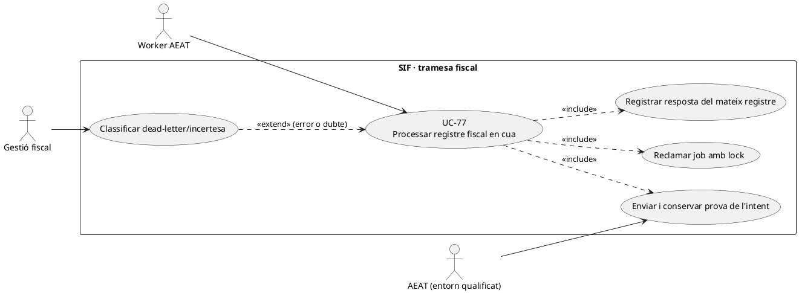
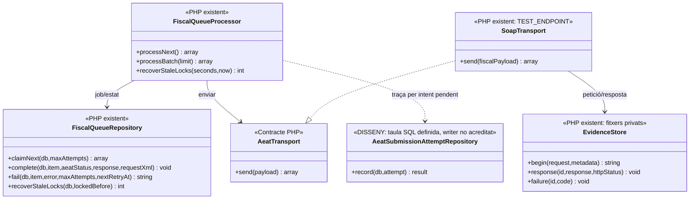
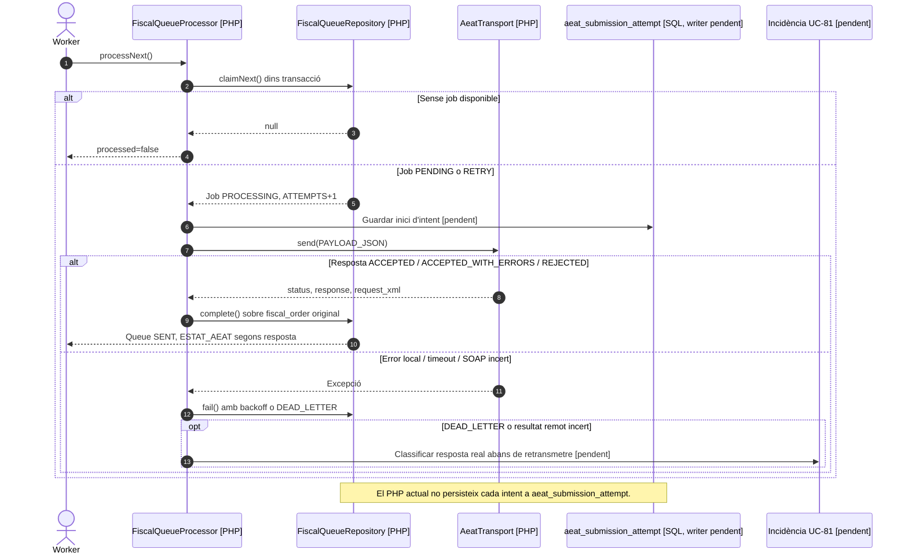

# UC-77 · Operar l'enviament AEAT, els reintents i el dead-letter

**Objectiu de la fitxa original:** persistir cada intent i resposta/CSV/error, reintentar de manera segura i convertir errors no recuperables en incidències. **Estat original: [DISSENY/BLOQUEJANT].** El repositori té una cua i un processador PHP reals; la integració definitiva amb l'AEAT, el circuit de revisió d'enviament incert i la traça SQL **per intent** no s'han d'inferir d'aquests components.

## 1. Implementació contrastada

`FiscalQueueProcessor::processNext()` reclama una entrada amb `FiscalQueueRepository::claimNext()` dins de `TransactionRunner`, envia el `PAYLOAD_JSON` mitjançant `AeatTransport::send()` i només admet `ACCEPTED`, `ACCEPTED_WITH_ERRORS` o `REJECTED` amb resposta estructurada. `FiscalQueueRepository::complete()` fixa `fiscal_queue.STATUS=SENT`, escriu `XML_PAYLOAD`, `AEAT_RESPONSE_JSON`, `ESTAT_AEAT` i `DATE_SENT` al **registre fiscal del mateix `fiscal_order`**, i actualitza `factura.ESTAT_AEAT`. Per tant, **`SENT` no vol dir `ACCEPTED`**: la resposta pot ser `REJECTED`.

Si el transport o el processament fallen, `fail()` posa `RETRY` amb ajornament exponencial o `DEAD_LETTER` en esgotar `maxAttempts` (per defecte 3); aquest últim cas marca `ESTAT_AEAT=ERROR`. `recoverStaleLocks()` retorna a `RETRY` un job que quedava a `PROCESSING`; el processador no pot garantir per si sol que un enviament remot **no s'hagués completat** abans de perdre la resposta.

**Límit especialment important:** `SoapTransport` està restringit pel constructor a `TEST_ENDPOINT` de preproducció; exigeix `payload['aeat']`, genera XML, usa certificat de client i `EvidenceStore` privat per a petició/resposta/errors. `EvidenceStore` pot guardar fitxers per intent, però `FiscalQueueRepository` **no escriu actualment cap fila a `aeat_submission_attempt`**. Aquesta taula existeix al SQL amb `FACTURA_REGISTRE_ID`, `FISCAL_QUEUE_ID`, número d'intent, entorn, hash, estat, HTTP, codi i CSV; falta acreditar-ne el writer i la correlació amb les evidències privades.

## 2. Regles funcionals específiques

| Fet | Contracte |
| --- | --- |
| Job original | `fiscal_queue.ID` + `UUID_FACTURA` + `fiscal_order` identifiquen el registre que s'envia. Un reintent de transport **no crea** una nova `factura`, `factura_registres` ni numeració. |
| Reclamació concurrent | Lock de la fila durant `claimNext()` i increment d'`ATTEMPTS`. Provar dos workers i crash entre petició SOAP i persistència de resposta. |
| Resposta remota | Separar transport fallit/incert, rebutjat, acceptat amb errors i acceptat. `SENT` expressa que `complete()` ha acabat, **no una acceptació**. No barrejar l'estat AEAT del registre amb el cobrament. |
| Traça de cada intent | **DISSENY PENDENT:** emplenar `aeat_submission_attempt` per enviament, vincular hash i prova privada real, conservar codi/CSV i temps sense desar secrets o contrasenya de certificat. L'`ATTEMPTS` agregat de la cua no equival a la història detallada. |
| Dead-letter | Immobilitzar reintents automàtics esgotats, crear expedient UC-81 i decidir si consultar l'estat del registre remot abans de **retransmetre el mateix payload**. No crear una subsanació només perquè ha fallat la xarxa. |
| Entorn i versió | Configuració i endpoints qualificats abans de producció (UC-38/39/83). Que `AeatPreflight::check()` retorni `ready=true` comprova prerequisits locals, **no** una acceptació de l'AEAT. |

### Flux, alternatives i proves

1. L'emissor UC-01 o els executors UC-75/76 creen **un registre fiscal i un job** en la mateixa operació local, abans de qualsevol enviament.
2. El worker reclama el job, obté `fiscal_order` del payload, valida transport configurat i prepara la petició; **pendent** crear una fila durable d'intent abans de sortir a xarxa.
3. Si arriba resposta coherent, es persisteix sobre **el mateix registre**. Amb `ACCEPTED_WITH_ERRORS` o `REJECTED`, el job també pot quedar `SENT`: cal obrir classificació/incidència pel contingut de la resposta, no tractar-lo com un error de connexió que es reintenta a cegues.
4. Davant un timeout, resposta SOAP amb error o lock recuperat, comprovar evidència i eventual estat remot abans del reintent quan el resultat sigui incert. El PHP actual aplica backoff i recuperació de lock, **no acredita una consulta remota de deduplicació**.
5. Quan s'esgoten intents, conservar factura i registre, exposar error, responsable i traça per UC-81; el reprocessament manual i criteri de reobertura del dead-letter són pendents.
6. Provar: cua amb dos workers, transport `REJECTED` amb job `SENT`, timeout després d'acceptació remota, crash després de SOAP i abans del commit, resposta no parsejable, `PAYLOAD_JSON` invàlid, dead-letter i recuperació de lock. **No s'han executat proves en aquesta revisió.**

## 3. UML de casos d'ús

## 4. UML de classes — efectiu i proposat

## 5. UML de seqüència — resposta de transport i cua

## 6. Traçabilitat

[UC-77 original](../06-fitxes-funcionals/uc-077.md) · [UC-75 anul·lació](uc-075-crear-registre-anullacio.md) · [UC-76 subsanació](uc-076-crear-registre-subsanacio.md) · [UC-81 incidència original](../06-fitxes-funcionals/uc-081.md) · [FiscalQueueProcessor](../../sif/src/Service/FiscalQueueProcessor.php) · [FiscalQueueRepository](../../sif/src/Repository/FiscalQueueRepository.php) · [SoapTransport](../../sif/src/Aeat/SoapTransport.php) · [EvidenceStore](../../sif/src/Aeat/EvidenceStore.php) · [Migració de traça d'intents](../../sif/database/migrations/2026_09_15_000003_add_functional_audit_control.sql).
