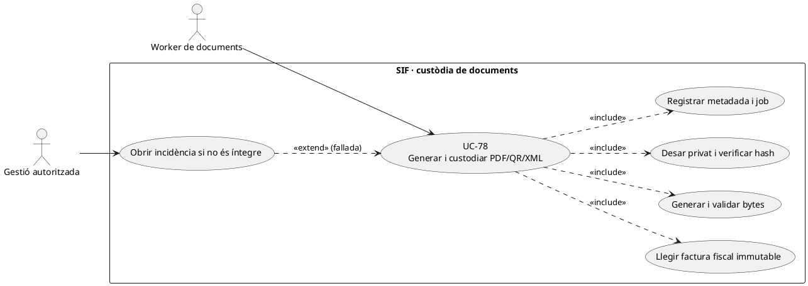
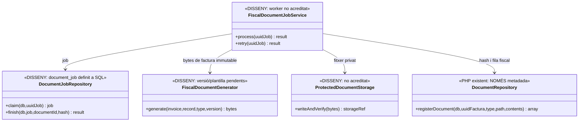

# UC-78 · Generar i custodiar PDF, QR i XML fiscals

**Objectiu del catàleg:** job de generació, versió, fitxer privat, hash, estat i incidència. **Estat [PARCIAL/DISSENY]:** existeix repositori PHP de **metadades** del document, no s'ha acreditat un generador/custodi complet que escrigui i verifiqui els bytes de PDF, QR i XML a partir del registre fiscal.

## 1. Fonts i separació d'artefactes

`DocumentRepository::registerDocument(PDO,uuidFactura,type,path,contents)` admet els tipus `PDF`, `XML` o `QR`, calcula `sha256(contents)` i insereix `UUID_FACTURA,TIPUS,PATH_FITXER,HASH_FITXER,ESTAT='CREATED'` a `factura_documents`. **No escriu cap fitxer a `path`** ni comprova l'existència, permisos o integritat del fitxer allà emmagatzemat. Per tant, una fila `CREATED` és només metadada, **no prova que existeixi el PDF/QR/XML llegible**.

La migració d'auditoria defineix `document_job` amb `UUID_FACTURA`, `DOCUMENT_TYPE`, `IDEMPOTENCY_KEY`, `GENERATOR_VERSION`, `STATUS/ATTEMPTS/MAX_ATTEMPTS`, lock, `FACTURA_DOCUMENT_ID`, `STORAGE_KEY`, `OUTPUT_HASH` i correlació. **No s'ha acreditat** un worker PHP de `document_job`, ni versió de plantilles i validació final d'aquests artefactes. `EvidenceStore` de `sif/src/Aeat` sí que desa **fitxers privats de petició/resposta de transport AEAT**, però això **no equival** a la custòdia del PDF/QR/ XML fiscal destinat al receptor.

## 2. Fitxa funcional específica

| Unitat | Contracte |
| --- | --- |
| Origen immutable | `UUID_FACTURA`, `NUM_VISIBLE`, tipus fiscal, línies, total/receptor i `factura_registres` adequat, hash, estat i versió del generador. No reconstruir un document emès llegint preus o dades mestres **vigents** del curs. |
| PDF | Document de factura identificat i accés protegit; referenciar el registre/snapshot correcte i el contingut requerit pel format/versió aplicables. La maquetació i validació del PDF definitiu **no s'han acreditat** al SIF consultat. |
| QR | Distingir contingut fiscal de QR i **l'arxiu d'imatge QR**; registrar tipus `QR` només després de verificar la representació real. No crear un identificador/URL inventat quan falta la dada fiscal necessària. |
| XML | Diferenciar XML de tramesa AEAT, XML de factura electrònica al destinatari (UC-123) i metadada `factura_documents.TIPUS=XML`. No afirmar que un XML arbitrari compleix tots els formats pel simple fet de registrar-lo. |
| Custòdia | Un worker **pendent** desa bytes en storage privat, verifica hash després de l'escriptura, controla ruta, ACL i retenció, i finalment associa el document/versió al job. El hash s'ha de calcular sobre **bytes reals**; no sobre un nom de fitxer. |
| Idempotència | Per factura + tipus + versió del generador i contingut fiscal concret; un retry després de timeout reusa artefacte vàlid o verifica si el storage ja té la mateixa sortida. No crear 2 PDFs «originals» contradictoris per la mateixa factura i versió. |
| Estat econòmic i fiscal | Generar document no crea `CHARGE/REFUND`, no reemeteix factura i **no acredita enviament/acceptació AEAT**. UC-77/123/80 governen respectivament transport fiscal, lliurament electrònic i consulta autoritzada. |

### Flux objectiu

1. Després de persistir factura i registre, programar un `document_job` idempotent amb tipus/versió i payload basat en **la factura emesa**, no en `A_PAGAR` actual de l'inscrit.
2. El worker **pendent** reclama job i llegeix snapshot/registre. Genera cada artefacte segons plantilla i regla aprovades, i valida renderitzat, dades, hash i relació de QR/XML amb el registre fiscal.
3. Escriu els bytes fora de l'àrea pública, comprova que el fitxer es pot tornar a llegir i compara SHA-256, aleshores crida `DocumentRepository::registerDocument()` amb el contingut real, `PATH_FITXER` opac i referència de job.
4. Marca `document_job` complet **només després de verificar bytes i metadada**. Si només existeix fila a `factura_documents` però ha fallat la persistència real, conservar error/reintent; no presentar «document llest».
5. Si es descobreix error fiscal del contingut original, UC-74 classifica la correcció del registre/document; **no** substituir de forma opaca un PDF previ deixant el mateix hash/metadada.
6. Exposar l'artefacte per UC-80 o enviar-lo per UC-123/79 sota permís específic, amb traça d'accés/lliurament separada.

**Proves:** falla escriptura després de generar bytes, fila `CREATED` però arxiu absent, hash discordant, worker duplicat, dos generadors amb versions diferents, QR inconsistent amb registre, XML no vàlid, factura rectificada, recuperar un document sense alterar factura. Cap prova de renderitzat ni generació end-to-end executada aquí.

## 3. UML de casos d'ús



## 4. UML de classes — metadada PHP i worker pendent



## 5. UML de seqüència — fitxer absent malgrat metadada (DISSENY/PARCIAL)

```mermaid
sequenceDiagram
autonumber
actor W as Worker
participant J as FiscalDocumentJobService [DISSENY]
participant DB as document_job [SQL]
participant G as FiscalDocumentGenerator [DISSENY]
participant S as ProtectedDocumentStorage [DISSENY]
participant R as DocumentRepository [PHP]
W->>J: process(UUID_JOB)
J->>DB: Reclamar job i llegir UUID_FACTURA + versió
J->>G: Generar i validar PDF/QR/XML del registre immutable
G-->>J: Bytes i tipus validats
J->>S: writeAndVerify(bytes) i relectura privada
alt Storage falla o hash difereix
 S-->>J: Error sense confirmació
 J->>DB: ERROR/RETRY i prova; no declarar CREATED usable
else Storage confirma bytes i hash
 S-->>J: STORAGE_KEY i hash verificat
 J->>R: registerDocument(db,uuidFactura,type,path,contents)
 R-->>J: HASH_FITXER i fila CREATED
 J->>DB: Vincular FACTURA_DOCUMENT_ID i completar job
end
Note over S,R: registerDocument() no escriu bytes; la custòdia real és disseny pendent.
```

## 6. Traçabilitat

[UC-78 original](../06-fitxes-funcionals/uc-078.md) · [UC-36 documents](uc-036-generar-consultar-documents.md) · [UC-55 custòdia](uc-055-custodiar-reintentar-documents.md) · [UC-77 AEAT](uc-077-operar-enviament-aeat-retry-dead-letter.md) · [UC-123 lliurament electrònic](uc-123-lliurar-factura-electronica.md) · [DocumentRepository](../../sif/src/Repository/DocumentRepository.php) · [EvidenceStore AEAT](../../sif/src/Aeat/EvidenceStore.php) · [Esquema document_job](../../sif/database/migrations/2026_09_15_000003_add_functional_audit_control.sql).
