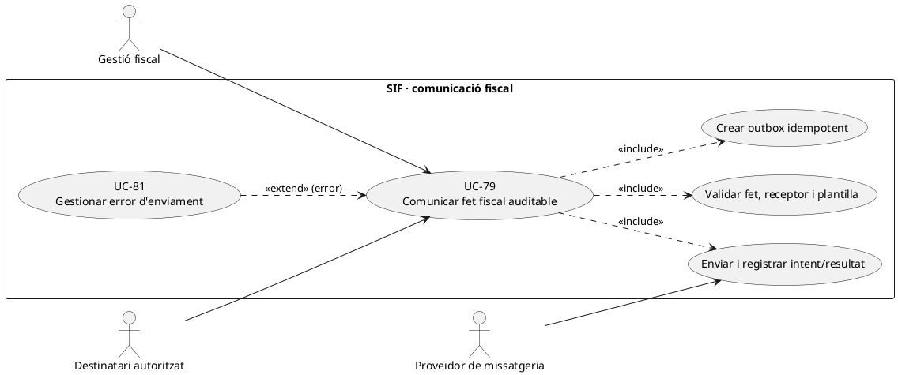
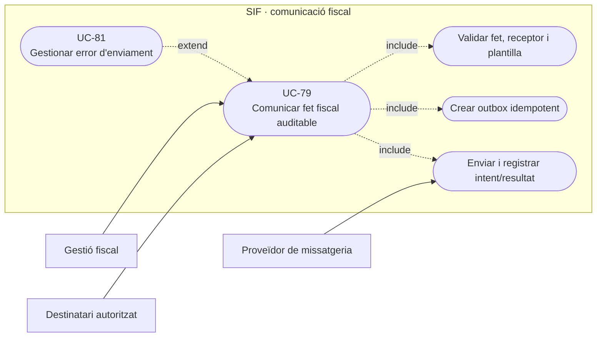
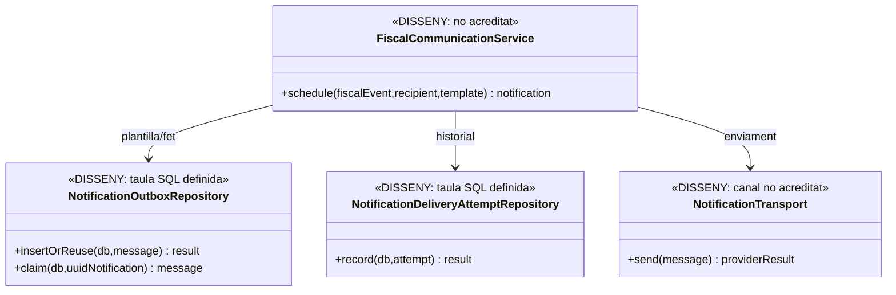
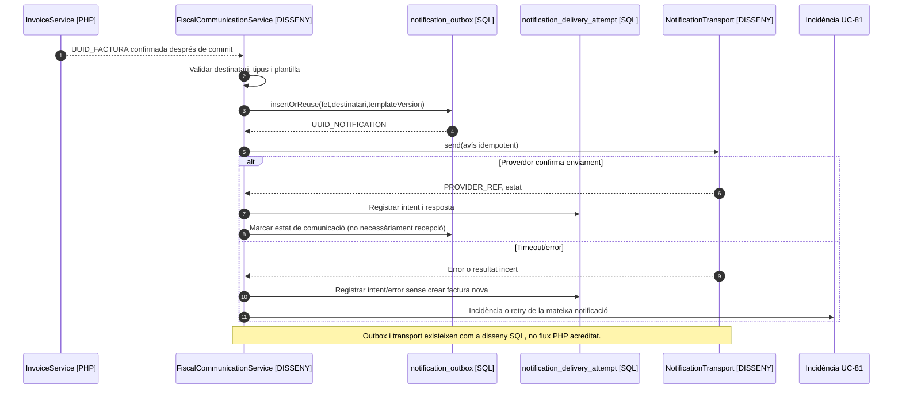

# UC-79 · Enviar una comunicació fiscal auditable

**Objectiu original:** outbox posterior al commit, plantilla/versionat, destinatari, intents i resultat. **Estat [DISSENY].** Una notificació sobre factura, rectificativa, devolució o error fiscal **no és** l'enviament del registre a l'AEAT (UC-77), ni tampoc prova automàticament el lliurament d'una factura electrònica en un format/canal acordat (UC-123).

## 1. Fonts contrastades

La migració d'auditoria defineix `notification_outbox`: `UUID_NOTIFICATION`, `IDEMPOTENCY_KEY` únic, `TEMPLATE_CODE/TEMPLATE_VERSION`, `RECIPIENT_TYPE/RECIPIENT_HASH`, `PAYLOAD_JSON`, `UUID_FACTURA/UUID_PAYMENT` opcionals, estat, data de pròxim intent i correlació. `notification_delivery_attempt` conserva `UUID_NOTIFICATION`, número d'intent, canal, referència del proveïdor, estat, codi/error i dates; `UNIQUE(UUID_NOTIFICATION, ATTEMPT_NO)`. **No s'ha acreditat un `NotificationOutboxService` PHP o worker d'enviament que consumeixi aquestes taules** ni la gestió operativa completa de plantilles/permisos.

`factura.BILLING_EMAIL` és la dada de contacte fiscal de la factura; **no acredita** que aquesta adreça sigui actual o que la persona autenticada tingui dret a rebre dades d'una factura d'empresa/grup. UC-69/120/126 validen receptor i contacte, i UC-125 és el consentiment **comercial** independent: no utilitzar-lo com a permís general per revelar documents fiscals.

## 2. Fitxa funcional específica

| Pas | Contracte |
| --- | --- |
| Disparador | Referència a un **fet confirmat** (`UUID_FACTURA`, `UUID_PAYMENT`, rectificativa, incidència) i motiu d'avís. Una intenció Redsys `PENDING` no s'ha de comunicar com un ingrés confirmat. |
| Destinatari | Receptor fiscal o representant verificat, pagador quan sigui legítim, o alumne únicament per les dades/avisos permesos. En grup, l'email d'un participant no autoritza enviar-li tota la factura d'empresa. |
| Plantilla | `TEMPLATE_CODE`, `TEMPLATE_VERSION`, idioma, variables de contingut mínimes i `UUID_OPERATION/REQUEST_ID/CORRELATION_ID`. Evitar dades sensibles en assumpte, log o enllaç sense autenticació. |
| Creació | Inserir **un** outbox idempotent per fet+finalitat+destinatari; preparar-lo associat al commit del fet o en un pas recuperable amb evidència. No enviar correu **abans** de persistir la factura i després afirmar que ja està emesa si la transacció falla. |
| Enviament | Worker pendent reclama outbox, registra **cada intent** i ref de proveïdor; timeout o resposta incerta no implica que no s'hagi enviat. No duplicar comunicacions amb nous identificadors per cada retry. |
| Evidència | Separar `PENDING`, `SENT`, `FAILED` i lliurament/lectura real segons contracte del canal; enviar a un servidor de correu no prova recepció a la bústia. |
| Fiscalitat i caixa | Cap `CHARGE/REFUND`, factura nova ni registre AEAT per enviar un avís. Un correu de «devolució efectuada» exigeix prova de sortida real i referència al moviment. |

### Flux i proves

1. Un fet confirmat genera una ordre d'avís amb destinatari legitimable, plantilla versionada i clau idempotent. Si la factura és de grup/empresa, comprovar el **rol i abast de cada destinatari** abans de serialitzar `PAYLOAD_JSON`.
2. Persistir outbox i correlació; un worker **pendent** recupera l'avís només després del commit de la factura/operació. La taula SQL no constitueix un enviament efectiu fins que hi ha adaptador i worker.
3. Enviament amb `notification_delivery_attempt`, temps, codi i `PROVIDER_REF`. Si hi ha resposta amb resultat incert, consultar prova del canal/reconciliar abans de repetir un correu que podria haver arribat.
4. Si s'ha d'adjuntar factura o enllaç, derivar a UC-80/123 per autorització, document original i prova diferenciada. No adjuntar documents fiscals d'un tercer a partir del correu de la matrícula.
5. Un error de notificació crea UC-81 i reintent **del mateix outbox**, no una segona emissió o cobrament.
6. Provar: factura emesa però email falla, dos reintents concurrents, timeout després d'enviar, adreça errònia, alumne de factura d'empresa, plantilla desactualitzada, intent Redsys pendent i persona sense consentiment comercial però que rep un avís operatiu legítim sota les regles aprovades.

**Pendents:** política de legitimació de destinatari i contingut, transport, credencials, plantilla/versionat, comprovació de canal, worker i recuperació de notificacions incertes; no s'han executat tests d'enviament.

## 3. UML de casos d'ús

### Vista de casos d’ús per a GitHub (Mermaid)

## 4. UML de classes — model SQL, executors pendents

## 5. UML de seqüència — factura confirmada i error del correu

## 6. Traçabilitat

[UC-79 original](../06-fitxes-funcionals/uc-079.md) · [UC-49 correu original](../06-fitxes-funcionals/uc-049.md) · [UC-58 outbox original](../06-fitxes-funcionals/uc-058.md) · [UC-80 accés al document original](../06-fitxes-funcionals/uc-080.md) · [UC-123 factura electrònica](uc-123-lliurar-factura-electronica.md) · [UC-125 consentiment](uc-125-consentiment-comunicacions-separat.md) · [SQL outbox/intents](../../sif/database/migrations/2026_09_15_000003_add_functional_audit_control.sql).
