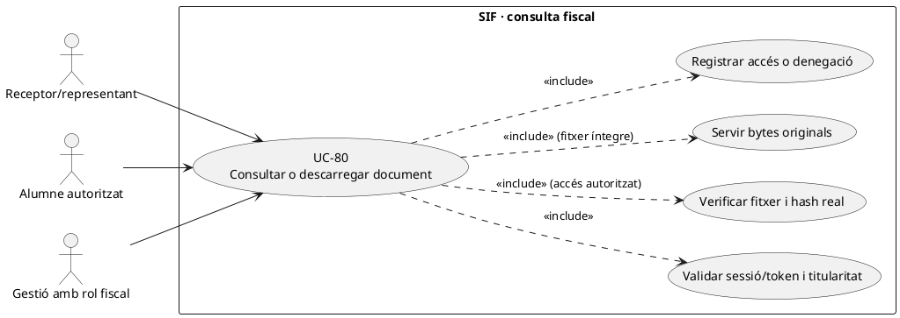
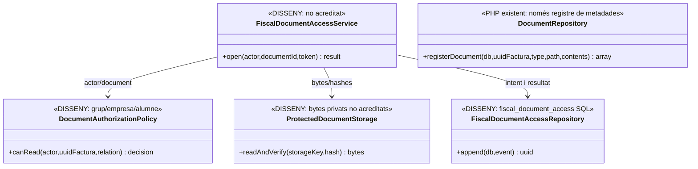
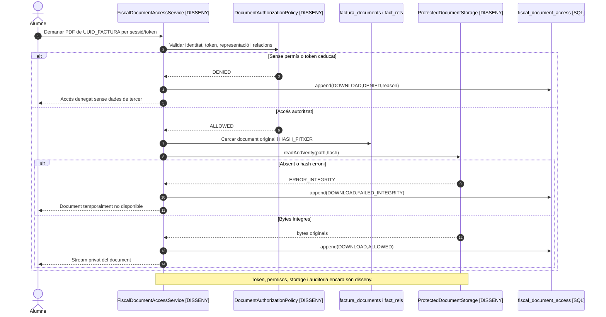

# UC-80 · Servir un document fiscal i registrar-ne l'accés o la denegació

**Objectiu del catàleg:** autorització, token/caducitat, document immutable i auditoria de **cada consulta, descàrrega o denegació**. **Estat [DISSENY]:** es disposa de metadades de documents i d'una taula SQL d'accés, però no s'ha acreditat un controlador PHP del SIF que autentiqui l'usuari, resolgui el token i serveixi bytes amb verificació de permisos.

## 1. Evidència i model d'accés

`DocumentRepository::registerDocument()` crea una fila de `factura_documents` per `PDF/XML/QR`, ruta i hash, **sense desar físicament ni servir el contingut del fitxer**. `fiscal_document_access` conté `FACTURA_DOCUMENT_ID`, `UUID_FACTURA`, `ACTION`, `RESULT`, `TOKEN_FINGERPRINT`, `ACTOR_TYPE/ID/ROLE`, `SOURCE_CHANNEL`, `REQUEST_ID`, `CORRELATION_ID`, `REASON_CODE` i instants. **No s'ha acreditat un writer ni política executable d'autorització per aquesta taula**. `fact_rels.VISIBLE_ALUMNE` és un camp de relació documental, però **no substitueix** verificació d'identitat i titularitat d'una factura d'empresa.

## 2. Fitxa funcional específica

| Pas | Regla |
| --- | --- |
| Identificació | Actor autenticat, rol, `ID_INSC`/subjecte canònic si correspon, `UUID_FACTURA`, document i sol·licitud; pagador, receptor fiscal, participant i representant són rols **separats**. No autoritzar per `IDPAG`, UUID conegut, email coincident o posseir una ruta de fitxer. |
| Token de consulta | **DISSENY:** secret opac, abast mínim (document, acció, actor/representació i venciment), hash/fingerprint i revocació. El camp `TOKEN_FINGERPRINT` d'auditoria **no crea ni valida un token**. El token de document no és el token de `payment_link` (UC-50). |
| Autorització | Resoldre relació amb `fact_rels` i titular/receptor, política per grup/empresa, estat de document i permisos de l'actor. `VISIBLE_ALUMNE=1` no dona permís a qualsevol alumne d'una factura amb diversos participants. |
| Integritat | Buscar document físic privat, reobrir bytes i comparar `HASH_FITXER`, tipus i `UUID_FACTURA`; si falta el fitxer o hash difereix, **denegar** i obrir incidència de custòdia UC-78/81. |
| Servir | Descarregar/visualitzar el **mateix** artefacte fiscal existent, amb resposta no cachejada públicament, cap ruta privada al navegador i registre de resultat per `REQUEST_ID`. No regenerar fiscalitat ni PDF sobre el catàleg vigent per atendre una lectura. |
| Auditoria | Escriure event de `fiscal_document_access` **també en denegacions** amb actor/canal/reason code i sense guardar token en clar o dades sensibles a l'URL del log. Separar autoritzat, lliurat al navegador i llegit per la persona: un HTTP correcte no demostra lectura humana. |
| Efecte econòmic | **Cap** `CHARGE/REFUND`, canvi de factura, numeració, cadena o cua AEAT per consultar el document. |

### Flux objectiu i variants

1. L'actor sol·licita un document per sessió o token concret; resoldre identitat UC-102/126 i rol respecte de la factura, **abans** de retornar metadades sensibles.
2. El controlador pendent registra intent d'accés, valida caducitat/abast/revocació i comprova receptor, relacions, `VISIBLE_ALUMNE` i eventual titularitat d'empresa/grup. Una petició aliena obté denegació auditada, **no** filtració de `BILLING_NIF_CIF`.
3. Consultar `factura_documents` i revalidar hash de bytes en storage privat. Si el fitxer és absent o alterat, registrar fallada i derivar a UC-78/81 sense inventar document.
4. Servir bytes originals segons permisos i enregistrar event de consulta/descàrrega amb `RESULT` precís. La resposta del servidor i la recepció completa del navegador són observacions diferents.
5. Si es revoca un token o acaba el vincle autoritzat d'accés, impedir **noves** consultes; conservar el registre històric, les factures i els accessos previs.
6. Provar: alumne d'una factura d'empresa, responsable de grup, `VISIBLE_ALUMNE=0`, email compartit, token caducat i reutilitzat, ruta pública manipulada, PDF absent/hash diferent, intents massius, denegació sense filtrar dades.

**Pendents:** política d'autorització específica, emissor/resolvedor de tokens, storage físic, writer d'`fiscal_document_access`, registre de denegacions, revocació i proves de privacitat end-to-end.

## 3. UML de casos d'ús

## 4. UML de classes — SQL i servidor d'arxius pendents

## 5. UML de seqüència — accés indegut i fitxer absent

## 6. Traçabilitat

[UC-80 original](../06-fitxes-funcionals/uc-080.md) · [UC-78 custòdia](uc-078-generar-custodiar-pdf-qr-xml.md) · [UC-102 accés alumne original](../06-fitxes-funcionals/uc-102.md) · [UC-61 pagament de l'alumne](uc-061-consultar-pendent-obtenir-enllac.md) · [UC-123 lliurament](uc-123-lliurar-factura-electronica.md) · [DocumentRepository](../../sif/src/Repository/DocumentRepository.php) · [Esquema d'accessos](../../sif/database/migrations/2026_09_15_000003_add_functional_audit_control.sql).
