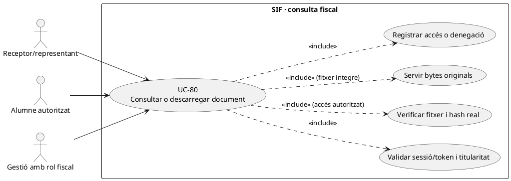
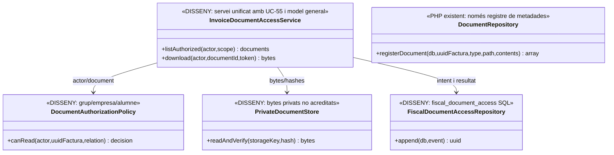
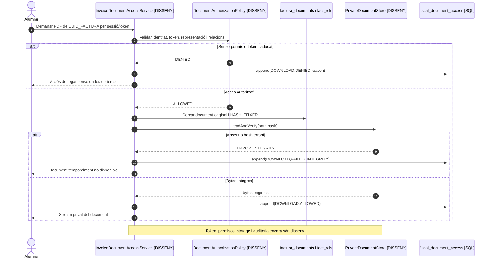
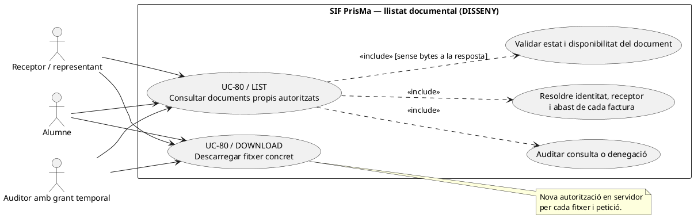
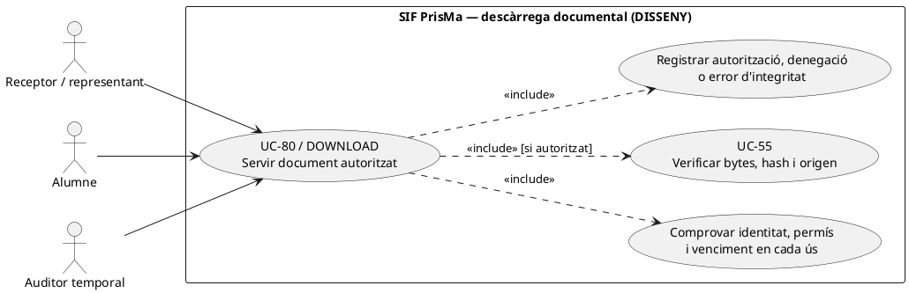

# UC-80 · Servir un document fiscal i registrar-ne l'accés o la denegació

**Objectiu del catàleg:** autorització, token/caducitat, document immutable i auditoria de **cada consulta, descàrrega o denegació**. El servei proposat d'accés es denomina `InvoiceDocumentAccessService`, com al model transversal i a UC-55; no són dos serveis executables diferents. **Estat [DISSENY]:** es disposa de metadades de documents i d'una taula SQL d'accés, però no s'ha acreditat un controlador PHP del SIF que autentiqui l'usuari, resolgui el token i serveixi bytes amb verificació de permisos.

## 1. Evidència i model d'accés

`DocumentRepository::registerDocument()` crea una fila de `factura_documents` per `PDF/XML/QR`, ruta i hash, **sense desar físicament ni servir el contingut del fitxer**. `fiscal_document_access` conté `FACTURA_DOCUMENT_ID`, `UUID_FACTURA`, `ACTION`, `RESULT`, `TOKEN_FINGERPRINT`, `ACTOR_TYPE/ID/ROLE`, `SOURCE_CHANNEL`, `REQUEST_ID`, `CORRELATION_ID`, `REASON_CODE` i instants. **No s'ha acreditat un writer ni política executable d'autorització per aquesta taula**. `fact_rels.VISIBLE_ALUMNE` és un camp de relació documental, però **no substitueix** verificació d'identitat i titularitat d'una factura d'empresa.

## 2. Fitxa funcional específica

| Pas | Regla |
| --- | --- |
| Identificació | Actor autenticat, rol, `ID_INSC`/subjecte canònic si correspon, `UUID_FACTURA`, document i sol·licitud; pagador, receptor fiscal, participant i representant són rols **separats**. No autoritzar per `IDPAG`, UUID conegut, email coincident o posseir una ruta de fitxer. |
| Token de consulta | **DISSENY:** secret opac, abast mínim (document, acció, actor/representació i venciment), hash/fingerprint i revocació. El camp `TOKEN_FINGERPRINT` d'auditoria **no crea ni valida un token**. El token de document no és el token de `payment_link` (UC-50). |
| Autorització | Resoldre relació amb `fact_rels` i titular/receptor, política per grup/empresa, estat de document i permisos de l'actor. `VISIBLE_ALUMNE=1` no dona permís a qualsevol alumne d'una factura amb diversos participants. |
| Integritat | Buscar document físic privat, reobrir bytes i comparar `HASH_FITXER`, tipus i `UUID_FACTURA`; si falta el fitxer o hash difereix, **denegar** i obrir incidència de custòdia UC-78/81. |
| Servir | Descarregar/visualitzar el **mateix** artefacte fiscal existent, amb resposta no cachejada públicament, cap ruta privada al navegador i registre de resultat per `REQUEST_ID`. No regenerar fiscalitat ni PDF sobre el catàleg vigent per atendre una lectura. |
| Auditoria | Escriure event de `fiscal_document_access` **també en denegacions** amb actor/canal/reason code i sense guardar token en clar o dades sensibles a l'URL del log. Separar autoritzat, lliurat al navegador i llegit per la persona: un HTTP correcte no demostra lectura humana. |
| Efecte econòmic | **Cap** `CHARGE/REFUND`, canvi de factura, numeració, cadena o cua AEAT per consultar el document. |

### Flux objectiu i variants

1. L'actor sol·licita un document per sessió o token concret; resoldre identitat UC-102/126 i rol respecte de la factura, **abans** de retornar metadades sensibles.
2. El controlador pendent registra intent d'accés, valida caducitat/abast/revocació i comprova receptor, relacions, `VISIBLE_ALUMNE` i eventual titularitat d'empresa/grup. Una petició aliena obté denegació auditada, **no** filtració de `BILLING_NIF_CIF`.
3. Consultar `factura_documents` i revalidar hash de bytes en storage privat. Si el fitxer és absent o alterat, registrar fallada i derivar a UC-78/81 sense inventar document.
4. Servir bytes originals segons permisos i enregistrar event de consulta/descàrrega amb `RESULT` precís. La resposta del servidor i la recepció completa del navegador són observacions diferents.
5. Si es revoca un token o acaba el vincle autoritzat d'accés, impedir **noves** consultes; conservar el registre històric, les factures i els accessos previs.
6. Provar: alumne d'una factura d'empresa, responsable de grup, `VISIBLE_ALUMNE=0`, email compartit, token caducat i reutilitzat, ruta pública manipulada, PDF absent/hash diferent, intents massius, denegació sense filtrar dades.

**Pendents:** política d'autorització específica, emissor/resolvedor de tokens, storage físic, writer d'`fiscal_document_access`, registre de denegacions, revocació i proves de privacitat end-to-end.

### 2.1. Diferenciar consulta d'alumne, empresa i auditor en el panell real

**Distribució dels canals definida a PrisMa.** El panell oficial `pay.prisma.cat/sif/documents` consulta `factura_documents`, `factura` i altres documents SIF, amb `GET /api/documents` i `GET /api/documents/{id}/download` com a **endpoints previstos**. La intranet principal només mostra resum/accés; l'espai d'alumne i l'accés del receptor/empresa són vies de **consulta externa** amb autorització pròpia, no una ruta alternativa que pugui llegir fitxers directament de `pay.prisma.cat`.

**Què correspon a cada subjecte.** Una persona amb factura individual pròpia pot consultar factura, cobrament i PDF/QR **si el document existeix i el servidor verifica la titularitat**. Si la matrícula està coberta per factura d'empresa, el participant veu **estat administratiu o de cobertura mínim**, no les dades fiscals de l'empresa, el PDF complet ni les dades dels altres participants. Per a l'empresa/responsable, verificar receptor fiscal i representació: `entitats_resp.CORREU` pot ser contacte de notificació, però no equival per si sol a ser receptor fiscal. Els rols d'auditor `AUDITOR_FISCAL` i `AEAT_READONLY` són **de lectura dins de l'abast concedit**; no habilitar-los a regenerar documents ni a alterar el registre per tenir accés a descàrregues.

**Integritat abans de publicar i efectes d'un error.** El procediment antic `descarregaFactura.php` pot reconstruir el PDF amb `generaFactura($id,true)`, i `eliminarArxiu.php` rep un `filename` temporal. Cap de les dues rutes és un servei vàlid de descàrrega de document fiscal SIF immutable. `DocumentRepository::registerDocument()` escriu **metadades**, no bytes al storage: la descàrrega ha de comprovar ubicació privada, integritat real, UUID i autorització. En fitxer absent o hash discordant, registrar denegació/incidència UC-78/81 i no retornar una ruta local, regenerar des de dades vives o presentar `CREATED` com a disponibilitat real.

**Traça d'accés amb rol i resultat.** `fiscal_document_access` és esquema d'auditoria, **no** prova que existeixi un writer PHP de consultes i denegacions. El controlador objectiu registra factura/document, acció, canal, actor/rol, decisió i causa sense desar el token en clar. L'actor pot tenir una sessió vàlida però no permís per aquell document: **autenticació no és autorització**. Diferenciar bytes servits del fet que la persona els hagi llegit.

### 2.2. Proves d'accés entre canals (no executades)

| ID | Escenari | Resultat exigible |
| --- | --- | --- |
| AF-80-01 | Alumne de grup accedeix per URL a factura d'empresa | Denegació del PDF complet, possible estat de cobertura mínim. |
| AF-80-02 | Correu del responsable coincideix amb el d'un participant | No derivar autorització fiscal de la coincidència de correu. |
| AF-80-03 | Auditor té accés de lectura i vol regenerar document | Denegació de la mutació al servidor; consulta permesa segons abast. |
| AF-80-04 | Fila de document CREATED però bytes absents | Error de custòdia i incidència, no descàrrega ni nou número fiscal. |
| AF-80-05 | Token desconegut/caducat o UUID d'una altra factura | Denegació auditada sense revelar receptor/paths. |
| AF-80-06 | Usuari descarrega PDF històric del llegat | Etiqueta d'històric/no-VERI*FACTU quan correspongui, no presentar com a document immutable SIF. |

## 3. UML de casos d'ús



## 4. UML de classes — SQL i servidor d'arxius pendents



## 5. UML de seqüència — accés indegut i fitxer absent



### 5.1. Acció independent: consultar el llistat de documents disponibles — UC-07/80, DISSENY

**Actor/disparador:** receptor, representant d'empresa, alumne o auditor autenticat obre el llistat de documents. **Precondicions:** identitat i representació verificades i abast de consulta resolt per recurs; en una factura d'empresa, la condició de participant no dóna dret automàtic al PDF complet ni a les dades fiscals dels altres inscrits. **Postcondició:** retornar **només metadades de documents autoritzats i realment disponibles**, amb estat de disponibilitat/absència clar; la consulta de llistat **no entrega bytes** ni autoritza futures descàrregues sense un control nou. En particular, `fact_rels.VISIBLE_ALUMNE=1` i `factura_documents.ESTAT=CREATED` no són dues autoritzacions suficients.



```mermaid
sequenceDiagram
autonumber
actor A as Alumne / empresa / auditor
participant UI as GET documents [ENDPOINT PREVIST]
participant S as InvoiceDocumentAccessService [DISSENY]
participant Auth as Visibilitat/identitat per factura [DISSENY]
participant DB as factura + fact_rels + factura_documents [LECTURA]
participant Av as Disponibilitat i hash UC-55 [DISSENY]
participant Log as fiscal_document_access [SQL; writer PENDENT]
A->>UI: Consultar documents de l'àmbit propi
UI->>S: listAuthorized(actor,scope)
S->>Auth: Comprovar sessió/grant vigent i permisos per recurs
alt Actor no identificat, grant vençut o filtre d'empresa aliè
 Auth-->>S: DENIED
 S->>Log: Registrar intent/denegació [OBJECTIU]
 S-->>UI: Resposta segura sense identificadors de factures alienes
else Actor i àmbit validats
 Auth-->>S: Conjunt de factures permeses amb visibilitat per document
 S->>DB: Llegir únicament documents de factures dins d'abast
 DB-->>S: Metadades permeses, HISTORICAL/NO_VERIFACTU quan calgui
 S->>Av: Verificar disponibilitat real dels fitxers que es mostraran
 Av-->>S: AVAILABLE/PENDING/ERROR per document [OBJECTIU]
 S->>Log: Registrar consulta per recursos mostrats [OBJECTIU]
 S-->>UI: Metadades filtrades, sense path privat ni token reutilitzable
end
UI-->>A: Llistat restringit o denegació
Note over S,Log: Servei/endpoint, política i writer encara no acreditats. Consultar el llistat no significa haver descarregat bytes.
```

### 5.2. Acció independent: descarregar un document concret amb revocació/fitxer incert — UC-80, DISSENY

**Actor/disparador:** subjecte autoritzat prem «Descarregar» sobre un document seleccionat o obre un enllaç que havia rebut anteriorment. **Precondicions:** identitat actual, receptor/representació, `UUID_FACTURA`, `FACTURA_DOCUMENT_ID`, grant/token encara vigent **en aquesta petició**, bytes físics i SHA-256 congruents. **Postcondició:** bytes exactes del document autoritzat amb auditoria d'intent/resultat o rebuig sense path ni dades de tercers; un `HTTP 200` no acredita que la persona els hagi llegit. Quan el document és històric, cal acreditar igualment original versus reconstrucció i no presentar-lo com a VERI*FACTU retroactiu.



```mermaid
sequenceDiagram
autonumber
actor A as Actor autenticat
participant S as InvoiceDocumentAccessService [DISSENY]
participant Auth as Autorització i revocació UC-59/80 [DISSENY]
participant DB as factura_documents i emissor històric [LECTURA]
participant Store as Storage privat [DISSENY]
participant Log as fiscal_document_access [SQL; writer PENDENT]
A->>S: download(documentId,token/sessió) en una petició nova
S->>Auth: Revalidar actor, document, representació i grant/token
alt Token caducat/revocat o document fora d'abast
 Auth-->>S: DENIED
 S->>Log: Registrar denegació sense dades alienes [OBJECTIU]
 S-->>A: Accés denegat, cap metadata sensible ni bytes
else Autoritzat per a aquest document
 Auth-->>S: ALLOWED
 S->>DB: Llegir UUID_FACTURA, tipus, status, hash i referència original
 alt Document absent o només metadata no verificada
  DB-->>S: PENDING/NOT_VERIFIED
  S->>Log: Registrar resultat DOCUMENT_UNAVAILABLE [OBJECTIU]
  S-->>A: No disponible, sense regenerar factura ni QR fiscal
 else Metadata existent
  DB-->>S: Referència a bytes privats
  S->>Store: readAndVerify(path,hash) i contrastar font
  alt Fitxer absent o SHA-256 diferent
   Store-->>S: MISSING/HASH_MISMATCH
   S->>Log: Registrar error i obrir incidència UC-55 [OBJECTIU]
   S-->>A: Document temporalment no disponible
  else Bytes íntegres i autorització encara vigent al servei
   Store-->>S: Bytes originals
   S->>Auth: Revalidar grant si hi ha canvi de sessió/temps abans d'entrega
   alt Revocat abans d'iniciar la resposta
    Auth-->>S: DENIED
    S->>Log: Registrar denegació final [OBJECTIU]
    S-->>A: Sense bytes
   else Autoritzat
    Auth-->>S: ALLOWED
    S->>Log: Registrar accés autoritzat/resultat tècnic [OBJECTIU]
    S-->>A: Stream privat dels bytes comprovats
   end
  end
 end
end
Note over Auth,Store: Endpoints i writer no acreditats, la revisió final de permisos i la finestra temporal de revocació requereixen prova de concurrència.
```

**Precisió SQL i PHP:** `fiscal_document_access.REQUEST_ID` **no té unicitat** a la migració; és un camp de traça, no un bloqueig de doble descàrrega ni una credencial de consulta. `DocumentRepository::registerDocument()` retorna només `ok` i `hash` després d'inserir metadata; no serveix bytes ni acredita que el fitxer existeixi. No intentar resoldre permisos només per `VISIBLE_ALUMNE`, `TOKEN_FINGERPRINT` o l'enllaç que conserva el navegador.

| Prova pendent | Escenari | Resultat requerit |
| --- | --- | --- |
| AC-80-07 | Alumne d'una factura d'empresa accedeix al llistat general | Metadades fiscals de l'empresa i dels altres participants ocultes; informació administrativa pròpia segons política. |
| AC-80-08 | Receptor fiscal amb PDF en metadata `CREATED` però fitxer físic absent | Llistat indica no disponibilitat real; descàrrega bloquejada amb incidència. |
| AC-80-09 | Auditor obté URL mentre grant vigent i la reutilitza després de revocació | Denegació de la nova descàrrega i registre d'intent, sense servir bytes. |
| AC-80-10 | Històric `ARCHIVED` sense bytes originals verificats | Metadades classificades com a pendents; cap original fals ni QR VERI*FACTU inventat. |
| AC-80-11 | Un mateix document rep consulta del llistat i descàrrega posterior | Accions i resultats auditats distintament; consulta no comptada com a lliurament de bytes. |

## 6. Traçabilitat

[UC-80 original](../06-fitxes-funcionals/uc-080.md) · [UC-78 custòdia](uc-078-generar-custodiar-pdf-qr-xml.md) · [UC-102 accés alumne original](../06-fitxes-funcionals/uc-102.md) · [UC-61 pagament de l'alumne](uc-061-consultar-pendent-obtenir-enllac.md) · [UC-123 lliurament](uc-123-lliurar-factura-electronica.md) · [DocumentRepository](../../sif/src/Repository/DocumentRepository.php) · [Esquema d'accessos](../../sif/database/migrations/2026_09_15_000003_add_functional_audit_control.sql).
