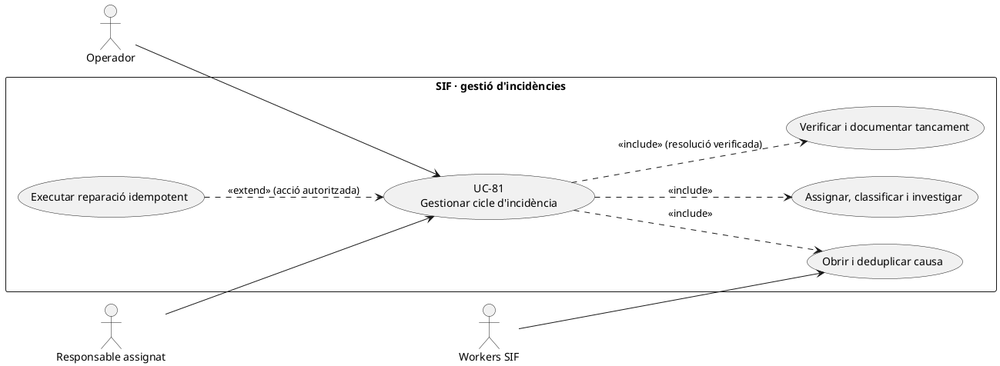
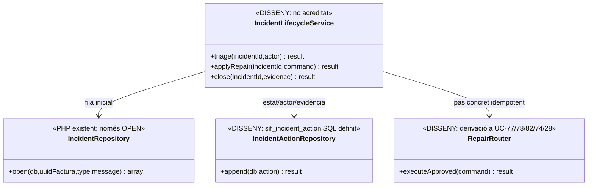

# UC-81 · Gestionar el cicle complet d'una incidència SIF

**Objectiu del catàleg:** prioritat, assignació, accions, canvis d'estat, resolució i evidència. **Estat [PARCIAL/DISSENY].** El PHP pot **obrir** una incidència a `errors_verifactu`, però no s'ha acreditat un gestor de tot el cicle amb permisos, assignació, pla de reparació i verificació de tancament.

## 1. Evidència i límits

`IncidentRepository::open(PDO,?uuidFactura,type,message)` comprova tipus i missatge i insereix `errors_verifactu(UUID_FACTURA,TIPUS_INCIDENCIA,ESTAT='OPEN',DETAILS)`. Retorna `ok=true` **sense retornar l'ID d'incidència** i no implementa transicions d'estat. La migració defineix `sif_incident_action` amb `INCIDENT_ID`, `ACTION_TYPE`, estat anterior/nou, severitat, `ASSIGNEE_ID`, actor/rol, motiu, detalls, `EVIDENCE_JSON`, correlació i data. **No s'ha acreditat un writer PHP de `sif_incident_action` ni el workflow complet**. `FiscalQueueRepository::fail()` pot deixar la cua en `DEAD_LETTER` i posar `ESTAT_AEAT=ERROR`, però **no crea una incidència assignada automàticament** per aquesta funció.

Una incidència documental, de notificació, de callback Redsys o de divergència del llegat ha d'identificar també el recurs corresponent, no només `UUID_FACTURA`: el model de vincle d'incidència amb múltiples referències i correlacions és una decisió pendent.

## 2. Fitxa funcional específica

| Etapa | Contracte |
| --- | --- |
| Obrir | Fet verificable i classificat, font, moment, `UUID_FACTURA/UUID_PAYMENT/UUID_OPERATION/ID_INSC` si existeixen, error i correlació; deduplicar per **mateix incident lògic**, no suprimir incidències diferents per compartir factura. |
| Triage | Assignar severitat, responsable, sistema/font, passos afectats i estat; `sif_incident_action` permet traçar canvis d'estat, però la política de prioritat/SLA i el writer són pendents. |
| Investigar | Preservar factura/registre/job/payment originals i evidències (resposta AEAT, hash de document, referència Redsys, estats Prisma). No guardar contrasenyes, dades de targeta o justificants sensibles en `DETAILS`. |
| Decidir | Seleccionar **una reparació concreta**: reintentar el mateix job UC-77/78/79, conciliar SIF/llegat UC-82, classificar correcció fiscal UC-74, resoldre pagament UC-28/105 o actualitzar accés acadèmic UC-124. No executar totes les vies com un «retry general». |
| Executar | Idempotència per comanda de reparació i registre d'acció amb actor/motiu/estat anterior/nou; els passos entre SIF i altres BDs poden fallar parcialment. Repetir el pas pendent, no duplicar `CHARGE`, factura, registre fiscal o retorn. |
| Tancar | Verificar **el resultat de la destinació**: `SENT` d'una cua no certifica acceptació AEAT, `factura_documents.CREATED` no prova bytes, `OBSERVACIONS` llegada no prova que la matrícula Moodle s'hagi reparat. Guardar evidència i decisió de tancament. |
| Fiscalitat i diners | Obrir/tancar incidència **no crea** `CHARGE/REFUND`, modifica imports ni esborra registres fiscals. Qualsevol correcció econòmica requereix moviment real o atribució individual segons el cas corresponent. |

### Flux propi i proves

1. Un procés/operador detecta un fet i consulta incidències obertes de mateixa operació, recurs i causa. `IncidentRepository::open()` pot inserir la fila base, però **la deduplicació i l'ID retornat requeriran adaptador/writer addicional**.
2. Classificar severitat/afectació, assignar un responsable i registrar event `OPEN→TRIAGED/ASSIGNED` a `sif_incident_action` (nom de transició **orientatiu**, no enum SQL verificat).
3. Recollir evidència original i comparar amb situació actual: import extern, factura/registre, job AEAT, document privat, pagador/titular i llegat acadèmic. Una dada discrepant no prova per si mateixa un pagament nou.
4. Aprovar i executar **només** l'acció adequada; registrar `STARTED/SUCCEEDED/FAILED` i clau idempotent per comanda. Si la xarxa respon amb incertesa, reconciliar amb la font abans de reexecutar un efecte extern.
5. Verificar resultat final, registrar accions i evidència, tancar quan tots els efectes pendents del cas estan resolts o justificar expressament el tancament parcial segons política.
6. Provar: dos avisos del mateix error, incident de factura ja cancel·lada, AEAT accepta però timeout local, PDF absent, callback Redsys tardà, assignació a rol no autoritzat, càrrec bancari real que no apareix al llegat i retry que només havia fallat a Moodle.

**Pendents:** codi/taula d'idempotència d'incidència i reparacions, permisos/SLA, model d'enllaç a recursos, writer i visualització de `sif_incident_action`, notificació a responsables i tests de tancament amb evidència.

## 3. UML de casos d'ús



## 4. UML de classes — obertura PHP i accions pendents



## 5. UML de seqüència — dead-letter amb resposta remota incerta

```mermaid
sequenceDiagram
autonumber
actor O as Operador
participant S as IncidentLifecycleService [DISSENY]
participant I as IncidentRepository [PHP]
participant A as sif_incident_action [SQL, writer pendent]
participant Q as fiscal_queue / evidència AEAT
participant R as RepairRouter [DISSENY]
O->>S: Obrir incidència per job DEAD_LETTER
S->>I: open(db,uuidFactura,AEAT_QUEUE,error)
I-->>S: ok=true (sense INCIDENT_ID al retorn PHP)
S->>A: Registrar triage/assignació [requereix identificador real]
S->>Q: Llegir factura, fiscal_order, intents i prova privada
alt Resultat remot incert
 S-->>O: Cal comprovar estat abans de reintentar
else Reparació autoritzada i idempotent
 O->>S: Aprovar pas concret del mateix job
 S->>R: executeApproved(command)
 R-->>S: Resultat o incidència parcial
 S->>Q: Verificar estat final del registre original
 S->>A: Guardar acció, prova i estat final
 S-->>O: Resolució comprovada o pendent
end
Note over S,A: L'obertura PHP existeix; triage, assignació i tancament no acreditats.
```

## 6. Traçabilitat

[UC-81 original](../06-fitxes-funcionals/uc-081.md) · [UC-77 cua AEAT](uc-077-operar-enviament-aeat-retry-dead-letter.md) · [UC-78 documents](uc-078-generar-custodiar-pdf-qr-xml.md) · [UC-82 conciliació original](../06-fitxes-funcionals/uc-082.md) · [UC-74 classificar](uc-074-classificar-correccio-fiscal.md) · [IncidentRepository](../../sif/src/Repository/IncidentRepository.php) · [FiscalQueueRepository](../../sif/src/Repository/FiscalQueueRepository.php) · [Migració accions d'incidència](../../sif/database/migrations/2026_09_15_000003_add_functional_audit_control.sql).
