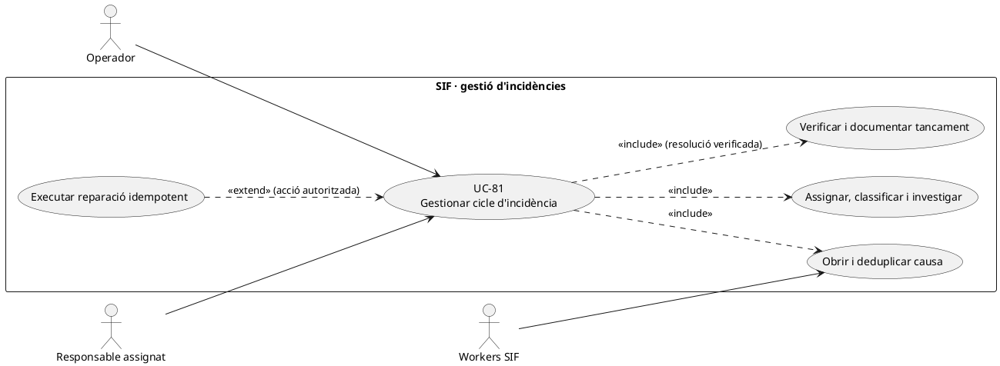
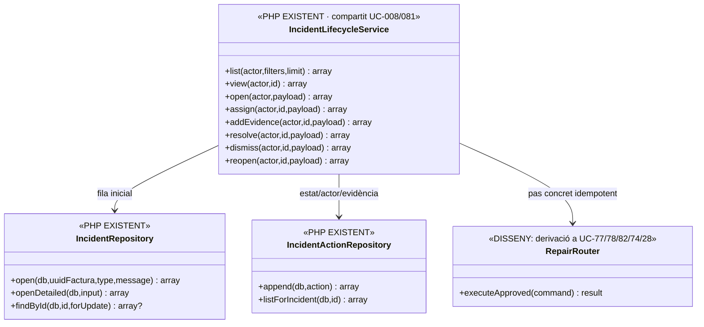

# UC-81 · Gestionar el cicle complet d'una incidència SIF

**Objectiu del catàleg:** prioritat, assignació, accions, canvis d'estat, resolució i evidència. **Estat [IMPLEMENTAT AL CODI / DESPLEGAMENT PARCIAL].** UC-081 és el detall de lifecycle del cas mare [UC-008](uc-008-gestionar-incidencia-sif.md). Lifecycle, API i UI del panell existeixen al repositori; configuració productiva i E2E continuen pendents.

## 1. Evidència i límits

`IncidentRepository::open()` es manté per compatibilitat, però `openDetailed()` ja genera `UUID_INCIDENT`, retorna `incident_id`, valida factura/pagament quan s'aporten i suporta recurs, correlació i idempotència. `IncidentActionRepository` escriu `sif_incident_action` append-only i `IncidentLifecycleService` implementa assignació, evidència, resolució, `DISMISSED` i reobertura. La cua fiscal crea incidència tant per conflicte d'integritat com quan els retries acaben en `DEAD_LETTER`; això no converteix l'estat local en resposta remota AEAT.

Una incidència documental, de notificació, de callback Redsys o de divergència del llegat ha d'identificar també el recurs corresponent, no només `UUID_FACTURA`: el model de vincle d'incidència amb múltiples referències i correlacions és una decisió pendent.

## 2. Fitxa funcional específica

| Etapa | Contracte |
| --- | --- |
| Obrir | Fet verificable i classificat, font, moment, `UUID_FACTURA/UUID_PAYMENT/UUID_OPERATION/ID_INSC` si existeixen, error i correlació; deduplicar per **mateix incident lògic**, no suprimir incidències diferents per compartir factura. |
| Triage | Assignar severitat, responsable, sistema/font, passos afectats i estat; `sif_incident_action` permet traçar canvis d'estat i el writer PHP ja està implementat; la política de prioritat/SLA continua pendent. |
| Investigar | Preservar factura/registre/job/payment originals i evidències (resposta AEAT, hash de document, referència Redsys, estats Prisma). No guardar contrasenyes, dades de targeta o justificants sensibles en `DETAILS`. |
| Decidir | Seleccionar **una reparació concreta**: reintentar el mateix job UC-77/78/79, conciliar SIF/llegat UC-82, classificar correcció fiscal UC-74, resoldre pagament UC-28/105 o actualitzar accés acadèmic UC-124. No executar totes les vies com un «retry general». |
| Executar | Idempotència per comanda de reparació i registre d'acció amb actor/motiu/estat anterior/nou; els passos entre SIF i altres BDs poden fallar parcialment. Repetir el pas pendent, no duplicar `CHARGE`, factura, registre fiscal o retorn. |
| Tancar | Verificar **el resultat de la destinació**: `SENT` d'una cua no certifica acceptació AEAT, `factura_documents.CREATED` no prova bytes, `OBSERVACIONS` llegada no prova que la matrícula Moodle s'hagi reparat. Guardar evidència i decisió de tancament. |
| Fiscalitat i diners | Obrir/tancar incidència **no crea** `CHARGE/REFUND`, modifica imports ni esborra registres fiscals. Qualsevol correcció econòmica requereix moviment real o atribució individual segons el cas corresponent. |

### Flux propi i proves

1. Un procés/operador detecta un fet i consulta incidències obertes de mateixa operació, recurs i causa. `IncidentRepository::openDetailed()` obre o reutilitza la fila base amb clau idempotent i retorna `incident_id`/`uuid_incident`; el contracte legacy `open()` es manté per compatibilitat.
2. Classificar severitat/afectació, assignar un responsable i registrar event `OPEN→TRIAGED/ASSIGNED` a `sif_incident_action` (nom de transició **orientatiu**, no enum SQL verificat).
3. Recollir evidència original i comparar amb situació actual: import extern, factura/registre, job AEAT, document privat, pagador/titular i llegat acadèmic. Una dada discrepant no prova per si mateixa un pagament nou.
4. Aprovar i executar **només** l'acció adequada; registrar `STARTED/SUCCEEDED/FAILED` i clau idempotent per comanda. Si la xarxa respon amb incertesa, reconciliar amb la font abans de reexecutar un efecte extern.
5. Verificar resultat final, registrar accions i evidència, tancar quan tots els efectes pendents del cas estan resolts o justificar expressament el tancament parcial segons política.
6. Provar: dos avisos del mateix error, incident de factura ja cancel·lada, AEAT accepta però timeout local, PDF absent, callback Redsys tardà, assignació a rol no autoritzat, càrrec bancari real que no apareix al llegat i retry que només havia fallat a Moodle.

**Pendents:** desplegament/E2E del panell, rols productius/SLA, notificació a responsables, integracions d'obertura encara no connectades, proves de concurrència específica i preproducció. La suite backend CI ja està verificada amb 555 proves i 0 errors. La reparació continua sent responsabilitat del UC específic; no s'implementa un retry general.

### 2.1. Lloc de resolució, objectes afectats i límit de l'obridor actual

**Lloc oficial i abast funcional.** `pay.prisma.cat/sif/incidencies` és el punt de gestió i resolució oficial i la UI ja està implementada al repositori amb handoff HMAC, sessió i CSRF. L'API interna disposa de `summary/list/view/open/assign/evidence/resolve/dismiss/reopen`. La intranet implementa resum read-only i deriva qualsevol resolució al SIF.

**Vincular a l'objecte afectat sense inventar factura.** `openDetailed()` admet `UUID_PAYMENT` i parella `RESOURCE_TYPE/RESOURCE_ID` a més de factura, per tant un cobrament orfe, job o inscripció no necessita una factura fictícia. El model és genèric, però encara cal connectar tots els detectors i decidir tipologies/retenció de cada recurs.

**Transicions i prova de tancament.** `IncidentActionRepository` ja escriu actor, responsable, estat anterior/nou, raó, evidència, correlació i idempotència. `resolve()` exigeix criteri, notes i evidència. Continua sent obligatori verificar la destinació real: `SENT` no és acceptació AEAT, `CREATED` no prova bytes i una nota llegada no prova conciliació o Moodle.

**Auditor i suport.** El panell preveu `AUDITOR_FISCAL`/`AEAT_READONLY` de lectura: poden consultar l'expedient fiscal autoritzat, però **no** assignar-se una reparació, reintentar un job o marcar una incidència resolta. La documentació enumera suport/gestió segons el cas; els permisos efectius i la separació de responsabilitats han de comprovar-se **al servidor**, no per una targeta visible del dashboard.

### 2.2. Proves d'incidències multirecurs (no executades)

| ID | Escenari | Resultat exigible |
| --- | --- | --- |
| IC-81-01 | CSV TPV acredita cobrament real sense factura atribuïda | Expedient amb identificador econòmic/ordre, sense UUID_FACTURA inventat. |
| IC-81-02 | Job AEAT SENT però registre REJECTED | Revisió fiscal amb resposta efectiva; no tancar per job enviat. |
| IC-81-03 | Document CREATED amb fitxer absent | Incidència oberta fins a bytes/hash verificats; cap nova factura. |
| IC-81-04 | Intranet mostra avís d'incidència, operador intenta resoldre-la allà | Derivar a la ruta SIF i exigir permís servidor de resolució. |
| IC-81-05 | Auditor de lectura intenta reobrir dead-letter | Denegació de l'acció sense canviar cua ni expedir un registre nou. |
| IC-81-06 | SIF resol cobrament però accés Moodle encara no s'ha sincronitzat | Registrar la fase acadèmica pendent, no afirmar tancament total de l'operació. |

## 3. UML de casos d'ús

```plantuml
@startuml
left to right direction
actor "Operador" as O
actor "Responsable assignat" as R
actor "Workers SIF" as W
rectangle "SIF · gestió d'incidències" {
 usecase "UC-81\nGestionar cicle d'incidència" as Main
 usecase "Obrir i deduplicar causa" as Open
 usecase "Assignar, classificar i investigar" as Triage
 usecase "Executar reparació idempotent" as Repair
 usecase "Verificar i documentar tancament" as Close
}
O --> Main
R --> Main
W --> Open
Main ..> Open : <<include>>
Main ..> Triage : <<include>>
Repair ..> Main : <<extend>> (acció autoritzada)
Main ..> Close : <<include>> (resolució verificada)
@enduml
```

## 4. UML de classes — obertura PHP i accions pendents

```mermaid
classDiagram
class IncidentLifecycleService {
 <<PHP EXISTENT · compartit UC-008/081>>
 +list(actor,filters,limit) array
 +view(actor,id) array
 +open(actor,payload) array
 +assign(actor,id,payload) array
 +addEvidence(actor,id,payload) array
 +resolve(actor,id,payload) array
 +dismiss(actor,id,payload) array
 +reopen(actor,id,payload) array
}
class IncidentRepository {
 <<PHP EXISTENT>>
 +open(db,uuidFactura,type,message) array
 +openDetailed(db,input) array
 +findById(db,id,forUpdate) array?
}
class IncidentActionRepository {
 <<PHP EXISTENT>>
 +append(db,action) array
 +listForIncident(db,id) array
}
class RepairRouter {
 <<DISSENY: derivació a UC-77/78/82/74/28>>
 +executeApproved(command) result
}
IncidentLifecycleService --> IncidentRepository : fila inicial
IncidentLifecycleService --> IncidentActionRepository : estat/actor/evidència
IncidentLifecycleService --> RepairRouter : pas concret idempotent
```

## 5. UML de seqüència — dead-letter amb resposta remota incerta

```mermaid
sequenceDiagram
autonumber
actor O as Operador
participant S as IncidentLifecycleService [PHP]
participant I as IncidentRepository [PHP]
participant A as IncidentActionRepository [PHP]
participant Q as fiscal_queue / evidència AEAT
participant R as RepairRouter [DISSENY]
O->>S: Obrir incidència per job DEAD_LETTER
S->>I: openDetailed(recurs, causa, correlation, idempotency)
I-->>S: incident_id + uuid_incident / reused
S->>A: append triage/assignació idempotent
S->>Q: Llegir factura, fiscal_order, intents i prova privada
alt Resultat remot incert
 S-->>O: Cal comprovar estat abans de reintentar
else Reparació autoritzada i idempotent
 O->>S: Aprovar pas concret del mateix job
 S->>R: executeApproved(command)
 R-->>S: Resultat o incidència parcial
 S->>Q: Verificar estat final del registre original
 S->>A: append acció, prova i estat final
 S-->>O: Resolució comprovada o pendent
end
Note over S,A: Backend verificat en CI; UI implementada al codi, desplegament/E2E i preproducció pendents.
```

## 6. Traçabilitat

[UC-81 original](../06-fitxes-funcionals/uc-081.md) · [UC-008 cas mare](uc-008-gestionar-incidencia-sif.md) · [UC-77 cua AEAT](uc-077-operar-enviament-aeat-retry-dead-letter.md) · [UC-78 documents](uc-078-generar-custodiar-pdf-qr-xml.md) · [UC-82 conciliació](../06-fitxes-funcionals/uc-082.md) · [UC-74 classificar](uc-074-classificar-correccio-fiscal.md) · [IncidentRepository](../../sif/src/Repository/IncidentRepository.php) · [IncidentActionRepository](../../sif/src/Repository/IncidentActionRepository.php) · [IncidentLifecycleService](../../sif/src/Service/IncidentLifecycleService.php) · [API](../../sif/public/api/incidents/manage.php) · [Migració lifecycle](../../sif/database/migrations/2026_09_29_000010_add_incident_lifecycle.sql).

## Addenda transversal UC-77 — incidència AEAT per rebuig, DLQ o integritat (disseny pendent)

UC-77 ha d'obrir o reutilitzar una incidència correlacionada quan: (a) el hash/identitat del payload difereix del registre immutable o manca una referència fiable, (b) hi ha rebuig formal definitiu, (c) s'esgoten tres intents totals, o (d) la resposta remota és incerta i no es pot retransmetre amb seguretat. Cada causa s'ha de diferenciar i conservar el resultat AEAT **real**; `ESTAT_AEAT=ERROR` local per transport no equival a `REJECTED` remot. El deduplicador utilitza job + registre + causa/event, no només `UUID_FACTURA`, i ha de conservar intents independents.

La reparació autoritzada ha de classificar evidències d'AEAT, resposta/CSV si existeixen, XML, identitat, hash, intent i correlació **abans** de reobrir el mateix job. L'error de xarxa no genera automàticament UC-76 ni una segona ALTA. Quan pertoqui avisar, UC-81 vincula l'alerta idempotent de UC-58; un problema amb l'outbox queda pendent de recuperació sense declarar el missatge enviat. L'assignació manual i el writer d'accions ja estan implementats al lifecycle compartit UC-008/081. Continuen pendents l'assignació automàtica per política/SLA, la recuperació de l'outbox i la verificació runtime de les integracions externes.

**Traça:** [UC-77 · seqüència i proves UC77-INT-01, UC77-DLQ-05/06](uc-077-operar-enviament-aeat-retry-dead-letter.md#5-uml-de-seqüència--contracte-objectiu-i-diferències-respecte-del-php-actual) · [UC-58](uc-058-gestionar-outbox-notificacions.md).

## 7. Estat d'implementació 2026-09-29

El lifecycle backend està verificat en CI (555/0) i la UI del panell ja està implementada al repositori. Queden pendents desplegament/E2E, configuració real de rols, SLA/notificacions, integracions addicionals, concurrència específica i preproducció. Els diagrames d'activitat ACTUAL/FINAL per pàgina/apartat es mantenen al [UC-008 canònic](uc-008-gestionar-incidencia-sif.md) per no duplicar-los.

## 8. Evidència CI 2026-09-29

La implementació compartida UC-008/UC-081 ha estat executada dins la suite completa SIF en dos workflows de la PR post-merge #21: **555 passed, 0 failed** en els runs 36638546735 i 36638546786. Això valida backend i migracions en test CI, no la UI ni l'entorn productiu.
