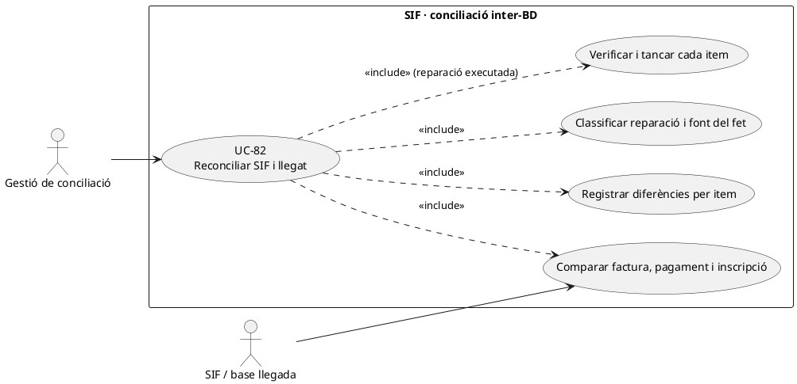
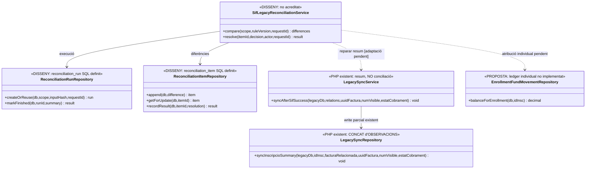
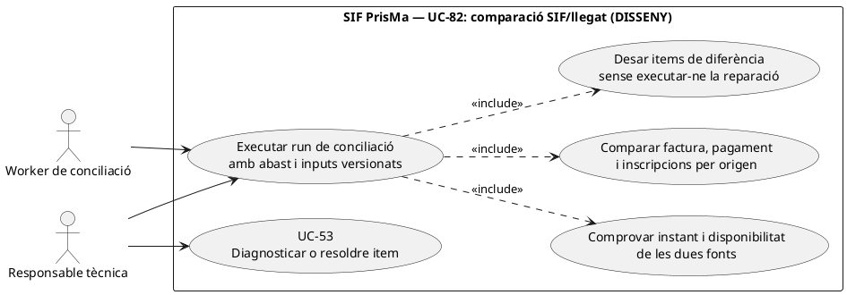
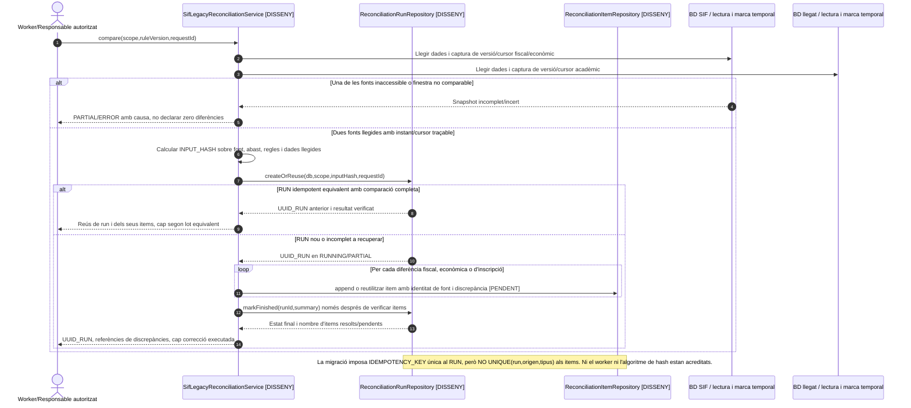
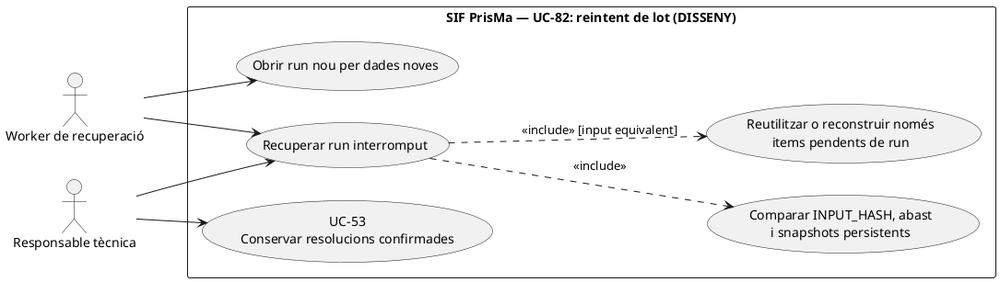

# UC-82 · Reconciliar el SIF amb la base de dades llegada

**Objectiu del catàleg:** execució de lot i **items de diferència per UUID, IDPAG, import i estat**, amb resolució traçada. **Frontera amb UC-53:** UC-82 prepara, executa/reutilitza i resumeix el lot de comparació; UC-53 diagnostica i aprova la reparació de cada item individual (també si es detecta fora d'un lot). Un mateix coordinador proposat `SifLegacyReconciliationService` ha de donar suport a totes dues accions, no dos serveis duplicats. **Estat [DISSENY].** Existeix una escriptura PHP de resum fiscal a `inscripcions`, però no s'ha acreditat un reconciliador bidireccional complet que comprovi factures, pagaments, inscripcions i assignacions individuals.

## 1. Evidència PHP i model SQL

`LegacySyncService::syncAfterSifSuccess()` recorre només les relacions `SOURCE_TYPE=INSCRIPCIO` amb `source_id`, i `LegacySyncRepository::syncInscripcioSummary()` fa `UPDATE inscripcions SET FACTURA_RELACIONADA=COALESCE(FACTURA_RELACIONADA,?), OBSERVACIONS=CONCAT(...)`. Per tant, **no comprova si el camp anterior correspon realment a la factura nova**, no calcula l'import atribuït per inscrit, no actualitza un ledger, no retorna un identificador d'acció i un retry pot tornar a **concatenar la mateixa nota** a `OBSERVACIONS`. Això és una **sincronització parcial de resum**, no una prova de conciliació completa.

`reconciliation_run` defineix `UUID_RUN`, tipus, sistema d'origen, `INPUT_HASH`, clau idempotent, estat, actor, correlació i resum. `reconciliation_item` inclou referència d'origen, `UUID_FACTURA/UUID_PAYMENT`, `RESULT`, codi i JSON de diferència, estat/acció/responsable de resolució i timestamps. **No s'ha acreditat** un writer/parser de l'execució i dels items a `sif/src`. `fact_rels` vincula factura i origen, però no conté una quantitat **pagada per `ID_INSC`**; `payment_allocation` assigna un `UUID_PAYMENT` a factura, no als participants.

## 2. Fitxa funcional específica

| Unitat | Regla |
| --- | --- |
| Actor i perímetre | Operador autoritzat, treball tècnic idempotent i gestió que resol discrepàncies; definir finestra, tipus d'origen, curs/edició i abast històric. Les dues BDs poden tenir cicles de disponibilitat diferents. |
| Clau d'equivalència | `UUID_FACTURA/NUM_VISIBLE`, `fact_rels.SOURCE_TYPE/SOURCE_ID/IDPAG/DS_ORDER`, `UUID_PAYMENT`, referència bancària i `ID_INSC` verificat. **No** fusionar intents Redsys diferents perquè comparteixen `IDPAG`; tampoc deduir titularitat d'un email compartit. |
| Comparació fiscal | Factura i receptor originals, línies i total, document/estat AEAT, rectificatives i estat de cobrament. La dada del llegat `FACTURA_RELACIONADA` o un text a `OBSERVACIONS` poden ser obsolets i no autoritzen editar la factura emesa. |
| Comparació bancària | `payment_transaction` (moviments reals), `payment_allocation` (per factura), notifications Redsys i dades llegades de pagament. Un `PAGAMENT=1` o `A_PAGAR` llegat **no demostra per si sol** un ingrés bancari SIF i no autoritza crear un `CHARGE` retrospectiu. |
| Comparació individual | Si una factura cobreix diverses inscripcions, quantificar **per participant** import inicial, tram cobrat, retornat i traspàs intern. La traça `enrollment_fund_movement` és **proposta no implementada**: la conciliació actual no pot certificar matemàticament aquests imports només amb `fact_rels`. |
| Resolució | Guardar un item per diferència, font i valor **abans/després**, regla, actor, causa i estat; reparar exclusivament el sistema/camp correcte. Una acció sobre factura emesa requereix UC-74, un cobrament real UC-02/28 i la matrícula Moodle UC-129. |
| Invariants | Reconciliar no crea factura nova ni cap `CHARGE/REFUND` sense evidència real. La factura original no s'edita per fer quadrar el llegat; `OBSERVACIONS` tampoc substitueix les taules de fons. |

### Flux propi

1. Obrir una execució versionada i idempotent amb abast, `INPUT_HASH`, actor i correlació. Capturar **snapshots comparables** del SIF i del llegat, incloent imports, dates, estat i referències; no comparar un instant SIF d'avui amb un export llegat d'ahir sense marcar la diferència temporal.
2. Relacionar cada factura amb els seus `fact_rels`, cada pagament amb les assignacions, cada `IDPAG` amb intents `DS_ORDER` **diferents** i cada `ID_INSC` amb la seva línia/origen. Registrar casos orfes, duplicats, imports/estats divergents i factures històriques `NO_VERIFACTU`.
3. Crear `reconciliation_item` per discrepància (writer pendent), amb severitat, import exacte quan correspongui, evidència de banc/AEAT i estat pendent. No comptar com a discrepància falsa un pagament fraccionat vàlid amb dos `DS_ORDER` per `IDPAG`.
4. Per cada item, classificar el **sistema que és font** del fet: AEAT per resposta fiscal efectiva, SIF per registres fiscals i assignació central, banc/Redsys per moviment extern real, Prisma per situació acadèmica; la política de conflictes es defineix per camp, no preval una BD única sobre totes les dimensions.
5. Aplicar reparació concreta i idempotent: sincronitzar de nou el resum llegat sense concatenacions duplicades (canvi PHP pendent), revisar assignació de pagament UC-56/105, corregir fiscalment per UC-74 quan procedeixi o derivar baixa/accés a UC-124/129. Una actualització directa de la taula `factura` queda fora del procediment.
6. Tornar a consultar **ambdues fonts** després de la reparació, registrar `RESOLUTION_STATUS` i evidència al mateix item i recalcular el resum de l'execució. Si queda un recurs en conflicte, mantenir incidència UC-81; no declarar conciliació total perquè s'ha completat la tasca de lectura.

### Alternatives i proves

| Escenari | Resultat |
| --- | --- |
| Mateix `IDPAG` amb dos pagaments fraccionats de `DS_ORDER` diferents | Dos moviments externs **si** tots dos estan confirmats; suma coherent per factura, no reús d'un dels cobraments ni dues factures del total. |
| Retry de `LegacySyncService` | Detectar nota SIF ja afegida a `OBSERVACIONS` i exigir sincronització llegat idempotent; **el PHP actual concatena una nota nova**. |
| Factura d'empresa amb tres inscrits | Una factura i potser un únic `CHARGE`; no afirmar que els tres estan cobrats individualment a partir de tres `fact_rels` sense imports. |
| SIF factura emesa, llegat `FACTURA_RELACIONADA` apunta a altra factura | Conflicte documentat; `COALESCE` del writer no el corregeix i no justifica sobreescriure número/UUID fiscals. |
| Llegat diu «pagat» sense UUID_PAYMENT ni evidència externa | Incidència de conciliació i recerca de banc/TPV, **no** import fictici automàtic. |
| Divergència després de baixa acadèmica amb ingrés real | Preservar ingrés bancari original, classificar moviment/retorn i actualitzar estat acadèmic per via separada. |

**Pendents:** worker/repository de lots i items, origen de dades llegades, política de conflictes, timestamps estables, consulta d'AEAT/TPV, ledger quantitatiu d'inscripcions i correcció d'idempotència de `LegacySyncRepository`. Sense proves end-to-end executades.

### Contracte per família de factures, pagament i matrícula — casos del llegat

**Identificadors que no són equivalents.** `FACTURA_RELACIONADA` és un agrupador històric que pot reunir factura ordinària A, rectificativa R i múltiples inscripcions; **no substitueix** `UUID_FACTURA`, la relació directa de rectificació ni `fact_rels`. `IDPAG` pot mantenir-se entre diversos intents `DS_ORDER` (denegació i acceptació, fraccions), mentre que un sol pagament real de grup pot correspondre a N inscripcions. `A_PAGAR`, `PAGAMENT`, `FRACCIO` i `DATA PAG` són dades operatives llegades, no equivalències necessàries amb el total d'una factura ni prova de transacció bancària única.

**Quatre dimensions de comparació.** Per **factura**: `UUID_FACTURA/NUM_VISIBLE`, sèrie, receptor, línies, rectificatives, estat AEAT i documents; per **diner**: `UUID_PAYMENT`, import extern, mètode/referència, `DS_ORDER` i suma d'assignacions; per **inscripció**: `ID_INSC`, `fact_rels`, curs/edició, imports individuals i estat acadèmic; per **comunicació i operació**: notes llegades, estat d'URL i correus només quan hi ha evidència, sense deduir que un email enviat és cobrament o document disponible. Capturar instant/versionat de les dues lectures: una factura confirmada SIF i un llegat anterior a un worker no són un desacord permanent sense tenir en compte la fase pendent.

**Classificació i tancament.** L'execució `reconciliation_run` proposada ha d'agrupar items per **causa**, no transformar cada camp diferent en una factura o pagament nou. Distingir `SYNC_PENDING` (commit SIF, llegat pendent), `SOURCE_CONFLICT` (relacions contradictòries), `PAYMENT_UNVERIFIED` (resum llegat sense evidència bancària) i `INDIVIDUAL_ALLOCATION_MISSING` (part individual no acreditada); **aquestes etiquetes són proposta funcional, no enums SQL implementats**. Revalidar permisos i executar l'acció correctiva específica abans de marcar `RESOLVED`; una conciliació de factures no resol per si sola la matrícula Moodle ni la concessió de certificat.

### Proves transversals complementàries (no executades)

| ID | Escenari | Resultat exigible |
| --- | --- | --- |
| RL-01 | Factura anterior al cobrament i llegat amb import pendent | Cap falsa divergència de cobrament pel fet d'existir factura. |
| RL-02 | IDPAG amb dues DS_ORDER acceptades corresponents a fraccions | Dos ingressos reals si acreditats, una obligació fiscal ja existent quan escau. |
| RL-03 | Família llegada A/R compartint `FACTURA_RELACIONADA` | Documents/relacions SIF separats, sense associació per igualtat d'agrupador sol. |
| RL-04 | Grup amb factura única i assignació quantitativa per inscrit absent | Incidència específica de traça individual, no dividir el pagament a parts iguals. |
| RL-05 | Reprocessament del mateix run després de reparació parcial | Recuperar items i només reexecutar accions pendents segons UUID/versió. |
| RL-06 | Resum fiscal conciliat però Moodle no dona accés | Aspecte acadèmic derivat a UC-124/129; no tornar a cobrar o facturar. |

## 3. UML de casos d'ús



## 4. UML de classes — sync PHP parcial vs conciliador pendent



## 5. UML de seqüència — nota duplicada i estat bancari divergent (DISSENY/PARCIAL)

```mermaid
sequenceDiagram
autonumber
actor G as Gestió
participant S as SifLegacyReconciliationService [DISSENY]
participant R as reconciliation_run / item [SQL]
participant F as SIF factura + payment_allocation
participant L as BD Prisma inscripcions
participant B as Banc/Redsys verificat
participant W as LegacySyncService [PHP]
G->>S: Conciliar edició amb INPUT_HASH i correlació
S->>R: createOrReuseRun(scope)
S->>F: Llegir factures, registres, UUID_PAYMENT i assignacions
S->>L: Llegir ID_INSC, FACTURA_RELACIONADA i OBSERVACIONS
S->>B: Consultar evidència d'ingrés extern si cal
S->>R: append(diferència per UUID/IDPAG/import/estat)
G->>S: Aprovar reparació individual amb fonts verificades
alt Només resum llegat desactualitzat
 S->>W: syncAfterSifSuccess(relations,...)
 W->>L: UPDATE FACTURA_RELACIONADA i CONCAT OBSERVACIONS
 Note over W,L: PHP actual pot duplicar la nota en reintents; reparar idempotència
else Pagament o titular no acreditat
 S->>R: Incidència/pendent; NO crear CHARGE fictici
end
S->>F: Rellegir resultat fiscal i econòmic
S->>L: Rellegir estat llegat
S->>R: recordResult(resultat real per item)
S-->>G: Resolts/pendents, sense alterar factura original
```

### 5.1. Acció independent: executar una comparació versionada (UC-82) — DISSENY

**Actor/disparador:** procés autoritzat o responsable tècnica sol·licita comparar un període/conjunt d'operacions amb dues fonts disponibles. **Precondicions:** abast i versió de la regla identificats, instant/cursor de lectura per SIF i llegat, permisos sobre les dues fonts, correlació del procés i criteri de no exposició de dades personals. **Postcondicions:** `UUID_RUN`, hash d'entrades reals i un conjunt d'items de discrepància traçables; el lot pot acabar amb items `PENDING`. La lectura i la creació d'items **no** autoritzen reparació automàtica ni impliquen un commit distribuït. Una execució que només ha llegit un dels dos sistemes queda parcial/incidència, no "sense diferències".





### 5.2. Acció independent: recuperar un lot interromput sense duplicar diferències — DISSENY

**Disparador:** `reconciliation_run` resta `RUNNING` o sense resum després d'una fallada durant la lectura/creació dels items. **Postcondició:** reobrir la mateixa execució només si l'abast, els inputs capturats i la regla són equivalents; reprendre cada item per clau semàntica de discrepància i no tornar a executar una correcció que UC-53 ja hagi confirmat. Si les dades de SIF o del llegat han canviat, crear **un run nou** amb versions noves i conservar l'anterior incomplet, en lloc de sobreescriure silenciosament el seu diagnòstic.



```mermaid
sequenceDiagram
autonumber
actor W as Worker
participant S as SifLegacyReconciliationService [DISSENY]
participant Runs as ReconciliationRunRepository [DISSENY]
participant Items as ReconciliationItemRepository [DISSENY]
participant F as Captura SIF i cursor
participant L as Captura llegat i cursor
W->>S: retryRun(UUID_RUN,requestId)
S->>Runs: Llegir abast/INPUT_HASH/STATUS i snapshot de captura [OBJECTIU]
S->>F: Verificar versió de dades SIF
S->>L: Verificar versió de dades llegades
alt Inputs han canviat o no existeix captura verificable
 S->>Runs: Conservar run anterior sense fals tancament
 S-->>W: Obrir run nou (nova versió/cursor); no barrejar items
else Inputs equivalents i run parcial
 S->>Items: Llegir items existents i RESOLUTION_STATUS
 loop Discrepàncies no materialitzades encara
  S->>Items: Insert idempotent per run + font + tipus + clau semàntica [PENDENT]
 end
 S->>Runs: Verificar recompte/consistència i actualitzar SUMMARY_JSON
 S-->>W: Mateix UUID_RUN, items sense duplicació i resolucions conservades
end
Note over Runs,Items: El codi PHP del writer no existeix i la migració no imposa UNIQUE per item semàntic. No deduir recuperació implementada del camp IDEMPOTENCY_KEY del run.
```

| Prova pendent | Escenari | Resultat exigible |
| --- | --- | --- |
| RC-82-07 | Només s'ha llegit la BD SIF i falla la lectura del llegat | Estat parcial/error i cap resultat «0 divergències». |
| RC-82-08 | Run interromput després de persistir 2 dels 3 items | Un únic UUID_RUN i 3 items diferents després del reintent, sense duplicar els dos primers. |
| RC-82-09 | Mateix abast però nous ingressos Redsys després de l'últim cursor | Nou INPUT_HASH/run, amb l'anterior conservat, no reús d'una comparació obsoleta. |
| RC-82-10 | Un item ja RESOLVED per UC-53 quan es reintenta la resta del lot | Conservar la resolució acreditada i no repetir-ne l'UPDATE o moviment econòmic. |
| RC-82-11 | Dues execucions concurrents amb la mateixa clau però inputs diferents | Conflicte d'identitat de run en comptes de barrejar items de snapshots diferents. |

## 6. Traçabilitat

[UC-82 original](../06-fitxes-funcionals/uc-082.md) · [UC-53 divergències](uc-053-detectar-resoldre-divergencies.md) · [UC-81 incidències](uc-081-cicle-complet-incidencia.md) · [UC-105 fons](uc-105-reassignar-repartir-pagament.md) · [UC-129 Moodle](uc-129-reconciliar-prisma-moodle-matricules.md) · [LegacySyncService](../../sif/src/Service/LegacySyncService.php) · [LegacySyncRepository](../../sif/src/Repository/LegacySyncRepository.php) · [PaymentRepository](../../sif/src/Repository/PaymentRepository.php) · [Migració de conciliació](../../sif/database/migrations/2026_09_15_000003_add_functional_audit_control.sql) · [Model individual de diners](00-revisio-moviments-inscripcions.md).
